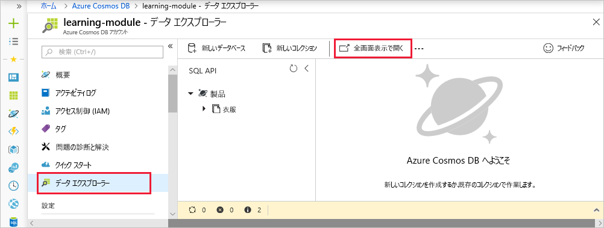
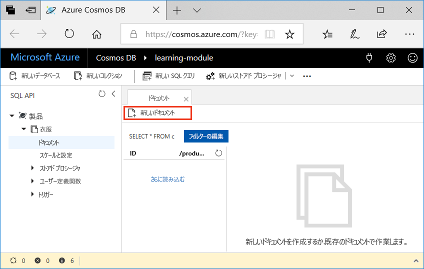

<span data-ttu-id="598b3-101">自分の Azure Cosmos DB データベースにデータを追加するのは簡単です。</span><span class="sxs-lookup"><span data-stu-id="598b3-101">Adding data to your Azure Cosmos DB database is simple.</span></span> <span data-ttu-id="598b3-102">Azure portal を開いてデータベースに移動し、データ エクスプローラーを使用して JSON ドキュメントをデータベースに追加します。</span><span class="sxs-lookup"><span data-stu-id="598b3-102">You open the Azure portal, navigate to your database, and use the Data Explorer to add JSON documents to the database.</span></span> <span data-ttu-id="598b3-103">データを追加するには、他にも高度な方法がありますが、データ エクスプローラーは Azure Cosmos DB によって提供される内部動作と機能を理解するのに最適なツールなので、まずはデータ エクスプローラーを使用します。</span><span class="sxs-lookup"><span data-stu-id="598b3-103">There are more advanced ways to add data, but we'll start here because the Data Explorer is a great tool to get you acquainted with the inner workings and functionality provided by Azure Cosmos DB.</span></span>

## <a name="what-is-the-data-explorer"></a><span data-ttu-id="598b3-104">データ エクスプローラーとは</span><span class="sxs-lookup"><span data-stu-id="598b3-104">What is the Data Explorer?</span></span>
<span data-ttu-id="598b3-105">Azure Cosmos DB データ エクスプローラーは、Azure portal に含まれるツールであり、Azure Cosmos DB に格納されているデータを管理するために使用します。</span><span class="sxs-lookup"><span data-stu-id="598b3-105">The Azure Cosmos DB Data Explorer is a tool included in the Azure portal that is used to manage data stored in an Azure Cosmos DB.</span></span> <span data-ttu-id="598b3-106">データ コレクションの表示とデータ コレクション内の移動、およびデータベース内のドキュメントの編集、データのクエリ、ストアド プロシージャの作成と実行のための UI が提供されています。</span><span class="sxs-lookup"><span data-stu-id="598b3-106">It provides a UI for viewing and navigating data collections, as well as for editing documents within the database, querying data, and creating and running stored procedures.</span></span>

## <a name="add-data-using-the-data-explorer"></a><span data-ttu-id="598b3-107">データ エクスプローラーを使用してデータを追加する</span><span class="sxs-lookup"><span data-stu-id="598b3-107">Add data using the Data Explorer</span></span>

1. <span data-ttu-id="598b3-108">サンドボックスをアクティブ化したときと同じアカウントを使用して、[サンドボックスの Azure portal](https://portal.azure.com/triplecrownlabs.onmicrosoft.com?azure-portal=true) にサインインします。</span><span class="sxs-lookup"><span data-stu-id="598b3-108">Sign into the [Azure portal for Sandbox](https://portal.azure.com/triplecrownlabs.onmicrosoft.com?azure-portal=true) using the same account you activated the sandbox with.</span></span>

    > [!IMPORTANT]
    > <span data-ttu-id="598b3-109">同じアカウントを使って、Azure portal とサンドボックスにログインします。</span><span class="sxs-lookup"><span data-stu-id="598b3-109">Login to the Azure portal and the sandbox with the same account.</span></span>
    > 
    > <span data-ttu-id="598b3-110">サンドボックスに確実に接続されるように、上記のリンクを使用して Azure portal にログインします。コンシェルジェ サブスクリプションへのアクセスが提供されます。</span><span class="sxs-lookup"><span data-stu-id="598b3-110">Login to the Azure portal using the link above to ensure you are connected to the sandbox, which provides access to a Concierge Subscription.</span></span>

1. <span data-ttu-id="598b3-111">**[すべてのサービス]** > **[データベース]** > **[Azure Cosmos DB]** の順にクリックします。</span><span class="sxs-lookup"><span data-stu-id="598b3-111">Click **All services** > **Databases** > **Azure Cosmos DB**.</span></span> <span data-ttu-id="598b3-112">次に、ご自分のアカウントを選択し、**[データ エクスプローラー]**、**[全画面表示で開く]** の順にクリックします</span><span class="sxs-lookup"><span data-stu-id="598b3-112">Then select your account, click **Data Explorer**, and then click **Open Full Screen**.</span></span>
 
   

2. <span data-ttu-id="598b3-114">**[全画面表示で開く]** ボックスで、**[開く]** をクリックします。</span><span class="sxs-lookup"><span data-stu-id="598b3-114">In the **Open Full Screen** box, click **Open**.</span></span>

    <span data-ttu-id="598b3-115">Web ブラウザーでは、新しいデータ エクスプローラーが全画面表示され、データベースを操作するための多くの領域と専用の環境が提供されます。</span><span class="sxs-lookup"><span data-stu-id="598b3-115">The web browser displays the new full-screen Data Explorer, which gives you more space and a dedicated environment for working with your database.</span></span>

3. <span data-ttu-id="598b3-116">新しい JSON ドキュメントを作成するには、SQL API ウィンドウで、**Clothing** を展開し、**[ドキュメント]** をクリックして、**[新しいドキュメント]** をクリックします。</span><span class="sxs-lookup"><span data-stu-id="598b3-116">To create a new JSON document, in the SQL API pane, expand **Clothing**, click **Documents**, then click **New Document**.</span></span>

   

4. <span data-ttu-id="598b3-118">ここで、次の構造のドキュメントをコレクションに追加します。</span><span class="sxs-lookup"><span data-stu-id="598b3-118">Now, add a document to the collection with the following structure.</span></span> <span data-ttu-id="598b3-119">次のコードをコピーして **[ドキュメント]** タブに貼り付けて、現在の内容を上書きします。</span><span class="sxs-lookup"><span data-stu-id="598b3-119">Just copy and paste the following code into the **Documents** tab, overwriting the current content:</span></span>

     ```json
    {
        "id": "1",
        "productId": "33218896",
        "category": "Women's Clothing",
        "manufacturer": "Contoso Sport",
        "description": "Quick dry crew neck t-shirt",
        "price": "14.99",
        "shipping": {
            "weight": 1,
            "dimensions": {
            "width": 6,
            "height": 8,
            "depth": 1
           }
        }
    }
     ```

5. <span data-ttu-id="598b3-120">JSON を **[ドキュメント]** タブに追加したら、**[保存]** をクリックします。</span><span class="sxs-lookup"><span data-stu-id="598b3-120">Once you've added the JSON to the **Documents** tab, click **Save**.</span></span>

    ![Azure portal のデータ エクスプローラーで JSON データをコピーして [保存] をクリックする](../media/3-azure-cosmosdb-data-explorer-save-document.png)

6. <span data-ttu-id="598b3-122">**[新しいドキュメント]** をもう一度クリックし、次の JSON オブジェクトをデータ エクスプローラーにコピーして **[保存]** をクリックすることにより、ドキュメントをもう 1 つ作成して保存します。</span><span class="sxs-lookup"><span data-stu-id="598b3-122">Create and save one more document clicking **New Document** again, and copying the following JSON object into Data Explorer and clicking **Save**.</span></span>

     ```json
    {
        "id": "2",
        "productId": "33218897",
        "category": "Women's Outerwear",
        "manufacturer": "Contoso",
        "description": "Black wool pea-coat",
        "price": "49.99",
        "shipping": {
            "weight": 2,
            "dimensions": {
            "width": 8,
            "height": 11,
            "depth": 3
           }
        }
    }
     ```

7. <span data-ttu-id="598b3-123">左側のメニューで **[ドキュメント]** をクリックして、ドキュメントが保存されていることを確認します。</span><span class="sxs-lookup"><span data-stu-id="598b3-123">Confirm the documents have been saved by clicking **Documents** on the left-hand menu.</span></span>

    <span data-ttu-id="598b3-124">データ エクスプローラーには、**[ドキュメント]** タブにドキュメントが 2 つ表示されます。</span><span class="sxs-lookup"><span data-stu-id="598b3-124">Data Explorer displays the two documents in the **Documents** tab.</span></span>

<span data-ttu-id="598b3-125">このユニットでは、データ エクスプローラーを使用して、それぞれが製品カタログ内の製品を表す 2 つのドキュメントを、データベースに追加しました。</span><span class="sxs-lookup"><span data-stu-id="598b3-125">In this unit, you added two documents, each representing a product in your product catalog, to your database by using the Data Explorer.</span></span> <span data-ttu-id="598b3-126">データ エクスプローラーは、ドキュメントの作成、ドキュメントの変更、Azure Cosmos DB の使用開始に適しています。</span><span class="sxs-lookup"><span data-stu-id="598b3-126">The Data Explorer is a good way to create documents, modify documents, and get started with Azure Cosmos DB.</span></span>  
