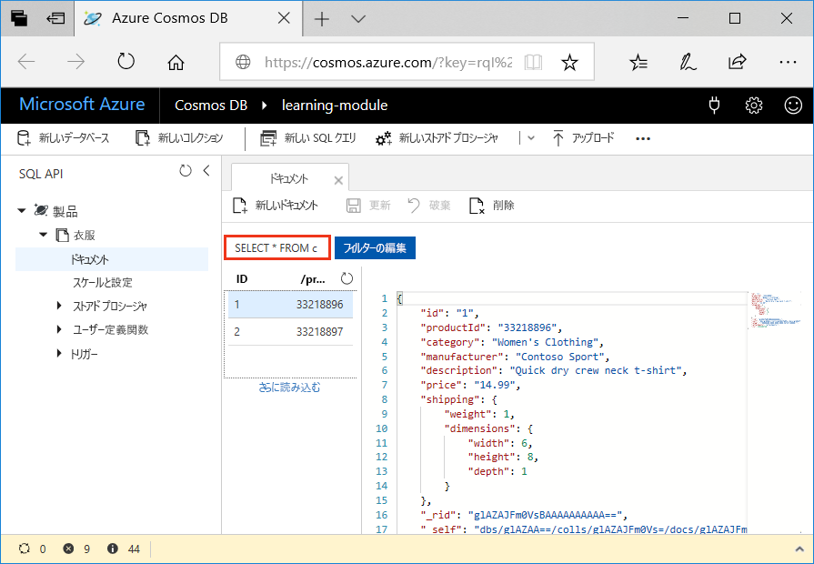

作成できるクエリの種類について学習しましたので、Azure portal でデータ エクスプローラーを使用して、ご自分の製品データを取得およびフィルター処理してみましょう。

データ エクスプローラー ウィンドウでは、既定で、**[ドキュメント]** タブのクエリが `SELECT * FROM c` に設定されています。 この既定のクエリでは、コレクション内のすべてのドキュメントが取得されて表示されます。



## <a name="create-a-new-query"></a>新しいクエリを作成する

1. データ エクスプローラーで、**[新しい SQL クエリ]** タブをクリックします。新しい **[クエリ 1]** タブ上の既定のクエリが `SELECT * from c` になっていることを確認し、**[クエリの実行]** をクリックします。 このクエリでは、そのデータベースの結果がすべて返されます。

    ![ORDER BY c._ts DESC を追加し [フィルタの適用] をクリックすることで既定のクエリを変更する](../media/5-azure-cosmosdb-data-explorer-edit-query.png)

2. 前のユニットで説明したクエリの一部を実行してみましょう。 クエリ タブで、`SELECT * from c` を削除し、次のクエリをコピーして貼り付け、**[クエリの実行]** をクリックします。

    ```
    SELECT *
    FROM Products p
    WHERE p.id ="1"
    ```

    結果には、`productId` が 1 の製品が返されます。

    ![「ORDER BY c._ts DESC」を追加し [フィルタの適用] をクリックすることで、既定のクエリを変更](../media/5-azure-cosmosdb-data-explorer-query-by-id.png)

3. 前のクエリを削除し、次のクエリをコピーして貼り付け、**[クエリの実行]** をクリックします。 このクエリでは、すべての製品の価格、説明、および製品 ID が、価格の昇順に並べ替えられて返されます。
 
    ```
    SELECT p.price, p.description, p.productId
    FROM Products p
    ORDER BY p.price ASC
    ```

## <a name="summary"></a>まとめ

これで、Azure Cosmos DB のデータでの基本的なクエリを完了しました。 