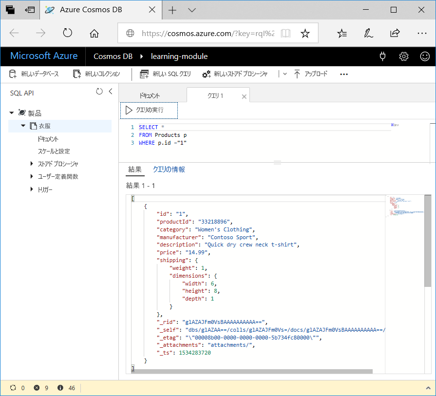

<span data-ttu-id="df900-101">これで、作成できるクエリの種類について学習できました。次は、Azure portal でデータ エクスプローラーを使用して、ご自分の製品データを取得し、フィルター処理してみましょう。</span><span class="sxs-lookup"><span data-stu-id="df900-101">Now that you've learned about what kinds of queries you can create, let's use the Data Explorer in the Azure portal to retrieve and filter your product data.</span></span>

<span data-ttu-id="df900-102">データ エクスプローラー ウィンドウでは、以下の図のように、既定で **[ドキュメント]** タブのクエリが `SELECT * FROM c` に設定されていることに注意してください。</span><span class="sxs-lookup"><span data-stu-id="df900-102">In your Data Explorer window, note that by default, the query on the **Document** tab is set to `SELECT * FROM c` as shown in the following image.</span></span> <span data-ttu-id="df900-103">この既定のクエリでは、コレクション内のすべてのドキュメントを取得して表示します。</span><span class="sxs-lookup"><span data-stu-id="df900-103">This default query retrieves and displays all documents in the collection.</span></span>


## <a name="create-a-new-query"></a><span data-ttu-id="df900-105">新しいクエリを作成する</span><span class="sxs-lookup"><span data-stu-id="df900-105">Create a new query</span></span>

1. <span data-ttu-id="df900-106">データ エクスプローラーで、**[新しい SQL クエリ]** をクリックします。</span><span class="sxs-lookup"><span data-stu-id="df900-106">In Data Explorer, click **New SQL Query**.</span></span> <span data-ttu-id="df900-107">新しい **[クエリ 1]** タブの既定のクエリがやはり `SELECT * from c` であることに注意してください。このクエリは、コレクション内のすべてのドキュメントを返します。</span><span class="sxs-lookup"><span data-stu-id="df900-107">Note that the default query on the new  **Query 1** tab is again `SELECT * from c`, which will return all documents in the collection.</span></span> 

1. <span data-ttu-id="df900-108">**[クエリの実行]** をクリックします。</span><span class="sxs-lookup"><span data-stu-id="df900-108">Click **Execute Query**.</span></span> <span data-ttu-id="df900-109">このクエリでは、そのデータベースの結果がすべて返されます。</span><span class="sxs-lookup"><span data-stu-id="df900-109">This query returns all results in the database.</span></span>

    ![ORDER BY c._ts DESC を追加し [フィルタの適用] をクリックすることで既定のクエリを変更する](../media/5-azure-cosmosdb-data-explorer-edit-query.png)

2. <span data-ttu-id="df900-111">前のユニットで説明したクエリの一部を実行してみましょう。</span><span class="sxs-lookup"><span data-stu-id="df900-111">Now, let's run some of the queries discussed in the previous unit.</span></span> <span data-ttu-id="df900-112">クエリ タブで、`SELECT * from c` を削除し、次のクエリをコピーして貼り付け、**[クエリの実行]** をクリックします。</span><span class="sxs-lookup"><span data-stu-id="df900-112">On the query tab, delete `SELECT * from c`, copy and paste the following query, and then click **Execute Query**:</span></span>

    ```sql
    SELECT * 
    FROM Products p 
    WHERE p.id ="1"
    ```

    <span data-ttu-id="df900-113">結果には、`productId` が 1 の製品が返されます。</span><span class="sxs-lookup"><span data-stu-id="df900-113">The results return the product whose `productId` is 1.</span></span>

    

3. <span data-ttu-id="df900-115">前のクエリを削除し、次のクエリをコピーして貼り付け、**[クエリの実行]** をクリックします。</span><span class="sxs-lookup"><span data-stu-id="df900-115">Delete the previous query, copy and paste the following query, and click **Execute Query**.</span></span> <span data-ttu-id="df900-116">このクエリでは、すべての製品の価格、説明、および製品 ID が、価格の昇順に並べ替えられて返されます。</span><span class="sxs-lookup"><span data-stu-id="df900-116">This query returns the price, description, and product ID for all products, ordered by price, in ascending order.</span></span>
 
    ```sql
    SELECT p.price, p.description, p.productId 
    FROM Products p 
    ORDER BY p.price ASC
    ```

## <a name="summary"></a><span data-ttu-id="df900-117">まとめ</span><span class="sxs-lookup"><span data-stu-id="df900-117">Summary</span></span>

<span data-ttu-id="df900-118">これで、Azure Cosmos DB のデータでの基本的なクエリを完了しました。</span><span class="sxs-lookup"><span data-stu-id="df900-118">You have now completed some basic queries on your data in Azure Cosmos DB.</span></span> 