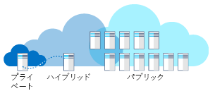

あなたは医療関連企業で働いているとします。Imagine you work at a healthcare company. レガシ システムと基幹業務システムを使用しており、将来的に新システムを使用する計画があります。You have legacy systems, line of business systems, and future plans for new systems. クラウド コンピューティングを使用することには利点があると聞いています。You've heard there are advantages to using cloud computing. パブリック クラウド、プライベート クラウド、ハイブリッド クラウドという異なるそれぞれのソリューション向けに、最適なデプロイ モデルをどのようにして選びますか。How do you choose the best deployment model for different solutions: public, private, or hybrid cloud?

## クラウド コンピューティングとはWhat is cloud computing?

クラウド コンピューティングでは、インターネット経由でサービスとアプリケーションをオンデマンドでプロビジョニングします。Cloud computing is the provisioning of services and applications on demand over the internet. サーバー、アプリケーション、データ、およびその他のリソースは、サービスとして提供されます。Servers, applications, data, and other resources are provided as a service. 

ユーザー側から見ると、サービスの詳細は抽象化されています。To the user, the details of the services are abstracted. コンピューティング リソースを迅速にプロビジョニングし、最小限の管理でサービスを使用できます。You can quickly provision computing resources and use the service with minimal management. クラウド コンピューティングとはインターネット経由で利用できるデータセンターだと考えるのは適切ではありません。You shouldn't think of cloud computing as a datacenter available through the internet. クラウド コンピューティングは、仮想化、低コストで入手できるハードウェア、自動化されたプロセスを使用して、セルフサービス式のユーザー エクスペリエンスを利用者に提供するものであり、公共サービスに似ています。Cloud computing uses virtualization, commodity hardware, and automated processes to provide a self-service user experience to customers similar to a public utility.

クラウド コンピューティングには、パブリック クラウド、プライベート クラウド、ハイブリッド クラウドという 3 つのデプロイ モデルがあります。There are three deployment models for cloud computing: public cloud, private cloud, and hybrid cloud. 次の図は、これらのデプロイ モデルの概要を示したものです。The following illustration shows an overview of these deployment models.

!!!!!! Video TC-008 プレースホルダー !!!Video TC-008 placeholder !!! 

> [!VIDEO https://channel9.msdn.com/Series/History/The-History-of-Microsoft-1995/player]

## パブリック クラウドPublic cloud

パブリック クラウドは、クラウド コンピューティングのデプロイ方法として最も一般的な方法です。Public clouds are the most common way of deploying cloud computing. サービスはパブリック インターネット経由で提供され、サービスの購入希望者はだれでもサービスを利用できます。Services are offered over the public internet and available to anyone who wants to purchase them. サーバーやストレージなどのクラウド リソースは、サードパーティのクラウド サービス プロバイダーによって所有および運用され、インターネット経由で提供されます。The cloud resources such as servers and storage are owned and operated by a third-party cloud service provider and delivered over the internet. サービスには無料のものとオンデマンドで購入するものがあり、利用者は使用した CPU サイクル、ストレージ、または帯域幅の消費量に応じた料金のみを支払います。Services may be free or sold on demand, allowing customers to pay only per usage for the CPU cycles, storage, or bandwidth they consume. Microsoft Azure はパブリック クラウドの一例です。Microsoft Azure is an example of a public cloud. 

勤務先の医療関連企業で、登録用の Web サイトが必要だとします。Let's imagine your healthcare company needs an enrollment website. そのサイトには、拡大縮小できること、年間を通して何度か発生する登録のピーク時に応答性を維持できることが求められます。The site needs to scale and be responsive during peak enrollment various times during the year. 顧客は世界中の場所からサイトにアクセスします。Your customers access the site from global locations. パブリック クラウドを使用して自動的にスケールアップし、登録のピーク時の需要に対応できます。You can use the public cloud to automatically scale up to meet demand at peak enrollment. サイトのトラフィックが少ないときは、サイトをスケールダウンしてコストを抑えることができます。When site traffic is low, your site can scale down to save costs. ピーク需要時のサイトの応答性が維持され、必要になったときにだけ追加リソースを購入します。Your site is responsive at peak demand, and you only pay for more resources when needed. また、複数の地理的リージョンに Web サイトをデプロイして信頼性と応答性を高めることもできます。You can also deploy your website in multiple geographic regions to increase reliability and responsiveness.

開発者は、Web サイト開発時に複数の開発環境を作成することで、開発プロセスを迅速化できます。During the development of your website, developers want to create multiple development environments to speed their development process. 開発者はパブリック クラウドを使用して、サンドボックス環境用に仮想マシンを迅速にプロビジョニングし、ソリューションを開発できます。Developers can use the public cloud to quickly provision virtual machines for sandboxed environments to develop a solution. 開発者は不要になった環境を削除できます。When the developers no longer need an environment, they can delete it.

### パブリック クラウドを使用する理由Why public cloud?

パブリック クラウドは、オンプレミスのインフラストラクチャよりも迅速に、ほぼ無限の拡張性を持ったプラットフォームを使用してデプロイすることができます。Public clouds can be deployed faster than on-premises infrastructures and with an almost infinitely scalable platform. インターネットにアクセスすることさえできれば、会社のすべての従業員が、任意のデバイスを使用して、どのオフィスまたは支社からでも同じアプリケーションを利用できます。Every employee of a company can use the same application from any office or branch using their device of choice as long as they can access the internet. 

パブリック クラウドを使用する理由の例:Examples of why you would use public cloud:

- **従量制またはサブスクリプションによるオンデマンドでのサービス消費:** オンデマンドまたはサブスクリプション モデルでは、CPU、ストレージ、その他のリソースについて、使用または予約した分だけの料金がかかります。**On-demand service consumption through as needed or subscription:** The on-demand or subscription model allows you to pay for the portion of CPU, storage, and other resources that you use or reserve.
- **ハードウェアの初期投資が不要:** オンプレミス ハードウェアやアプリケーション インフラストラクチャを購入、管理、メンテナンスする必要はありません。**No up-front investment of hardware:** No requirement to purchase, manage, and maintain on-premises hardware and application infrastructure. システムの管理とメンテナンスは、すべてクラウド サービス プロバイダーが担当します。The cloud service provider is held responsible for all management and maintenance of the system. 
- **自動化:** Web ポータルまたはスクリプトを使用して、または自動的に、インフラストラクチャのリソースを迅速にプロビジョニングできます。**Automation:** Quickly provision infrastructure resources using a web portal, scripts, or automatically. 
- **地理的な分散:** データを必要なときに手近な場所で見つけることができ、自社で多数のデータセンターを持つ必要がありません。**Geographic dispersity:** Locate data near where it's needed without having many of your own datacenters.
- **ハードウェア メンテナンスの削減:** ハードウェアのメンテナンスはサービス プロバイダーの責任において行われます。**Reduced hardware maintenance:** The service provider is responsible for hardware maintenance.

## プライベート クラウドPrivate cloud

プライベート クラウドは、1 つの企業または組織に属する特定のユーザー専用のコンピューティング リソースで構成されます。A private cloud consists of computing resources used exclusively by select users from one business or organization. 組織のオンサイト データセンターに物理的に配置される場合と、サードパーティのサービス プロバイダーによってホストされる場合があります。It can be physically located at your organization’s on-site datacenter, or it can be hosted by a third-party service provider. プライベート クラウドという用語を、従来のオンプレミス データセンターが名称変更されたものだと考えるのは、適切ではありません。The term private cloud should not be considered a rebranding of traditional on-premises datacenters. プライベート クラウドでは、オンプレミスのインフラストラクチャとサービスを使用して、パブリック クラウドと同様の利点が提供されます。A private cloud uses on-premises infrastructure and services to provide similar benefits of the public cloud. 抽象化プラットフォームを使用して、Kubernetes クラスターなどの*クラウドに似た*サービスや、Azure Stack のような完全なクラウド環境を実現できます。It uses an abstraction platform to provide *cloud-like* services such as Kubernetes clusters or a complete cloud environment like Azure Stack. ハードウェアの購入、構成、メンテナンスは、組織が行います。The organization is responsible for the purchase, configuration, and maintenance of the hardware. システム間の通信は通常、企業が所有してメンテナンスを行うネットワーク インフラストラクチャ上で実行されます。Communication between the systems is usually on the network infrastructure that the business owns and maintains. 例として、非公開の社内ネットワークや、建物間の専用光ファイバー接続があります。For example, a private internal network or a dedicated fiber optic connection between buildings.

あなたが勤務している医療関連企業が、自社データセンターのうちの 1 つにおいて、あるアプリケーションを使用しているとします。Imagine you work at healthcare company and you have an application that is in use at one of your datacenters. その運用環境はパブリック クラウドにレプリケートできません。The operating environment can't be replicated in the public cloud. 新しい要件として、別のデータセンターにあるデータにアクセスする必要があります。You have a new requirement to access data at another one of your datacenters. そのデータを含むデータベースは、規制に対するコンプライアンスのために、他の拠点に置いておく必要があります。The database containing the data needs to remain at the other site because of regulatory compliance. このシナリオはプライベート クラウドです。This scenario is a private cloud. あなたの勤務先の組織が所有する 2 つのデータセンターがあります。You have two datacenters your organization owns. インターネット経由のパブリック クラウド VPN をデータセンター間の接続に使用することが可能です。You could use a public cloud VPN over the internet to connect the datacenters. ただし、このシナリオは、ソリューションがこの組織以外には非公開であるためプライベート クラウドと考えることができます。However, the scenario would be considered a private cloud since the solution is private to the organization.

### プライベート クラウドを使用する理由Why private cloud?

プライベート クラウドを使用すると、組織に柔軟性がもたらされます。A private cloud can provide more flexibility to an organization. 組織は、特定のビジネス ニーズを満たすために、使用するクラウド環境をカスタマイズできます。Your organization can customize its cloud environment to meet specific business needs. リソースを他の組織と共有しないので、高度なコントロールとセキュリティを実現することが可能です。Since resources are not shared with others, high levels of control and security are possible. また、プライベート クラウドでは一定レベルの拡張性と効率性も得られます。Also, private clouds can provide a level of scalability and efficiency.

プライベート クラウドを使用する理由の例:Examples of why you would use private cloud:

- **既存の環境:** 既存の運用環境をパブリック クラウドにレプリケートすることができない。**Pre-existing environment:** An existing operating environment that can't be replicated in the public cloud. ハードウェアへの、およびソリューションの専門知識を持った人材への大規模な投資。A large investment in hardware and employees with solution expertise. 大規模な組織がコンピューティング リソースのコモディティ化を選択する場合。A large organization may choose to commoditize their computing resources.
- **レガシ アプリケーション:** 配置先を物理的に変更することが容易でない、ビジネスに不可欠なレガシ アプリケーション。**Legacy applications:** Business-critical legacy applications that can't easily be physically relocated.
- **データの管轄とセキュリティ:** 政治的な境界線、法的要件によって、データが物理的にどこに存在できるかが指定される場合があります。**Data sovereignty and security:** Political borders and legal requirements may dictate where data can physically exist.
- **規制に対するコンプライアンス/認定:** PCI または HIPAA コンプライアンス。**Regulatory compliance / certification:**  PCI or HIPAA compliance. 認定されたオンプレミス データセンター。Certified on-premises datacenter.

## ハイブリッド クラウドHybrid cloud

ハイブリッド クラウドは、パブリック クラウドとプライベート クラウドを組み合わせ、それらのクラウド間でデータとアプリケーションを共有できるようにしたコンピューティング環境です。A hybrid cloud is a computing environment that combines a public cloud and a private cloud by allowing data and applications to be shared between them. ハイブリッド クラウド コンピューティングでは、コンピューティングと処理の需要が変動したときに、企業はオンプレミス インフラストラクチャをパブリック クラウドにまでシームレスにスケールアップして、オーバーフローを処理することができます。サードパーティのデータセンターに対して、自社データ全体へのアクセス権を与える必要はありません。When computing and processing demand fluctuates, hybrid cloud computing gives businesses the ability to seamlessly scale their on-premises infrastructure up to the public cloud to handle any overflow - without giving third-party datacenters access to the entirety of their data. 組織は、ビジネスに不可欠なアプリケーションとデータをオンプレミスに、つまり企業のファイアウォールの内側に安全に保持しながら、基本的なコンピューティング タスクと機密性が高くないコンピューティング タスク用に、パブリック クラウドの柔軟性とコンピューティング能力を手に入れることができます。Organizations gain the flexibility and computing power of the public cloud for basic and non-sensitive computing tasks, while keeping business-critical applications and data on-premises, safely behind a company firewall.

ハイブリッド クラウドを使用すると、短期的な需要の急増を処理するために事前の設備投資を行う必要性を排除できます。Using a hybrid cloud helps eliminate the need to make up-front capital expenditures to handle short-term spikes in demand. また、クラウドにあるリソースに対して、どのリソースをローカルなリソースとするかを管理できる柔軟性があります。It also has the flexibility to manage which resources are local versus resources in the cloud. 企業は、長期的にはアイドル状態のままになる可能性がある、追加のリソースや設備の購入、プログラム、メンテナンスを行うのではなく、一時的に使用したリソースの料金を支払います。Companies pay only for resources they temporarily use instead of having to purchase, program, and maintain additional resources and equipment that could remain idle over long periods of time. 通常、統合は、Azure のようなクラウド プロバイダーとオンプレミスのデータセンターとの間で、セキュリティで保護された VPN を経由して行われます。Integration is generally through a secure VPN between cloud providers like Azure and on-premises datacenters.

勤務先の医療関連企業で、顧客が自分の医療情報にアクセスできるアプリケーションを使用しているとします。Imagine you work at healthcare company and you have an application where customers can access their healthcare information. 規制により、データを物理的な場所に保管する必要があります。A regulation requires that the data needs to remain at a physical location. 顧客向け Web サイトは、世界中の多数のユーザーに応答できる必要があります。The customer website needs to be responsive to their many global users.  ソリューションとして、データベースをオンプレミスのデータセンター内でホストし、Web サイトをパブリック クラウド内でホストすることが考えられます。As a solution, the database could be hosted in an on-premises datacenter and the website could be hosted in the public cloud. オンプレミスのデータセンターとパブリック クラウドとの間には VPN を使用します。A VPN is used between the on-premises datacenter and the public cloud. このシナリオは、ハイブリッド クラウドになります。This scenario would be considered a hybrid cloud.

### ハイブリッド クラウドを使用する理由Why hybrid cloud?

ハイブリッド クラウドを使用すると、組織は機密性の高いアセット向けにプライベート インフラストラクチャを制御し、メンテナンスすることができます。Hybrid cloud allows your organization to control and maintain a private infrastructure for sensitive assets. また、必要になったときにパブリック クラウド内の追加リソースを利用できる柔軟性が得られます。It also gives you the flexibility to take advantage of additional resources in the public cloud when you need them. パブリック クラウドにまでスケールアップできるため、追加のコンピューティング能力に対する支出は、必要なときだけしか発生しません。With the ability to scale to the public cloud, you pay for extra computing power only when needed. クラウドへの移行も容易になります。It can also ease transitioning to the cloud. 時間をかけて段階的に、徐々にワークロードを移行できます。You can migrate gradually by phasing in workloads over time.

ハイブリッド クラウドを使用する理由の例:Examples of why you would use hybrid cloud:

- **既存のハードウェア投資:** ビジネス上の理由により、既存の運用環境とハードウェアを使用する必要がある場合。**Existing hardware investment:** Business reasons require that you use an existing operating environment and hardware.
- **規制による要件:** 規制により、データを物理的な場所に保管することが必要な場合。**Regulatory requirements:** Regulation requires that the data needs to remain at a physical location.
- **独自の運用環境:** 従来の運用環境をパブリック クラウドにレプリケートできない場合。**Unique operating environment:** Public cloud can't replicate a legacy operating environment.
- **移行:** ワークロードを徐々にクラウドに移行する場合。**Migration:** Move workloads to the cloud over time.
