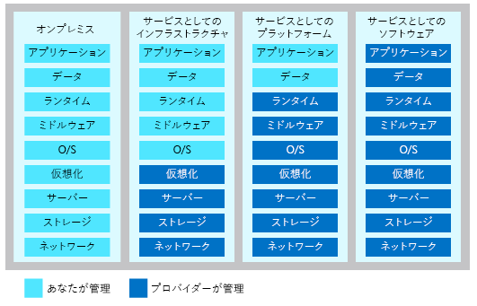

クラウド コンピューティング リソースは、次の 3 つの異なるサービス モデルを使用して提供されます。

- **インフラストラクチャとしてのサービス (IaaS)** では、インターネット経由でプロビジョニングと管理ができるインスタント コンピューティング インフラストラクチャが提供されます。
- **サービスとしてのプラットフォーム (PaaS)** では、独自のクラウド サービスを提供するために使用できる既製の開発環境とデプロイ環境が提供されます。
- **サービスとしてのソフトウェア (SaaS)** は、Web ベースのサービスとしてアプリケーションをインターネット経由で提供します。

!!! Video TC-007 プレースホルダー !!!

> [!VIDEO https://channel9.msdn.com/Series/History/The-History-of-Microsoft-1995/player]

サービス モデルを選択する際には、どのパーティがコンピューティング リソースを担当するかを考慮します。 ご自分のシナリオに基づいて、管理責任をどの程度分担するかを決めることができます。 次の図では、ご自分で、およびサービス プロバイダーが管理する、それぞれのクラウド サービスのカテゴリのリソース一覧を示しています。

