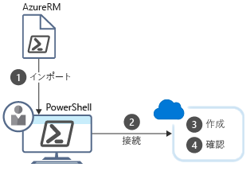

Azure PowerShell では、コマンドを記述し、すぐに実行できます。 これは**対話モード**と呼ばれています。

顧客関係管理 (CRM) の例の全体的な目標は VM を含む 3 つのテスト環境を作成することであることを思い出してください。 リソース グループを利用して VM を別々の環境に整理します。単体テスト用に 1 つ、統合テスト用に 1 つ、受け入れテスト用に 1 つとなります。 リソース グループは一度だけ作成すれば十分です。そこで、PowerShell の対話モードを使用することが良い選択肢となります。

このセクションでは、PowerShell を対話的に使用し、Azure サブスクリプションにログオンしてリソース グループを作成する例をいくつか紹介します。

## <a name="what-are-powershell-cmdlets"></a>PowerShell コマンドレットとは
PowerShell コマンドは**コマンドレット**と呼ばれています。 コマンドレットは 1 つの機能を操作するコマンドです。 **コマンドレット**と用語は "小さなコマンド" を意味します。 慣例で、コマンドレットの作成者には、コマンドレットをシンプルにすること、目的を 1 つだけにすることが推奨されています。

基本の PowerShell 製品には、セッションやバックグラウンド ジョブなどの機能で使用できるコマンドレットが付属します。 他の機能を操作するコマンドレットを得るには、PowerShell インストールにモジュールを追加します。 たとえば、サードパーティ モジュールには、FTP と連動するモジュール、オペレーティング システムを管理するモジュール、ファイル システムにアクセスするモジュールなどがあります。

コマンドレットには、動詞-名詞の命名規則が採用されています。たとえば、**Get-Process**、**Format-Table**、**Start-Service** のようになります。 動詞の選択にも規則があります。たとえば、データの取得は "get"、データの挿入または更新は "set"、データの書式設定は "format"、宛先への直接出力は "out" になります。

コマンドレットの作成者には、コマンドレットごとにヘルプ ファイルを含めることが推奨されています。 **Get-Help** コマンドレットを実行すると、コマンドレットのヘルプ ファイルが表示されます。

```powershell
Get-Help <cmdlet-name> -detailed
```

## <a name="what-is-azurerm"></a>AzureRM とは
**AzureRM** は、Azure 機能で使用できるコマンドレットを含む Azure PowerShell コマンドレットの正式名称です (名前の中の **RM** は **Resource Manager** という意味です)。 数百単位のコマンドレットが含まれ、あらゆる Azure リソースのほぼすべての面を制御できます。 リソース グループ、ストレージ、仮想マシン、Azure Active Directory、コンテナー、機械学習などを操作できます。

## <a name="how-to-create-a-resource-group"></a>リソース グループの作成方法
次に、ローカルにインストールした Azure PowerShell を使用してリソース グループを作成します。 

次の 4 つのステップがあります。 
1. Azure コマンドレットをインポートします。
1. Azure サブスクリプションに接続します。
1. リソース グループを作成します。
1. 正常に作成できたことを確認します (下記参照)。



各手順は異なるコマンドレットに対応しています。

### <a name="import"></a>[インポート]
起動時、PowerShell は既定で中心的なコマンドレットのみを読み込みます。 つまり、Azure で使用する必要があるコマンドレットは読み込まれません。 必要なコマンドレットを最も確実に読み込む方法は、PowerShell セッションの開始時にコマンドレットを手動でインポートすることです。

モジュールの読み込みには **Import-Module** コマンドレットを使用します。 このコマンドレットには、さまざまな状況に対処するためのパラメーターがたくさんあります。 たとえば、複数のモジュールを読み込んだり、特定のモジュール バージョンを読み込んだり、モジュールの一部を読み込んだりできます。 1 つのモジュールを完全に読み込む場合、構文は次のように単純になります。

```powershell
Import-Module <module-name>
```

> [!TIP]
> Azure PowerShell を頻繁に使用するようであれば、2 とおりの方法でモジュール読み込みプロセスを自動化できます。 PowerShell プロファイルにエントリを追加し、起動時に Azure モジュールをインポートするか、PowerShell の最新版を使用し、コマンドレットの使用時にコマンドレットを含むモジュールを自動的に読み込むことができます。

### <a name="connect"></a>接続
Azure PowerShell のローカル インストールを使用している場合、Azure コマンドを実行する前に認証する必要があります。 **Connect-AzureRmAccount** コマンドレットを実行すると、Azure 資格情報が求められ、Azure サブスクリプションに接続されます。 さまざまなオプション パラメーターがありますが、対話的プロンプトだけが必要であれば、パラメーターは必要ありません。

```powershell
Connect-AzureRmAccount
```

### <a name="create"></a>Create
**New-AzureRmResourceGroup** コマンドレットを実行すると、リソース グループが作成されます。 名前と場所を指定する必要があります。 この名前はサブスクリプション内で一意である必要があります。 この場所によって、お使いのリソース グループのメタデータが保存される場所が決定されます (コンプライアンス上の理由から重要となる場合があります)。 "West US"、"North Europe"、"West India" などの文字列を使用して場所を指定します。 ほとんどの Azure コマンドレットと同様に、**New-AzureRmResourceGroup** にはオプション パラメーターがたくさんありますが、中心的な構文は次のようになります。

```powershell
New-AzureRmResourceGroup -Name <name> -Location <location>
```

### <a name="verify"></a>確認
**Get-AzureRmResource** を実行すると、Azure リソースが一覧表示されます。 リソース グループが正常に作成されたことを確認するためにここで役に立ちます。

```powershell
Get-AzureRmResource
```

もっと簡潔な一覧を表示するには、パイプ '|' を利用して **Get-AzureRmResource** から **Format-Table** コマンドレットに出力を送信できます。

```powershell
Get-AzureRmResource | Format-Table
```

## <a name="summary"></a>まとめ
PowerShell の対話モードは 1 回限りのタスクに適しています。 例では、プロジェクトのライフタイムに対して同じリソース グループを使用します。つまり、対話で作成することが道理にかなっています。 このタスクでは多くの場合、スクリプトを記述してそのスクリプトを正確に 1 回実行するより、対話モードの方が簡単で速くなります。
