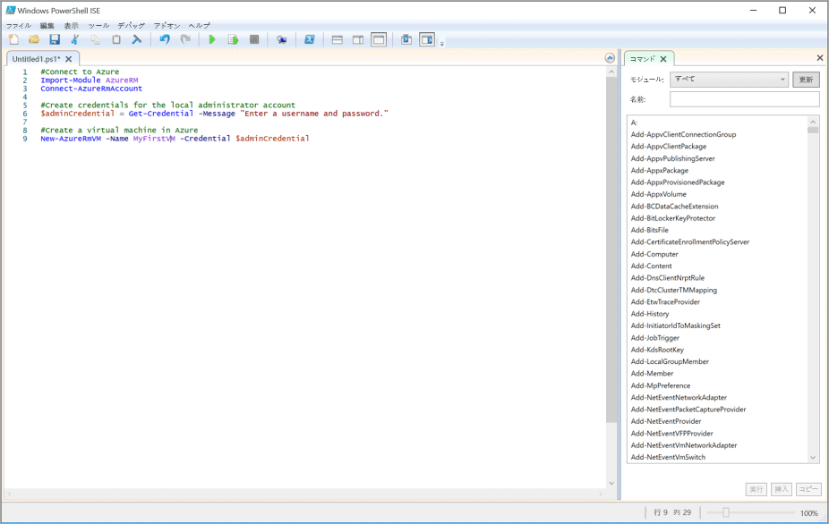

多くの場合、複雑なタスクや反復的なタスクの管理にはかなりの時間がかかります。 組織は、コストを削減してエラーを回避するためにこれらのタスクを自動化したいと考えます。

これは、カスタマー リレーションシップ マネジメント (CRM) 会社の例では重要なことです。 そのため、継続的に削除して再作成する必要がある、複数の Linux 仮想マシン (VM) でソフトウェアをテストします。 VM の作成を自動化するには PowerShell スクリプトを使用する必要があります。

VM の作成の主な操作以外にも、スクリプトに関する追加要件がいくつかあります。 
- 複数の VM を作成するため、ループ内に作成を配置する必要があります
- 3 つの異なるリソース グループで VM を作成する必要があるため、そのリソース グループの名前をパラメーターとしてスクリプトに渡す必要があります

このセクションでは、これらの要件を満たす Azure PowerShell スクリプトを記述して実行する方法を説明します。

## <a name="what-is-a-powershell-script"></a>PowerShell スクリプトとは
PowerShell スクリプトは、コマンドと制御コンストラクトを含むテキスト ファイルです。 コマンドはコマンドレットの呼び出しのことです。 制御コンストラクトでは、PowerShell によって提供されるループ、変数、パラメーター、コメントなどの機能をプログラミングします。

PowerShell スクリプト ファイルには **.ps1** ファイル拡張子が付いています。 任意のテキスト エディターでこれらのファイルを作成して保存することができます。 

> [!TIP]
> Windows で PowerShell スクリプトを記述する場合は、Windows PowerShell Integrated Scripting Environment (ISE) を使用できます。 このエディターでは、構文の色分けなどの機能と利用可能なコマンドレットの一覧が提供されます。
>
次のスクリーンショットは、Windows PowerShell Integrated Scripting Environment (ISE) でサンプル スクリプトを使用して Azure に接続し、Azure で仮想マシンを作成する様子を示しています。

>

スクリプトを記述したら、前にドットとバックスラッシュが付いたファイルの名前を渡して、PowerShell コマンド ラインから実行します。

```powershell
.\myScript.ps1
```

## <a name="powershell-techniques"></a>PowerShell 手法
PowerShell には、一般的なプログラミング言語で見られる多くの機能があります。 変数の定義、ブランチとループの使用、コマンド ライン パラメーターのキャプチャ、関数の記述、コメントの追加などを行うことができます。 このスクリプトには、変数、ループ、パラメーターという 3 つの機能が必要です。

### <a name="variables"></a>variables
PowerShell では変数がサポートされます。 **$** を使用して、変数と **=** を宣言し、値を割り当てます。 例:

```powershell
$loc = "East US"
$iterations = 3
```

変数でオブジェクトを保持することができます。 たとえば、次の定義では、**Get-Credential** コマンドレットによって返されるオブジェクトに **adminCredential** 変数が設定されます。

```powershell
$adminCredential = Get-Credential
```

変数に格納されている値を取得するには、次のように **$** プレフィックスとその名前を使用します。 

```powershell
$loc = "East US"
New-AzureRmResourceGroup -Name "MyResourceGroup" -Location $loc
```

### <a name="loops"></a>ループ
PowerShell には、**For**、**Do...While**、**For...Each** などのループがいくつかあります。 ここではコマンドレットを一定の回数実行するため、**For** ループが最適です。

中心的な構文は次のとおりです。この例では 2 回反復され、毎回 **i** の値が出力されます。 比較演算子が記述され、"より小さい" 場合は **-lt**、"以下" の場合は **-le**、"等しい" 場合は **eq**、"等しくない" 場合は **ne** などとなります。

```powershell
For ($i = 1; $i -lt 3; $i++)
{
    $i
}
```

### <a name="parameters"></a>parameters
スクリプトを実行するときに、コマンド ラインで引数を渡すことができます。 パラメーターごとに名前を指定でき、スクリプトで値を抽出するのに役立ちます。 例:

```powershell
.\setupEnvironment.ps1 -size 5 -location "East US"
```

スクリプト内で、変数に値をキャプチャします。 この例では、パラメーターは名前と一致します。

```powershell
param([string]$location, [int]$size)
```

コマンド ラインでは名前を省略することができます。 例:

```powershell
.\setupEnvironment.ps1 5 "East US"
```

スクリプト内では、パラメーターに名前がない場合の照合に位置を使用します。

```powershell
param([int]$size, [string]$location)
```

## <a name="how-to-create-a-linux-virtual-machine"></a>Linux 仮想マシンを作成する方法

Azure PowerShell では、仮想マシンを作成するための **New-AzureRmVm** コマンドレットが提供されます。 コマンドレットには多くのパラメーターがあり、それを使用して数多くの VM 構成設定を処理することができます。 ほとんどのパラメーターに適切な既定値があるため、指定する必要があるのは次の 5 つのみです。

- **ResourceGroupName**: 新しい VM が配置されるリソース グループ。
- **Name**: Azure での VM の名前。
- **Location**: VM がプロビジョニングされる地理的な場所。
- **Credential**: VM 管理者アカウント用のユーザー名とパスワードが含まれているオブジェクト。 ここでは **Get-Credential** を使用します。これはユーザー名とパスワードの入力を求めるコマンドレットです。 **Get-Credential** ではユーザー名とパスワードが、結果として返される資格情報オブジェクトにパッケージ化されます。
- **Image**: VM で使用するオペレーティング システムの ID。 ここでは "UbuntuLTS" を使用します。

コマンドレットの構文は次のとおりです。

```powershell
   New-AzureRmVm 
       -ResourceGroupName <resource group name> 
       -Name <machine name> 
       -Credential <credentials object> 
       -Location <location> 
       -Image <image name>
```

## <a name="summary"></a>まとめ
PowerShell と Azure PowerShell を組み合わせることで、Azure の自動化に必要なすべてのツールを利用できます。 CRM の例では、スクリプトを汎用的にするためのパラメーターとコードの繰り返しを避けるためのループを使用して、複数の Linux VM を作成することができます。 つまり、これまで複雑だった操作が、1 つの手順で行えるようになります。