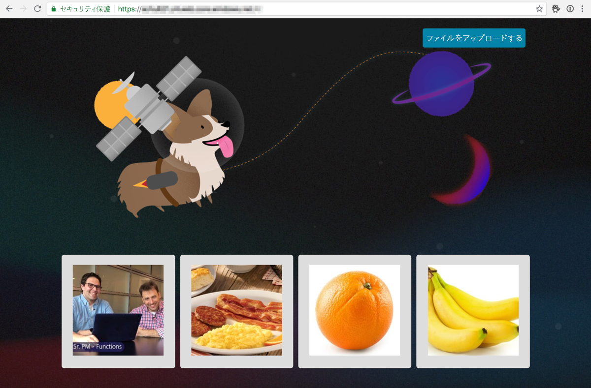
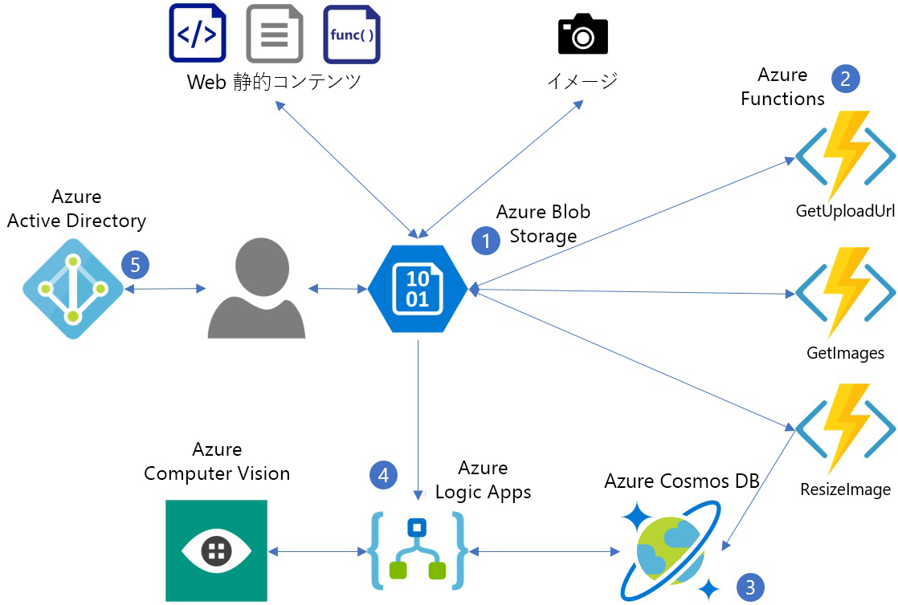
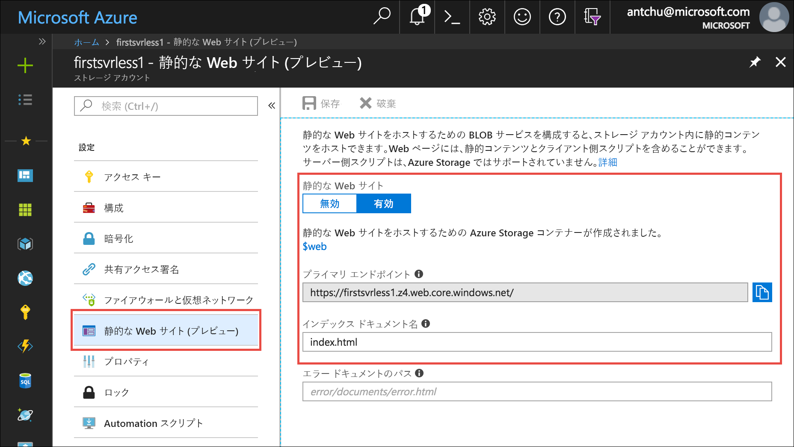
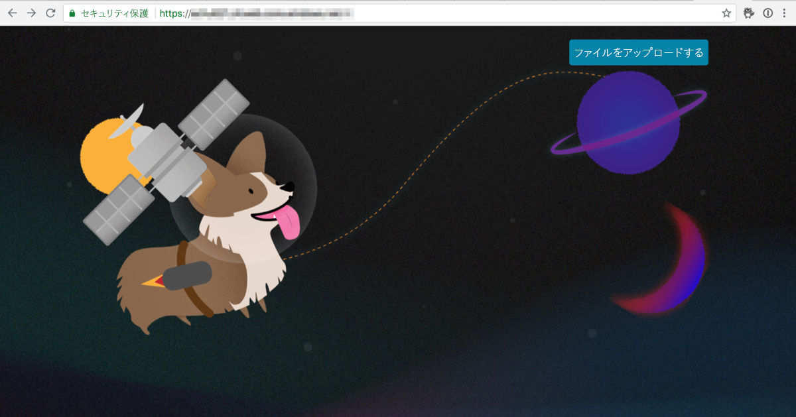

このモジュールでは、HTML ベースのユーザー インターフェイスを表示するシンプルな Web アプリケーションをデプロイします。 サーバーレス バックエンドにより、アプリケーションで画像をアップロードし、説明キャプションを自動的に生成できます。



次の図では、アプリケーションによって使用されている Azure サービスを示します。



1. Azure Blob Storage は静的 Web コンテンツ (HTML、CSS、JS) を提供し、画像が格納されます。
2. Azure Functions によって、画像のアップロード、サイズ変更、およびメタデータ ストレージが管理されます。
3. Azure Cosmos DB には、画像のメタデータが格納されます。
4. Azure Logic Apps によって、Cognitive Services Computer Vision API から画像のキャプションが取得されます。
5. Azure Active Directory によりユーザー認証が管理されます。

Azure Blob Storage は、静的ファイルをホストする際に使用できる、低コストで非常にスケーラブルなサービスです。 このモジュールでは、Blob Storage を使用して、構築する Web アプリに静的コンテンツ (たとえば、HTML、JavaScript、CSS) を提供します。

## <a name="create-an-azure-storage-account"></a>Azure Storage アカウントの作成
<!---TODO: Update for sandbox?--->

Azure Storage アカウントは、テーブル、キュー、ファイル、BLOB (オブジェクト)、仮想マシン ディスクを格納できる Azure リソースです。

1. **[Enter focus mode]\(フォーカス モードにする\)** ボタンを選択して、Azure Cloud Shell (Bash) を起動します。 このボタンは、ブラウザー ウィンドウの幅に応じて、ページの右上または下部に表示されます。 フォーカス モードでは、ブラウザー ウィンドウの右側に Cloud Shell ウィンドウがドッキングされるので、このチュートリアルで示すコマンドを簡単に実行できます。

1. Azure では、リソース グループは、管理を容易にするために関連する Azure リソースを保持するコンテナーです。 **first-serverless-app** という名前の新しいリソース グループを作成します。

    ```azurecli
    az group create -n first-serverless-app -l westcentralus
    ```

1. このチュートリアルの静的コンテンツ (HTML、CSS、および JavaScript ファイル) は Blob Storage でホストされます。 Blob Storage にはストレージ アカウントが必要です。 リソース グループに汎用 v2 (GPv2) ストレージ アカウントを作成します。 `<storage account name>` を一意の名前に置き換えます。

    ```azurecli
    az storage account create -n <storage account name> -g first-serverless-app --kind StorageV2 -l westcentralus --https-only true --sku Standard_LRS
    ```
    
1. [Azure portal](https://portal.azure.com/?azure-portal=true) の上部にある検索バーを使用して、先ほど作成したストレージ アカウントを検索します。 アカウントを開きます。

1. 左側のナビゲーションで、**[静的な Web サイト (プレビュー)]** を選択して、静的な Web サイトをホストするコンテナーを構成します。
    - **[有効]** を選択して、静的な Web サイトを有効にします。
    - インデックス ドキュメント名として「**index.html**」と入力します。 ボックスには既にグレーのフォントで *index.html* と表示されていますが、これはテキストの例でしかありません。 やはり、ボックスに「**index.html**」と入力する必要があります。
    - **[保存]** をクリックします。
    
    

1. このチュートリアルの作業中に簡単にコピーできる場所に**プライマリ エンドポイント**を保存します。 このエンドポイントは Web アプリケーションの URL です。

## <a name="upload-the-web-application"></a>Web アプリケーションをアップロードする

1. このチュートリアルでビルドするアプリケーションのソース ファイルは、[GitHub リポジトリ](https://github.com/Azure-Samples/functions-first-serverless-web-application)にあります。 Cloud Shell のホーム ディレクトリから、このリポジトリを複製します。

    ```azurecli
    cd ~
    git clone https://github.com/Azure-Samples/functions-first-serverless-web-application
    ```

    リポジトリは `/home/<username>/functions-first-serverless-web-application` に複製されます。

1. クライアント側の Web アプリケーションは **www** フォルダーにあり、Vue.js JavaScript フレームワークを使用して構築されています。 **www** フォルダーを開き、**npm** コマンドを実行してアプリケーションの依存関係をインストールして、アプリケーションをビルドします。 これらのコマンドの最後は、完了に数分かかることがあります。

    ```azurecli
    cd ~/functions-first-serverless-web-application/www
    npm install
    npm run generate
    ```

    アプリケーションが **dist** フォルダーに生成されます。

1. 現在のディレクトリを **dist** フォルダーに変更し、アプリケーションを **$web** BLOB コンテナーにアップロードします。

    ```azurecli
    cd dist
    az storage blob upload-batch -s . -d \$web --account-name <storage account name>
    ```

1. アプリケーションを表示するには、Web ブラウザーで静的な Web サイトのプライマリ エンドポイント URL を開きます。

    


## <a name="summary"></a>まとめ

このユニットでは、ストレージ アカウントを含む **first-serverless-app** という名前のリソース グループを作成しました。 ストレージ アカウント内の **$web** という名前の BLOB コンテナーに Web アプリケーションの静的コンテンツを格納し、コンテンツを公開しました。 次に、サーバーレス関数を使用して、この Web アプリケーションから Blob Storage に画像をアップロードする方法を説明します。