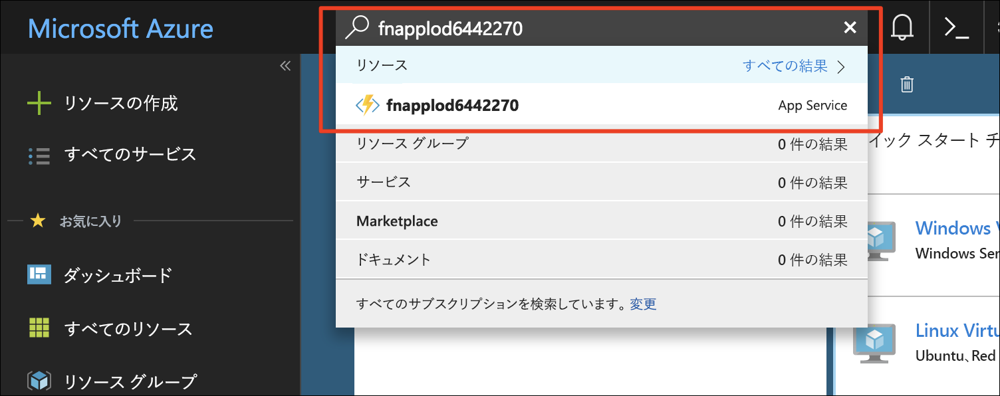
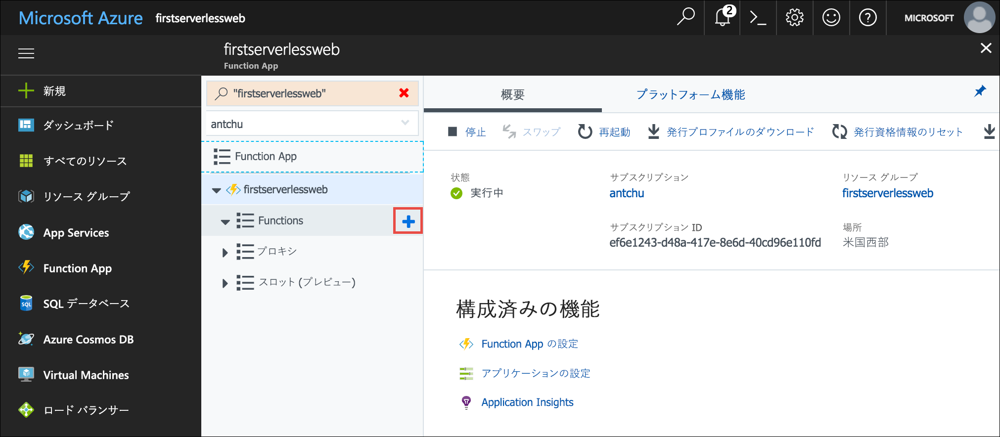
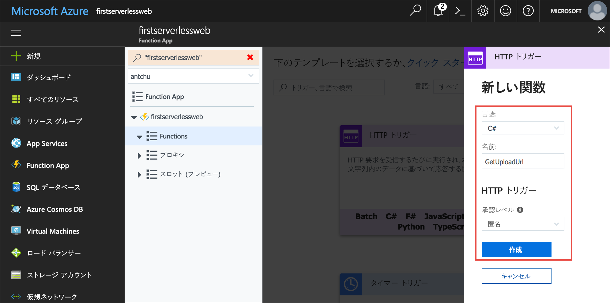
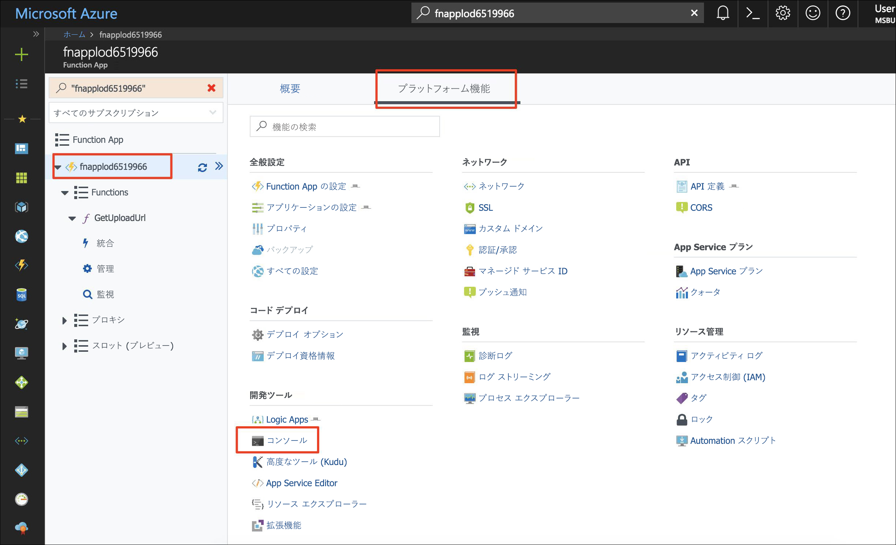
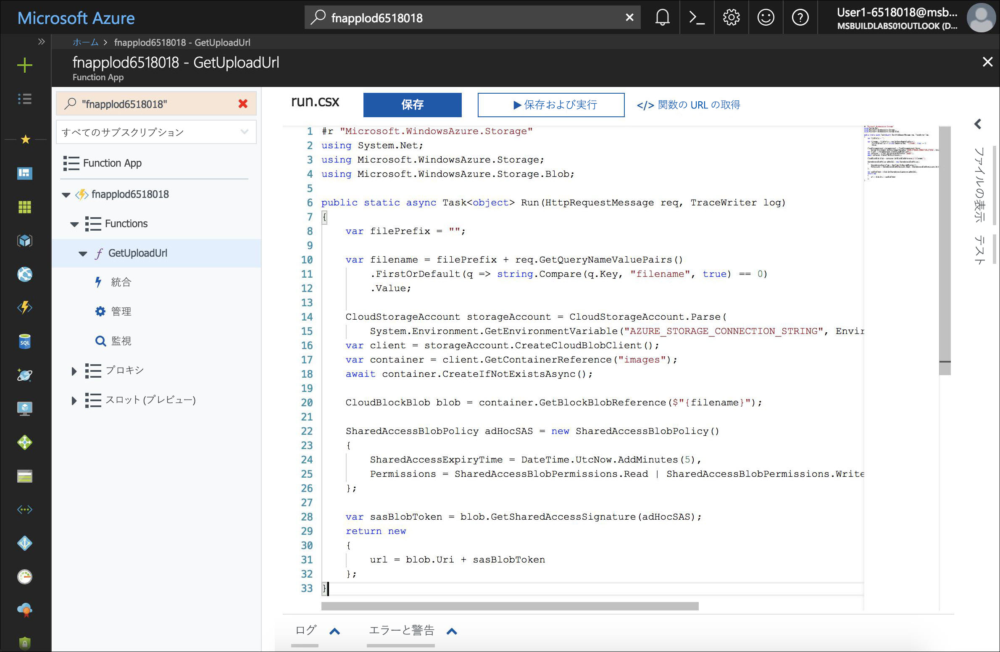
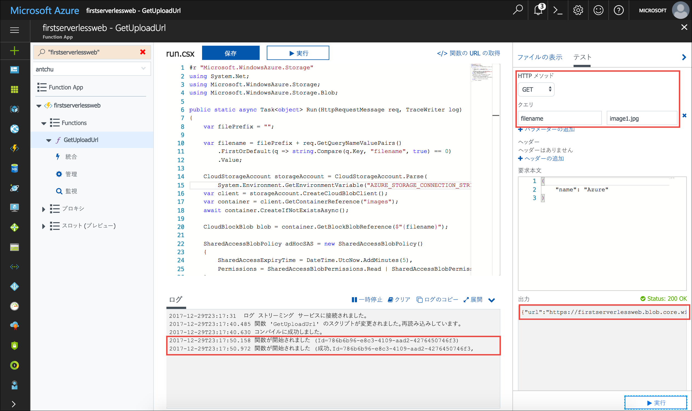
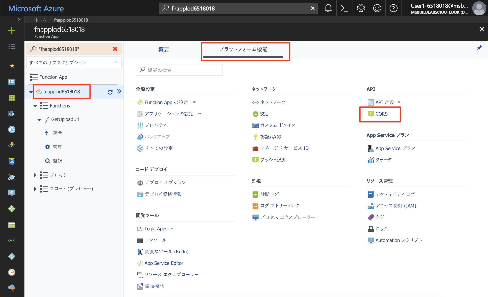
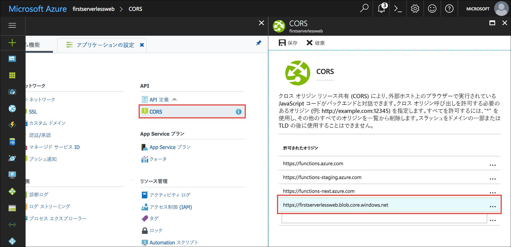

あなたが作成しているアプリケーションは、フォト ギャラリーです。 このアプリケーションでは、クライアント側 JavaScript を使用して API を呼び出し、画像をアップロードおよび表示します。 このモジュールでは、時間制限付き URL を生成して画像をアップロードするサーバーレス関数を使用して、API を作成します。 この Web アプリケーションでは、[Blob Storage REST API](https://docs.microsoft.com/rest/api/storageservices/blob-service-rest-api) を使って Blob Storage に画像をアップロードするために、生成済み URL が使用されます。

## <a name="create-a-blob-storage-container-for-images"></a>画像用の Blob Storage コンテナーを作成する

アプリケーションには、画像をアップロードしてホストするために、別個のストレージ コンテナーが必要です。

1. Azure Cloud Shell (Bash) に引き続きサインインしていることを確認します。 そうでない場合は、**[Enter focus mode]\(フォーカス モードにする\)** を選択して、Cloud Shell ウィンドウを開きます。

1.  すべての BLOB へのパブリック アクセスを持つストレージ アカウント内に **images** という名前の新しいコンテナーを作成します。

    ```azurecli
    az storage container create -n images --account-name <storage account name> --public-access blob
    ```

## <a name="create-an-azure-functions-app"></a>Azure Functions アプリを作成する

Azure Functions はサーバーレス関数を実行するためのサービスです。 サーバーレス関数は、HTTP 要求などのイベントによって、または BLOB がストレージ コンテナーに作成されたときに、トリガーする (呼び出す) ことができます。

Azure Functions アプリは、1 つ以上のサーバーレス関数のためのコンテナーです。

- 新しい Functions アプリを、先に作成した **first-serverless-app** リソース グループ内に作成し、一意の名前を付けます。 Functions アプリには、ストレージ アカウントが必要です。 このチュートリアルでは、既存のストレージ アカウントを使用します。

    ```azurecli
    az functionapp create -n <function app name> -g first-serverless-app -s <storage account name> -c westcentralus
    ```

## <a name="create-an-http-triggered-serverless-function"></a>HTTP によってトリガーされるサーバーレス関数を作成する

画像を Blob Storage に安全にアップロードするため、フォト ギャラリー Web アプリでは、サーバーレス関数に HTTP 要求を行い、時間制限付き URL を生成します。 関数は HTTP 要求によってトリガーされます。この関数では Azure Storage SDK が使用されます。これにより、セキュリティで保護された URL が生成され、返されます。

1. Functions アプリが作成されたら、**検索**ボックスを使用して Azure portal 内でそのアプリを検索します。 アプリをクリックして開きます。

    


1. 左側のナビゲーションの Functions アプリ ウィンドウで、**[関数]** をポイントし、プラス記号 (+) をクリックして新しいサーバーレス関数を作成します。

    

1. **[カスタム関数]** をクリックして、関数テンプレートの一覧を表示します。

1. **HttpTrigger** テンプレートを見つけて、使用する言語 (C# または JavaScript) をクリックします。

1. 次の値を使用して、BLOB のアップロード URL を生成する関数を作成します。

    | 設定      |  推奨値   | 説明                                        |
    | --- | --- | ---|
    | **言語** | C# または JavaScript | 使用する言語を選びます。 |
    | **関数名の指定** | GetUploadUrl | アプリケーションから関数を検出できるように、この名前を、表示されているとおりに入力します。 |
    | **承認レベル** | Anonymous | 関数にパブリックにアクセスできるようにします。 |

    

1. **[作成]** をクリックして、関数を作成します。

::: zone pivot="csharp"
1. **C#** 

    関数のソース コードが表示されたら、**run.csx** ファイル内のすべての内容を [**csharp/GetUploadUrl/run.csx**](https://raw.githubusercontent.com/Azure-Samples/functions-first-serverless-web-application/master/csharp/GetUploadUrl/run.csx) ファイルの内容で置き換えます。

::: zone-end

::: zone pivot="javascript"
1. **JavaScript** 

    1. (JavaScript) この関数には、npm の `azure-storage` パッケージが必要です。 このパッケージによって、セキュリティで保護された URL を構築するために必要な Shared Access Signature (SAS) トークンが生成されます。 npm パッケージをインストールするには、左側のナビゲーションで Functions アプリをクリックし、**[プラットフォーム機能]** をクリックします。

    1. (JavaScript) **[コンソール]** をクリックしてコンソール ウィンドウを表示します。

        

    1. (JavaScript) `cd d:\home\site\wwwroot` コマンドを実行して、現在のディレクトリが **d:\home\site\wwwroot** であることを確認します。

    1. (JavaScript) `npm init -y` コマンドを実行して、空の **package.json** ファイルを作成します。

    1. (JavaScript) パッケージをインストールするには、コンソールでコマンド `npm install --save azure-storage` を実行します。 パッケージを **package.json** として保存します。 操作が完了するまで数分かかることがあります。

    1. (JavaScript) 左側のナビゲーションで関数 (**GetUploadUrl**) をクリックして、関数を表示します。 **index.js** ファイルのすべての内容を、[**javascript/GetUploadUrl/index.js**](https://raw.githubusercontent.com/Azure-Samples/functions-first-serverless-web-application/master/javascript/GetUploadUrl/index.js) ファイルの内容で置き換えます。
    
        

::: zone-end

1. コード ウィンドウの下の **[ログ]** をクリックして、ログ パネルを展開します。

1. **[保存]** をクリックします。 関数が正常にコンパイルされていることを、ログ パネルで確認します。

この関数により、Blob Storage にファイルをアップロードするために使用する Shared Access Signature (SAS) URL と呼ばれるものが生成されます。 SAS URL の有効期間は短く、この URL でアップロードが許可されるのは 1 つのファイルだけです。 [Shared Access Signature の使用方法](https://docs.microsoft.com/azure/storage/common/storage-dotnet-shared-access-signature-part-1)については、Blob Storage のドキュメントを参照してください。


## <a name="add-an-environment-variable-for-the-storage-connection-string"></a>ストレージ接続文字列に環境変数を追加する

作成した関数で SAS URL を生成できるようにするには、ストレージ アカウントの接続文字列が必要です。 接続文字列は、関数本体でハードコーディングするのではなく、アプリケーション設定として格納できます。 アプリケーション設定には、Functions アプリ内のすべての関数が環境変数としてアクセスできます。

1. Cloud Shell で、ストレージ アカウント接続文字列のクエリを実行し、**STORAGE_CONNECTION_STRING** という名前の Bash 変数に保存します。

    ```azurecli
    export STORAGE_CONNECTION_STRING=$(az storage account show-connection-string -n <storage account name> -g first-serverless-app --query "connectionString" --output tsv)
    ```

    変数が正常に設定されていることを確認します。

    ```azurecli
    echo $STORAGE_CONNECTION_STRING
    ```

1. 前の手順で保存した値を使用して、**AZURE_STORAGE_CONNECTION_STRING** という名前の新しいアプリケーション設定を作成します。

    ```azurecli
    az functionapp config appsettings set -n <function app name> -g first-serverless-app --settings AZURE_STORAGE_CONNECTION_STRING=$STORAGE_CONNECTION_STRING -o table
    ```

    コマンドの出力に、正しい値が指定された新しいアプリケーション設定が含まれていることを確認します。


## <a name="test-the-serverless-function"></a>サーバーレス関数をテストする

Azure portal には、関数の作成と編集だけでなく、関数をテストするツールも組み込まれています。

1. HTTP サーバーレス関数をテストするには、コード ウィンドウの右側にある **[テスト]** タブをクリックして、テスト パネルを展開します。

1. **[HTTP メソッド]** を **[GET]** に変更します。

1. **[クエリ]** の下の **[パラメーターの追加]** をクリックし、次のパラメーターを追加します。

    | 名前      |  値   | 
    | --- | --- |
    | **filename** | image1.jpg |

1. テスト パネルで **[実行]** をクリックして、HTTP 要求を関数に送信します。

1. 関数の出力にアップロード URL が返されます。 関数の実行は、ログ パネルに表示されます。

    


## <a name="configure-cors-in-the-functions-app"></a>Functions アプリで CORS を構成する

関数のフロントエンドは Blob Storage でホストされているため、そのドメイン名は、Azure Functions アプリとは異なります。 作成した関数がクライアント側の JavaScript によって正常に呼び出されるように、Functions アプリをクロス オリジン リソース共有 (CORS) 用に構成する必要があります。

1. 関数アプリ ウィンドウの左側のナビゲーション バーで、お使いの Functions アプリの名前をクリックします。

1. **[プラットフォーム機能]** をクリックして、高度な機能の一覧を表示します。

1. **[API]** で **[CORS]** をクリックします。

    

1. 前のモジュールのアプリケーション URL の許可されたオリジンを、末尾のスラッシュ (/) を省略して追加します。 例: `https://firstserverlessweb.z4.web.core.windows.net`。

    

1. **[保存]** をクリックします。

1. **C#**:

   1. (C#) `GetUploadUrl` 関数に戻り、**[統合]** タブを選択します。

   1. (C#) **[選択した HTTP メソッド]** で、**[OPTIONS]** を選択します。

      **[GET]**、**[POST]**、および **[OPTIONS]** がすべて選択されている必要があります。 CORS では **OPTIONS** メソッドが使用されます。C# 関数の既定では、これは選択されていません。  

   1. (C#) **[保存]** をクリックします。

1. 引き続き Azure portal で、Functions アプリに移動します。 **[概要]** タブを選択します。**[再起動]** をクリックして、CORS への変更が有効になっていることを確認します。

## <a name="configure-cors-in-the-storage-account"></a>ストレージ アカウントで CORS を構成する

Functions アプリでは Blob Storage に対してクライアント側 JavaScript 呼び出しを実行して、ファイルをアップロードするため、ストレージ アカウントを CORS 用に構成する必要があります。

- 次のコマンドを実行して、すべてのオリジンが、ファイルをストレージ アカウントにアップロードできるようにします。

    ```azurecli
    az storage cors add --methods OPTIONS PUT --origins '*' --exposed-headers '*' --allowed-headers '*' --services b --account-name <storage account name>
    ```


## <a name="modify-the-web-app-to-upload-images"></a>Web アプリを変更して画像をアップロードする

Web アプリでは、**settings.js** という名前のファイルから設定を取得します。 次の手順では、Cloud Shell を使用してファイルを作成します。 `window.apiBaseUrl` を Functions アプリの URL に設定し、`window.blobBaseUrl` を Azure Blob Storage エンドポイントの URL に設定します。

1. Cloud Shell で、現在のディレクトリが **www/dist** フォルダーであることを確認します。

    ```azurecli
    cd ~/functions-first-serverless-web-application/www/dist
    ```

1. Functions アプリの URL のクエリを実行し、**FUNCTION_APP_URL** という名前の Bash 変数に格納します。

    ```azurecli
    export FUNCTION_APP_URL="https://"$(az functionapp show -n <function app name> -g first-serverless-app --query "defaultHostName" --output tsv)
    ```

    変数が正しく設定されていることを確認します。

    ```azurecli
    echo $FUNCTION_APP_URL
    ```

1. Functions アプリに API 呼び出しのベース URI を設定するには、**settings.js** ファイルを作成します。 次の例のように、Functions アプリの URL を追加します。

    `window.apiBaseUrl = 'https://fnapp@lab.GlobalLabInstanceId.azurewebsites.net'`

    変更を行うには、次のコマンドを実行するか、VIM などのコマンド ライン エディターを使用します。

    ```azurecli
    echo "window.apiBaseUrl = '$FUNCTION_APP_URL'" > settings.js
    ```

    ファイルが正常に書き込まれたことを確認します。

    ```azurecli
    cat settings.js
    ```

1. Blob Storage のベース URL のクエリを実行し、**BLOB_BASE_URL** という名前の Bash 変数に格納します。

    ```azurecli
    export BLOB_BASE_URL=$(az storage account show -n <storage account name> -g first-serverless-app --query primaryEndpoints.blob -o tsv | sed 's/\/$//')
    ```

    変数が正しく設定されていることを確認します。

    ```azurecli
    echo $BLOB_BASE_URL
    ```

1. API 呼び出しのベース URI をお使いの Functions アプリに設定するには、次の例のように、Blob Storage URL を **settings.js** ファイルに追加します。

    `window.blobBaseUrl = 'https://mystorage.blob.core.windows.net'`

    変更を行うには、次のコマンドを実行するか、VIM などのコマンド ライン エディターを使用します。

    ```azurecli
    echo "window.blobBaseUrl = '$BLOB_BASE_URL'" >> settings.js
    ```

    ファイルが正常に書き込まれたこと、および 2 行が含まれていることを確認します。

    ```azurecli
    cat settings.js
    ```

1. ファイルを Blob Storage にアップロードします。

    ```azurecli
    az storage blob upload -c \$web --account-name <storage account name> -f settings.js -n settings.js
    ```


## <a name="test-the-web-application"></a>Web アプリケーションをテストする

この時点で、ギャラリー アプリケーションでは Blob Storage に画像をアップロードできますが、まだ画像は表示できません。 `GetImages` 関数の呼び出しが試行されますが、この関数はまだ存在しません。これは後のモジュールで作成します。 この呼び出しは失敗し、Web ページには "分析中…" と表示されたままになりますが、選択する画像は正常にアップロードされます。

画像が正常にアップロードされていることを確認するには、Azure portal で **images** コンテナーの内容を確認します。

1. ブラウザー ウィンドウで、アプリケーションを参照します。 画像ファイルを選択してアップロードします。 アップロードが完了しますが、画像を表示する機能はまだ追加していないため、アップロードした写真はアプリに表示されません  (Web ページには "画像分析中..." と表示されたままになります。これは後で修正します)。

1. Cloud Shell で、**images** コンテナーに画像がアップロードされていることを確認します。

    ```azurecli
    az storage blob list --account-name <storage account name> -c images -o table
    ```

1. 次のチュートリアルに進む前に、**images** コンテナー内のすべてのファイルを削除します。

    ```azurecli
    az storage blob delete-batch -s images --account-name <storage account name>
    ```


## <a name="summary"></a>まとめ

このユニットでは、Azure Functions アプリを作成しました。また、サーバーレス関数を使用して、Web アプリケーションで画像を Blob Storage にアップロードできるようにする方法を学習しました。 次は、BLOB によってトリガーされるサーバーレス関数を使用して、アップロードされた画像のサムネイルを作成する方法を説明します。