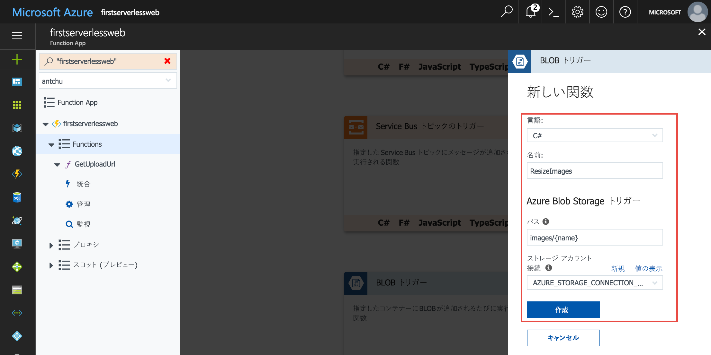
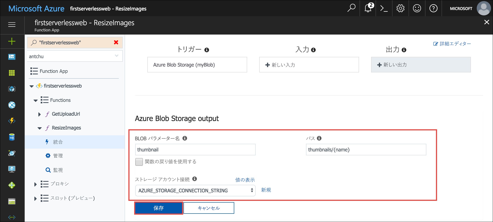
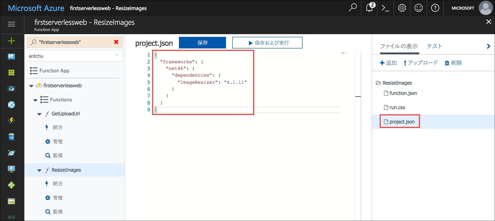

<span data-ttu-id="28c62-101">前のユニットでは、サーバーレス関数を使用して、Web アプリケーションから Blob Storage に画像をアップロードするときにセキュリティで保護する方法について説明しました。</span><span class="sxs-lookup"><span data-stu-id="28c62-101">In the previous unit, you saw how a serverless function can facilitate the secure uploading of images to Blob storage from a web application.</span></span> <span data-ttu-id="28c62-102">このモジュールでは、アップロードされた画像を監視し、そこからサムネイルを作成するために、別のサーバーレス関数を作成します。</span><span class="sxs-lookup"><span data-stu-id="28c62-102">In this module, you create another serverless function to watch for uploaded images and create thumbnails from them.</span></span>

## <a name="create-a-blob-storage-container-for-thumbnails"></a><span data-ttu-id="28c62-103">サムネイル用の Blob Storage コンテナーを作成する</span><span class="sxs-lookup"><span data-stu-id="28c62-103">Create a Blob storage container for thumbnails</span></span>

<span data-ttu-id="28c62-104">フル サイズの画像は、**images** という名前のコンテナーに格納されます。</span><span class="sxs-lookup"><span data-stu-id="28c62-104">The full-size images are stored in a container named **images**.</span></span> <span data-ttu-id="28c62-105">これらの画像のサムネイルを格納するには、別のコンテナーが必要になります。</span><span class="sxs-lookup"><span data-stu-id="28c62-105">You need another container to store thumbnails of those images.</span></span>

<span data-ttu-id="28c62-106">すべての BLOB へのパブリック アクセスを持つストレージ アカウント内に、**thumbnails** という名前の新しいコンテナーを作成します。</span><span class="sxs-lookup"><span data-stu-id="28c62-106">Create a new container named **thumbnails** in your Storage account with public access to all blobs.</span></span>

```azurecli
az storage container create -n thumbnails --account-name <storage account name> --public-access blob
```

## <a name="create-a-blob-triggered-serverless-function"></a><span data-ttu-id="28c62-107">BLOB によってトリガーされるサーバーレス関数を作成する</span><span class="sxs-lookup"><span data-stu-id="28c62-107">Create a blob-triggered serverless function</span></span>

<span data-ttu-id="28c62-108">トリガーでは関数を呼び出す方法を定義します。</span><span class="sxs-lookup"><span data-stu-id="28c62-108">A trigger defines how a function is invoked.</span></span> <span data-ttu-id="28c62-109">次に作成する関数では BLOB トリガーを使用します。</span><span class="sxs-lookup"><span data-stu-id="28c62-109">The function you create next uses a blob trigger.</span></span> <span data-ttu-id="28c62-110">関数は、BLOB (画像ファイル) が **images** コンテナーにアップロードされるときに自動的に呼び出されます。</span><span class="sxs-lookup"><span data-stu-id="28c62-110">The function is automatically invoked when a blob (image file) is uploaded to the **images** container.</span></span> <span data-ttu-id="28c62-111">1 つの関数には 1 つのトリガーしか含められません。</span><span class="sxs-lookup"><span data-stu-id="28c62-111">A function must have one trigger.</span></span> <span data-ttu-id="28c62-112">トリガーにはデータが関連付けられていて、通常そのデータは、その関数をトリガーしたペイロードです。</span><span class="sxs-lookup"><span data-stu-id="28c62-112">Triggers have associated data, which are usually the payload that triggered the function.</span></span>

<span data-ttu-id="28c62-113">バインディングでは、関数が Azure またはサード パーティのサービスでデータを読み書きする方法を定義します。</span><span class="sxs-lookup"><span data-stu-id="28c62-113">Bindings define how a function reads or writes data in Azure or third-party services.</span></span> <span data-ttu-id="28c62-114">この関数では、関数をトリガーする画像のサムネイル バージョンを作成し、そのサムネイルを *thumbnails* コンテナーに保存します。</span><span class="sxs-lookup"><span data-stu-id="28c62-114">This function creates a thumbnail version of the image that triggers it and saves the thumbnail in a *thumbnails* container.</span></span>

1. <span data-ttu-id="28c62-115">サンドボックスをアクティブ化したときと同じアカウントを使用して、[Azure portal](https://portal.azure.com/triplecrownlabs.onmicrosoft.com?azure-portal=true) にサインインします。</span><span class="sxs-lookup"><span data-stu-id="28c62-115">Sign into the [Azure portal](https://portal.azure.com/triplecrownlabs.onmicrosoft.com?azure-portal=true) using the same account you activated the sandbox with.</span></span>

1. <span data-ttu-id="28c62-116">ご自分の関数アプリを開くと、ポータルの上部にある **[検索]** ボックスを使用して名前で検索することができます。</span><span class="sxs-lookup"><span data-stu-id="28c62-116">Open your Function app, you can use the **Search** box at the top of the portal to find it by name.</span></span>

1. <span data-ttu-id="28c62-117">Functions アプリ ウィンドウの左側のナビゲーションで、**[関数]** をポイントし、プラス記号 (+) をクリックして新しいサーバーレス関数を作成します。</span><span class="sxs-lookup"><span data-stu-id="28c62-117">In the Functions app window's left navigation, point to **Functions** and click the plus sign (+) to create a new serverless function.</span></span> <span data-ttu-id="28c62-118">クイック スタート ページが表示されたら、**[カスタム関数]** をクリックして、関数テンプレートの一覧を表示します。</span><span class="sxs-lookup"><span data-stu-id="28c62-118">If a quickstart page appears, click **Custom function** to see a list of function templates.</span></span>

1. <span data-ttu-id="28c62-119">**BlobTrigger** テンプレートを検索して選択します。</span><span class="sxs-lookup"><span data-stu-id="28c62-119">Find the **BlobTrigger** template and select it.</span></span>

1. <span data-ttu-id="28c62-120">以下の値を使用して、画像がアップロードされるときにサムネイルを作成する関数を作成します。</span><span class="sxs-lookup"><span data-stu-id="28c62-120">Use these values to create a function that creates thumbnails as images are uploaded:</span></span>

    | <span data-ttu-id="28c62-121">設定</span><span class="sxs-lookup"><span data-stu-id="28c62-121">Setting</span></span>      |  <span data-ttu-id="28c62-122">推奨値</span><span class="sxs-lookup"><span data-stu-id="28c62-122">Suggested value</span></span>   | <span data-ttu-id="28c62-123">説明</span><span class="sxs-lookup"><span data-stu-id="28c62-123">Description</span></span>                                        |
    | --- | --- | ---|
    | <span data-ttu-id="28c62-124">**言語**</span><span class="sxs-lookup"><span data-stu-id="28c62-124">**Language**</span></span> | <span data-ttu-id="28c62-125">C# または JavaScript</span><span class="sxs-lookup"><span data-stu-id="28c62-125">C# or JavaScript</span></span> | <span data-ttu-id="28c62-126">優先する言語を選択します。</span><span class="sxs-lookup"><span data-stu-id="28c62-126">Choose your preferred language.</span></span> |
    | <span data-ttu-id="28c62-127">**関数名の指定**</span><span class="sxs-lookup"><span data-stu-id="28c62-127">**Name your function**</span></span> | <span data-ttu-id="28c62-128">ResizeImage</span><span class="sxs-lookup"><span data-stu-id="28c62-128">ResizeImage</span></span> | <span data-ttu-id="28c62-129">アプリケーションから関数を検出できるように、この名前を、表示されているとおりに入力します。</span><span class="sxs-lookup"><span data-stu-id="28c62-129">Enter this name exactly as shown, so the application can discover the function.</span></span> |
    | <span data-ttu-id="28c62-130">**パス**</span><span class="sxs-lookup"><span data-stu-id="28c62-130">**Path**</span></span> | <span data-ttu-id="28c62-131">images/{name}</span><span class="sxs-lookup"><span data-stu-id="28c62-131">images/{name}</span></span> | <span data-ttu-id="28c62-132">**images** コンテナーにファイルが示されたときに関数を実行します。</span><span class="sxs-lookup"><span data-stu-id="28c62-132">Execute the function when a file appears in the **images** container.</span></span> |
    | <span data-ttu-id="28c62-133">**ストレージ アカウント情報**</span><span class="sxs-lookup"><span data-stu-id="28c62-133">**Storage account information**</span></span> | <span data-ttu-id="28c62-134">AZURE_STORAGE_CONNECTION_STRING</span><span class="sxs-lookup"><span data-stu-id="28c62-134">AZURE_STORAGE_CONNECTION_STRING</span></span> | <span data-ttu-id="28c62-135">接続文字列を使用して前に作成した環境変数を使用します。</span><span class="sxs-lookup"><span data-stu-id="28c62-135">Use the environment variable previously created with the connection string.</span></span> |

    

1. <span data-ttu-id="28c62-137">**[作成]** をクリックして、関数を作成します。</span><span class="sxs-lookup"><span data-stu-id="28c62-137">Click **Create** to create the function.</span></span>

1. <span data-ttu-id="28c62-138">関数が作成されたら、**[統合]** をクリックして、そのトリガー、入力、および出力バインディングを表示します。</span><span class="sxs-lookup"><span data-stu-id="28c62-138">When the function is created, click **Integrate** to view its trigger, input, and output bindings.</span></span>

1. <span data-ttu-id="28c62-139">**[新しい出力]** をクリックし、新しい出力バインディングを作成します。</span><span class="sxs-lookup"><span data-stu-id="28c62-139">Click **New output** to create a new output binding.</span></span>

    ![[統合] タブで [新しい出力] を選択する](../media/3-new-output.jpg)

1. <span data-ttu-id="28c62-141">**[Azure Blob Storage]** を選び、**[選択]** をクリックします。</span><span class="sxs-lookup"><span data-stu-id="28c62-141">Select **Azure Blob Storage** and click **Select**.</span></span> <span data-ttu-id="28c62-142">**[選択]** ボタンを見つけるために、下へスクロールする必要がある場合があります。</span><span class="sxs-lookup"><span data-stu-id="28c62-142">You may have to scroll down to see the **Select** button.</span></span>

    ![[Azure Blob Storage] を選択する](../media/3-storage-output.jpg)

1. <span data-ttu-id="28c62-144">次の値を入力します。</span><span class="sxs-lookup"><span data-stu-id="28c62-144">Enter the following values:</span></span>

    | <span data-ttu-id="28c62-145">設定</span><span class="sxs-lookup"><span data-stu-id="28c62-145">Setting</span></span>      |  <span data-ttu-id="28c62-146">推奨値</span><span class="sxs-lookup"><span data-stu-id="28c62-146">Suggested value</span></span>   | <span data-ttu-id="28c62-147">説明</span><span class="sxs-lookup"><span data-stu-id="28c62-147">Description</span></span>                                        |
    | --- | --- | ---|
    | <span data-ttu-id="28c62-148">**BLOB パラメーター名**</span><span class="sxs-lookup"><span data-stu-id="28c62-148">**Blob parameter name**</span></span> | <span data-ttu-id="28c62-149">thumbnail</span><span class="sxs-lookup"><span data-stu-id="28c62-149">thumbnail</span></span> | <span data-ttu-id="28c62-150">この関数では、この名前のパラメーターを使用してサムネイルを書き込みます。</span><span class="sxs-lookup"><span data-stu-id="28c62-150">The function uses the parameter with this name to write the thumbnail.</span></span> |
    | <span data-ttu-id="28c62-151">**関数の戻り値を使用する**</span><span class="sxs-lookup"><span data-stu-id="28c62-151">**Use function return value**</span></span> | <span data-ttu-id="28c62-152">No</span><span class="sxs-lookup"><span data-stu-id="28c62-152">No</span></span> |  |
    | <span data-ttu-id="28c62-153">**パス**</span><span class="sxs-lookup"><span data-stu-id="28c62-153">**Path**</span></span> | <span data-ttu-id="28c62-154">thumbnails/{name}</span><span class="sxs-lookup"><span data-stu-id="28c62-154">thumbnails/{name}</span></span> | <span data-ttu-id="28c62-155">サムネイルは、**thumbnails** という名前のコンテナーに書き込まれます。</span><span class="sxs-lookup"><span data-stu-id="28c62-155">The thumbnails are written to a container named **thumbnails**.</span></span> |
    | <span data-ttu-id="28c62-156">**ストレージ アカウント接続**</span><span class="sxs-lookup"><span data-stu-id="28c62-156">**Storage account connection**</span></span> | <span data-ttu-id="28c62-157">AZURE_STORAGE_CONNECTION_STRING</span><span class="sxs-lookup"><span data-stu-id="28c62-157">AZURE_STORAGE_CONNECTION_STRING</span></span> | <span data-ttu-id="28c62-158">接続文字列を使用して前に作成した環境変数を使用します。</span><span class="sxs-lookup"><span data-stu-id="28c62-158">Use the environment variable previously created with the connection string.</span></span> |

    

1. <span data-ttu-id="28c62-160">**[保存]** をクリックして変更を保存します。</span><span class="sxs-lookup"><span data-stu-id="28c62-160">Click **Save** to save your changes.</span></span>

<span data-ttu-id="28c62-161">::: zone pivot="javascript"</span><span class="sxs-lookup"><span data-stu-id="28c62-161">::: zone pivot="javascript"</span></span>

11. <span data-ttu-id="28c62-162">ウィンドウの右上隅にある **[詳細エディター]** をクリックして、バインディングを表す JSON を表示します。</span><span class="sxs-lookup"><span data-stu-id="28c62-162">Click on **Advanced editor** in the top right corner of the window to reveal the JSON that represents the bindings.</span></span>

1. <span data-ttu-id="28c62-163">`blobTrigger` バインディングで、`binary` の値を持つ `dataType` という名前のプロパティを追加します。</span><span class="sxs-lookup"><span data-stu-id="28c62-163">In the `blobTrigger` binding, add a property named `dataType` with a value of `binary`.</span></span> <span data-ttu-id="28c62-164">これによって、BLOB コンテンツをバイナリ データとして関数に渡すように、バインディングが構成されます。</span><span class="sxs-lookup"><span data-stu-id="28c62-164">This configures the binding to pass the blob contents to the function as binary data.</span></span>

    ```json
    {
        "name": "myBlob",
        "type": "blobTrigger",
        "direction": "in",
        "path": "images/{name}",
        "connection": "AZURE_STORAGE_CONNECTION_STRING",
        "dataType": "binary"
    }
    ```

1. <span data-ttu-id="28c62-165">**[保存]** をクリックして新しいバインディングを作成します。</span><span class="sxs-lookup"><span data-stu-id="28c62-165">Click **Save** to create the new binding.</span></span>

<span data-ttu-id="28c62-166">::: zone-end</span><span class="sxs-lookup"><span data-stu-id="28c62-166">::: zone-end</span></span>

<span data-ttu-id="28c62-167">::: zone pivot="csharp"</span><span class="sxs-lookup"><span data-stu-id="28c62-167">::: zone pivot="csharp"</span></span>

11. <span data-ttu-id="28c62-168">左側のナビゲーションで、関数名 **ResizeImage** を選択して、この関数のソース コードを開きます。</span><span class="sxs-lookup"><span data-stu-id="28c62-168">Select the **ResizeImage** function name in the left navigation to open the function's source code.</span></span>

1. <span data-ttu-id="28c62-169">この関数でサムネイルを生成するには、**ImageResizer** という NuGet パッケージが必要です。</span><span class="sxs-lookup"><span data-stu-id="28c62-169">The function requires a NuGet package called **ImageResizer** to generate the thumbnails.</span></span> <span data-ttu-id="28c62-170">NuGet パッケージは、**project.json** ファイルを使用して C# 関数に追加します。</span><span class="sxs-lookup"><span data-stu-id="28c62-170">NuGet packages are added to C# functions using a **project.json** file.</span></span> <span data-ttu-id="28c62-171">このファイルを作成するには、右にある **[ファイルの表示]** をクリックして、関数を構成するファイルを表示します。</span><span class="sxs-lookup"><span data-stu-id="28c62-171">To create the file, click **View Files** on the right to reveal the files that make up the function.</span></span>

1. <span data-ttu-id="28c62-172">**[追加]** をクリックして、**project.json** という名前の新しいファイルを追加します。</span><span class="sxs-lookup"><span data-stu-id="28c62-172">Click **Add** to add a new file named **project.json**.</span></span> <span data-ttu-id="28c62-173">完了したら **Enter** キーを押して、ファイルを追加します。</span><span class="sxs-lookup"><span data-stu-id="28c62-173">Press **Enter** when done to add the file.</span></span>

1. <span data-ttu-id="28c62-174">[**/csharp/ResizeImage/project.json**](https://raw.githubusercontent.com/Azure-Samples/functions-first-serverless-web-application/master/csharp/ResizeImage/project.json) ファイルの内容を、新しく作成したファイルにコピーします。</span><span class="sxs-lookup"><span data-stu-id="28c62-174">Copy the contents of the [**/csharp/ResizeImage/project.json**](https://raw.githubusercontent.com/Azure-Samples/functions-first-serverless-web-application/master/csharp/ResizeImage/project.json) file into the newly created file.</span></span> <span data-ttu-id="28c62-175">ファイルを保存します。</span><span class="sxs-lookup"><span data-stu-id="28c62-175">Save the file.</span></span> <span data-ttu-id="28c62-176">ファイルが更新されると、パッケージが自動的に復元されます。</span><span class="sxs-lookup"><span data-stu-id="28c62-176">Packages are automatically restored when the file is updated.</span></span>

    

1. <span data-ttu-id="28c62-178">**[ファイルの表示]** で、**[run.csx]** を選択します。</span><span class="sxs-lookup"><span data-stu-id="28c62-178">Under **View Files**, select **run.csx**.</span></span> <span data-ttu-id="28c62-179">その内容を [**/csharp/ResizeImage/run.csx**](https://raw.githubusercontent.com/Azure-Samples/functions-first-serverless-web-application/master/csharp/ResizeImage/run.csx) ファイルの内容で置き換えます。</span><span class="sxs-lookup"><span data-stu-id="28c62-179">Replace its content with the content in the [**/csharp/ResizeImage/run.csx**](https://raw.githubusercontent.com/Azure-Samples/functions-first-serverless-web-application/master/csharp/ResizeImage/run.csx) file.</span></span>

1. <span data-ttu-id="28c62-180">ログ パネルを展開するには、コード ウィンドウの下の **[ログ]** をクリックします。</span><span class="sxs-lookup"><span data-stu-id="28c62-180">To expand the logs panel, click **Logs** below the code window.</span></span>

1. <span data-ttu-id="28c62-181">**[保存]** をクリックします。</span><span class="sxs-lookup"><span data-stu-id="28c62-181">Click **Save**.</span></span> <span data-ttu-id="28c62-182">関数が確実にエラーのない状態で正常に保存されていることをログ パネルで確認します。</span><span class="sxs-lookup"><span data-stu-id="28c62-182">Check the Logs panel to ensure the function is successfully saved and there are no errors.</span></span>

<span data-ttu-id="28c62-183">::: zone-end</span><span class="sxs-lookup"><span data-stu-id="28c62-183">::: zone-end</span></span>

<span data-ttu-id="28c62-184">::: zone pivot="javascript"</span><span class="sxs-lookup"><span data-stu-id="28c62-184">::: zone pivot="javascript"</span></span>

14. <span data-ttu-id="28c62-185">この関数で写真のサイズを変更するには、npm の `jimp` パッケージが必要です。</span><span class="sxs-lookup"><span data-stu-id="28c62-185">This function requires the `jimp` package from npm to resize the photo.</span></span> <span data-ttu-id="28c62-186">npm パッケージをインストールするには、左側のナビゲーションで Functions アプリの名前をクリックし、**[プラットフォーム機能]** をクリックします。</span><span class="sxs-lookup"><span data-stu-id="28c62-186">To install the npm package, click on the Functions app name on the left navigation and click **Platform features**.</span></span>

1. <span data-ttu-id="28c62-187">**[コンソール]** をクリックしてコンソール ウィンドウを表示します。</span><span class="sxs-lookup"><span data-stu-id="28c62-187">Click **Console** to reveal a console window.</span></span>

1. <span data-ttu-id="28c62-188">コンソールで `npm install jimp` コマンドを実行します。</span><span class="sxs-lookup"><span data-stu-id="28c62-188">Run the command `npm install jimp` in the console.</span></span> <span data-ttu-id="28c62-189">操作が完了するまで数分かかることがあります。</span><span class="sxs-lookup"><span data-stu-id="28c62-189">It may take a few minutes to complete the operation.</span></span>

1. <span data-ttu-id="28c62-190">左側のナビゲーションで関数名 **ResizeImage** をクリックして、関数を表示します。</span><span class="sxs-lookup"><span data-stu-id="28c62-190">Click on the **ResizeImage** function name in the left navigation to reveal the function.</span></span> <span data-ttu-id="28c62-191">**index.js** ファイルのすべての内容を、[**/javascript/ResizeImage/index.js**](https://raw.githubusercontent.com/Azure-Samples/functions-first-serverless-web-application/master/javascript/ResizeImage/index.js) ファイルの内容で置き換えます。</span><span class="sxs-lookup"><span data-stu-id="28c62-191">Replace all the content in the **index.js** file with the content of the [**/javascript/ResizeImage/index.js**](https://raw.githubusercontent.com/Azure-Samples/functions-first-serverless-web-application/master/javascript/ResizeImage/index.js) file.</span></span>

1. <span data-ttu-id="28c62-192">ログ パネルを展開するには、コード ウィンドウの下の **[ログ]** をクリックします。</span><span class="sxs-lookup"><span data-stu-id="28c62-192">To expand the logs panel, click **Logs** below the code window.</span></span>

1. <span data-ttu-id="28c62-193">**[保存]** をクリックします。</span><span class="sxs-lookup"><span data-stu-id="28c62-193">Click **Save**.</span></span> <span data-ttu-id="28c62-194">関数が確実にエラーのない状態で正常に保存されていることをログ パネルで確認します。</span><span class="sxs-lookup"><span data-stu-id="28c62-194">Check the Logs panel to ensure the function is successfully saved and there are no errors.</span></span>

<span data-ttu-id="28c62-195">::: zone-end</span><span class="sxs-lookup"><span data-stu-id="28c62-195">::: zone-end</span></span>

## <a name="test-the-serverless-function"></a><span data-ttu-id="28c62-196">サーバーレス関数をテストする</span><span class="sxs-lookup"><span data-stu-id="28c62-196">Test the serverless function</span></span>

1. <span data-ttu-id="28c62-197">ブラウザーでアプリケーションを開きます。</span><span class="sxs-lookup"><span data-stu-id="28c62-197">Open the application in a browser.</span></span> <span data-ttu-id="28c62-198">画像ファイルを選択してアップロードします。</span><span class="sxs-lookup"><span data-stu-id="28c62-198">Select an image file and upload it.</span></span> <span data-ttu-id="28c62-199">アップロードが完了しますが、画像を表示する機能はまだ追加していないため、アップロードした写真はアプリに表示されません。</span><span class="sxs-lookup"><span data-stu-id="28c62-199">The upload completes, but because we haven't added the ability to display images yet, the app doesn't show the uploaded photo.</span></span>

1. <span data-ttu-id="28c62-200">Cloud Shell で、**images** コンテナーに画像がアップロードされていることを確認します。</span><span class="sxs-lookup"><span data-stu-id="28c62-200">In Cloud Shell, confirm the image was uploaded to the **images** container.</span></span>

    ```azurecli
    az storage blob list \
        --account-name <storage account name> \
        -c images \
        -o table
    ```

1. <span data-ttu-id="28c62-201">**thumbnails** という名前のコンテナー内に、サムネイルが作成されていることを確認します。</span><span class="sxs-lookup"><span data-stu-id="28c62-201">Confirm the thumbnail was created in a container named **thumbnails**.</span></span>

    ```azurecli
    az storage blob list \
        --account-name <storage account name> \
        -c thumbnails \
        -o table
    ```

1. <span data-ttu-id="28c62-202">サムネイル用の URL を取得します。</span><span class="sxs-lookup"><span data-stu-id="28c62-202">Get the URL for the thumbnail.</span></span>

    ```azurecli
    az storage blob url \
        --account-name <storage account name> \
        -c thumbnails \
        -n <filename> \
        --output tsv
    ```

    <span data-ttu-id="28c62-203">ブラウザーで URL を開き、サムネイルが正常に作成されたことを確認します。</span><span class="sxs-lookup"><span data-stu-id="28c62-203">Open the URL in a browser and confirm the thumbnail was properly created.</span></span>

1. <span data-ttu-id="28c62-204">次のユニットに進む前に、**images** と **thumbnails** の各コンテナー内のすべてのファイルを削除します。</span><span class="sxs-lookup"><span data-stu-id="28c62-204">Before continuing to the next unit, delete all files in the **images** and **thumbnails** containers.</span></span>

    ```azurecli
    az storage blob delete-batch \
        -s images \
        --account-name <storage account name>
    ```

    ```azurecli
    az storage blob delete-batch \
        -s thumbnails \
        --account-name <storage account name>
    ```

## <a name="summary"></a><span data-ttu-id="28c62-205">まとめ</span><span class="sxs-lookup"><span data-stu-id="28c62-205">Summary</span></span>

<span data-ttu-id="28c62-206">このユニットでは、画像が Blob Storage コンテナーにアップロードされるときにサムネイルを作成するサーバーレス関数を作成しました。</span><span class="sxs-lookup"><span data-stu-id="28c62-206">In this unit, you created a serverless function to create a thumbnail when an image is uploaded to a Blob storage container.</span></span> <span data-ttu-id="28c62-207">次は、Azure Cosmos DB を使用して、画像のメタデータの格納および一覧表示を行う方法について学習します。</span><span class="sxs-lookup"><span data-stu-id="28c62-207">Next, you will learn how to use Azure Cosmos DB to store and list image metadata.</span></span>