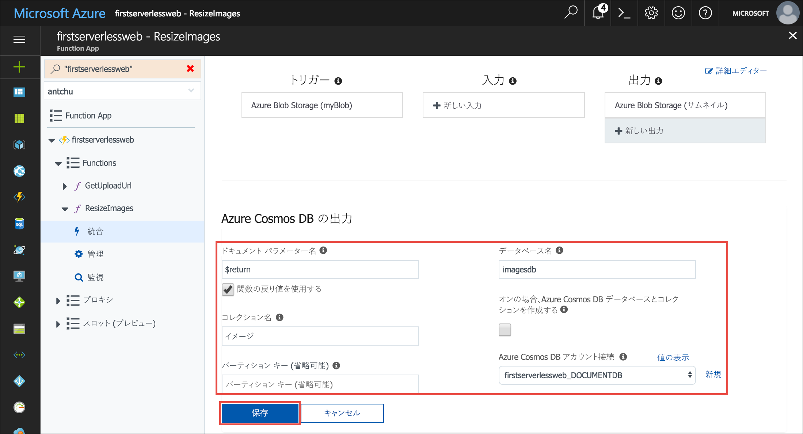
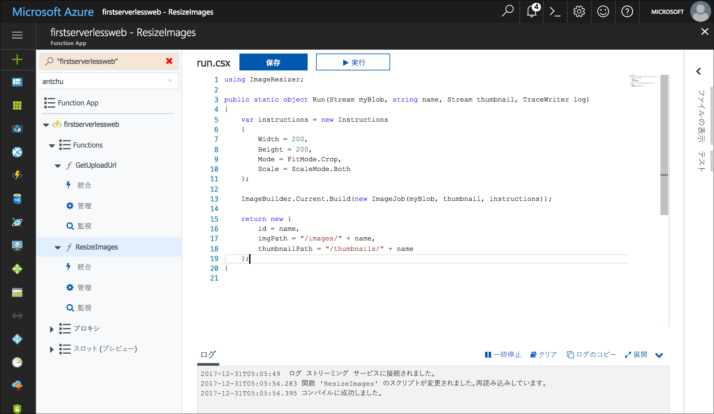
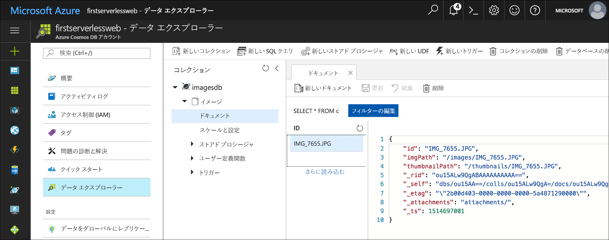

Azure Cosmos DB は、Microsoft のサーバーレスなグローバル分散型マルチモデル データベースです。 このモジュールでは、Azure Functions を使用して、画像のメタデータを JSON ドキュメントとして Azure Cosmos DB に格納および取得する方法を学習します。

## <a name="create-an-azure-cosmos-db-account-database-and-collection"></a>Azure Cosmos DB アカウント、データベース、およびコレクションを作成する

Azure Cosmos DB アカウントは、Azure Cosmos DB データベースを含む Azure リソースです。

1. Cloud Shell に引き続きサインインしていることを確認します。 そうでない場合は、**[Enter focus mode]\(フォーカス モードにする\)** を選択して、Cloud Shell ウィンドウを開きます。 

1. このチュートリアルの他のリソースと同じリソース グループ内で、一意の名前の Azure Cosmos DB アカウントを作成します。

    ```azurecli
    az cosmosdb create -g first-serverless-app -n <cosmos db account name>
    ```

1. Azure Cosmos DB アカウントが作成されたら、そのアカウントに **imagesdb** という名前の新しいデータベースを作成します。

    ```azurecli
    az cosmosdb database create -g first-serverless-app -n <cosmos db account name> --db-name imagesdb
    ```

1. データベースが作成されたら、400 要求ユニット (RU) のスループットで、そのデータベースに **images** という名前の新しいコレクションを作成します。

    ```azurecli
    az cosmosdb collection create -g first-serverless-app -n <cosmos db account name> --db-name imagesdb --collection-name images --throughput 400
    ```


## <a name="save-a-document-to-azure-cosmos-db-when-a-thumbnail-is-created"></a>サムネイルの作成時にドキュメントを Azure Cosmos DB に保存する

Azure Cosmos DB の出力バインディングを使用すると、Azure Functions から Azure Cosmos DB コレクション内にドキュメントを作成できます。 次の手順で、**ResizeImage** 関数の Azure Cosmos DB 出力バインディングを構成し、保存するドキュメント (オブジェクト) を返すようにこの関数を変更します。

1. Azure portal で関数アプリを開きます。

1. 左側のナビゲーションで、**ResizeImage** 関数を展開し、**[統合]** を選択します。

1. **[出力]** で **[新しい出力]** をクリックします。

1. **[Azure Cosmos DB]** 項目を見つけて選択します。 次に **[選択]** をクリックします。

    ![[新しい出力] を選択する](../media/4-new-output.jpg)

1. **[Azure Cosmos DB output]\(Azure Cosmos DB 出力\)** の各フィールドに次の値を入力します。

    | 設定      |  推奨値   | 説明                                        |
    | --- | --- | ---|
    | **ドキュメント パラメーター名** | **[関数の戻り値を使用する]** を選択します。 | ボックス内の値が自動的に **$return** に設定されます。 |
    | **データベース名** | imagesdb | 作成したデータベースの名前を使用します。 |
    | **コレクション名** | images | 作成したコレクションの名前を使用します。 |

1. **[Azure Cosmos DB アカウント接続]** の横にある **[新規]** をクリックします。 以前に作成した Azure Cosmos DB アカウントを選択します。

    

1. **[保存]** をクリックして、Azure Cosmos DB 出力バインディングを作成します。

1. 左側の関数名 **ResizeImage** をクリックして、関数を開きます。

1. **C#**

    1. (C#) 関数の戻り値の型を **void** から **object** に変更します。

    1. (C#) 関数の末尾に次のコード ブロックを追加して、保存するドキュメントを返すようにします。
    
        ```csharp
        return new {
            id = name,
            imgPath = "/images/" + name,
            thumbnailPath = "/thumbnails/" + name
        };
        ```
    
        

1. **JavaScript**

    (JavaScript) `else` 句の `context.done()` ステートメントを変更して、Azure Cosmos DB に保存するドキュメントを返すようにします。

    ```javascript
    if (error) {
        context.done(error);
    } else {
        context.bindings.thumbnail = stream;
        context.done(null, {
            id: context.bindingData.name,
            imgPath: "/images/" + context.bindingData.name,
            thumbnailPath: "/thumbnails/" + context.bindingData.name
        });
    }
    ```

1. コード ウィンドウの下の **[ログ]** をクリックして、ログ パネルを展開します。

1. **[保存]** をクリックします。 関数が正常に保存され、エラーがないことをログ パネルで確認します。


## <a name="create-a-function-to-list-images-from-azure-cosmos-db"></a>Azure Cosmos DB の画像を一覧表示する関数を作成する

Web アプリケーションでは、Azure Cosmos DB から画像のメタデータを取得するための API が必要です。 次の手順では、Azure Cosmos DB 入力バインディングを使用してデータベース コレクションを照会する、HTTP によってトリガーされる関数を作成します。

1. 関数アプリで、左側の **[関数]** をポイントしてプラス記号 (+) をクリックし、新しい関数を作成します。

1. **HttpTrigger** テンプレートを検索して選択します。

1. 以下の値を使用して、取得する画像の URL を生成する関数を作成します。

    | 設定      |  推奨値   | 説明                                        |
    | --- | --- | ---|
    | **関数名の指定** | GetImages | アプリケーションから関数を検出できるように、この名前を、表示されているとおりに入力します。 |
    | **承認レベル** | Anonymous | 関数にパブリックにアクセスできるようにします。 |

1. **[作成]** をクリックします。

1. 新しい関数が作成されたら、左側のナビゲーションの関数名の下にある **[統合]** をクリックします。

1. **[新しい入力]** をクリックして、**[Azure Cosmos DB]** を選択します。 

    ![[新しい入力] を選択する](../media/4-new-input.jpg)

1. **[選択]** をクリックします。

1. 次の値を入力します。

    | 設定      |  推奨値   | 説明                                        |
    | --- | --- | ---|
    | **ドキュメント パラメーター名** | documents | 関数内のパラメーター名と一致します。 |
    | **データベース名** | imagesdb |  |
    | **コレクション名** | images |  |
    | **SQL クエリ** | select * from c order by c._ts desc | ドキュメントを取得します。最新のドキュメントが最初に取得されます。 |
    | **Azure Cosmos DB アカウント接続** | 既存の接続文字列を選択します。 |  |

1. **[保存]** をクリックして入力バインディングを作成します。

1. **C#**

    関数名をクリックしてコード ウィンドウを開きます。 **run.csx** ファイルのすべてを、[**/csharp/GetImages/run.csx**](https://raw.githubusercontent.com/Azure-Samples/functions-first-serverless-web-application/master/csharp/GetImages/run.csx) ファイル内の内容で置き換えます。

1. **JavaScript**

    関数名をクリックしてコード ウィンドウを開きます。 **index.js** ファイルのすべてを、[**/javascript/GetImages/index.js**](https://raw.githubusercontent.com/Azure-Samples/functions-first-serverless-web-application/master/javascript/GetImages/index.js) ファイル内の内容で置き換えます。

1. コード ウィンドウの下の **[ログ]** をクリックして、ログ パネルを展開します。

1. **[保存]** をクリックします。 関数が正常に保存され、エラーがないことをログ パネルで確認します。


## <a name="test-the-application"></a>アプリケーションをテストする

1. ブラウザーでアプリケーションを開きます。 画像ファイルを選択してアップロードします。

1. 数秒後に、新しい画像のサムネイルがページに表示されます。

1. Azure Portal の **[検索]** ボックスを使用して、Azure Cosmos DB アカウントを名前で検索します。 名前をクリックしてアカウントを開きます。

1. 左側の **[データ エクスプローラー]** をクリックし、コレクションとドキュメントを参照します。

1. **imagesdb** データベースの下で、**images** コレクションを選択します。

1. アップロードした画像に対してドキュメントが作成されていることを確認します。

    


## <a name="summary"></a>まとめ

このユニットでは、Azure Cosmos DB アカウント、データベース、およびコレクションを作成する方法を学習しました。 Azure Cosmos DB バインディングを使用して、Azure Cosmos DB コレクション内に画像のメタデータを保存し、取得する方法も学習しました。 次は、Microsoft Cognitive Services を使用して、アップロードした各画像のキャプションを自動的に生成する方法を学習します。