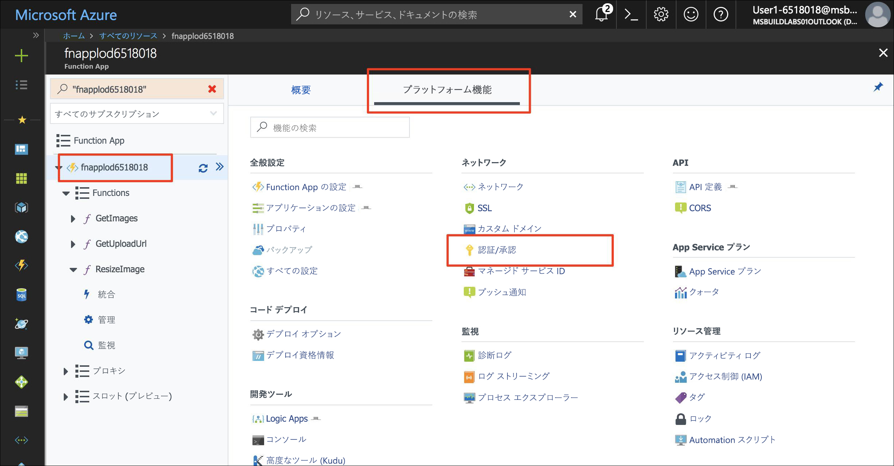
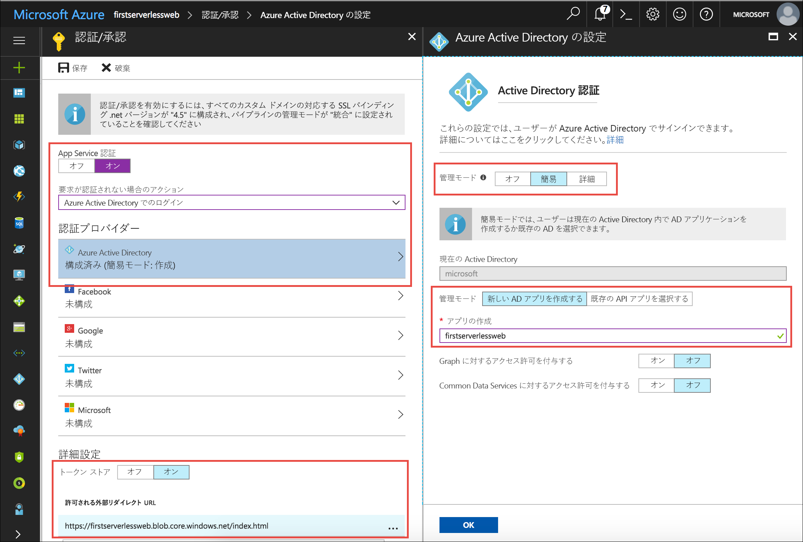
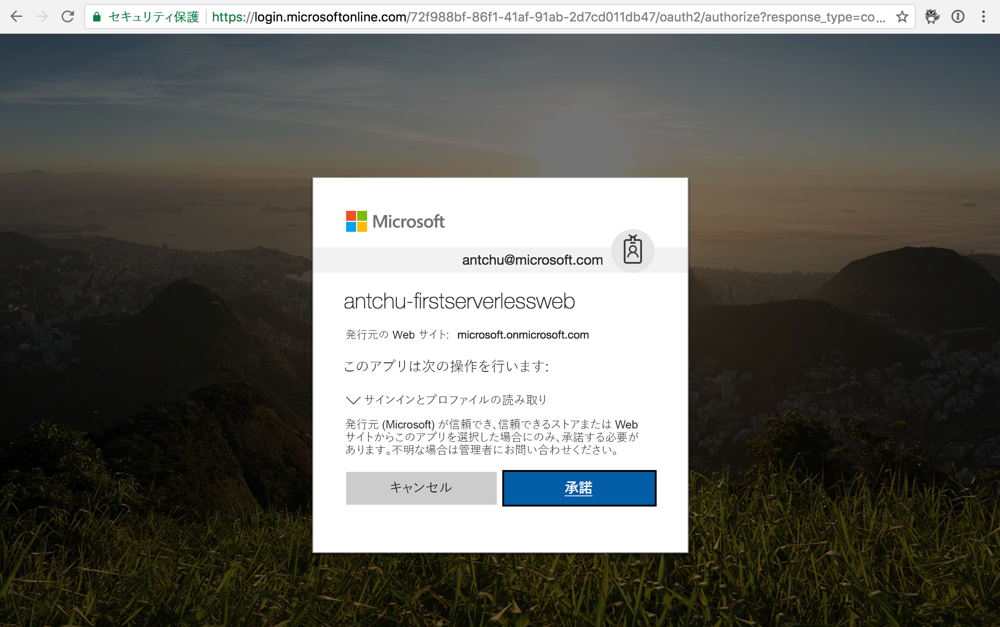

Azure App Service 認証を使用すると、Azure Functions アプリでターン キー認証がサポートされるようになります。 Facebook、Twitter、Microsoft アカウント、Google、および Azure Active Directory とシームレスに統合されます。 Web アプリのバックエンド API を保護するには、App Service 認証を追加します。

## <a name="enable-app-service-authentication"></a>App Service 認証を有効にする

1. [Azure portal](https://portal.azure.com/?azure-portal=true) で関数アプリを開きます。

1. **[プラットフォーム機能]** で、**[認証/承認]** を選択します。

    

1. 次の値を選択します。
    
    | 設定      |  推奨値   | 説明                                        |
    | --- | --- | ---|
    | **App Service 認証** | On | 認証を有効にします。 |
    | **要求が認証されない場合のアクション** | Azure Active Directory でサインインします。 | 構成済みの認証方法 (下記) を選択します。 |
    | **認証プロバイダー** | 次を参照してください。 | 次を参照してください。 |
    | **トークン ストア** | On | App Service でトークンを格納および管理できるようになります。 |
    | **許可される外部リダイレクト URL** | アプリケーションの URL。例: https://firstserverlessweb.z4.web.core.windows.net/。 | ユーザーが認証された後に App Service からリダイレクトできる URL。 |

1. **[Azure Active Directory]** を選択して **[Azure Active Directory の設定]** を表示します。

    1. **[管理モード]** として **[簡易]** を選択し、次の情報を入力します。
    
        | 設定      |  推奨値   | 説明                                        |
        | --- | --- | ---|
        | **管理モード** | [簡易]、[新しい AD アプリを作成する] | サービス プリンシパルと Azure Active Directory 認証が自動的に設定されます。 |
        | **アプリの作成** | my-serverless-webapp | 一意のアプリケーション名を入力します。 |
    
    1. **[OK]** をクリックして Azure Active Directory の設定を保存します。

    


1. **[保存]** をクリックします。


## <a name="modify-the-web-app-to-enable-authentication"></a>Web アプリを変更して認証を有効にする

1. Cloud Shell で、現在のディレクトリが **www/dist** フォルダーであることを確認します。

    ```azurecli
    cd ~/functions-first-serverless-web-application/www/dist
    ```

1. 関数アプリで認証を有効にするには、次のコード行を **settings.js** ファイルに追加します。

    `window.authEnabled = true`

    次のコマンドを使用するか、VIM などのコマンド ライン エディターを使用して、変更を加え結果を表示します。

    ```azurecli
    echo "window.authEnabled = true" >> settings.js
    ```

    ファイルが変更されたことを確認します。

    ```azurecli
    cat settings.js
    ```

1. ファイルを Blob Storage にアップロードします。

    ```azurecli
    az storage blob upload -c \$web --account-name <storage account name> -f settings.js -n settings.js
    ```


## <a name="test-the-application"></a>アプリケーションをテストする

1. ブラウザーでアプリケーションを開きます。 **[ログイン]** をクリックしてログインします。

1. 画像ファイルを選択してアップロードします。

    
    

## <a name="summary"></a>まとめ

このユニットでは、Azure App Service 認証を使用してアプリケーションに認証を追加する方法について学習しました。