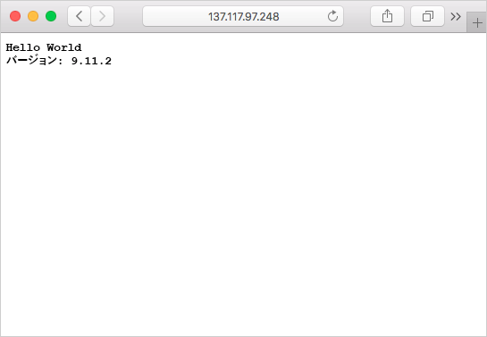

Azure Container Registry や、Azure Container Instances、Azure Kubernetes Registry、Docker for Windows/Mac などの多くのコンテナー管理プラットフォームから、コンテナー イメージをプルできます。 Azure Container Registry からコンテナー イメージを実行するときは、認証資格情報が必要になる場合があります。 

Container Registry での認証には、Azure サービス プリンシパルを使用することをお勧めします。 さらに、Azure Key Vault で Azure サービス プリンシパルの資格情報をセキュリティ保護することもお勧めします。 このアプローチをお勧めするため、このユニットではこのアプローチがどのように行われるかを見ていきます。

ただし、実際の演習では、すべての Azure コンテナー レジストリで有効にできる組み込みの管理アカウントを使用します。 この管理者アカウントは、Microsoft の無料のサンドボックス リソースで動作します。

<!-- Activate the sandbox -->
[!include[](../../../includes/azure-sandbox-activate.md)]

最初に、小文字のコンテナー レジストリ名を含む変数を作成します (たとえば、"MyContainer" ではなく "mycontainer" の値で)。 この変数は、このユニット全体で使われます。

```azurecli
ACR_NAME=<acrName>
```

### <a name="service-principal"></a>サービス プリンシパル

ここで、実稼働アプリケーションのためにサービス プリンシパルを作成します。 **これは、サンドボックス環境では動作しません**が、ご自身のシステムではベスト プラクティスです。 実際には、下記の管理者アカウントの手順を使用します。

サービス プリンシパルを作成するには、`az ad sp create-for-rbac` コマンドを使用します。 `--role` 引数により、*reader* ロールを持つサービス プリンシパルが構成され、レジストリに対するプルのみのアクセス権が付与されます。 プッシュ アクセス権とプル アクセス権の両方を付与するには、`--role` 引数を *contributor* に変更します。

```azurecli
az ad sp create-for-rbac --scopes $(az acr show --name $ACR_NAME --query id --output tsv) --role reader
```

サービス プリンシパルの作成の出力は次のようになります。 `appId` と `password` の値を書き留めておきます。 これらは Azure キー コンテナーに格納されるはずです。

```output
{
  "appId": "1fa05179-0000-0000-0000-e269a4e97c41",
  "displayName": "azure-cli-2018-08-19-22-35-26",
  "name": "http://azure-cli-2018-08-19-22-35-26",
  "password": "72377509-0000-0000-0000-c8edbcb2d950",
  "tenant": "00000000-0000-0000-0000-000000000000"
}
```

### <a name="admin-account"></a>管理者アカウント

Azure コンテナー レジストリには、組み込みの管理者アカウントが付属しています。 これは Azure AD またはロールベースのアクセス制御とは関連付けられていないため、**テストのみで使用する必要があります**。 

最初に、管理者アカウントを有効にする必要があります
```azurecli
  az acr update -n $ACR_NAME --admin-enabled true
```

自動生成されたユーザー名とパスワードを取得するクエリを実行します

```azurecli
  az acr credential show --name $ACR_NAME
```

次のように出力されます。 `username` と、`name` "password" とペアになっている `value` を書き留めます。 これらをキー コンテナーに保存します。

```output
{  "passwords": [
    {
      "name": "password",
      "value": "aaaaa"
    },
    {
      "name": "password2",
      "value": "bbbbb"
    }
  ],
  "username": "ccccc"
}
```

### <a name="save-the-username-and-password-to-keyvault"></a>ユーザー名とパスワードをキー コンテナーに保存します

`az keyvault create` コマンドで Azure キー コンテナーを作成します。

```azurecli
az keyvault create --resource-group <rgn>[Sandbox resource group name]</rgn> --name $ACR_NAME-keyvault
```

次に、`az keyvault secret set` コマンドを使用して、ACR のユーザー名をコンテナーに格納します。 サービス プリンシパルを使用していた場合は、この値の appId を使用します。 今度は管理者アカウントを使用しているため、上記のクエリのユーザー名を保存します。 次のコマンドを発行します。`<username>` は忘れずに置き換えてください。

```azurecli
az keyvault secret set --vault-name $ACR_NAME-keyvault --name $ACR_NAME-pull-usr --value <username>
```

次に、`az keyvault secret set` コマンドを使用して、*password* をコンテナーに格納します。 `<password>` は、上記のクエリの `password` に置き換えます。

```azurecli
az keyvault secret set --vault-name $ACR_NAME-keyvault --name $ACR_NAME-pull-pwd --value <password>
```

Azure キー コンテナーを作成し、そこに 2 つのシークレットを格納しました。

* `$ACR_NAME-pull-usr`: コンテナー レジストリの**ユーザー名**。
* `$ACR_NAME-pull-pwd`: コンテナー レジストリの**パスワード**。

これらのシークレットは、ユーザーまたはアプリケーションやサービスがレジストリからイメージをプルするときに名前で参照できます。

### <a name="deploy-a-container-with-azure-cli"></a>Azure CLI でコンテナーを展開する

サービス プリンシパルの資格情報を Azure Key Vault に格納したので、アプリケーションやサービスでそれを使用してプライベート レジストリにアクセスできます。

コンテナー インスタンスを展開するには、次の `az container create` コマンドを実行します。 このコマンドでは、Azure Key Vault に格納されているサービス プリンシパルの資格情報を使用して、コンテナー レジストリに対する認証を行います。

```azurecli
az container create \
    --resource-group <rgn>[Sandbox resource group name]</rgn> \
    --name acr-build \
    --image $ACR_NAME.azurecr.io/helloacrbuild:v1 \
    --registry-login-server $ACR_NAME.azurecr.io \
    --ip-address Public \
    --location eastus \
    --registry-username $(az keyvault secret show --vault-name $ACR_NAME-keyvault --name $ACR_NAME-pull-usr --query value -o tsv) \
    --registry-password $(az keyvault secret show --vault-name $ACR_NAME-keyvault --name $ACR_NAME-pull-pwd --query value -o tsv)
```

Azure コンテナー インスタンスの IP アドレスを取得します。

```azurecli
az container show --resource-group  <rgn>[Sandbox resource group name]</rgn> --name acr-build --query ipAddress.ip --output table
```

ブラウザーを開き、コンテナーの IP アドレスに移動します。 すべてが正しく構成されている場合、次の結果が表示されるはずです。



