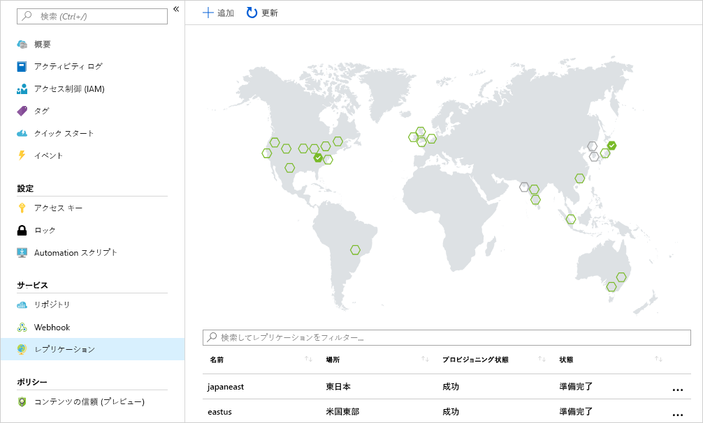

会社では、分散顧客ベースを提供するローカル プレゼンスを確実に確保できるように、コンピューティング ワークロードが複数のリージョンにデプロイされます。 

イメージが実行される各リージョンにコンテナー レジストリを配置することを目標とします。 この戦略により、ネットワーク上の近い場所での操作が実現され、高速で信頼性の高いイメージ レイヤー転送が可能になります。 

geo レプリケーションにより、Azure コンテナー レジストリが単一のレジストリとして機能することが可能になり、マルチマスター リージョン レジストリでいくつかのリージョンに対応できます。

geo レプリケートされたレジストリには次の利点があります。

- 複数のリージョンで 1 つのレジストリ/イメージ/タグ名を使用できる
- リージョン デプロイからネットワーク上の近い場所のレジストリにアクセスできる
- コンテナー ホストと同じリージョンにあるレプリケートされたローカルのレジストリからイメージがプルされるので、追加のエグレス料金が発生しない
- 複数のリージョンにまたがってレジストリを一元管理できる

## <a name="replicate-an-image-to-multiple-locations"></a>イメージを複数の場所にレプリケートする

`az acr replication create` Azure CLI コマンドを使用して、ご利用のコンテナー イメージをリージョン間でレプリケートします。 この例では、`japaneast` リージョン用のレプリケーションを作成します。 `<acrName>` を、ご利用のコンテナー レジストリの名前で更新します。

```azurecli
az acr replication create --registry <acrName> --location japaneast
```

出力は次のようになります。

```console
{
  "id": "/subscriptions/00000000-0000-0000-0000-000000000000/resourceGroups/myresourcegroup/providers/Microsoft.ContainerRegistry/registries/myACR0007/replications/japaneast",
  "location": "japaneast",
  "name": "japaneast",
  "provisioningState": "Succeeded",
  "resourceGroup": "myresourcegroup",
  "status": {
    "displayStatus": "Syncing",
    "message": null,
    "timestamp": "2018-08-15T20:22:09.275792+00:00"
  },
  "tags": {},
  "type": "Microsoft.ContainerRegistry/registries/replications"
}
```

最後の手順。 作成されたすべてのコンテナー イメージのレプリカを取得することができます。 `az acr replication list` コマンドを使用して、この一覧を取得します。 `<acrName>` を、ご利用のコンテナー レジストリの名前で更新します。

```azurecli
az acr replication list --registry <acrName> --output table
```

出力は次のようになります。

```console
NAME       LOCATION    PROVISIONING STATE    STATUS
---------  ----------  --------------------  --------
japaneast  japaneast   Succeeded             Ready
eastus     eastus      Succeeded             Ready
```

ご利用のイメージ レプリカを一覧表示する方法は、Azure CLI だけではないことに留意してください。 Azure portal 内から、Azure Container Registry に対して `Replications` を選択すると、現在のレプリケーションの詳細を示すマップが表示されます。 マップ上のリージョンを選択すると、追加のリージョンにコンテナー イメージをレプリケートできます。



## <a name="clean-up"></a>クリーンアップ
<!---TODO: Update for sandbox?--->

この時点で、リソース グループを削除することにより、作成したリソースをクリーンアップすることができます。 そのためには、`az group delete` コマンドを使用します。

```azurecli
az group delete --name myResourceGroup --no-wait
```

## <a name="summary"></a>まとめ

これで、Azure CLI を使用して、コンテナー イメージが複数の Azure データセンターに正常にレプリケートされました。 