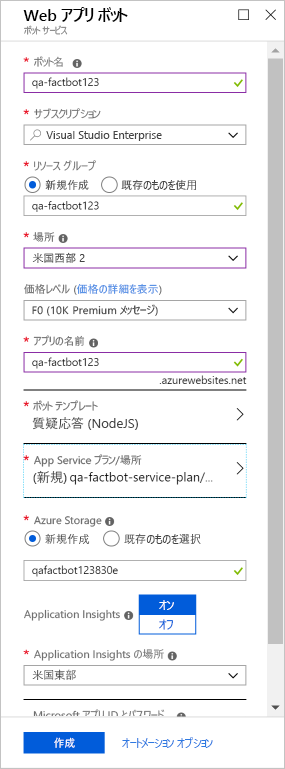

> [!NOTE]
> VM の起動後、サインインするために必要なユーザー名とパスワードは、手順の横にある **[リソース]** タブに配置されます。

ボットを作成する最初のステップは、ボットが Azure でホストされる場所を指定することです。 Azure App Service の Web Apps 機能はボット アプリケーションをホストするのに最適であり、Azure Bot Service はそれを自動的にプロビジョニングするように設計されています。 この演習では、Azure portal を使用して Azure Web アプリ ボットをプロビジョニングします。

1. VM ブラウザーで https://portal.azure.com を開いて Azure portal にサインインします。

1. **[+ リソースの作成]**、**[AI + Machine Learning]**、**[Web App Bot]** の順に選択します。

    ![Web App Bot リソースの種類が強調表示されている [リソースの作成] ブレードを示す Azure portal のスクリーンショット。](../media/2-new-bot-service.png)

1. **[アプリ名]** ボックスに "qa-factbot" などの名前を入力します。 *この名前は Azure 内で一意である必要があるため、名前の横に緑色のチェック マークが表示されることを確認してください。*

1. **[サブスクリプション]** と **[リソース グループ]** で、既存のリソースを選択します。

1. 最寄りの場所を選択し、**S1** 価格レベルを選択します。

1. 次に **[Bot template]\(ボット テンプレート\)** を選択します。 バージョンとして **[SDK v3]**、SDK 言語として **[Node.js]** を選択し、テンプレートの種類として **[Question and Answer]\(質問と回答\)** を選択します。 次に、ブレードの下部にある **[選択]** を選択します。

    ![Node.js SDK 言語と質問と回答のテンプレート オプションが強調表示されている、ボット作成プロセスの [Bot template]\(ボット テンプレート\) ブレードを示す Azure portal のスクリーンショット。](../media/2-portal-select-template.png)

1. **[App Service プラン/場所]**、**[新規作成]** の順に選択し、前の手順で選択したものと同じリージョンに "qa-factbot-service-plan" のような名前で App Service プランを作成します。 終わったら、[Web App Bot] ブレードの下部にある **[作成]** を選択してデプロイを開始します。

    

    > [!NOTE]
    > 通常、デプロイに必要な時間は 2 分以内です。

1. デプロイが完了したら、ポータルの左側にあるリボンの **[リソース グループ]** を選択します。
1. このグループ用にあらかじめ作成したリソース グループを選択し、Azure Web アプリ ボットをデプロイしたリソース グループを開きます。

Azure Web アプリ ボット用に作成されたいくつかのリソースが表示されます。 Azure Web アプリ ボットをデプロイするときは、見えないところで多くのことが行われています。 ボットが作成されて登録され、それをホストする [Azure Web App](https://azure.microsoft.com/services/app-service/web/) が作成されて、[Microsoft QnA Maker](https://www.qnamaker.ai/) で動作するようにボットが構成されました。 次の手順では、QnA Maker を使用して、ボットにインテリジェンスを取り入れるための質問と回答のナレッジ ベースを作成します。
