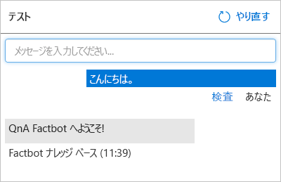

[!INCLUDE [0-vm-note](0-vm-note.md)]

[Azure Cognitive Services](https://www.microsoft.com/cognitive-services/) の一部である [QnA Maker](https://www.qnamaker.ai/) は、人工知能 (AI) と機械学習に基づくインテリジェントなアプリを構築するためのサービスと API のスイートです。[QnA Maker](https://www.qnamaker.ai/) is part of [Azure Cognitive Services](https://www.microsoft.com/cognitive-services/), which is a suite of services and APIs for building intelligent apps backed by artificial intelligence (AI) and machine learning. ユーザーからのあらゆる質問を予測して応答するようにボットをコーディングするのではなく、QnA Maker で作成された質問と回答のナレッジ ベースにボットを接続することができます。Rather than code a bot to anticipate every question a user might ask and provide a response, you can connect it to a knowledge base of questions and answers created with QnA Maker. 一般的な使用シナリオは、"Windows プロダクト キーはどこにありますか" や "Visual Studio Code はどこでダウンロードできますか" といったドメイン固有の質問にボットで回答できるように、FAQ ページの URL からナレッジ ベースを作成することです。A common usage scenario is to create a knowledge base from the URL of a FAQ page so the bot can answer domain-specific questions such as "How do I find my Windows product key" or "Where can I download Visual Studio Code?"

このユニットでは、QnA Maker を使用して、"スーパー ボウルで最も優勝回数の多い NFL チームはどこですか" や "世界最大の都市はどこですか" といった質問を含むナレッジ ベースを作成します。In this unit, you will use QnA Maker to create a knowledge base containing questions such as "What NFL teams have won the most Super Bowls" and "What is the largest city in the world?" 次に、HTTPS エンドポイントを経由してアクセスできるように、ナレッジ ベースを Azure Web アプリにデプロイします。Then, you will deploy the knowledge base in an Azure web app so that it can be accessed via an HTTPS endpoint.

1. VM ブラウザーで https://www.qnamaker.ai を開いて QnA Maker ポータルを開き、**[サインイン]** を選択し、Azure portal のサインインに使用した同じラボ アカウントでサインインします。Open the QnA Maker portal by opening https://www.qnamaker.ai in the VM browser, and select **Sign in** to sign in with the same lab account that you used to sign into the Azure portal. 

1. ハンバーガー メニューを選択し、**[ナレッジ ベースの作成]** を選択します。Select the hamburger menu, then **Create a knowledge base**. 

1. **[Create a QnA service]\(QnA サービスの作成\)** を選択します。Select **Create a QnA service**.

1. Azure portal タブが新しく開いたら、**[名前]** ボックスに名前を入力します。In the newly-opened Azure portal tab, enter a name into the **Name** box. この名前は、Azure 内で一意である必要があるため、名前の横*および*ブレードの下の方にある **[アプリ名]** ボックスに緑色のチェック マークが表示されることを確認します。This name must be unique within Azure, so make sure a green check mark appears next to it *and* in the **App name** box further down the blade.

1. **[リソース グループ]** の下で **[既存のものを使用]** を選択し、この演習のために事前に作成した演習用リソース グループを選択します。Select **Use existing** under **Resource group**, then select the exercise resource group pre-created for this exercise.

1. ドロップダウンの利用可能な一覧から **[場所]** を選択します。Select a **Location** from the list available in the dropdown. 

1. **[管理価格レベル]** として **[F0]** を選択します。Select **F0** as the **Management pricing tier**. 

1. **[価格レベルの検索]** として **[F]** を選択します。Select **F** for the **Search pricing tier**. 

1. **[アプリ名]** が Azure に固有であることを確認します。Verify the **App name** is unique to Azure.

1. 両方の場所のドロップダウンで最も近い場所を選択してから、ブレードの下部にある **[作成]** ボタンを選択します。Select the location nearest you in both location drop-downs, then select the **Create** button at the bottom of the blade.

    ![説明した構成値が設定された QnA Maker の [作成] ブレードを表示している Azure portal のスクリーンショット。](../media/3-new-qna-maker-service.png)

1. ポータルの左側にあるリボンで **[リソース グループ]** を選択し、事前に作成した演習用リソース グループを開きます。Select **Resource groups** in the ribbon on the left side of the portal, and open the pre-created exercise resource group. ブレードの上部の "デプロイ中" が、QnA のサービスとそれに関連付けられているリソースが正常にデプロイされたことを示す "成功" に変わるまで待ちます。Wait until "Deploying" changes to "Succeeded" at the top of the blade, indicating that the QnA service and the resources associated with it were successfully deployed. メッセージが消えたら、メニュー バーのベル アイコンを選択し、状態を表示できます。If the message disappears, you can select the bell icon in the menu bar to view the status. また、ブレードの上部の **[更新]** をクリックすると、デプロイ状態が更新されます。You can also select **Refresh** at the top of the blade to refresh the deployment status.

1. VM ブラウザーで https://www.qnamaker.ai/Create を開いて **[ナレッジ ベースの作成]** に戻り、**[手順 2]** までスクロールし、QnA サービスに接続します。Return to **Create a knowledge base** by opening https://www.qnamaker.ai/Create in the VM browser and scroll to **Step 2** to connect to our QnA service.

1. **[Microsoft Azure Directory ID]\(Microsoft Azure Directory ID\)** で **[Microsoft Learn Hosting]\(Microsoft Learn Hosting\)** を選択します。Under **Microsoft Azure Directory ID**, choose **Microsoft Learn Hosting**.

1. **[Azure サブスクリプション名]** ドロップダウン リストから **[Microsoft Learn Hosting]\(Microsoft Learn Hosting\)** を選択します。Select **Microsoft Learn Hosting** from the **Azure subscription name** drop-down list.

1. **[Azure QnA service]\(Azure QnA サービス\)** で、前に指定した QnA サービスの名前を選択します。Under **Azure QnA service**, select the QnA service name you specified previously. サービスが一覧にないときは、場合によっては、ページを更新する必要があります。If no services are listed, you may need to refresh the page.

1. 次に、ナレッジ ベースに "Factbot ナレッジ ベース" などの名前を割り当てます。Then, assign the knowledge base a name, such as "Factbot Knowledge Base".

1. QnA Maker のナレッジ ベースに手動で質問と回答を入力することも、オンラインのよく寄せられる質問またはローカル ファイルから質問と回答をインポートすることもできます。You can enter questions and answers into a QnA Maker knowledge base manually, or you can import them from online FAQs or local files. サポートされている形式には、タブ区切りテキスト ファイル、Microsoft Word 文書、Excel スプレッドシート、および PDF ファイルが含まれます。Supported formats include tab-delimited text files, Microsoft Word documents, Excel spreadsheets, and PDF files.

    たとえば、VM ブラウザーで https://github.com/MicrosoftDocs/mslearn-build-chat-bot-with-azure-bot-service/blob/master/Factbot.tsv.zip を開き、**Factbot.tsv.zip** ファイルをダウンロードします。To demonstrate, open https://github.com/MicrosoftDocs/mslearn-build-chat-bot-with-azure-bot-service/blob/master/Factbot.tsv.zip in the VM browser, then download the **Factbot.tsv.zip** file. この zip フォルダーには **Factbot.tsv** という名前のテキスト ファイルが含まれています。This zip folder contains a text file named **Factbot.tsv**. ファイルを抽出し、コンピューターにコピーします。Extract and copy the file to your computer. 次に、VM ブラウザーで、QnA Maker ポータル内を下にスクロールし、**[+ ファイルの追加]** を選択し、**Factbot.tsv** を選択します。Then, scroll down in the QnA Maker portal in the VM browser, select **+ Add file**, and select **Factbot.tsv**. このファイルには、20 個の質問と回答がタブ区切り形式で含まれています。This file contains 20 questions and answers in tab-delimited format.

1. ページの下部の **[Create your KB]\(KB の作成\)** を選択して、ナレッジ ベースが作成されるのを待ちます。Select **Create your KB** at the bottom of the page, and wait for the knowledge base to be created. 通常は 1 分もかかりません。It should take less than a minute.

1. **Factbot.tsv** からインポートされた質問と回答がナレッジ ベースに表示されることを確認します。Confirm that the questions and answers imported from **Factbot.tsv** appear in the knowledge base. 次に、**[Save and train]\(保存してトレーニング\)** を選択し、トレーニングが完了するのを待ちます。Then, select **Save and train** and wait for training to complete.

    

1. **[Save and train]\(保存してトレーニング\)** ボタンの右にある **[テスト]** ボタンを選択します。Select the **Test** button to the right of the **Save and train** button. メッセージ ボックスに「こんにちは」と入力して、**Enter** キーを押します。Type "Hi" into the message box and press **Enter**. 次に示すように、応答が "QnA Factbot へようこそ" となることを確認します。Confirm that the response is "Welcome to the QnA Factbot," as shown below.

    

1. メッセージ ボックスに、「最も売れた本は何ですか?」と入力し、Type "What book has sold the most copies?" **Enter** キーを押します。into the message box and press **Enter**. 応答はどのようになるでしょう。What is the response?

1. もう一度 **[テスト]** ボタンを選択し、[テスト] パネルを折りたたみます。Select the **Test** button again to collapse the Test panel. 
1. ページ上部のメニューで **[発行]** を選択し、ページの下部にある **[発行]** ボタンを選択してナレッジ ベースを発行します。Select **Publish** in the menu at the top of the page, and select the **Publish** button at the bottom of the page to publish the knowledge base. *発行* すると、ナレッジ ベースが HTTPS エンドポイントで使用可能になります。*Publishing* makes the knowledge base available at an HTTPS endpoint.

発行プロセスが完了するまで待機し、QnA サービスがデプロイされたことを確認します。Wait for the publication process to complete and confirm that the QnA service has been deployed. これで、ナレッジ ベースが独自の Azure Web アプリでホストされるようになったので、次の手順では、それを使用できるボットをデプロイします。With the knowledge base now hosted in an Azure web app of its own, the next step is to deploy a bot that can use it.
