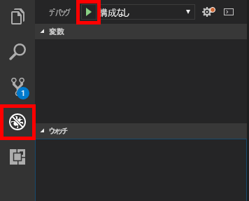

<span data-ttu-id="e0fe6-101">記述するアプリケーション コードと同様に、ボット コードへの変更は、ローカルにテストしてデバッグを行ってから、運用環境にデプロイする必要があります。</span><span class="sxs-lookup"><span data-stu-id="e0fe6-101">As with any application code that you write, changes to bot code need to be tested and debugged locally before being deployed to production.</span></span> <span data-ttu-id="e0fe6-102">ボットのデバッグを支援するため、Microsoft では [Bot Framework Emulator](https://emulator.botframework.com/) を提供しています。</span><span class="sxs-lookup"><span data-stu-id="e0fe6-102">To help debug bots, Microsoft offers the [Bot Framework Emulator](https://emulator.botframework.com/).</span></span> <span data-ttu-id="e0fe6-103">この演習では、Visual Studio Code とエミュレーターを使用して、ボットをデバッグする方法を学習します。</span><span class="sxs-lookup"><span data-stu-id="e0fe6-103">In this unit, you will learn how to use Visual Studio Code and the emulator to debug your bots.</span></span>

1. <span data-ttu-id="e0fe6-104">Microsoft Bot Framework Emulator をインストールしていない場合は、ここで少し時間を取ってインストールします。</span><span class="sxs-lookup"><span data-stu-id="e0fe6-104">If you haven't installed the Microsoft Bot Framework Emulator, take a moment to do so now.</span></span> <span data-ttu-id="e0fe6-105">https://emulator.botframework.com/ からダウンロードできます。</span><span class="sxs-lookup"><span data-stu-id="e0fe6-105">You can download it from https://emulator.botframework.com/.</span></span> <span data-ttu-id="e0fe6-106">Windows、macOS、および Linux 用のバージョンが使用できます。</span><span class="sxs-lookup"><span data-stu-id="e0fe6-106">Versions are available for Windows, macOS, and Linux.</span></span>

1. <span data-ttu-id="e0fe6-107">Visual Studio Code の統合ターミナルで次のコマンドを実行して、[Restify](http://restify.com/) をインストールします。これは RESTful Web サービスをビルドおよび使用するためによく使用されている Node.js パッケージです。</span><span class="sxs-lookup"><span data-stu-id="e0fe6-107">Execute the following command in Visual Studio Code's integrated terminal to install [Restify](http://restify.com/), a popular Node.js package for building and consuming RESTful web services:</span></span>

    ```bash
    npm install restify
    ```

1. <span data-ttu-id="e0fe6-108">次のコマンドにこの手順を繰り返して、[Microsoft Bot Framework Bot Builder SDK for Node.js](https://docs.microsoft.com/bot-framework/nodejs/bot-builder-nodejs-quickstart) をインストールします。</span><span class="sxs-lookup"><span data-stu-id="e0fe6-108">Repeat this step for the following commands to install the [Microsoft Bot Framework Bot Builder SDK for Node.js](https://docs.microsoft.com/bot-framework/nodejs/bot-builder-nodejs-quickstart):</span></span>

    ```bash
    npm install botbuilder
    npm install botbuilder-azure
    npm install botbuilder-cognitiveservices
    ```

1. <span data-ttu-id="e0fe6-109">Visual Studio Code のアクティビティ バーで **[エクスプローラー]** ボタンをクリックします。</span><span class="sxs-lookup"><span data-stu-id="e0fe6-109">Click the **Explorer** button in Visual Studio Code's activity bar.</span></span> <span data-ttu-id="e0fe6-110">次に、**[app.js]** を選択してコード エディターで開きます。</span><span class="sxs-lookup"><span data-stu-id="e0fe6-110">Then, select **app.js** to open it in the code editor.</span></span> <span data-ttu-id="e0fe6-111">このファイルには、ボットを駆動するコードが含まれています。このコードは、Azure Bot Service によって生成され、Azure portal からダウンロードされたものです。</span><span class="sxs-lookup"><span data-stu-id="e0fe6-111">This file contains the code that drives the bot — code that was generated by the Azure Bot Service and downloaded from the Azure portal.</span></span>

1. <span data-ttu-id="e0fe6-112">**app.js** の内容を次のコードに置き換えた後に、ファイルを保存します。</span><span class="sxs-lookup"><span data-stu-id="e0fe6-112">Replace the contents of **app.js** with the following code, and then save the file.</span></span>

    ```JavaScript
    "use strict";
    var builder = require("botbuilder");
    var botbuilder_azure = require("botbuilder-azure");

    var useEmulator = true;
    var userName = "";
    var yearsCoding = "";
    var selectedLanguage = "";

    var connector = useEmulator ? new builder.ChatConnector() : new botbuilder_azure.BotServiceConnector({
        appId: process.env.MicrosoftAppId,
        appPassword: process.env.MicrosoftAppPassword
    });

    var bot = new builder.UniversalBot(connector);

    bot.dialog('/', [

    function (session) {
        builder.Prompts.text(session, "Hello, and welcome to QnA Factbot! What's your name?");
    },

    function (session, results) {
        userName = results.response;
        builder.Prompts.number(session, "Hi " + userName + ", how many years have you been writing code?");
    },

    function (session, results) {
        yearsCoding = results.response;
        builder.Prompts.choice(session, "What language do you love the most?", ["C#", "Python", "Node.js", "Visual FoxPro"]);
    },

    function (session, results) {
        selectedLanguage = results.response.entity;

        session.send("Okay, " + userName + ", I think I've got it:" +
            " You've been writing code for " + yearsCoding + " years," +
            " and prefer to use " + selectedLanguage + ".");
    }]);

    var restify = require('restify');
    var server = restify.createServer();

    server.listen(3978, function() {
        console.log('test bot endpoint at http://localhost:3978/api/messages');
    });

    server.post('/api/messages', connector.listen());
    ```

1. <span data-ttu-id="e0fe6-113">左側の余白をクリックして、20 行目、25 行目、および 30 行目にブレークポイントを設定します。</span><span class="sxs-lookup"><span data-stu-id="e0fe6-113">Set breakpoints on lines 20, 25, and 30 by clicking in the margin on the left.</span></span>

1. <span data-ttu-id="e0fe6-114">アクティビティ バーで **[デバッグ]** ボタンをクリックしてから緑色の矢印をクリックして、デバッグ セッションを開始します。</span><span class="sxs-lookup"><span data-stu-id="e0fe6-114">Click the **Debug** button in the activity bar, and then click the green arrow to start a debugging session.</span></span> <span data-ttu-id="e0fe6-115">デバッグ コンソールに "http://localhost:3978/api/messages でボットのエンドポイントをテスト" が表示されることを確認します。</span><span class="sxs-lookup"><span data-stu-id="e0fe6-115">Confirm that "test bot endpoint at http://localhost:3978/api/messages" appears in the debug console.</span></span>

    

1. <span data-ttu-id="e0fe6-117">ボット コードは現在ローカルで実行されています。</span><span class="sxs-lookup"><span data-stu-id="e0fe6-117">Your bot code is now running locally.</span></span> <span data-ttu-id="e0fe6-118">Bot Framework Emulator を起動し、**[新しいボット構成を作成する]** をクリックします。</span><span class="sxs-lookup"><span data-stu-id="e0fe6-118">Launch the Bot Framework Emulator and click **Create a new bot configuration**.</span></span> <span data-ttu-id="e0fe6-119">前の手順でデバッグ コンソールに表示されたボット名とボット URL を入力します。</span><span class="sxs-lookup"><span data-stu-id="e0fe6-119">Enter the bot name and the bot URL displayed in the debug console in the previous step.</span></span> <span data-ttu-id="e0fe6-120">次に、**[Save and connect]\(保存して接続\)** をクリックして、任意の場所に構成ファイルを保存します。</span><span class="sxs-lookup"><span data-stu-id="e0fe6-120">Then, click **Save and connect** and save the configuration file in the location of your choice.</span></span>

    > <span data-ttu-id="e0fe6-121">今後は、[My Bots]\(マイ ボット\) の下のボット名をクリックするだけで、ボットに再接続することができます。</span><span class="sxs-lookup"><span data-stu-id="e0fe6-121">In the future, you can reconnect to the bot simply by clicking the bot name under "My Bots".</span></span>

    ![[保存] と接続ボタンが強調表示された新しいボット構成画面を示している Bot Framework Emulator のスクリーンショット。](../media/5-new-bot-configuration.png)

1. <span data-ttu-id="e0fe6-123">エミュレーターの下部にあるボックスに「こんにちは」と入力して、**Enter** キーを押します。</span><span class="sxs-lookup"><span data-stu-id="e0fe6-123">Type "hi" into the box at the bottom of the emulator and press **Enter**.</span></span> <span data-ttu-id="e0fe6-124">Visual Studio Code が **app.js** の 20 行目で中断することを確認します。</span><span class="sxs-lookup"><span data-stu-id="e0fe6-124">Confirm that Visual Studio Code breaks on line 20 of **app.js**.</span></span> <span data-ttu-id="e0fe6-125">次に、Visual Studio Code のデバッグ ツールバーで **[続行]** ボタンをクリックしてエミュレーターに戻り、ボットの応答を表示します。</span><span class="sxs-lookup"><span data-stu-id="e0fe6-125">Then, click the **Continue** button in Visual Studio Code's debugging toolbar and return to the emulator to see the bot's response.</span></span>

1. <span data-ttu-id="e0fe6-126">ボットから一連の質問がされます。</span><span class="sxs-lookup"><span data-stu-id="e0fe6-126">The bot will ask you a series of questions.</span></span> <span data-ttu-id="e0fe6-127">ブレークポイントにヒットするたびに、Visual Studio Code でそれらの質問に答え、**[続行]** をクリックします。</span><span class="sxs-lookup"><span data-stu-id="e0fe6-127">Answer them and click **Continue** in Visual Studio Code each time a breakpoint is hit.</span></span> <span data-ttu-id="e0fe6-128">完了したら、デバッグ ツールバーの **[停止]** ボタンをクリックして、デバッグ セッションを終了します。</span><span class="sxs-lookup"><span data-stu-id="e0fe6-128">When you're done, click the **Stop** button in the debugging toolbar to end the debugging session.</span></span>

<span data-ttu-id="e0fe6-129">この時点で、完全に機能するボットが作成され、ボットを Microsoft Bot Framework Emulator でローカルに実行することでデバッグする方法を学習しました。</span><span class="sxs-lookup"><span data-stu-id="e0fe6-129">At this point, you have a fully functioning bot and know how to debug it by running it locally in the Microsoft Bot Framework Emulator.</span></span> <span data-ttu-id="e0fe6-130">次の手順では、発行したナレッジ ベースにボットを接続して、ボットをよりインテリジェントにします。</span><span class="sxs-lookup"><span data-stu-id="e0fe6-130">The next step is to make the bot more intelligent by connecting it to the knowledge base you published.</span></span>