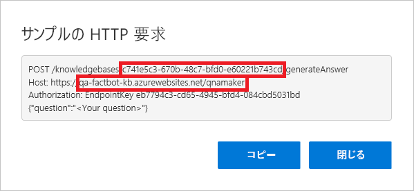

このユニットでは、前に作成した QnA Maker のナレッジ ベースにボットを接続して、ボットがインテリジェントな会話を実行できるようにします。 ナレッジ ベースに接続するには、QnA Maker ポータルからいくつかの情報を取得し、それを Azure portal にコピーし、ボット コードを更新してから Azure にボットを再デプロイする必要があります。

1. [QnA Maker ポータル](https://www.qnamaker.ai/)に戻り、右上隅にある自分の名前をクリックします。 ドロップダウン メニューから **[エンドポイント キーの管理]** を選択します。 **[表示]** をクリックしてプライマリ エンドポイント キーを表示し、**[コピー]** をクリックしてそれをクリップボードにコピーします。 次に、それをテキスト ファイルに貼り付けて、すぐに取得できるようにします。

1. ページの上部にあるメニューで **[My knowledge bases]\(マイ ナレッジ ベース\)** をクリックします。 次に、先ほど作成したナレッジ ベースの **[コードの表示]** をクリックします。

1. 1 行目からナレッジ ベース ID、2 行目からホスト名をコピーします。 それらもテキスト ファイルに貼り付けます。 その後、ダイアログを閉じます。 コピーするホスト名に "https://" プレフィックスを**含めないでください**。

    

1. Azure portal で Web アプリ ボットに戻ります。 左にあるメニューで **[アプリケーション設定]** をクリックし、"QnAKnowledgebaseId"、"QnAAuthKey"、"QnAEndpointHostName" という名前のアプリケーション設定が見つかるまで下にスクロールします。 手順 3 で取得したナレッジ ベース ID およびホスト名と、手順 1 で取得したエンドポイント キーを、これらのフィールドに貼り付けます。 その後、**[保存]** をクリックします。

    

1. Visual Studio Code に戻り、**app.js** の内容を次のコードで置き換えます。 その後、ファイルを保存します。

    ```JavaScript
    var restify = require('restify');
    var builder = require('botbuilder');
    var botbuilder_azure = require("botbuilder-azure");
    var builder_cognitiveservices = require("botbuilder-cognitiveservices");

    // Setup Restify Server
    var server = restify.createServer();
    server.listen(process.env.port || process.env.PORT || 3978, function () {
        console.log('%s listening to %s', server.name, server.url);
    });

    // Create chat connector for communicating with the Bot Framework Service
    var connector = new builder.ChatConnector({
        appId: process.env.MicrosoftAppId,
        appPassword: process.env.MicrosoftAppPassword
    });

    // Listen for messages from users
    server.post('/api/messages', connector.listen());

    // Create your bot with a function to receive messages from the user
    var bot = new builder.UniversalBot(connector);

    var recognizer = new builder_cognitiveservices.QnAMakerRecognizer({
        knowledgeBaseId: process.env.QnAKnowledgebaseId,
        authKey: process.env.QnAAuthKey,
        endpointHostName: process.env.QnAEndpointHostName
    });

    var basicQnAMakerDialog = new builder_cognitiveservices.QnAMakerDialog({
        recognizers: [recognizer],
        defaultMessage: "I'm not quite sure what you're asking. Please ask your question again.",
        qnaThreshold: 0.3
    });

    bot.dialog('basicQnAMakerDialog', basicQnAMakerDialog);

    bot.dialog('/',
    [
        function (session) {
            session.replaceDialog('basicQnAMakerDialog');
        }
    ]);
    ```

    > [!Note]
    > 30 行目の `QnAMakerDialog` インスタンスを作成するための呼び出し。 これにより、Azure Bot Service でビルドされたボットと、Microsoft QnA Maker で構築されたナレッジ ベースを統合するダイアログが作成されます。

1. Visual Studio Code のアクティビティ バーで **[ソース管理]** ボタンをクリックします。 メッセージ ボックスに「ナレッジ ベースに接続済み」と入力し、チェック マークをクリックして変更をコミットします。 次に、省略記号をクリックし、**[ブランチの発行]** コマンドを使用してこれらの変更をリモート リポジトリ (したがって、 Azure Web アプリ) にプッシュします。

1. Azure portal で Web アプリ ボットに戻り、左側にある **[Test in Web Chat]\(Web チャットでのテスト\)** をクリックしてテスト コンソールを開きます。 チャット ウィンドウの下部にあるボックスに、「世界で最も普及しているソフトウェア プログラミング言語は何ですか?」 と入力し、**Enter** キーを押します。 ボットが応答することを確認します。

ボットがナレッジ ベースに接続されたので、最後の手順はそれを実際にテストすることです。 Skype でテストを行ったら、より自然なものになるでしょうか?
