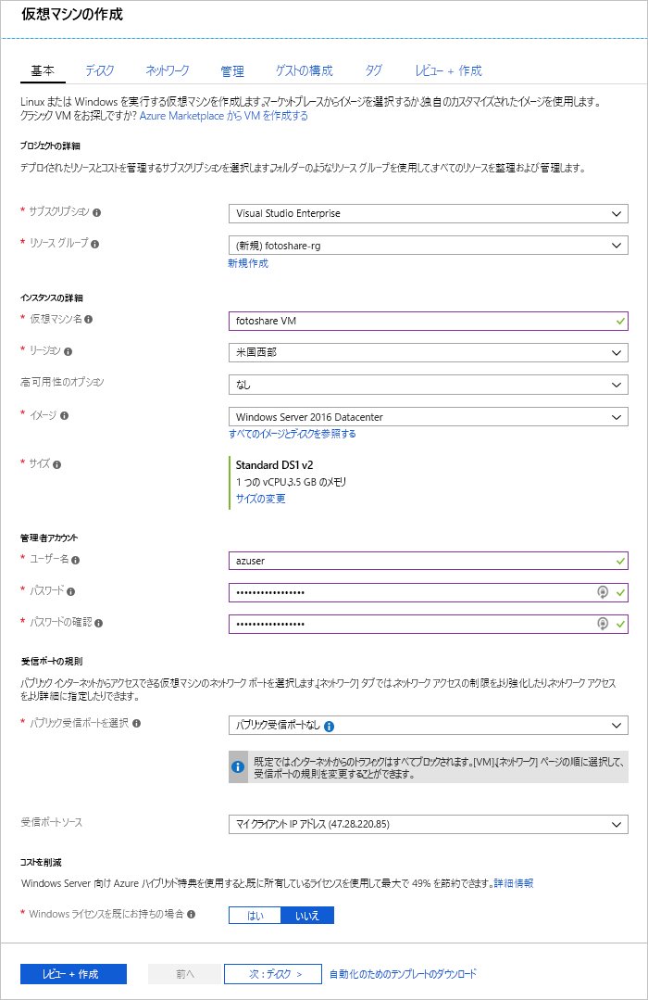

SQL Server およびカスタム アプリケーションを実行している Azure virtual machines (Vm) 上に格納されているデータの共有サイト、写真を実行するとします。 次の調整するには。

- VM のディスク キャッシュ設定を変更する必要があります。
- キャッシュが有効な VM に新しいデータ ディスクを追加するには。

Azure portal でこれらの変更を加えと判断しました。

この演習では、先に説明した VM に変更を加えたを通じていきます。 最初に、ポータルにサインインし、VM を作成しましょう。

## Azure portal にサインインする

[!include]

1. [Azure portal](https://portal.azure.com/?azure-portal=true) にサインインします。

## 仮想マシンの作成

この手順では、次のプロパティを持つ VM を作成するいきます。

|プロパティ  |値  |
|---------|---------|
|イメージ     |   **Windows Server 2016 Datacenter**      |
|名前     |   **fotoshareVM**     |
|リソース グループ     |   **<rgn>[サンド ボックス リソース グループ名]</rgn>**      |

[!include]

1. ポータルの左側のメニューで選択**仮想マシン**します。

1. 今すぐ選択**追加**での左上、**仮想マシン**画面。 このアクションは、作成プロセスを開始します。

1. **コンピューティング**使用可能な VM イメージを一覧表示するパネル*Windows Server 2016 Datacenter*検索ボックスにします。

1. 選択**Windows Server 2016 Datacenter**クリックして、検索結果から**作成**VM の作成プロセスを開始します。

1. **基本**パネルで、選択したことを確認、**サブスクリプション**します。

1. **リソース グループ**、 をクリックして**新規作成**を提供し、**名**の`fotoshare-rg` をクリック**OK**します。

1. **仮想マシン名**ボックスに、入力`fotoshareVM`します。

1. **リソース グループ**を選択します**既存の使用**選択<rgn>[サンド ボックス リソース グループ名]</rgn>します。

1. **場所**ドロップダウン リストでは、上記の一覧からリージョンを選択します。

1. VM の**サイズ**、推奨される既定のままにするか、クリックして**サイズを変更する**から別のサイズを選択する、**サイズの選択**ブレード。

    > [!NOTE]
    > この時点で内でもディスクのキャッシュを構成するオプションはありません、**ディスク**作成ブレードのタブ。

    > [!IMPORTANT]
    > L シリーズと B シリーズの仮想マシンのディスク キャッシュを変更できないことに注意してください。 別のサイズを選択します。

1. **管理者アカウント**セクションに、入力、 **Username**と**パスワード**/**パスワードの確認入力**の新しい VM の管理者アカウント。

1. 次の図は、例のような**基本**いっぱいになるように構成なります。残りのタブとフィールドの既定値のままにし、をクリックして**レビュー作成 +** します。

    

1. 新しい VM 設定を確認した後には、次のようにクリックします。**作成**、新しい VM のデプロイを開始します。

VM の作成時間がかかることができます。 VM が展開されるまで待ってから、演習を続けます。 プロセスが完了すると、通知ハブで、メッセージが表示されます。

> [!IMPORTANT]
> この VM を使用して、次のレッスンで、ので少しおき、それをを!

## ポータルのビューの OS ディスク キャッシュの状態

VM をデプロイすると、次の手順を使用して、OS ディスクのキャッシュ状態ことを確認できます。

1. 左側のメニューでクリックして**すべてのリソース**、VM を選択します。 **fotoshareVM**します。

1. **仮想マシン**ブレードで、**設定**を選択します**ディスク**します。

1. **ディスク**ウィンドウで、VM が 1 つのディスクを OS ディスク。 キャッシュの種類がの既定値に設定されて現在**読み取り/書き込み**します。

![読み取り専用キャッシュに設定され、OS ディスクを使用した VM のブレードの [ディスク] セクションを示す Azure portal のスクリーン ショット。](../media/4-os-disk-rw.PNG)

## ポータルでの OS ディスクのキャッシュ設定を変更します。

1. **ディスク**ペインで、**編集**画面の左上にします。

1. 変更、**ホスト キャッシュ**を OS ディスクの値**読み取り専用**ボックスの一覧を選び、ドロップダウン リストを使用して**保存**画面の左上にします。

1. この更新プログラムは、時間がかかることができます。 理由は、Azure ディスクのキャッシュ設定を変更する割り当てを解除し、ターゲット ディスクを再アタッチです。 オペレーティング システム ディスクの場合は、VM が再起動もします。 操作が完了したら、VM ディスクが更新されているという通知が届きます。

1. OS ディスクのキャッシュの種類に設定が完了すると、**読み取り専用**します。

データ ディスクのキャッシュの構成に進みましょう。 ディスクを構成するには、まず 1 つを作成する必要になります。

## VM とキャッシュの種類のセットにデータ ディスクを追加します。

1. 戻り、**ディスク**の移動と選択、ポータルで VM ビュー**データ ディスクの追加**します。 エラーがすぐに表示されます、**名前**フィールド、フィールドを空にすることはできません、ことを通知します。 私たちはありませんのデータ ディスクはまだ、1 つ作成しましょう。

1. **[名前]** ボックスの一覧をクリックして、**[ディスクの作成]** をクリックします。

1. **管理ディスクの作成** ウィンドウで、**名前**ボックスに「 **fotosharesVM データ**します。

1. **リソース グループ**を選択します**既存を使用して、**、選択と<rgn>[サンド ボックス リソース グループ名]</rgn>します。

1. その他のフィールドが既定値としてのままにし、をクリックして**作成**画面の下部にあります。

    ディスクが作成されるまで待ってから、次に進みます。

1. 変更、**ホスト キャッシュ**値を新しいデータ ディスクを**読み取り専用**ボックスの一覧を選び、ドロップダウン リストを使用して**保存**画面の左上にします。

    VM が新しいデータ ディスクの更新が完了するまで待ちます。 データ ディスクのキャッシュの種類に設定が完了すると、**読み取り専用**します。

この演習では、Azure portal を使用して新しい VM でキャッシュを構成、既存のディスクのキャッシュ設定を変更、および新しいデータ ディスクにキャッシュを構成しました。 次のスクリーン ショットは、最終的な構成を示しています。

