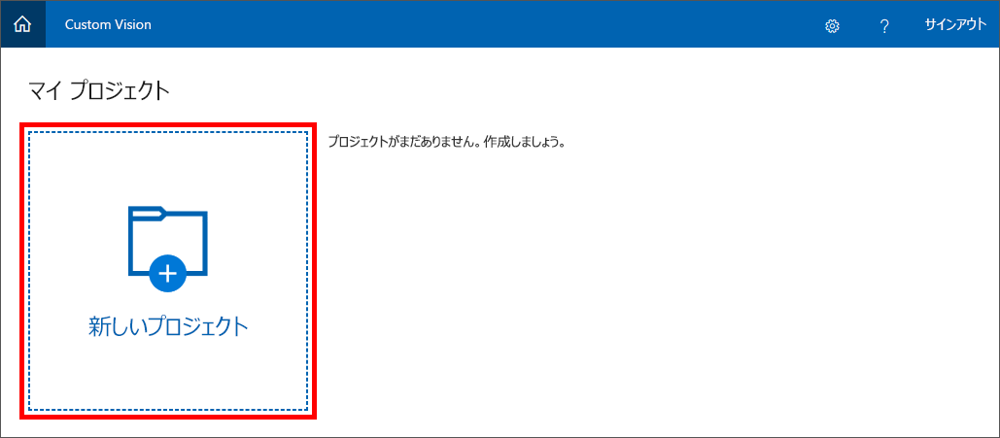
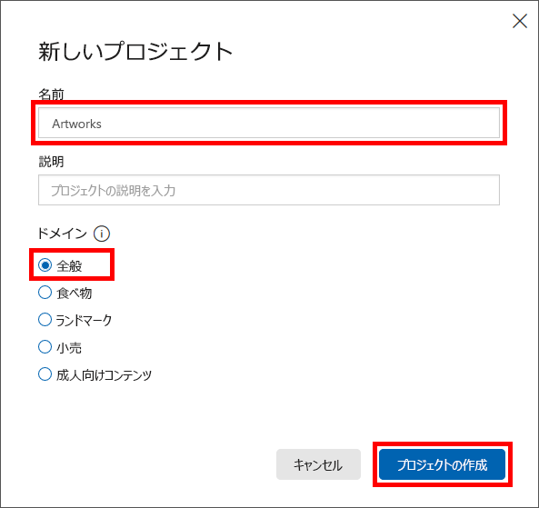

Custom Vision Service で画像分類モデルを構築するための最初のステップは、プロジェクトを作成することです。The first step in building an image-classification model with the Custom Vision Service is to create a project. このユニットでは、Custom Vision Service ポータルを使用して Custom Vision Service プロジェクトを作成します。In this unit, you will use the Custom Vision Service portal to create a Custom Vision Service project.

1. ブラウザーで [Custom Vision Service ポータル](https://www.customvision.ai/?azure-portal=true)を開きます。Open the [Custom Vision Service portal](https://www.customvision.ai/?azure-portal=true) in your browser. その後、**[サインイン]** を選択します。Then select **Sign In**.

1. サインインを求められたら、Microsoft アカウントの資格情報を使用してサインインします。If you are asked to sign in, do so using the credentials for your Microsoft account. このアプリにユーザー情報へのアクセスを許可するように求められたら、**[はい]** をクリックし、プロンプトが表示されたらサービス使用条件に同意します。If you are asked to let this app access your info, click **Yes**, and if prompted, agree to the terms of service.

1. **[新しいプロジェクト]** をクリックして新しいプロジェクトを作成します。Click **New Project** to create a new project.

    

1. **[新しいプロジェクトの作成]** ダイアログで、プロジェクトの名前を *Artworks* に設定し、**[ドメイン]** の一覧で **[全般]** が選択されていることを確認します。In the **Create new project** dialog, name the project *Artworks*, and make sure that **General** is selected in the **Domains** list. **[プロジェクトの種類]** と **[Classification Types]** \(分類の種類\) の設定は既定のままにします。You can keep the default settings for **Project Types** and **Classification Types**. **[プロジェクトの作成]** を選択し、プロジェクトを作成します。Select **Create project** to create our project.

    > ドメインは、指定した種類の画像に合わせてモデルを最適化しています。A domain optimizes a model for specific types of images. たとえば、含まれている食品の種類別または料理の民族性別に食品の画像を分類することが目標の場合は、[食料] ドメインを選択すると便利です。For example, if your goal is to classify food images by the types of food they contain or the ethnicity of the dishes, then it might be helpful to select the Food domain. 提供されているどのドメインとも一致しないシナリオの場合、または選択するドメインがわからない場合は、[全般] ドメインを選択します。For scenarios that don't match any of the offered domains, or if you are unsure of which domain to choose, select the General domain.

   

次の手順は、プロジェクトに画像をアップロードし、それらの画像にタグを割り当てて分類することです。The next step is to upload images to the project and assign tags to those images to classify them.