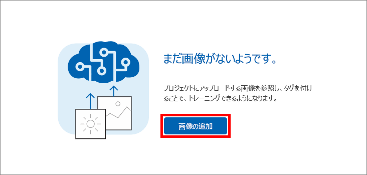
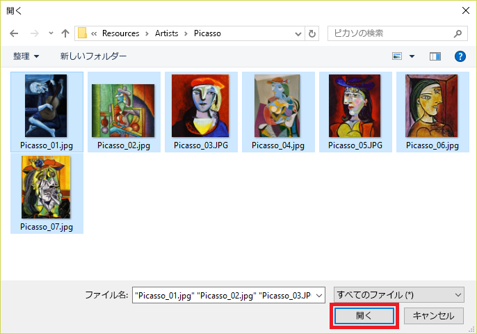

このユニットでは、ピカソ、ポロック、レンブラントの有名な絵画の画像を Artworks プロジェクトに追加し、Custom Vision Service が画家の区別を学習できるように画像にタグを付けます。In this unit, you will add images of famous paintings by Picasso, Pollock, and Rembrandt to the Artworks project, and tag the images so the Custom Vision Service can learn to differentiate one artist from another.

1. **[Add images]\(画像の追加\)** をクリックして画像をプロジェクトに追加します。Click **Add images** to add images to the project.

    

1. **[Browse local files]\(ローカル ファイルの参照\)** をクリックします。Click **Browse local files**.

    

    _"ローカル画像の参照"__Browsing for local images_

1. [このモジュールに付属するリソース](https://a4r.blob.core.windows.net/public/cvs-resources.zip)の "Artists\Picasso" フォルダーを参照し、フォルダー内のすべてのファイルを選択して、**[開く]** をクリックします。Browse to the "Artists\Picasso" folder in the [resources that accompany this module](https://a4r.blob.core.windows.net/public/cvs-resources.zip), select all of the files in the folder, and click **Open**.

    

1. **[Add some tags...]\(タグの追加...\)** ボックスに「絵画」と入力します。Type "painting" (without quotation marks) into the **Add some tags...** box. **[+]** をクリックして画像にタグを割り当てます。Then click **+** to assign the tag to the images.

    

1. 手順 4 を繰り返し、"ピカソ" タグを画像に追加します。Repeat Step 4 to add a "Picasso" tag to the images.

1. **[Upload 7 files]\(7 ファイルをアップロード\)** をクリックして、画像をアップロードします。Click **Upload 7 files** to upload the images. アップロードが完了したら、**[完了]** をクリックします。Once the upload has finished, click **Done**.

    

1. アップロードした画像が、割り当てたタグと共にポータルに表示されることを確認します。Confirm that the images you uploaded appear in the portal, along with the tags assigned to them.

    

1. ピカソの 7 つの画像を使用して、Custom Vision Service はピカソの絵を適切に識別できます。With seven Picasso images, the Custom Vision Service can do a decent job of identifying paintings by Picasso. しかし、今すぐモデルをトレーニングした場合、モデルはピカソの絵がどのようなものかだけを理解し、他の画家の絵画を識別することはできません。But if you trained the model right now, it would only understand what a Picasso looks like, and it would not be able to identify paintings by other artists.

    次の手順では、別の画家の絵画をいくつかアップロードします。The next step is to upload some paintings by another artist. **[Add images]\(画像の追加\)** をクリックして、モジュール リソースの "Artists\Rembrandt" フォルダーにあるすべての画像を選択します。Click **Add images** and select all of the images in the "Artists\Rembrandt" folder in the module resources. それらに "絵画" と "レンブラント" ("ピカソ" ではなく) というタグを付けて、プロジェクトにアップロードします。Tag them with the labels "painting" and "Rembrandt" (not "Picasso"), and upload them to the project.

    > "絵画" タグを追加するとき、再度入力する必要はありません。When you add the tag "painting," you don't have to type it in again. 次に示すように、**[Add some tags...]\(タグの追加...\)** ボックスのドロップダウン リストから選択できます。You can select it from the drop-down list attached to the **Add some tags...** box, as shown below. "レンブラント" タグを追加するには、「レンブラント」と**入力**して、**[+]** をクリックする必要があります。You **will** have to type "Rembrandt" and click **+** to add a "Rembrandt" tag.

    

1. プロジェクトにピカソの画像と共にレンブラントの画像が表示され、タグの一覧に "レンブラント" と表示されることを確認します。Confirm that the Rembrandt images appear alongside the Picasso images in the project, and that "Rembrandt" appears in the list of tags.

    

1. 次に、謎めいた画家であるジャクソン ポロックの絵画を追加し、Custom Vision Service がポロックの絵も認識できるようにします。Now add paintings by the enigmatic artist Jackson Pollock to enable the Custom Vision Service to recognize Pollock paintings, too. モジュール リソースの "Artists\Pollock" フォルダーですべての画像を選択し、"絵画" と "ポロック" というタグを付けて、プロジェクトにアップロードします。Select all of the images in the "Artists\Pollock" folder in the module resources, tag them with the terms "painting" and "Pollock", and upload them to the project.

タグを付けた画像をアップロードしたら、次に、これらの画像でモデルをトレーニングし、モデルがピカソとレンブラントとポロックの絵を区別したり、絵がこれらの有名な画家のいずれかの作品であるかどうかを判別したりできるようにします。With the tagged images uploaded, the next step is to train the model with these images so it can distinguish between paintings by Picasso, Rembrandt, and Pollock, as well as determine whether a painting is a work by one of these famous artists.