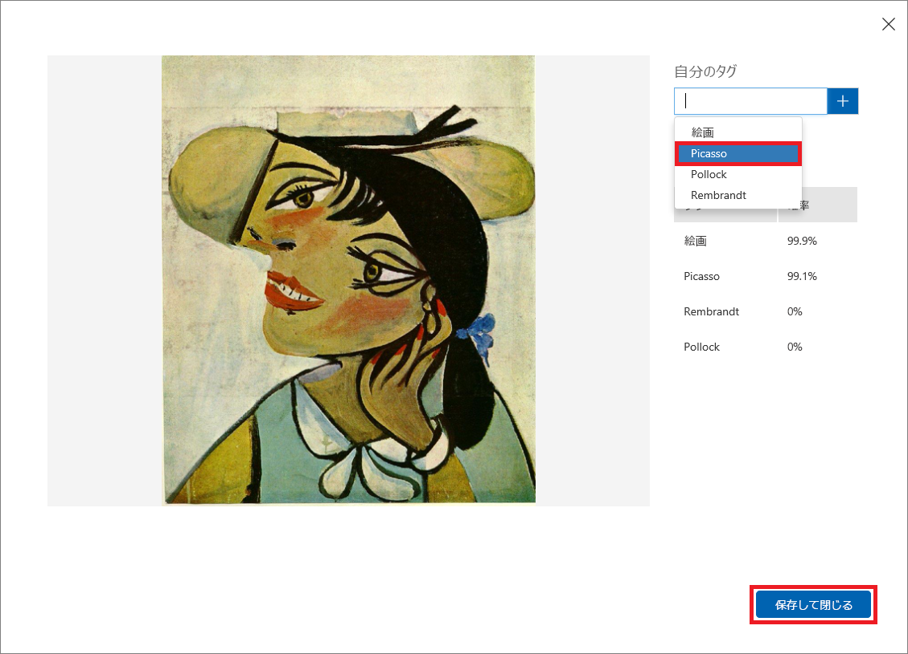

モデルのトレーニングが済んだので、今度はモデルをテストします。 モデルに新しい画像を渡して、どれくらい正しく分類されるか確認します。

1. ページの上部にある **[Quick Test]\(クイック テスト\)** をクリックします。

    

1. **[ローカル ファイルを参照します]** をクリックして、前にダウンロードしたモジュール リソース フォルダー内の "Quick Tests" フォルダーを参照します。 **PicassoTest_01.jpg** を選択して、**[開く]** をクリックします。

    

1. [Quick Test]\(クイック テスト\) ダイアログでテストの結果を確認します。 絵画がピカソである確率はどれくらいですか。 レンブラントやポロックである確率はどれくらいですか。

    

1. [Quick Test]\(クイック テスト\) ダイアログを閉じます。 次に、ページの上部にある **[予測]** をクリックします。

    

1. アップロードしたテスト画像をクリックして、その詳細を表示します。 次に、ドロップダウン リストから **[Picasso]** を選択し、**[保存して閉じる]** をクリックすることによって、イメージを "Picasso" としてタグ付けします。

    > このようにテスト イメージをタグ付けすることによって、追加のトレーニング用イメージをアップロードすることなく、モデルを改良することができます。

    

1. 別のクイック テストを実行し、今度は [Quick Test]\(クイック テスト\) フォルダー内の **FlowersTest.jpg** という名前のファイルを使用します。 この画像にはピカソ、レンブラント、またはポロックである確率として低い値が割り当てられることを確認します。

このモデルはトレーニングされ、使用する準備ができており、特定の画家ごとに絵画をうまく識別することができます。 HTTP 経由で予測エンドポイントを呼び出して、何が起こるか見てみましょう。