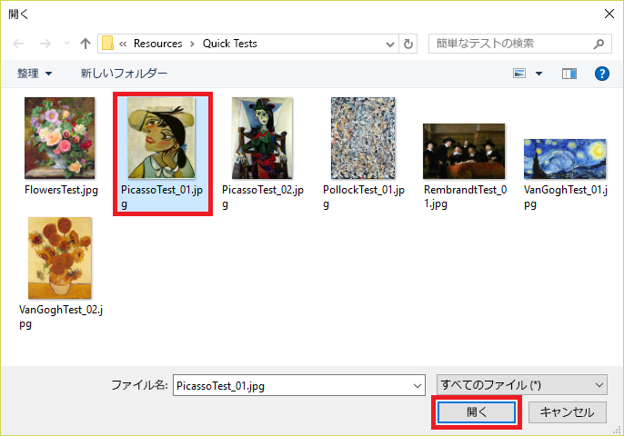

モデルのトレーニングが済んだので、今度はモデルをテストします。Now that we've trained our model, it's time to test it. モデルに新しい画像を渡して、どれくらい正しく分類されるか確認します。We'll give the model new images and see how well it classifies it.

1. ページの上部にある **[Quick Test]\(クイック テスト\)** をクリックします。Click **Quick Test** at the top of the page.

    

1. **[ローカル ファイルを参照します]** をクリックして、前にダウンロードしたモジュール リソース フォルダー内の "Quick Tests" フォルダーを参照します。Click **Browse local files**, and then browse to the "Quick Tests" folder in the module resources folder you download previously. **PicassoTest_01.jpg** を選択して、**[開く]** をクリックします。Select **PicassoTest_01.jpg**, and click **Open**.

    

1. [Quick Test]\(クイック テスト\) ダイアログでテストの結果を確認します。Examine the results of the test in the "Quick Test" dialog. 絵画がピカソである確率はどれくらいですか。What is the probability that the painting is a Picasso? レンブラントやポロックである確率はどれくらいですか。What is the probability that it's a Rembrandt or Pollock?

    

1. [Quick Test]\(クイック テスト\) ダイアログを閉じます。Close the "Quick Test" dialog. 次に、ページの上部にある **[予測]** をクリックします。Then click **Predictions** at the top of the page.

    

1. アップロードしたテスト画像をクリックして、その詳細を表示します。Click the test image that you uploaded to show a detail of it. 次に、ドロップダウン リストから **[Picasso]** を選択し、**[保存して閉じる]** をクリックすることによって、イメージを "Picasso" としてタグ付けします。Then tag the image as a "Picasso" by selecting **Picasso** from the drop-down list and clicking **Save and close**.

    > このようにテスト イメージをタグ付けすることによって、追加のトレーニング用イメージをアップロードすることなく、モデルを改良することができます。By tagging test images this way, you can refine the model without uploading additional training images.

    

1. 別のクイック テストを実行し、今度は [Quick Test]\(クイック テスト\) フォルダー内の **FlowersTest.jpg** という名前のファイルを使用します。Run another quick test, this time using the file named **FlowersTest.jpg** in the "Quick Test" folder. この画像にはピカソ、レンブラント、またはポロックである確率として低い値が割り当てられることを確認します。Confirm that this image is assigned a low probability of being a Picasso, a Rembrandt, or a Pollock.

このモデルはトレーニングされ、使用する準備ができており、特定の画家ごとに絵画をうまく識別することができます。The model is trained and ready to go and appears to be skilled at identifying paintings by certain artists. HTTP 経由で予測エンドポイントを呼び出して、何が起こるか見てみましょう。Let's call the prediction endpoint over HTTP and see what happens.