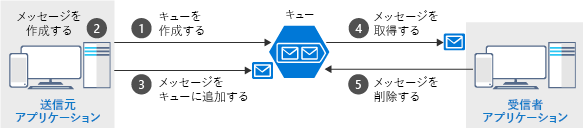

Queues にはメッセージが保持されています。メッセージは、送信者アプリケーションと受信者アプリケーションがその形状を把握しているデータのパケットです。 キューは送信者によって作成され、メッセージが追加されます。 受信者はメッセージを受け取り、それを処理して、キューからそのメッセージを削除します。 次の図は、このプロセスの典型的なフローを示しています。



`get` と `delete` は別の操作であることに注意してください。 この取り合わせは、受信側で可能性のあるエラーを処理し、_at-least-once delivery_ と呼ばれる概念を実装します。 受信者がメッセージを受け取ると、メッセージはキューに残りますが、30 秒間は表示されません。 受信者に処理時のクラッシュや電源障害があった場合は、キューからメッセージは削除されません。 このメッセージは、30 秒後にキューに再表示され、受信者の別のインスタンスがそれを完了まで処理します。

## <a name="the-azure-storage-client-library-for-net"></a>.NET 用 Azure Storage クライアント ライブラリ

**.NET 用 Azure Storage クライアント ライブラリ**には、やりとりをする必要がある各オブジェクトを表す型があります。

- `CloudStorageAccount` は、ご使用の Azure ストレージ アカウントを表します。
- `CloudQueueClient` は、Azure Queue Storage を表します。
- `CloudQueue` は、ご使用のキュー インスタンスの 1 つを表します。
- `CloudQueueMessage` は、メッセージを表します。

これらのクラスを使用すると、キューにプログラムを使用してアクセスできます。 このライブラリには、同期メソッドと非同期メソッドの両方があります。クライアント アプリがブロックされるのを防ぐには、非同期バージョンを使用する必要があります。

> [!NOTE]
> .NET 用 Azure Storage クライアント ライブラリは、**WindowsAzure.Storage** NuGet パッケージにあります。 これは、IDE、Azure CLI または PowerShell `Install-Package WindowsAzure.Storage` を使用してインストールできます。

## <a name="how-to-connect-to-a-queue"></a>キューへの接続方法

キューに接続するには、まず接続文字列を使用して `CloudStorageAccount` を作成します。 結果のオブジェクトにより、`CloudQueueClient` が作成され、代わりに `CloudQueue` インスタンスを開くことができるようになります。 基本のコード フローは次のとおりです。

```csharp
CloudStorageAccount account = CloudStorageAccount.Parse(connectionString);

CloudQueueClient client = account.CreateCloudQueueClient();

CloudQueue queue = client.GetQueueReference("myqueue");
```

`CloudQueue` を作成しても、必ずしも_実際_にストレージ キューが存在することは意味しません。 ただし、このオブジェクトを使用すると、既存のキューを作成、削除、チェックすることができます。 前述のとおり、すべてのメソッドで同期バージョンと非同期バージョンがサポートされていますが、ここでは、`Task` ベースの非同期バージョンのみを使用します。

## <a name="how-to-create-a-queue"></a>キューの作成方法

キューは、送信者のアプリケーションが常にキューを作成する責任を負う、一般的な方法で作成します。 これにより、アプリケーションはより自己完結的となり、管理セットアップへの依存性が低くなります。 

クライアント ライブラリでは、作成がシンプルになるように、必要に応じてキューが作成されたり、またはキューが既に存在する場合に `false` が返されたりする `CreateIfNotExistsAsync` メソッドが公開されています。 

典型的なコードは次のとおりです。

```csharp
CloudQueue queue;
//...

await queue.CreateIfNotExistsAsync();
```

> [!NOTE]
> この API を使用するには、ストレージ アカウントに対する `Write` または `Create` のアクセス許可が必要です。 **アクセス キー** セキュリティ モデルを使用していても、常に、キューに対する読み取り操作のみを許可するその他のアプローチを持つアカウントへのアクセス許可をロックダウンすることができます。

## <a name="how-to-send-a-message"></a>メッセージの送信方法

メッセージを送信するには、`CloudQueueMessage` オブジェクトをインスタンス化します。 このクラスには、メッセージにデータを読み込むいくつかのオーバーロードされたコンストラクターがあります。 ここでは、`string` を受け取るコンストラクターを使用します。 メッセージを作成したら、それの送信に `CloudQueue` オブジェクトを使用します。

典型的な例を次に表します。

```csharp
var message = new CloudQueueMessage("your message here");

CloudQueue queue;
//...

await queue.AddMessageAsync(message);
```

> [!NOTE]
> キューの合計サイズとしては、最大 500 TB が可能ですが、その中の個々のメッセージの最大サイズは 64 KB です (Base64 のエンコードを使用する場合は 48 KB)。 大きなペイロードが必要な場合、URL をメッセージ内の実際のデータ (Blob として格納) に渡し、キューと blob を結合できます。 このアプローチによりは、最大 200 GB の 1 つの項目をキューに追加できます。

## <a name="how-to-receive-and-delete-a-message"></a>メッセージの受信および削除方法

受信側で、次のメッセージを受け取り、処理し、処理の完了後それを削除します。 シンプルな例を次に表します。

```C#
CloudQueue queue;
//...

CloudQueueMessage message = await queue.GetMessageAsync();

if (message != null)
{
    // Process the message
    //...

    await queue.DeleteMessageAsync(message);
}
```

では、この知識をアプリケーションに応用してみましょう。