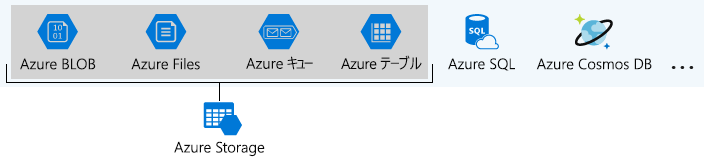
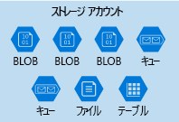
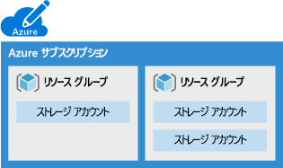
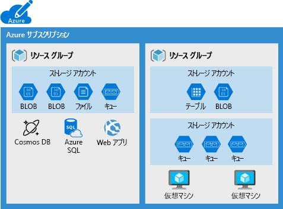
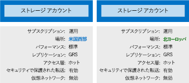

組織には、さまざまな要件のセットを実装できるように、複数のストレージ アカウントがある場合があります。Organizations often have multiple storage accounts to let them implement different sets of requirements. チョコレート メーカーの例では、プライベート ビジネス データのためにストレージ アカウントが 1 つあり、顧客用のファイルに使用するストレージ アカウントが 1 つあります。In the chocolate-manufacturer example, there would be one storage account for the private business data and one for the consumer-facing files. ここでは、ストレージ アカウントによって制御されるポリシーの要素を学習します。これは、必要なアカウントの数を決定するのに役立ちます。Here, you will learn the policy factors that are controlled by a storage account, which will help you decide how many accounts you need.

## Azure Storage とはWhat is Azure Storage?

Azure では、お客様のデータを保存する多くの方法が提供されています。Azure provides many ways to store your data. Azure SQL Server、Azure Cosmos DB、Azure Table Storage などの複数のデータベース オプションがあります。There are multiple database options like Azure SQL Server, Azure Cosmos DB, and Azure Table Storage. Azure には、Azure キューや Event Hubs など、メッセージを保存し、送信する方法が複数あります。Azure offers multiple ways to store and send messages, such as Azure Queues and Event Hubs. Azure Files や Azure BLOB などのサービスを使用し、ルーズ ファイルを保存することもできます。You can even store loose files using services like Azure Files and Azure Blobs.

Azure では、これらの 4 つのデータ サービスが選ばれ、_Azure Storage_ という名前の下にまとめて配置されています。Azure selected four of these data services and placed them together under the name _Azure Storage_. この 4 つのサービスは、Azure BLOB、Azure Files、Azure キュー、Azure テーブルです。The four services are Azure Blobs, Azure Files, Azure Queues, and Azure Tables. 次の図は、Azure Storage の要素を示しています。The following illustration shows the elements of Azure Storage.

これらの 4 つはすべてプリミティブなクラウド ベースのストレージ サービスであり、同じアプリケーションで一緒に使用されることが多いため、特別な処理方法が指定されています。These four were given special treatment because they are all primitive, cloud-based storage services and are often used together in the same application.

## ストレージ アカウントとはWhat is a storage account?

_ストレージ アカウント_は、Azure Storage サービスのセットをまとめてグループ化するコンテナーです。A _storage account_ is a container that groups a set of Azure Storage services together. Azure Storage からのデータ サービスのみが、ストレージ アカウント (Azure BLOB、Azure Files、Azure キュー、Azure テーブル) に含まれる可能性があります。Only data services from Azure Storage can be included in a storage account (Azure Blobs, Azure Files, Azure Queues, and Azure Tables). 次の図は、複数のデータ サービスを含むストレージを示しています。The following illustration shows a storage account containing several data services.

データ サービスをストレージ アカウントに組み合わせると、グループとして管理できます。Combining data services into a storage account lets you manage them as a group. アカウントを作成するタイミングを指定する設定、または作成後に変更した内容は、そのアカウント内のすべてに適用されます。The settings you specify when you create the account, or any that you change after creation, are applied to everything in the account. ストレージ アカウントを削除すると、そこに含まれる格納データはすべて削除されます。Deleting the storage account deletes all of the data stored inside it.

ストレージ アカウントは Azure リソースであり、リソース グループに含まれます。A storage account is an Azure resource and is included in a resource group. 次の図は、複数のリソース グループを含む Azure サブスクリプションを示しています。各グループには 1 つまたは複数のストレージ アカウントが含まれます。The following illustration shows an Azure subscription containing multiple resource groups, where each group contains one or more storage accounts.

Azure SQL や Cosmos DB などのその他の Azure データ サービスは、独立した Azure リソースとして管理され、ストレージ アカウントに含めることはできません。Other Azure data services like Azure SQL and Cosmos DB are managed as independent Azure resources and cannot be included in a storage account. 次の図は、一般的な配置を示しています。BLOB、Files、キュー、テーブルは、ストレージ アカウント内にありますが、その他のサービスはありません。The following illustration shows a typical arrangement: Blobs, Files, Queues, and Tables are inside storage accounts, while other services are not.

## ストレージ アカウントの設定Storage account settings

ストレージ アカウントでは、アカウント内のストレージ サービスのすべてに適用するポリシーを定義します。A storage account defines a policy that applies to all the storage services in the account. たとえば、含まれるサービスがすべて米国西部のデータセンターに保存され、https 経由でのみアクセス可能で、販売部門のサブスクリプションに請求されるように指定することができます。For example, you could specify that all the contained services will be stored in the West US datacenter, accessible only over https, and billed to the sales department's subscription.

ストレージ アカウントによって制御される設定は、次のとおりです。The settings that are controlled by a storage account are:

- **[サブスクリプション]**: アカウントのサービスに対して請求される Azure サブスクリプション。**Subscription**: The Azure subscription that will be billed for the services in the account.

- **[場所]**: アカウントのサービスを保存するデータセンター。**Location**: The datacenter that will store the services in the account.

- **[パフォーマンス]**: ご利用のストレージ アカウントで所有できるデータ サービスとデータの格納に使用するハードウェア ディスクの種類を決定します。**Performance**: Determines the data services you can have in your storage account and the type of hardware disks used to store the data. **[Standard]** では、任意のデータ サービス (BLOB、File、キュー、テーブル) を所有し、磁気ディスク ドライブを使用できます。**Standard** allows you to have any data service (Blob, File, Queue, Table) and uses magnetic disk drives. **[Premium]** では、_[ページ BLOB]_ と呼ばれる 1 つの特定の BLOB の種類に制限され、ストレージにソリッドステート ドライブ (SSD) を使用します。**Premium** limits you to one specific type of blob called a _page blob_ and uses solid-state drives (SSD) for storage.

- **[レプリケーション]**: ご利用のデータのコピーを作成し、ハードウェアの障害や自然災害から保護するために使用する戦略を決定します。**Replication**: Determines the strategy used to make copies of your data to protect against hardware failure or natural disaster. 少なくとも、Azure ではストレージ アカウントに関連付けられているデータセンター内のデータのコピーを自動的に保持します。At a minimum, Azure will automatically maintain a copy of your data within the data center associated with the storage account. これはローカル冗長ストレージ (LRS) と呼ばれ、ハードウェアの障害から保護しますが、データセンター全体を機能させなくするイベントから保護することはありません。This is called locally-redundant storage (LRS), and guards against hardware failure but does not protect you from an event that incapacitates the entire datacenter. 冗長ストレージ (GRS) などのその他のオプションのいずれかにアップグレードし、世界中のそのさまざまなデータセンターでレプリケーションを取得できます。You can upgrade to one of the other options such as geo-redundant storage (GRS) to get replication at different datacenters across the world.

- **[アクセス層]**: このストレージ アカウントで BLOB にすばやくアクセスする方法を制御します。**Access tier**: Controls how quickly you will be able to access the blobs in this storage account. ホットでは、クールよりも速くアクセスできますが、コストは増加します。Hot gives quicker access than Cool, but at increased cost. これは、BLOB のみに該当し、新しい BLOB の既定値として機能します。This applies only to blobs, and serves as the default value for new blobs.

- **[安全な転送が必須]**: アクセスにサポートされるプロトコルを決定するセキュリティ機能。**Secure transfer required**: A security feature that determines the supported protocols for access. 有効では https が必須で、無効では http を許可します。Enabled requires HTTPs, while disabled allows HTTP.

- **[仮想ネットワーク]**: 指定した仮想ネットワークからの受信アクセス要求のみを許可するセキュリティ機能。**Virtual networks**: A security feature that allows inbound access requests only from the virtual network(s) you specify.

## 必要なストレージ アカウントの数はいくつですか?How many storage accounts do you need?

ストレージ アカウントは、場所、レプリケーション戦略、サブスクリプション所有者などの設定を集めたものです。A storage account represents a collection of settings like location, replication strategy, and subscription owner. ご自分のデータに適用するすべてのグループの設定に対して、ストレージ アカウントが 1 つ必要です。You need one storage account for every group of settings that you want to apply to your data. 次の図では、1 つの設定が異なるストレージ アカウントを 2 つ示しています。個別のストレージ アカウントを必要とすることが、違いの 1 つです。The following illustration shows two storage accounts that differ in one setting; that one difference is enough to require separate storage accounts.

通常、必要なストレージ アカウントの数は、データの多様性、価格感受性、管理オーバーヘッドの許容範囲によって決定されます。The number of storage accounts you need is typically determined by your data diversity, cost sensitivity, and tolerance for management overhead.

### データの多様性Data diversity

組織では、使用する場所、秘密度、請求を支払うグループなどが異なるデータを生成することが多いです。これらのベクターのいずれかの間の多様性によって、複数のストレージ アカウントになる可能性があります。Organizations often generate data that differs in where it is consumed, how sensitive it is, which group pays the bills, etc. Diversity along any of these vectors can lead to multiple storage accounts. 次の 2 つの例を考えてみましょう。Let's consider two examples:

1. 国またはリージョンに固有のデータはありますか?Do you have data that is specific to a country or region? ある場合は、パフォーマンスまたはコンプライアンス上の理由から、その国でデータセンターを検索する必要が生じる場合もあります。If so, you might want to locate it in a data center in that country for performance or compliance reasons. 場所ごとにストレージ アカウントが 1 つ必要です。You will need one storage account for each location.

1. 私有財産であるデータや一般に公開するデータはありますか?Do you have some data that is proprietary and some for public consumption? ある場合は、仮想ネットワークを私有財産データに対して有効にして、一般公開向けデータには無効にできます。If so, you could enable virtual networks for the proprietary data and not for the public data. また、これには個別のストレージ アカウントも必要です。This will also require separate storage accounts.

一般に、増加した多様性は、ストレージ アカウントの数が増えることを意味します。In general, increased diversity means an increased number of storage accounts.

### 価格感受性Cost sensitivity

ストレージ アカウント自体に財務費用はかかりませんが、そのアカウント用に選択した設定がアカウントのサービス コストに影響します。A storage account by itself has no financial cost; however, the settings you choose for the account do influence the cost of services in the account. geo 冗長ストレージは、ローカルの冗長ストレージよりコストが高いです。Geo-redundant storage costs more than locally-redundant storage. Premium パフォーマンスとホット アクセス層では、BLOB のコストが増加します。Premium performance and the Hot access tier increase the cost of blobs.

コストを削減するために、複数のストレージ アカウントを使用することができます。You can use multiple storage accounts to reduce costs. たとえば、重要なカテゴリと一般カテゴリにデータをパーティション分割することができます。For example, you could partition your data into critical and non-critical categories. 冗長ストレージを使ってストレージ アカウントに重要なデータを配置し、ローカル冗長ストレージを使って別のストレージ アカウントに一般データを配置できます。You could place your critical data into a storage account with geo-redundant storage and put your non-critical data in a different storage account with locally-redundant storage.

### 管理オーバーヘッドの許容範囲Tolerance for management overhead

ストレージ アカウントごとに作成および保持するため、管理者の時間と注意が必要です。Each storage account requires some time and attention from an administrator to create and maintain. また、クラウド ストレージにデータを追加する場合、複雑さが増します。このロールのすべてのユーザーが、新しいデータを正しいアカウントに追加できるように、各ストレージ アカウントの目的を理解する必要があります。It also increases complexity for anyone who adds data to your cloud storage; everyone in this role needs to understand the purpose of each storage account so they add new data to the correct account.

ストレージ アカウントは、コストを最小限に抑えながら、必要なパフォーマンスとセキュリティを得ることができる強力なツールです。Storage accounts are a powerful tool to help you get the performance and security you need while minimizing costs. 通常の戦略は、データの分析から始まり、場所、課金、レプリケーション戦略などの特性を共有するパーティションを作成して、パーティションごとにストレージ アカウントを 1 つ作成します。A typical strategy is to start with an analysis of your data and create partitions that share characteristics like location, billing, and replication strategy, and then create one storage account for each partition.