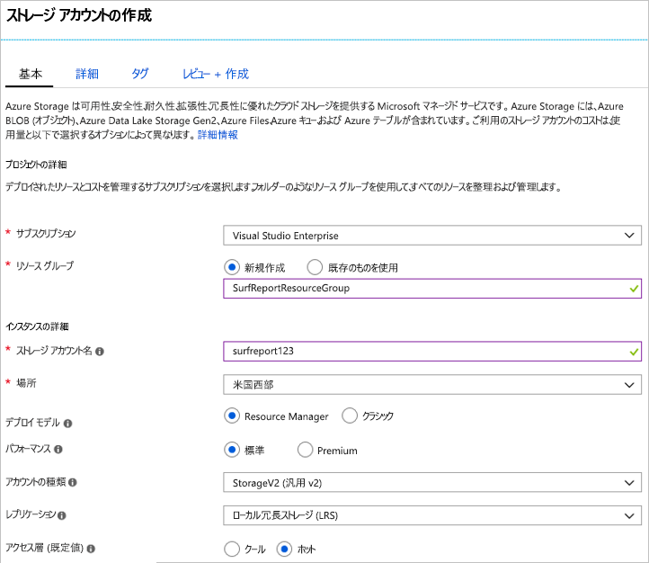

このユニットでは、架空南カリフォルニア サーフ レポート web アプリの適切なストレージ アカウントを作成するのに、Azure portal を使用します。

レポート サイトの閲覧を使用して、写真とそのローカル ビーチ条件のビデオをアップロードできます。 表示するユーザーは、そのコンテンツを使って、サーフィンに最適な状態のビーチを選ぶことができる。 デザインと機能の目標は次のとおりです。

- ビデオ コンテンツはすばやく読み込まれる必要がある
- このサイトではアップロード ボリュームの予期しない上昇を処理する必要がある
- サーフィンの状態が変更されると、古くなったコンテンツは削除されるため、サイトでは常に現在の状態が示される

処理用の Azure キューでアップロードされたコンテンツをバッファー処理し、ストレージ用の Azure BLOB に移動する実装に決めます。 コンテンツへの待機時間の短いアクセスを提供する一方、キューおよび blob の両方を保持できるストレージ アカウントが必要です。

## Azure portal を使用してストレージ アカウントを作成するには

[!include]

1. [Azure Portal](https://portal.azure.com/?azure-portal=true) にサインインします。

1. 上部には、Azure ポータルで、選択の左**リソースの作成**です。

1. 表示される選択パネルで選択**ストレージ**します。

1. このペインの右側にある、次のように選択します。**ストレージ アカウント - blob、ファイル、テーブル、キュー**します。

    

### 基本的なオプションを構成する

[!include]

**PROJECT DETAILS**:

1. 適切な**サブスクリプション**を選択します。

1. 既存のリソース グループを選択します。 <rgn>[サンド ボックス リソース グループ名]</rgn>ドロップダウン リストから。

    > [!NOTE]
    > この無料のリソース グループは、microsoft ラーニング エクスペリエンスの一部として提供されています。 実際のアプリケーションのアカウントを作成する場合は、アプリのすべてのリソースを保持するために、サブスクリプションで新しいリソース グループを作成するは。

**インスタンスの詳細**:

1. 入力、**ストレージ アカウント名**します。 名前は、アカウント内のデータへのアクセスに使用されるパブリック URL を生成するためには。 既存のすべてのストレージ アカウント名が Azure の間で一意である必要があります。 長さは 3 ~ 24 文字である必要があり、小文字と数字のみを含めることができます。

1. 選択、**場所**に近接します。 

1. ままに、**デプロイ モデル**として_Resource manager_します。 これは Azure でのすべてのリソース デプロイの優先モデルであり、アプリのすべての関連リソースをグループ化することができます、_リソース グループ_管理を容易にします。

1. 選択_標準_の**パフォーマンス**オプション。 これは、ストレージ アカウントにデータを保持するために使用するディスク記憶域の種類を決定します。 標準では、従来のハード_ディスク、および Premium はソリッド ステート ドライブ (SSD) を使用してすばやくアクセスします。 ただし、Premium のみがサポートする_ページ blob_ 、ビデオを blob とキューのバッファー処理のどちらでのみ利用するブロック必要がありますが、_標準_オプション。

1. 選択_StorageV2 (汎用 v2)_ の**アカウントの種類**します。 これにより、最新の機能へのアクセスと価格設定します。 具体的には、Blob ストレージ アカウントには、このアカウントの種類で使用可能なその他のオプションがあります。 さまざまな blob およびキューを作成する必要があるため、 _Blob storage_オプションは機能しません。 このアプリケーションではありません選択することにメリットを_ストレージ (汎用 v1)_ にアクセスして、予想されるワークロードのコストを削減する可能性が高いできなくなる機能を制限するためのアカウント。

1. ままに、**レプリケーション**として_ローカル冗長ストレージ (LRS)_ します。 Azure ストレージ アカウント内のデータは常に高可用性を確保するレプリケート - このオプションを使用して、レプリケーションが、持続性の要件を満たすために発生しますからどれだけ離れてを選択できます。 ここでは画像やビデオは古くなった素早くサイトから削除されます。 つまり、グローバルな冗長性のために追加料金を払う価値がほとんどないということです。 致命的な障害でデータを失った場合は、ユーザーからの最新コンテンツでサイトを再開することができます。

1. 設定、**アクセス層**に_ホット_します。 この設定は、Blob storage の場合のみ使用されます。 **ホット アクセス層**は頻繁にアクセスされるデータに最適です、**クール アクセス層**アクセス頻度の低いデータをお勧めします。 設定のみに注意してください、_既定_値 - Blob を作成するときに設定できますデータに別の値。 ここでは、blob の高パフォーマンス オプションを使用するためを迅速に、読み込むビデオをします。
   
次のスクリーンショットは、**[基本]** タブの設定が完了したことを示しています。リソース グループ、サブスクリプション、および名前が異なる値を持つことに注意してください。

### 詳細オプションを構成する

1. をクリックして、 **[次へ]: [詳細設定] >** に移動するボタン、 **[詳細設定]** タブ、または選択、 **[詳細設定]** 画面の上部にあるタブ。

1. **転送が必須のセキュリティで保護された**設定かどうかを制御**HTTP**ストレージ アカウント内のデータにアクセスするために使用する REST Api を使用できます。 このオプションを設定_有効_が強制的に SSL を使用するすべてのクライアント (**HTTPS**)。 これを設定する必要はほとんどの_有効_として HTTPS を使用して、ネットワーク経由ではベスト プラクティスを考慮します。

    > [!WARNING]
    > このオプションが有効になっている場合は、いくつか追加の制限が適用されます。 Linux で SMB 2.1 または 3.0 の使用シナリオを含め、暗号化なしの azure files サービスの接続は失敗します。 Azure storage では、カスタム ドメイン名の SSL をサポートしない、ため、カスタム ドメイン名を持つこのオプションを使用できません。

1. 設定、**仮想ネットワーク**オプションを_None_します。 このオプションを使用して、Azure の仮想ネットワーク上のストレージ アカウントを分離できます。 パブリック インターネット アクセスを使用します。 コンテンツはパブリックを対象に、パブリック クライアントのアクセスを許可する必要があります。

1. ままに、 **Data Lake ストレージ Gen2**オプションとして_無効_します。 これは、このモジュールに関係ないビッグ データ アプリケーションです。

次のスクリーンショットは、**[詳細]** タブの設定が完了したことを示しています。

![**詳細** タブが選択されている [ストレージ アカウントを作成する] ブレードのスクリーンショット。](../media/5-create-storage-account-advanced.png)

### 作成

1. 調べることができます、**タグ**たい場合は、設定します。 これは、カテゴリ化のためのアカウントにキー/値ペアを関連付けることができます、任意の Azure リソースを利用できる機能。

1. をクリックして**確認作成 +** 設定を確認します。 これは、すべての必須フィールドが選択されているかどうかを確認するオプションの簡単な検証を行います。 問題がある場合は、ここで報告されます。 設定を確認したら、クリックして**作成**をストレージ アカウントをプロビジョニングします。

アカウントをデプロイするまで数分をかかります。 Azure が動作しているときにこのアカウントを使用して Api を見てみましょう。

### 確認

1. 左サイドバーで **[ストレージ アカウント]** リンクを選択します。

1. 一覧で新しいストレージ アカウントを見つけて、作成が成功したことを確認します。

<!-- Cleanup sandbox -->
[!include]

自分のサブスクリプションを使用して、リソース グループと関連付けられているすべてのリソースを削除する Azure ポータルで次の手順ができます。

1. 左サイドバーで **[リソース グループ]** リンクを選択します。

1. 一覧で作成したリソース グループを見つけます。

1. リソース グループのエントリを右クリックし、選択**リソース グループの削除**コンテキスト メニュー。 同じコンテキスト メニューを取得するエントリの右側にある「...」メニュー要素をクリックすることもできます。

1. 確認フィールドにリソース グループ名を入力します。

1. **[削除]** ボタンをクリックします。

## まとめ

お客様のビジネス要件による設定でストレージ アカウントを作成しました。 たとえば、する可能性がありますが選択されて米国西部データ センター、お客様が、主に南カリフォルニアであります。 これは、一般的なフロー: まず分析データと、目標とし、一致するようにストレージ アカウントのオプションを構成します。