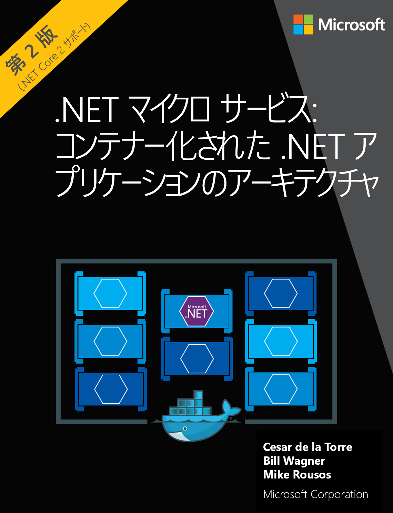

<span data-ttu-id="52f4e-101">現場の販売業者がサーバーに投稿するストック イメージからテキストを読み取る必要があるとします。</span><span class="sxs-lookup"><span data-stu-id="52f4e-101">Suppose you now want to read text from the stock images that your frontline distributors post to your server.</span></span> <span data-ttu-id="52f4e-102">つまり、販売価格を含むプロモーション ステッカーを探すために製品をスキャンする必要があります。</span><span class="sxs-lookup"><span data-stu-id="52f4e-102">In particular, you want to scan product looking for promotional stickers that containing sale prices.</span></span> <span data-ttu-id="52f4e-103">ここで、Computer Vision API の光学式文字認識 (OCR) 機能を試します。</span><span class="sxs-lookup"><span data-stu-id="52f4e-103">It's time to try the optical character recognition (OCR) feature of the Computer Vision API.</span></span> 

## <a name="calling-the-computer-vision-api-to-extract-printed-text"></a><span data-ttu-id="52f4e-104">Computer Vision API を呼び出して印刷されたテキストを抽出する</span><span class="sxs-lookup"><span data-stu-id="52f4e-104">Calling the Computer Vision API to extract printed text</span></span>

<span data-ttu-id="52f4e-105">`ocr` 操作ではイメージのテキストを検出し、認識された文字をコンピューターで扱えるように文字ストリームに抽出します。</span><span class="sxs-lookup"><span data-stu-id="52f4e-105">The `ocr` operation detects text in an image and extracts the recognized characters into a machine-usable character stream.</span></span> <span data-ttu-id="52f4e-106">要求 URL の形式は次のようになります。</span><span class="sxs-lookup"><span data-stu-id="52f4e-106">The request URL has the following format:</span></span>

`https://<region>.api.cognitive.microsoft.com/vision/v2.0/ocr?language=<...>&detectOrientation=<...>`

<span data-ttu-id="52f4e-107">通常どおり、すべての呼び出しはアカウントが作成されたリージョンに対して行う必要があります。</span><span class="sxs-lookup"><span data-stu-id="52f4e-107">As usual, all calls must be made to the region where the account was created.</span></span> <span data-ttu-id="52f4e-108">呼び出しでは、2 つの省略可能なパラメーターを受け入れます。</span><span class="sxs-lookup"><span data-stu-id="52f4e-108">The call accepts two optional parameters:</span></span>

- <span data-ttu-id="52f4e-109">**言語**: イメージで検出されるテキストの言語コード。</span><span class="sxs-lookup"><span data-stu-id="52f4e-109">**language**: The language code of the text to be detected in the image.</span></span> <span data-ttu-id="52f4e-110">既定値は `unk` (つまり、不明) です。</span><span class="sxs-lookup"><span data-stu-id="52f4e-110">The default value is `unk`,or unknown.</span></span> <span data-ttu-id="52f4e-111">これにより、サービスでイメージ内のテキストの言語を自動検出できるようになります。</span><span class="sxs-lookup"><span data-stu-id="52f4e-111">This let's the service auto detect the language of the text in the image.</span></span>
- <span data-ttu-id="52f4e-112">**detectOrientation**: true の場合、サービスでは、さらに処理を行う前に、イメージの向きの検出とその修正が試行されます。たとえば、イメージが上下反対になっていないかどうかが確認されます。</span><span class="sxs-lookup"><span data-stu-id="52f4e-112">**detectOrientation**: When true, the service  tries to detect the image orientation and correct it before further processing, for example, whether the image is upside-down.</span></span> 

[!INCLUDE [get-key-note](./get-key.md)]

## <a name="extract-printed-text-from-an-image-using-ocr"></a><span data-ttu-id="52f4e-113">OCR を使用してイメージから印刷されたテキストを抽出する</span><span class="sxs-lookup"><span data-stu-id="52f4e-113">Extract printed text from an image using OCR</span></span>

<span data-ttu-id="52f4e-114">光学式文字認識 (OCR) に使用するイメージは、*.NET Microservices: Architecture for Containerized .NET Applications* (.NET マイクロサービス: コンテナー化された .NET アプリケーションのアーキテクチャ) という本のカバーです。</span><span class="sxs-lookup"><span data-stu-id="52f4e-114">The image we're going to be using for Optical Character Recognition (OCR) is the cover from the book *.NET Microservices: Architecture for Containerized .NET Applications*.</span></span>



1. <span data-ttu-id="52f4e-116">Cloud Shell で次のコマンドを実行します。</span><span class="sxs-lookup"><span data-stu-id="52f4e-116">Execute the following command in Cloud Shell.</span></span> <span data-ttu-id="52f4e-117">コマンドの `<region>` を、ご利用の Cognitive Services アカウントのリージョンに置き換えます。</span><span class="sxs-lookup"><span data-stu-id="52f4e-117">Replace `<region>` in the command with the region of your cognitive services account.</span></span>

```azurecli
curl "https://<region>.api.cognitive.microsoft.com/vision/v2.0/ocr" \
-H "Ocp-Apim-Subscription-Key: $key" \
-H "Content-Type: application/json"  \
-d "{'url' : 'https://raw.githubusercontent.com/MicrosoftDocs/mslearn-process-images-with-the-computer-vision-service/master/images/ebook.png'}" \
 | jq '.'
```

<span data-ttu-id="52f4e-118">次の JSON は、この呼び出しからの応答例です。</span><span class="sxs-lookup"><span data-stu-id="52f4e-118">The following JSON is an example of the response we get from this call.</span></span> <span data-ttu-id="52f4e-119">JSON の一部の行は、スニペットがページに収まるように削除されています。</span><span class="sxs-lookup"><span data-stu-id="52f4e-119">Some lines of JSON have been removed to make the snippet fit better on the page.</span></span>

```json
{
  "language": "en",
  "orientation": "Up",
  "textAngle": 0,
  "regions" : [
        /*... snipped*/
        {
          "boundingBox": "766,1419,302,33",
          "words": [
            {
              "boundingBox": "766,1419,126,25",
              "text": "Microsoft"
            },
            {
              "boundingBox": "903,1420,165,32",
              "text": "Corporation"
            }
          ]
        }]
}
```

<span data-ttu-id="52f4e-120">この応答について詳しく見ていきましょう。</span><span class="sxs-lookup"><span data-stu-id="52f4e-120">Let's examine this response in more detail.</span></span> 

- <span data-ttu-id="52f4e-121">サービスではテキストが英語と認識されました。</span><span class="sxs-lookup"><span data-stu-id="52f4e-121">The service identified the text as being English.</span></span> <span data-ttu-id="52f4e-122">`language` フィールドの値には、イメージで検出されたテキストの BCP-47 言語コードが含まれています。</span><span class="sxs-lookup"><span data-stu-id="52f4e-122">The value of the `language` field contains the BCP-47 language code of the text detected in the image.</span></span> <span data-ttu-id="52f4e-123">この例では、**en** (つまり、英語) となっています。</span><span class="sxs-lookup"><span data-stu-id="52f4e-123">In this example it is **en**, or English.</span></span> 
- <span data-ttu-id="52f4e-124">`orientation` は **up** として検出されました。</span><span class="sxs-lookup"><span data-stu-id="52f4e-124">The `orientation` was detected as **up**.</span></span> <span data-ttu-id="52f4e-125">このプロパティは、イメージがその中心を軸に、検出されたテキストの角度に応じて回転された後の、認識されたテキストの先頭の向きを示しています。</span><span class="sxs-lookup"><span data-stu-id="52f4e-125">This property is the direction that the top of the recognized text is facing, after the image has been rotated around its center according to the detected text angle.</span></span> 
- <span data-ttu-id="52f4e-126">`textAngle` は、テキストを水平または垂直になるように回転する必要がある角度です。</span><span class="sxs-lookup"><span data-stu-id="52f4e-126">The `textAngle` is the angle by which the text must be rotated to become horizontal or vertical.</span></span> <span data-ttu-id="52f4e-127">この例では、テキストが完全に水平だったため、返された値は **0** となっています。</span><span class="sxs-lookup"><span data-stu-id="52f4e-127">In this example, the text was perfectly horizontal, so the value returned is **0**.</span></span>  
- <span data-ttu-id="52f4e-128">`regions` プロパティには、テキストの位置、図におけるその位置、およびイメージのその部分で検出された単語を示すために使用される値のリストが含まれています。</span><span class="sxs-lookup"><span data-stu-id="52f4e-128">The `regions` property contains a list of values used to show where the text is, its position in the picture, and the word found in that part of the image.</span></span> 
- <span data-ttu-id="52f4e-129">`boundingBox` の値の 4 つの整数は次のとおりです。</span><span class="sxs-lookup"><span data-stu-id="52f4e-129">The four integers of the `boundingBox` value are:</span></span> 
    - <span data-ttu-id="52f4e-130">左端の x 座標</span><span class="sxs-lookup"><span data-stu-id="52f4e-130">the x-coordinate of the left edge</span></span> 
    - <span data-ttu-id="52f4e-131">上端の y 座標</span><span class="sxs-lookup"><span data-stu-id="52f4e-131">the y-coordinate of the top edge</span></span>
    - <span data-ttu-id="52f4e-132">境界ボックスの幅</span><span class="sxs-lookup"><span data-stu-id="52f4e-132">the width of the bounding box</span></span>
    - <span data-ttu-id="52f4e-133">境界ボックスの高さ</span><span class="sxs-lookup"><span data-stu-id="52f4e-133">the height of the bounding box,</span></span> 
   
    <span data-ttu-id="52f4e-134">これらの値を使用して、イメージで検出されたテキストをすべて囲むボックスを描画することができます。</span><span class="sxs-lookup"><span data-stu-id="52f4e-134">You can use these values to draw boxes around every piece of text found in the image.</span></span>

<span data-ttu-id="52f4e-135">この演習でわかるように、`ocr` サービスによって、イメージ内の印刷されたテキストに関する詳細が示されます。</span><span class="sxs-lookup"><span data-stu-id="52f4e-135">As you can see in this exercise, the `ocr` service gives detailed information about the printed text in an image.</span></span> 

<span data-ttu-id="52f4e-136">`ocr` 操作の詳細については、[OCR](https://westus.dev.cognitive.microsoft.com/docs/services/5adf991815e1060e6355ad44/operations/56f91f2e778daf14a499e1fc) のリファレンス ドキュメントを参照してください。</span><span class="sxs-lookup"><span data-stu-id="52f4e-136">For more information about the `ocr` operation, see the [OCR](https://westus.dev.cognitive.microsoft.com/docs/services/5adf991815e1060e6355ad44/operations/56f91f2e778daf14a499e1fc) reference documentation.</span></span>