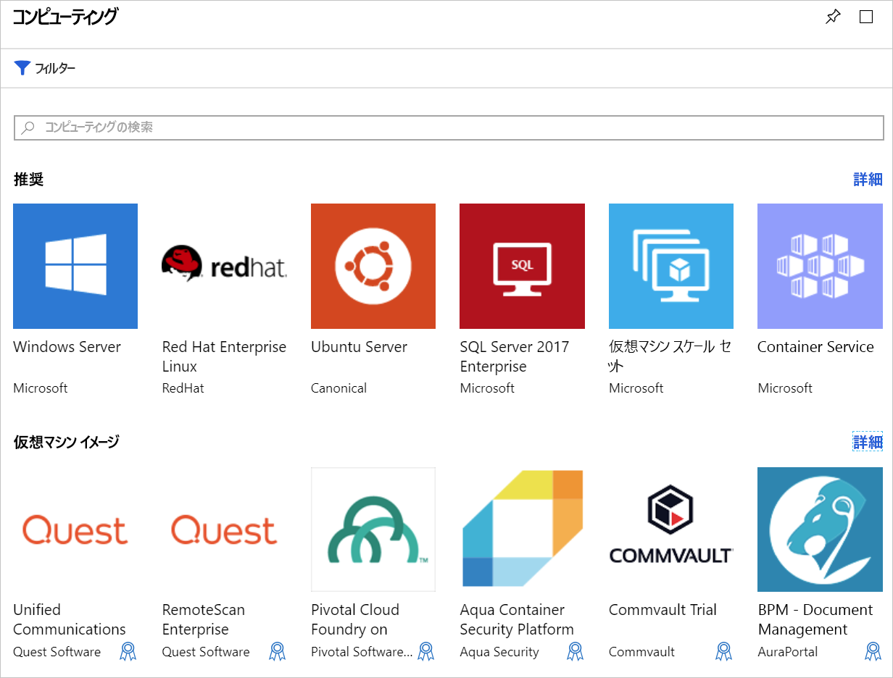

ローカルの Ubuntu Linux サーバーで実行中の既存のWeb サイトが存在しています。 目標は、最新の Ubuntu イメージを使用して Azure 仮想マシン (VM) を作成し、サイトをクラウドに移行することです。 このユニットでは、Azure で仮想マシンを作成する際に決定が必要になるオプションについて学習します。

## Azure Virtual Machines の概要

Azure の仮想マシンは、オンデマンドでスケーラブルなクラウド コンピューティング リソースです。 プロセッサ、メモリ、ストレージ、およびネットワーク リソースが含まれます。 開始しは仮想マシンを停止し、または Azure CLI を使用して、Azure portal から管理できます。 実行中の VM に直接接続し、ローカル コンピューター上にいる場合、コマンドを実行するリモート Secure Shell (SSH) を使用することもできます。

### Azure での Linux の実行

Azure で Linux ベースの VM を作成することは簡単です。 Microsoft は主要な Linux ベンダーと提携し、ディストリビューションが Azure プラットフォーム用に確実に最適化されるようにしています。 SUSE、Red Hat、Ubuntu などの一般的な Linux ディストリビューションのさまざまな構築済みイメージから仮想マシンを作成したり、クラウドで実行する独自の Linux ディストリビューションを構築できます。

## Azure VM の作成

VM は、Azure Portal、スクリプト（Azure CLI または Azure PowerShell を使用）、または Azure Resourse Manager テンプレートなどの複数の方法で Azure での定義およびデピロイが行えます。 すべてのケースでは、後ほど情報のいくつかの情報を指定する必要があります。

Azure Marketplace には、OS と特定のシナリオにインストールされているお気に入りのソフトウェア ツールの両方を含む事前構成済みのイメージも提供します。

## Linux VM で使用されるリソース

Azure で Linux VM を作成する場合、VM をホストするためにリソースも作成します。 これらのリソースが連携することによってコンピューターが仮想化され、Linux オペレーティング システムが実行されます。 これらいずれかが存在する必要があります (と VM の作成時に選択)、または vm が作成されます。

- CPU およびメモリリソースを提供する仮想マシン
- 仮想ハード ディスクを保持する Azure Storage アカウント
- OS、アプリケーション、およびデータを保持する仮想ディスク
- 他の Azure サービスやオンプレミスのハードウェアに VM を接続する仮想ネットワーク (VNet)
- VNet と通信するためのネットワーク インターフェイス
- VM へのアクセスを可能にする省略可能なパブリック IP アドレス

他の Azure サービスと同じように、VM を格納する (および、必要に応じて管理のためにこれらのリソースをグループ化する) ための**リソース グループ**が必要です。 新しい VM を作成する場合、既存のリソース グループを使用することも、新しいリソース グループを作成することもできます。

## VM イメージを選択する

イメージの選択は、VM を作成するときに行う最初の最も重要な決定事項の 1 つです。 イメージとは、VM の作成に使用するテンプレートです。 これらのテンプレートには、OS と、多くの場合はその他のソフトウェア (開発ツールや Web ホスティング環境など) が含まれています。

コンピューターにインストールできるものはすべて、イメージに含めることができます。 Apache HTTP Server 上の web アプリをホストしているなどの必要なタスクでは正確にあらかじめ構成されたイメージから VM を作成できます。

> [!TIP]  
> 作成して、カスタム ディスク イメージをアップロードすることもできます。

## VM のサイズ設定

物理マシンに一定量のメモリや CPU 電源があるように、仮想マシンにも同様にあります。 Azure では、さまざまな価格ポイントで異なるサイズの VM が提供されます。 選択したサイズは、VM の処理能力、メモリ、および最大ストレージ容量が決まります。

> [!WARNING]
> 各サブスクリプションには、VM の作成に影響するクォータ制限があります。 既定では、1 つのリージョン内のすべての VM 全体で、20 を超える数の仮想_コア_を使用することはできません。 領域にまたがる VM を分割するか、制限を引き上げる[オンライン リクエスト](https://docs.microsoft.com/azure/azure-supportability/resource-manager-core-quotas-request)を送信することができます。

VM のサイズは、基本的なテストと運用向けの B シリーズから、大規模なコンピューティング タスク向けの H シリーズまで、複数のカテゴリに分類されています。 実行するワークロードに基づいて VM のサイズを選択する必要があります。 VM 作成後に VM のサイズを変更することは可能ですが、そのためにはまず VM を停止する必要があるので、可能であれば最初から適切なサイズを選択することをお勧めします。

#### 対象とするシナリオに基づくいくつかのガイドラインを示します。

| 操作内容 | 考慮するサイズ
|-------|------------------|
| **汎用コンピューティング/web**: テストと開発、小規模から中規模のデータベース、または低 ~ 中程度のトラフィックの web サーバー。 | B、Dsv3、Dv3、DSv2、Dv2 |
| **大量の計算タスク**: トラフィックが中程度の web サーバー、ネットワーク アプライアンス、バッチ処理、およびアプリケーション サーバー。 | Fsv2、Fs、F |
| **大量のメモリ使用量**: リレーショナル データベース サーバー、中規模および大規模のキャッシュ、およびメモリ内分析。 | Esv3、Ev3、M、GS、G、DSv2、Dv2 |
| **データ ストレージと処理**: ビッグ データ、SQL、および NoSQL データベースをその必要性の高いディスク スループットと I/O です。 | Ls |
| **負荷の高いグラフィックスのレンダリング**やビデオ編集、ディープ ラーニングを使用したモデル トレーニングと推論 (ND)。 | NV、NC、NCv2、NCv3、ND |
| **ハイ パフォーマンス コンピューティング (HPC)**: かどうか最も高速かつ最も強力な CPU 仮想マシン オプションで高スループットのネットワーク インターフェイスを持つ必要があります。 | H |

## ストレージ オプションを選択する

次にストレージに関する一連の決定事項を示します。 まず、ディスク テクノロジを選択することができます。 オプションには、従来の円盤状の記憶媒体ベースのハード ディスク ドライブ (HDD) や、より最新のソリッドステート ドライブ (SSD) が含まれます。 ハードウェアを購入する場合と同じように、SSD ストレージは高コストですがパフォーマンスに優れています。

> [!TIP]
> SSD ストレージには、standard と premium という 2 つのレベルがあります。 Standard SSD ディスクは、ワークロードは標準的であるが、パフォーマンスを向上させたい場合に選択します。 I/O 集中型ワークロードまたは非常に迅速にデータを処理する必要があるミッション クリティカルなシステムの場合は、Premium SSD ディスクを選択します。

### ディスクへのストレージ のマッピング

Azure では、仮想ハード_ディスク (Vhd) を使用して、VM の物理ディスクを表します。 VHD は、論理形式とディスク ドライブのデータをレプリケートしますが、Azure Storage アカウントにページ BLOB として格納されます。 記憶域の種類ごとのディスクごとに選択できます (SSD または HDD) を使用する必要があります。 これにより、一般にはディスクで実行する予定の I/O に基づいて、各ディスクのパフォーマンスを制御することができます。

既定では、2 個の仮想ハード ディスク (VHD) が Linux VM に作成されます。

1. **オペレーティング システム ディスク**: これはプライマリ ドライブであり、最大容量は 2,048 GB です。 既定のラベルは `/dev/sda` です。

1. A**一時ディスク**: これにより、OS またはすべてのアプリの一時ストレージです。 Linux 仮想マシンでは、このディスクは `/dev/sdb` であり、Azure Linux エージェントによりフォーマットされて、`/mnt` にマウントされます。 サイズは、VM のサイズに基づいて設定され、スワップ ファイルの格納に使用されます。 

> [!WARNING]
> 一時ディスクは永続的ではありません。 このディスクには、システムにとって重大ではないデータのみを書き込む必要があります。

#### データについて

プライマリ ドライブに OS だけでなくデータを格納することもできますが、専用の "_データ ディスク_" を作成する方がよい方法です。 追加のディスクを作成して VM にアタッチできます。 各ディスクは最大 4095 GB のデータを保存でき、ストレージの最大容量は、選択した VM サイズによって決まります。

> [!NOTE]  
> 興味深い機能として、実際のディスクから VHD イメージを作成する機能が挙げられます。 これにより、簡単に移行する_既存_をクラウドにオンプレミスのコンピューターからの情報。

### アンマネージド vs マネージド ディスク

最後に行うストレージの選択は、**アンマネージド** ディスクを使用するか、または**マネージド** ディスクを使用するかです。

アンマネージド ディスクを使用する場合、VM ディスクに対応する VHD を保持するために使用するストレージ アカウントを自分で管理する必要があります。 使用するスペースの容量に対応したストレージ アカウント料金を支払うことになります。 1 つのストレージ アカウントには、I/O 操作数 20,000/秒という固定レート制限があります。これは、1 つのストレージ アカウントが最大スロットルで 40 個の標準仮想ハード ディスクをサポートできることを意味します。 スケールアウトを行う必要がある場合は、複数のストレージ アカウントが必要となります。これは複雑な状況をもたらす場合があります。

マネージド ディスクはより新しく、推奨されるディスク ストレージ モデルです。 ストレージ アカウントを管理する負担を Azure に移すことで、この複雑さを適切に解決します。 ディスクの種類 (Premium または Standard) と、ディスクのサイズを指定して、Azure が作成し、両方のディスクを管理_と_ストレージの使用します。 ストレージ アカウント制限について気にする必要がないため、簡単にスケールアウトできます。また、他にも様々な利点があります。

- **信頼性の向上**: Azure でのようなレベルの回復力を提供する Azure Storage のさまざまな部分で高信頼性の Vm に関連付けられた Vhd が配置されることです。
- **セキュリティの向上**: マネージド ディスクは、リソース グループ内の実際の管理対象リソースです。 つまり、ロールベースのアクセス制御を使用して、VHD データを使用できるユーザーを制限することができます。
- **スナップショットサポート**： VHD の読み取り専用コピーの作成にスナップショットが利用可能です。 所有元の VM をシャット ダウンする必要があるが、スナップショットを作成するいくつかは数秒しかかかりません。 これを完了すると、VM の電源し、スナップショットを使用して、運用環境の問題のトラブルシューティングまたは、スナップショットの作成時に、VM に、ポイントにロールバックする重複する VM を作成できます。
- **バックアップのサポート**: 管理ディスクに自動的にバックアップできますによる Azure Backup では、ディザスター リカバリーの異なるリージョンに VM のサービスに影響はありません。

## ネットワーク通信

仮想マシンは仮想ネットワーク（VNet）を用いて外部リソースと通信を行います。 VNet は、リソースが通信を行う単一領域内のプライベート ネットワークを表します。 仮想ネットワークは、ユーザーがオンプレミスで管理するネットワークと同じようなものです。 サブネットに分割してリソースを分離したり、他のネットワーク (オンプレミスのネットワークを含む) に接続したり、トラフィック規則を適用して受信および送信接続を管理したりできます。

### ネットワークの計画

新しい VM を作成するときは、新しい仮想ネットワークの作成、またはリージョン内の既存の VNet の使用を選択できます。

VM と一緒に Azure でネットワークを自動的に作成するとシンプルですが、ほとんどのシナリオに適していない可能性が高くなります。 ネットワークの要件を計画することをお勧め_前もって_アーキテクチャ内のすべてのコンポーネントと VNet の構造を個別に作成します。 その後、VM を作成して、既に作成されている VNet に配置します。 このモジュールでは、後で詳しく仮想ネットワークについて説明します。

仮想マシンを作成する前に、VM の望ましい管理方法を決定する必要があります。 そのオプションを見てみましょう。