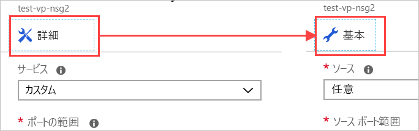

ネットワーク セキュリティ グループをネットワークに適用し、サーバーに対して HTTP トラフィックだけを許可してみましょう。Let's apply a network security group to our network, so that we only allow HTTP traffic through our server.

## ネットワーク セキュリティ グループを作成するCreate a network security group

SSH アクセスが必要であることを示したため、Azure ではセキュリティ グループが作成されているはずです。Azure should have created a security group for us because we indicated we wanted SSH access. しかし、ここではプロセス全体を確認するために、新しいセキュリティ グループを作成します。But let's create a new security group, so you can walk through the entire process. VM の "_前_" に仮想ネットワークを作成することにした場合、これは特に重要です。This is particularly important if you decide to create your virtual network _before_ your VMs. 前述のとおり、セキュリティ グループは "_省略可能_" であり、必ずしもネットワークと共に作成されるわけではありません。As mentioned earlier, security groups are _optional_ and not necessarily created with the network.

1. [Azure portal](https://portal.azure.com/triplecrownlabs.onmicrosoft.com?azure-portal=true) で、左隅のサイドバーにある **[リソースの作成]** ボタンをクリックして、新しいリソースの作成を開始します。In the [Azure portal](https://portal.azure.com/triplecrownlabs.onmicrosoft.com?azure-portal=true), click the **Create a resource** button in the left-corner sidebar to start a new resource creation.

1. フィルター ボックスに「**ネットワーク セキュリティ グループ**」と入力し、一覧で一致する項目を選択します。Type **Network security group** into the filter box and select the matching item in the list.

1. **[リソース マネージャー]** デプロイ モデルが選択されていることを確認し、**[作成]** をクリックします。Make sure the **Resource Manager** deployment model is selected and click **Create**.

1. セキュリティ グループの **[名前]** を指定します。Provide a **Name** for your security group. ここでも、名前付け規則を使用することをお勧めします。Again, naming conventions are a good idea here. **Test Web Network Security Group #1 in East US** の場合は **test-web-eus-nsg1** を使用します。Let's use **test-web-eus-nsg1** for **Test Web Network Security Group #1 in East US**. セキュリティ グループをどこに配置するかに応じて、名前の場所の部分を変更してください。You'll likely want to change the location portion of the name to reflect where you put the security group.

1. 適切な**サブスクリプション**を選択し、既存の**リソース グループ**を使用します。Select the proper **Subscription** and use your existing **Resource group**.

1. 最後に、VM/仮想ネットワークと同じ**場所**に配置します。Finally, put it into the same **Location** as the VM / virtual network. これは重要なことです。場所が異なる場合、このリソースを適用できなくなります。This is important; you won't be able to apply this resource if it's in a different location.

1. **[作成]** をクリックしてグループを作成します。Click **Create** to create the group.

## ネットワーク セキュリティ グループに新しい受信規則を追加するAdd a new inbound rule to our network security group

デプロイはすぐに完了するはずです。Deployment should complete quickly. 完了したら、新しい規則をセキュリティ グループに追加できます。When it's finished, we can add new rules to our security group:

1. Azure portal で新しいセキュリティ グループのリソースを見つけて選択します。Find the new security group resource and select it in the Azure portal.

1. 概要ページには、ネットワークをロックダウンするために作成された既定の規則がいくつか表示されます。On the overview page, you'll find that it has some default rules created to lock down the network.

    受信側:On the inbound side:

    - VNet 間の受信トラフィックはすべて許可されます。All incoming traffic from one VNet to another is allowed. これにより、VNet 上のリソースは相互に通信することができます。This lets resources on the VNet talk to each other.
    - Azure Load Balancer の**プローブ**によって、VM が有効であることを確認するように求められます。Azure Load Balancer **probe** requests to ensure the VM is alive.
    - 他の受信トラフィックはすべて拒否されます。All other inbound traffic is denied.  

    送信側:On the outbound side:  
    - VNet 上のすべてのネットワーク内のトラフィックが許可されます。All in-network traffic on the VNet is allowed.
    - インターネットへの送信トラフィックはすべて許可されます。All outbound traffic to the internet is permitted.
    - 他の送信トラフィックはすべて拒否されます。All other outbound traffic is denied.

    > [!NOTE]  
    > これらの既定の規則には優先度の高い値が設定されています。これは、これらの規則が "_最後_" に評価されることを意味します。These default rules are set with high-priority values, which means that they get evaluated _last_. これを変更したり、削除したりすることはできませんが、優先度の低い値のトラフィックと一致するようにより具体的な規則を作成することで、"_上書き_" することができます。They cannot be changed or deleted, but you can _override_ them by creating more specific rules to match your traffic with a lower priority value.

1. セキュリティ グループの **[設定]** パネルで **[受信セキュリティ規則]** セクションをクリックします。Click the **Inbound security rules** section in the **Settings** panel for the security group.

1. **[+ 追加]** をクリックして新しいセキュリティ規則を追加します。Click **+ Add** to add a new security rule.

    ![[追加] ボタンが強調表示されている受信セキュリティ規則の設定を示す Azure portal のスクリーンショット。](../media/8-add-rule.png)

    セキュリティ規則に必要な情報を入力する方法には、基本と高度の 2 つがあります。There are two ways to enter the information necessary for a security rule: basic and advanced. **[追加]** パネルの上部にあるボタンをクリックして、これらを切り替えることができます。You can switch between them by clicking the button at the top of the **add** panel.

    

    高度モードでは、ルールを完全にカスタマイズできます。The advanced mode provides the ability to customize the rule completely. ただし、既知のプロトコルを構成するだけの場合は、基本モードの方が操作は少し簡単です。However, if you need to configure a known protocol, the basic mode is a bit easier to work with.

1. 基本モードに切り替えます。Switch to the basic mode.

1. HTTP 規則に関する情報を追加します。Add the information for our HTTP rule:

    - **[サービス]** を HTTP に設定します。Set the **Service** to be HTTP. これでポートの範囲が設定されます。This will set your port range up for you.
    - **[優先度]** を **1000** に設定します。Set the **Priority** to **1000**. 既定値の **[拒否]** 規則よりも低い数値にする必要があります。It has to be a lower number than the default **Deny** rule. 任意の値で範囲を開始することができますが、後で例外を作成する必要がある場合は、余裕を持たせることをお勧めします。You can start the range at any value, but it's recommended that you give yourself some space in case an exception needs to be created later.
    - 規則に名前を付けます。ここでは、**allow-http-traffic** を使用します。Give the rule a name; we'll use **allow-http-traffic**.
    - 規則の説明を入力します。Give the rule a description.

1. **高度な**モードに戻ります。Switch back to the **Advanced** mode. 設定がまだ存在することに注目してください。Notice that our settings are still present. このパネルを使用して、より詳細な設定を作成することができます。We can use this panel to create more fine-grained settings. たとえば、**[ソース]** を特定の IP アドレスまたはカメラに固有の IP アドレスの範囲に制限できます。In particular, we would likely restrict the **Source** to be a specific IP address or range of IP addresses specific to the cameras. ローカル コンピューターの現在の IP アドレスがわかっている場合は、それを試すことができます。If you know the current IP address of your local computer, you can try that. それ以外の場合は、設定を **[任意]** のままにして、規則をテストできるようにします。Otherwise, leave the setting as **Any**, so you can test the rule.

1. **[追加]** をクリックして、規則を作成します。Click **Add** to create the rule. これで受信規則の一覧が更新されます。規則が優先順になっていることに注目してください。これは規則を確認する順序です。This will update the list of inbound rules - notice they are in priority order, which is how they will be examined.

## セキュリティ グループを適用するApply the security group

セキュリティ グループを単一の VM を保護するためにネットワーク インターフェイスに適用するか、サブネットに適用し、そのサブネット上のリソースに適用できることを思い出してください。Recall that we can apply the security group to a network interface to guard a single VM or to a subnet where it would apply to any resources on that subnet. 後者のアプローチが最も一般的であるため、これを使用します。The latter approach tends to be the most common, so let's do that. Azure でこのリソースにアクセスすることができます。その場合、仮想ネットワーク リソースを経由するか、仮想ネットワークを使用している VM 経由で間接的にアクセスできます。We could get to this resource in Azure through either the virtual network resource or indirectly through the VM that is using the virtual network.

1. 仮想マシンの **[概要]** パネルに切り替えます。Switch to the **Overview** panel for the virtual machine. **[すべてのリソース]** の下に VM があります。You can find the VM under **All Resources**.

1. **[設定]** セクションで **[ネットワーク]** という項目を選択します。Select the **Networking** item in the **Settings** section.

1. ネットワーク プロパティには、**[仮想ネットワーク/サブネット]** を含む、VM に適用されるネットワークに関する情報があります。In the networking properties, you will find information about the networking applied to the VM, including the **Virtual network/subnet**. これは、リソースにアクセスするためのクリック可能なリンクです。This is a clickable link to get to the resource. これをクリックして仮想ネットワークを開きます。Click it to open the virtual network. このリンクは、VM の **[概要]** パネル "_でも_" 使用できます。This link is _also_ available on the **Overview** panel of the VM. これらのいずれかをクリックすると、仮想ネットワークの **[概要]** が開きます。Either of these will open the **Overview** of the virtual network.

1. **[設定]** セクションで、**[サブネット]** 項目を選択します。In the **Settings** section, select the **Subnets** item.

1. 以前に VM とネットワークを作成したときの定義された (既定) 単一のサブネットがあるはずです。We should have a single subnet defined (default) from when we created the VM + network earlier. 一覧の項目をクリックして詳細を表示します。Click the item in the list to open the details.

1. **[ネットワーク セキュリティ グループ]** エントリをクリックします。Click the **Network security group** entry.

1. **test-web-eus-nsg1** という新しいセキュリティ グループを選択します。Select your new security group: **test-web-eus-nsg1**. ここには VM で作成された別のグループもあるはずです。There should be another group here as well that was created with the VM.

1. **[保存]** をクリックして変更内容を保存します。Click **Save** to save the change. ネットワークに適用されるまで少し時間がかかります。It will take a minute to apply to the network.

## ネットワーク インターフェイスで NSG を更新するUpdate the NSG on the network interface

サブネットに適用されている NSG でポート 80 が開いていますが、ネットワーク インターフェイスに適用されている NSG では現在許可されていないため、ブロックされます。Port 80 is open on the NSG applied to the subnet, but it's still going to be blocked because it's not currently allowed on the NSG applied to the network interface. これを修正し、接続できるようにしましょう。Let's fix that and then we should be able to connect.

1. 仮想マシンの **[概要]** パネルに戻ります。Switch back to the **Overview** panel for the virtual machine. **[すべてのリソース]** の下に VM があります。You can find the VM under **All Resources**.

1. **[設定]** セクションで、**[ネットワーク]** 項目を選択します。In the **Settings** section, select the **Networking** item.

1. **[受信ポートの規則]** セクションに、サブネットの NSG ルールが表示され、そのすぐ下にネットワーク インターフェイスの NSG ルールが表示されます。In the **Inbound port rules** section you should see the NSG rules for the subnet, then the NSG rules for the network interface just below it. ネットワーク インターフェイスの NSG ルールで、**[受信ポートの規則を追加する]** を選択します。In the NSG rules for the network interface, select **Add inbound port rule**.

1. 基本モードに切り替えます。Switch to the basic mode.

1. HTTP 規則に関する情報を追加します。Add the information for our HTTP rule:

    - **[サービス]** を HTTP に設定します。Set the **Service** to be HTTP. これにより、ポート範囲が設定されます。This will set your port range up for you.
    - **[優先度]** を **310** に設定します。Set the **Priority** to **310**.
    - 規則に名前を付けます。ここでは、**allow-http-traffic** を使用します。Give the rule a name; we'll use **allow-http-traffic**.
    - 規則の説明を入力します。Give the rule a description.

1. **[追加]** をクリックして、規則を作成します。Click **Add** to create the rule.

## 規則を確認するVerify the rules

変更内容を検証しましょう。Let's validate the change:

1. 仮想マシンの **[概要]** パネルに戻ります。Switch back to the **Overview** panel for the virtual machine. **[すべてのリソース]** の下に VM があります。You can find the VM under **All Resources**.

1. **[設定]** セクションで **[ネットワーク]** という項目を選択します。Select the **Networking** item in the **Settings** section.

1. ネットワーク インターフェイスの詳細には、**[有効なセキュリティ規則]** のリンクがあります。これをクリックすると、規則がどのように評価されるのかがすぐにわかります。In the network interface details, there is a link for **Effective security rules** that will quickly show you how rules are going to be evaluated. リンクをクリックして分析を開き、新しい規則が表示されることを確認します。Click the link to open the analysis and make sure you see your new rules.

    ![ネットワークの [有効なセキュリティ規則] ブレードが表示された Azure portal のスクリーンショット。](../media/8-effective-rules.png)

1. 言うまでもなく、規則がすべて機能していることを検証する最良の方法は、サーバーに HTTP 要求を送信することです。Of course, the best way to validate it's all working is to hit our server with an HTTP request. 規則が機能していることがわかります。It should now work.

    

## もう 1 つの注意点One more thing

セキュリティ規則を理解するのは大変です。Security rules are tricky to get right. この新しいセキュリティ グループを適用したときにミスをしてしまいました。SSH アクセスが失われてしまったのです。We made a mistake when we applied this new security group - we lost our SSH access! これを修正するには、サブネットに適用されているセキュリティ グループに、SSH アクセスを許可する別のルールを追加します。To fix this, you can add another rule to the security group applied to the subnet to allow SSH access. 必ず、規則の受信 TCP/IP アドレスを、所有しているアドレスに限定してください。Make sure to restrict the inbound TCP/IP addresses for the rule to be the ones you own.

> [!WARNING]  
> 常に、管理アクセスに使用するポートをロックダウンするようにしてください。Always make sure to lock down ports used for administrative access. さらに優れたアプローチは、プライベート ネットワークに仮想ネットワークをリンクするための VPN を作成し、そのアドレス範囲からの RDP または SSH 要求のみを許可することです。An even better approach is to create a VPN to link the virtual network to your private network and only allow RDP or SSH requests from that address range. SSH で使用されるポートを、既定以外のポートに変更することもできます。You can also change the port used by SSH to be something other than the default. ポートの変更は攻撃を防止するには不十分です。Keep in mind that changing ports is not sufficient to stop attacks. これによって、検出を少し困難にすることしかできません。It simply makes it a little harder to discover.