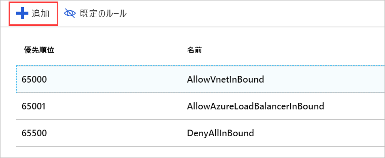

みましょうを通じてマイクロソフトのサーバーだけの HTTP トラフィックを許可するようには、ネットワーク セキュリティ グループ、ネットワークに適用されます。

## ネットワーク セキュリティ グループの作成

SSH アクセスが必要であることを示したため、Azure ではセキュリティ グループが作成されているはずです。 ただし、全体のプロセスを説明することができますので、新しいセキュリティ グループを作成しましょう。 VM の "_前_" に仮想ネットワークを作成することにした場合、これは特に重要です。 前述のとおり、セキュリティ グループは "_省略可能_" であり、必ずしもネットワークと共に作成されるわけではありません。

1. [Azure portal](https://portal.azure.com?azure-portal=true)、 をクリックして、**リソースの作成**新しいリソースの作成を開始する左上隅にあるサイドバーのボタンをクリックします。

1. 型**ネットワーク セキュリティ グループ**フィルター ボックスに、リストに一致するアイテムを選択します。

1. **[リソース マネージャー]** デプロイ モデルが選択されていることを確認し、**[作成]** をクリックします。

1. セキュリティ グループの **[名前]** を指定します。 ここでも、命名規則は、こちらをお勧めします。 使用してみましょう**テスト web eus nsg1**の**テスト Web ネットワーク セキュリティ グループの #1 米国東部**します。 セキュリティ グループを配置する場所を反映するように名前の場所の部分を変更したい可能性があります。

1. 適切な **[サブスクリプション]** を選択し、既存の **[リソース グループ]** を使用します。

1. 最後に、同じ配置**場所**vm/仮想ネットワーク。 これは重要なことです。場所が異なる場合、このリソースを適用できなくなります。

1. **[作成]** をクリックしてグループを作成します。

## ネットワーク セキュリティ グループに新しい受信の規則を追加します。

デプロイはすぐに完了するはずです。 完了したら、新しい規則、セキュリティ グループに追加できます。

1. Azure portal で新しいセキュリティ グループのリソースを見つけて選択します。

1. 概要ページには、ネットワークをロックダウンするために作成された既定の規則がいくつか表示されます。

    受信側:

    - VNet 間の受信トラフィックはすべて許可されます。 これにより、VNet 上のリソースは相互に通信することができます。
    - Azure Load Balancer**プローブ**ように、VM への要求が有効です。
    - 他の受信トラフィックはすべて拒否されます。  

    送信側:  
    - VNet 上のすべてのネットワーク内のトラフィックが許可されます。
    - インターネットへのすべての送信トラフィックを許可します。
    - 他の送信トラフィックはすべて拒否されます。

    > [!NOTE]  
    > これらの既定の規則が優先度の高い値を持つ設定は、評価を取得することを意味する_最後_します。 これを変更したり、削除したりすることはできませんが、優先度の低い値のトラフィックと一致するようにより具体的な規則を作成することで、"_オーバーライド_" できます。

1. セキュリティ グループの **[設定]** パネルで **[受信セキュリティ規則]** セクションをクリックします。

1. **[+ 追加]** をクリックして新しいセキュリティ規則を追加します。

    

    セキュリティ規則に必要な情報を入力する方法は 2 つ (基本と高度) あります。 上部にあるボタンをクリックして切り替えることができます、**追加**パネル。

    

    高度なモードでは、ルールを完全にカスタマイズする機能を提供します。 ただし、既知のプロトコルを構成する必要がある場合は、基本的なモードを使用する少し簡単になります。

1. 基本モードに切り替えます。

1. HTTP ルールの情報を追加します。

    - **[サービス]** を HTTP に設定します。 これでポートの範囲が設定されます。
    - 設定、**優先度**に**1000**します。 既定値の **[拒否]** 規則よりも低い数値にする必要があります。 任意の値で範囲を開始することができますを実現することによって領域例外は、後で作成する必要がある場合をお勧めします。
    - 規則に名前を付けます。使用して**を許可する http トラフィック**します。
    - 規則の説明を入力します。

1. **高度な**モードに戻ります。 設定がまだ存在することに注目してください。 このパネルを使用して、より詳細な設定を作成することができます。 たとえば、**[ソース]** を特定の IP アドレスまたはカメラに固有の IP アドレスの範囲に制限できます。 ローカル コンピューターの現在の IP アドレスがわかっている場合は、それを試すことができます。 それ以外の場合、設定のままに**任意**ので、ルールをテストすることができます。

1. **[追加]** をクリックして、規則を作成します。 これで受信規則の一覧が更新されます。規則が優先順になっていることに注目してください。これは規則を調べる順序です。

## セキュリティ グループを適用する

1 つの VM を保護するためのネットワーク インターフェイス、またはそのサブネット上のすべてのリソースに適用されますが、サブネットに、セキュリティ グループに適用することを思い出してください。 後者のアプローチは、そのをでは最も一般的な傾向があります。 仮想ネットワーク リソースを Azure では、このリソースを取得でしたまたは直接を通じて VM を使用しているいない仮想ネットワーク。

1. 仮想マシンの **[概要]** パネルに切り替えます。 **[すべてのリソース]** の下に VM があります。

1. **[設定]** セクションで **[ネットワーク]** という項目を選択します。

1. ネットワークのプロパティでは、VM に適用されるネットワークについての情報を紹介しますなど、**仮想ネットワーク/サブネット**します。 これは、リソースにアクセスするためのクリック可能なリンクです。 これをクリックして仮想ネットワークを開きます。 このリンクは、VM の **[概要]** パネル "_でも_" 使用できます。 これらのいずれかをクリックすると、仮想ネットワークの **[概要]** が開きます。

1. **[設定]** セクションで、**[サブネット]** 項目を選択します。

1. 以前に VM とネットワークを作成したときの拒否された (既定) 単一のサブネットがあるはずです。 一覧の項目をクリックして詳細を表示します。

1. **[ネットワーク セキュリティ グループ]** エントリをクリックします。

1. **test-web-eus-nsg1** という新しいセキュリティ グループを選択します。 ここには VM で作成された別のグループもあるはずです。

1. **[保存]** をクリックして変更内容を保存します。 ネットワークに適用されるまで少し時間がかかります。

## 規則を確認する

変更を確認してみましょう。

1. 仮想マシンの **[概要]** パネルに戻ります。 **[すべてのリソース]** の下に VM があります。

1. **[設定]** セクションで **[ネットワーク]** という項目を選択します。

1. ネットワーク インターフェイスの詳細へのリンクを**有効なセキュリティ規則**を簡単に説明する評価される規則を移動する方法。 リンクをクリックして分析を開き、新しい規則が表示されることを確認します。

    

1. もちろん、規則がすべて動作しているのを検証する最善の方法は、サーバーに HTTP 要求を送信することです。 これで動作します。

    

## もう 1 つ注意すべき点

セキュリティ規則を理解するのは大変です。 この新しいセキュリティ グループを適用したときに間違えてしまいました。つまり、SSH が失われてしまったのです。 これを解決するために、SSH アクセスがサポートされるようにセキュリティ グループに別の規則を追加することができます。 必ず、規則に対する受信 TCP/IP アドレスを所有しているものに限定してください。

> [!WARNING]  
> 常に、管理アクセスに使用するポートをロックダウンするようにしてください。 さらに優れたアプローチは、プライベート ネットワークに仮想ネットワークをリンクするための VPN を作成し、そのアドレス範囲からの RDP または SSH 要求のみを許可することです。 SSH で使用されるポートを、既定以外のものに変更することもできます。 ポートの変更が不十分である攻撃を停止することに留意してください。 単になります少し困難を検出します。