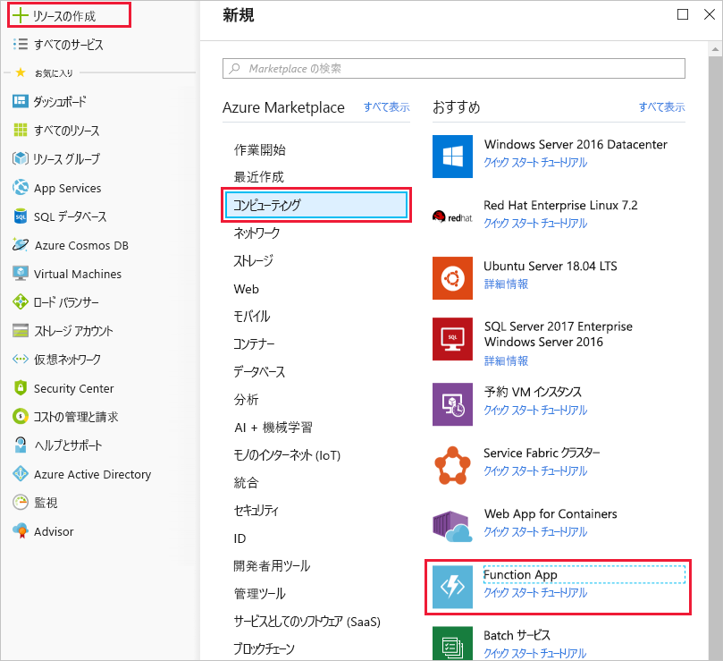
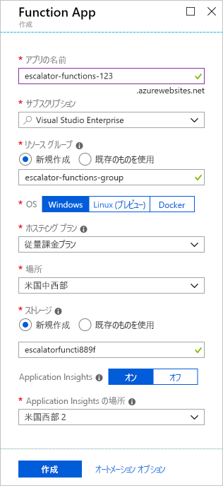

これで温度サービスを実装する準備ができました。 前のユニットでは、サーバーなしのソリューションが自分のニーズに最適であることがわかりました。 Azure 関数を保持するために、関数アプリを作成することから始めましょう。

## 関数アプリとは

関数は、**関数アプリ**と呼ばれる実行コンテキストでホストされます。 Azure では、関数とコンピューティング リソースを論理的にグループ化し、構造化するために、関数アプリを定義します。 エレベーターの例では、エスカレーター駆動歯車の温度サービスをホストする関数アプリを作成します。 関数アプリを作成するために、いくつかの決定を行う必要があります。サービス プランを選択し、互換性のあるストレージ アカウントを選択する必要があります。

### サービス プランを選択する

関数アプリでは、2 種類のサービス プランのいずれかを使用できます。 最初のサービス プランは、**従量課金サービス プラン**です。 これは、Azure のサーバーレス アプリケーション プラットフォームを使用するときに選択するプランです。 従量課金サービス プランでは、自動スケーリングが提供され、関数が実行されているときに課金されます。 従量課金プランには、関数の実行に対して構成可能なタイムアウト期間が付属します。 既定は 5 分ですが、最長 10 分までのタイムアウトを構成できます。

2 つ目のプランは、**Azure App Service プラン**と呼ばれています。 このプランでは、定義した VM 上で関数が連続的に実行されるようにして、タイムアウト期間を避けることができます。 App Service プランを使用している場合、お客様は関数を実行するアプリ リソースを管理する責任があるため、これは技術的にはサーバーレス プランではありません。 ただし、関数が連続的に使用される場合、あるいは従量課金プランよりも多くの処理能力または実行時間が必要な場合に、このプランを選択することをお勧めします。

### ストレージ アカウントの要件

関数アプリを作成する場合、関数アプリはストレージ アカウントにリンクされている必要があります。 既存のアカウントを選択するか、新しいアカウントを作成できます。 関数アプリでは、関数実行の記録や実行トリガーの管理など、内部操作のためにこのストレージ アカウントが使用されます。 従量課金サービス プランでは、これは関数コードと構成ファイルが格納される場所でもあります。

## 関数アプリの作成

Azure portal で関数アプリを作成しましょう。

[!include]

[!include]

1. ご自分の Azure アカウントを使用して [Azure portal](https://portal.azure.com?azure-portal=true) にサインインします。

1. Azure portal の左上隅にある **[リソースの作成]** ボタンを選択し、**[はじめに]、[Serverless Function App]\(サーバーなしの Function App\)** の順に選択して、Function App の *[作成]* ブレードを開きます。 また、使用することができます、**コンピューティング > Function App**オプションは、同じブレードが開きます。

  

1. グローバルに一意のアプリ名を選択します。 これはサービスのベース URL として機能します。 たとえば、**escalator-functions-xxxxxxx** という名前を付けることができます。xxxxxxx は自分のイニシャルや誕生年に置き換えることができます。 グローバルに一意でない場合、別の組み合わせをお試しください。 有効な文字は a-z、0-9、- (ハイフン) です。

1. 関数アプリをホストする Azure サブスクリプションを選択します。

1. 呼ばれる既存のリソース グループを選択します。 <rgn>[サンド ボックス リソース グループ名]</rgn>します。

1. OS に **Windows** を選択します。

1. **ホスティング プラン**を選択します**従量課金プラン**、これはサーバーレスのホスティング オプションです。

1. 自分または顧客が住んでいる場所に最も近い地域を選択します。

1. 新しいストレージ アカウントを作成します。 Azure では、アプリ名に基づいて名前が指定されます。 必要に応じて変更できますが、この名前も固有である必要があります。

1. Azure Application Insights が **[オン]** になっていることを確認し、自分 (または顧客) から最も近いリージョンを選択します。
  完了すると、構成は次のスクリーンショットにある構成のようになります。

  

1. **[作成]** を選択します。デプロイには数分かかります。 完了すると、通知が届きます。

## Azure 関数アプリを確認する

1. Azure Portal の左側にあるメニューから、**[リソース グループ]** を選択します。 参照してください、 <rgn>[サンド ボックス リソース グループ名]</rgn>で使用可能なグループの一覧。

  ![メニュー項目と < rgn > [サンド ボックス リソース グループ名] グループのリソースとリソース グループ ブレードを表示する Azure ポータルのスクリーン ショット </rgn > リスト項目が強調表示されます。](../media/3-resource-group.png)

1. 選択<rgn>[サンド ボックス リソース グループ名]</rgn>します。 次の一覧のようにリソース リストが表示されます。

  ![[サンド ボックス リソース グループ名] < rgn > 内のすべてのリソースを示す Azure ポータルのスクリーン ショット </rgn > を App Service プランをストレージ アカウント、Application Insights リソース、および App Service のエントリを含むグループ。](../media/3-resource-list.png)

稲妻関数のアイコンとして App Service では、リストの項目は、新しい function app です。 クリックして新しい関数の詳細を開くことができます - ブラウザーでは、関数アプリが実行されていることを示します。 既定の web ページを取得する必要がありますを開く場合に、割り当てられているパブリック URL があります。
