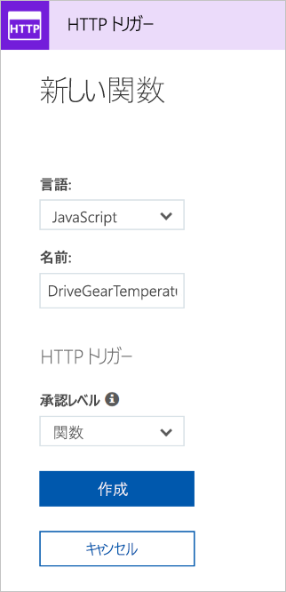

<span data-ttu-id="72228-101">歯車駆動の例を続け、温度サービスのロジックを追加しましょう。</span><span class="sxs-lookup"><span data-stu-id="72228-101">Let's continue with our gear drive example and add the logic for the temperature service.</span></span> <span data-ttu-id="72228-102">具体的には、HTTP 要求からデータを受信します。</span><span class="sxs-lookup"><span data-stu-id="72228-102">Specifically, we're going to receive data from an HTTP request.</span></span>

## <a name="function-requirements"></a><span data-ttu-id="72228-103">関数の要件</span><span class="sxs-lookup"><span data-stu-id="72228-103">Function requirements</span></span>

<span data-ttu-id="72228-104">まず、ロジックにいくつかの要件を定義する必要があります。</span><span class="sxs-lookup"><span data-stu-id="72228-104">First, we need to define some requirements for our logic:</span></span>

- <span data-ttu-id="72228-105">0 - 25 の温度には、**[OK]** のフラグを設定します。</span><span class="sxs-lookup"><span data-stu-id="72228-105">Temperatures between 0-25 should be flagged as **OK**.</span></span>
- <span data-ttu-id="72228-106">26 - 50 の温度には、**[注意]** のフラグを設定します。</span><span class="sxs-lookup"><span data-stu-id="72228-106">Temperatures between 26-50 should be flagged as **CAUTION**.</span></span>
- <span data-ttu-id="72228-107">50 以上の温度には、**[危険]** のフラグを設定します。</span><span class="sxs-lookup"><span data-stu-id="72228-107">Temperatures above 50 should be flagged as **DANGER**.</span></span>

## <a name="add-a-function-to-our-function-app"></a><span data-ttu-id="72228-108">関数アプリに関数を追加する</span><span class="sxs-lookup"><span data-stu-id="72228-108">Add a function to our function app</span></span>

<span data-ttu-id="72228-109">前のユニットで説明したように、Azure には関数の作成を始めるのに役立つテンプレートが用意されています。</span><span class="sxs-lookup"><span data-stu-id="72228-109">As we discussed in the preceding unit, Azure provides templates that help you get started building functions.</span></span> <span data-ttu-id="72228-110">このユニットでは、`HttpTrigger` テンプレートを使用して、温度サービスを実装します。</span><span class="sxs-lookup"><span data-stu-id="72228-110">In this unit, we'll use the `HttpTrigger` template to implement the temperature service.</span></span>

1. <span data-ttu-id="72228-111">[Azure portal](https://portal.azure.com/learn.docs.microsoft.com?azure-portal=true) にサインインします。</span><span class="sxs-lookup"><span data-stu-id="72228-111">Sign in to the [Azure portal](https://portal.azure.com/learn.docs.microsoft.com?azure-portal=true).</span></span>

1. <span data-ttu-id="72228-112">左側のメニューで **[すべてのリソース]** を選択し、"**<rgn>[サンドボックス リソース グループ名]</rgn>**" を選択し、最初の演習のリソース グループを選択します。</span><span class="sxs-lookup"><span data-stu-id="72228-112">Select the resource group from the first exercise by choosing **All resources** in the left-hand menu, and then selecting "**<rgn>[sandbox resource group name]</rgn>**".</span></span>

1. <span data-ttu-id="72228-113">グループのリソースが表示されます。</span><span class="sxs-lookup"><span data-stu-id="72228-113">The resources for the group will then be displayed.</span></span> <span data-ttu-id="72228-114">**escalator-functions-xxxxxxx** 項目 (稲妻の Function アイコンでも示されます) を選択することで、前の演習で作成した関数アプリの名前をクリックします。</span><span class="sxs-lookup"><span data-stu-id="72228-114">Click the name of the function app that you created in the previous exercise by selecting the **escalator-functions-xxxxxxx** item (also indicated by the lightning bolt Function icon).</span></span>

  ![強調表示されている [すべてのリソース] ブレードと作成したエスカレーター関数アプリが示されている Azure portal のスクリーンショット。](../media/5-access-function-app.png)

1. <span data-ttu-id="72228-116">左側のメニューには、関数アプリ名と 3 項目 (*[関数]*、*[プロキシ]*、*[スロット]*) を含むサブメニューが表示されます。</span><span class="sxs-lookup"><span data-stu-id="72228-116">The left-side menu displays your function app name and a submenu with three items: *Functions*, *Proxies*, and *Slots*.</span></span>  <span data-ttu-id="72228-117">初めての関数の作成を始めるには、**[Functions]** をクリックし、結果のページの上部にある **[新しい関数]** ボタンをクリックします。</span><span class="sxs-lookup"><span data-stu-id="72228-117">To start creating our first function, select **Functions** and click  the **New function** button at the top of the resulting page.</span></span>

  ![関数アプリの Functions リストと強調表示された [Functions] メニュー項目および [新しい関数] ボタンが示されている Azure portal のスクリーンショット。](../media/5-function-add-button.png)

1. <span data-ttu-id="72228-119">クイック スタート画面で、次のスクリーンショットで示されているように、**[関数を独自に作成する]** セクションの **[カスタム関数]** リンクを選択します。</span><span class="sxs-lookup"><span data-stu-id="72228-119">In the Quickstart screen, select the **Custom function** link in the **Get started on your own** section as shown in the following screenshot.</span></span> <span data-ttu-id="72228-120">[クイック スタート] 画面が表示されない場合は、ページの上部にある **[クイックスタートに移動します]** リンクをクリックします。</span><span class="sxs-lookup"><span data-stu-id="72228-120">If you don't see the Quickstart screen, click on the **go to the quickstart** link at the top of the page.</span></span>

  ![[関数を独自に作成する] セクションの [カスタム関数] ボタンが強調表示されている [クイック スタート] ブレードが示されている Azure portal のスクリーンショット。](../media/5-custom-function.png)

1. <span data-ttu-id="72228-122">次のスクリーンショットに示すように、画面に表示されたテンプレートの一覧から、**HTTP トリガー** テンプレートでの **JavaScript** の実装を選択します。</span><span class="sxs-lookup"><span data-stu-id="72228-122">From the list of templates displayed on the screen, select the **JavaScript** implementation of the **HTTP trigger** template as shown in the following screenshot.</span></span>

1. <span data-ttu-id="72228-123">表示された **[新しい関数]** ダイアログの名前フィールドに「**DriveGearTemperatureService**」と入力します。</span><span class="sxs-lookup"><span data-stu-id="72228-123">Enter **DriveGearTemperatureService** in the name field of the **New Function** dialog that appears.</span></span> <span data-ttu-id="72228-124">認証レベルを "関数" のままにして **[作成]** ボタンを押し、関数を作成します。</span><span class="sxs-lookup"><span data-stu-id="72228-124">Leave the Authorization level as "Function" and press the **Create** button to create the function.</span></span>

  

1. <span data-ttu-id="72228-126">関数の作成が完了すると、コード エディターが *index.js* コード ファイルの内容と共に表示されます。</span><span class="sxs-lookup"><span data-stu-id="72228-126">When your function creation completes, the code editor opens with the contents of the *index.js* code file.</span></span> <span data-ttu-id="72228-127">テンプレートが生成された既定のコードは、次のスニペット内に一覧されます。</span><span class="sxs-lookup"><span data-stu-id="72228-127">The default code that the template generated for us is listed in the following snippet.</span></span>

```javascript
module.exports = function (context, req) {
    context.log('JavaScript HTTP trigger function processed a request.');

    if (req.query.name || (req.body && req.body.name)) {
        context.res = {
            // status: 200, /* Defaults to 200 */
            body: "Hello " + (req.query.name || req.body.name)
        };
    }
    else {
        context.res = {
            status: 400,
            body: "Please pass a name on the query string or in the request body"
        };
    }
    context.done();
};
```

<span data-ttu-id="72228-128">関数では、HTTP 要求のクエリ文字列から、または要求本文の一部として渡される名前が必要です。</span><span class="sxs-lookup"><span data-stu-id="72228-128">Our function expects a name to be passed in either through the HTTP request query string or as part of the request body.</span></span> <span data-ttu-id="72228-129">この関数では、メッセージ "**Hello, {name}**" を返し、要求で送信された名前をエコー バックすることによって応答が行われます。</span><span class="sxs-lookup"><span data-stu-id="72228-129">The function responds by returning the message  **Hello, {name}**, echoing back the name that was sent in the request.</span></span>

<span data-ttu-id="72228-130">ソース ビューの右側にタブが 2 つ表示されます。</span><span class="sxs-lookup"><span data-stu-id="72228-130">On the right-hand side of the source view, you'll find two tabs.</span></span> <span data-ttu-id="72228-131">**[ファイルの表示]** タブでは、ご自分の関数におけるコードと構成ファイルが一覧されます。</span><span class="sxs-lookup"><span data-stu-id="72228-131">The **View files** tab lists the code and config file for your function.</span></span>  <span data-ttu-id="72228-132">**function.json** を選択すると、次のような外観の関数の構成が表示されます。</span><span class="sxs-lookup"><span data-stu-id="72228-132">Select **function.json** to view the configuration of the function, which should look like the following:</span></span>

```javascript
{
    "disabled": false,
    "bindings": [
    {
        "authLevel": "function",
        "type": "httpTrigger",
        "direction": "in",
        "name": "req"
    },
    {
        "type": "http",
        "direction": "out",
        "name": "res"
    }
    ]
}
```

<span data-ttu-id="72228-133">この構成では、HTTP 要求を受け取ったときに実行する関数を宣言します。</span><span class="sxs-lookup"><span data-stu-id="72228-133">This configuration declares that the function runs when it receives an HTTP request.</span></span> <span data-ttu-id="72228-134">出力バインディングでは、HTTP 応答として送信される応答を宣言します。</span><span class="sxs-lookup"><span data-stu-id="72228-134">The output binding declares that the response will be sent as an HTTP response.</span></span>

## <a name="test-the-function"></a><span data-ttu-id="72228-135">関数をテストする</span><span class="sxs-lookup"><span data-stu-id="72228-135">Test the function</span></span>

> [!TIP]
> <span data-ttu-id="72228-136">**cURL** は、ファイルを送受信するために使用できるコマンドライン ツールです。</span><span class="sxs-lookup"><span data-stu-id="72228-136">**cURL** is a command line tool that can be used to send or receive files.</span></span> <span data-ttu-id="72228-137">このツールは、Linux、macOS、および Windows 10 に含まれており、その他のほとんどのオペレーティング システムでもダウンロードできます。</span><span class="sxs-lookup"><span data-stu-id="72228-137">It's included with Linux, macOS, and Windows 10, and can be downloaded for most other operating systems.</span></span> <span data-ttu-id="72228-138">cURL では、HTTP、HTTPS、FTP、FTPS、SFTP、LDAP、TELNET、SMTP、POP3 などのさまざまなプロトコルをサポートします。詳細については、次のリンクを参照してください。</span><span class="sxs-lookup"><span data-stu-id="72228-138">cURL supports numerous protocols like HTTP, HTTPS, FTP, FTPS, SFTP, LDAP, TELNET, SMTP, POP3, etc. For more information, refer to the links below:</span></span>
>
>- <https://en.wikipedia.org/wiki/CURL>
>- <https://curl.haxx.se/docs/>

<span data-ttu-id="72228-139">関数をテストするには、コマンド ラインで cURL を使用して、関数 URL に HTTP 要求を送信できます。</span><span class="sxs-lookup"><span data-stu-id="72228-139">To test the function, you can send an HTTP request to the function URL using cURL on the command line.</span></span> <span data-ttu-id="72228-140">関数のエンドポイント URL を見つけるには、次のスクリーンショットに示すように、関数コードに戻り、**[関数の URL の取得]** リンクを選択します。</span><span class="sxs-lookup"><span data-stu-id="72228-140">To find the endpoint URL of the function, return to your function code and select the **Get function URL** link, as shown in the following screenshot.</span></span> <span data-ttu-id="72228-141">このリンクを一時的に保存します。</span><span class="sxs-lookup"><span data-stu-id="72228-141">Save this link temporarily.</span></span>

![[関数の URL の取得] ボタンが強調表示されている関数エディターが示されている Azure portal のスクリーンショット。](../media/5-get-function-url.png)

### <a name="securing-http-triggers"></a><span data-ttu-id="72228-143">HTTP トリガーをセキュリティで保護する</span><span class="sxs-lookup"><span data-stu-id="72228-143">Securing HTTP triggers</span></span>

<span data-ttu-id="72228-144">HTTP トリガーを使用すると、各要求で表示されるキーを要求することで、API キーを使用して不明な呼び出し元をブロックすることができます。</span><span class="sxs-lookup"><span data-stu-id="72228-144">HTTP triggers let you use API keys to block unknown callers by requiring the key to be present on each request.</span></span> <span data-ttu-id="72228-145">関数を作成するときは、"_認可レベル_" を選択します。</span><span class="sxs-lookup"><span data-stu-id="72228-145">When you create a function, you select the _authorization level_.</span></span> <span data-ttu-id="72228-146">既定では、これは関数固有の API キーが必要な "関数" に設定されますが、グローバルな "マスター" キーを使用するには "管理者" を設定したり、キーが必要ないことを示すには "匿名" を設定したりすることもできます。</span><span class="sxs-lookup"><span data-stu-id="72228-146">By default, it's set to "Function", which requires a function-specific API key, but it can also be set to "Admin" to use a global "master" key, or "Anonymous" to indicate that no key is required.</span></span> <span data-ttu-id="72228-147">作成後に関数プロパティから認証レベルを変更することもできます。</span><span class="sxs-lookup"><span data-stu-id="72228-147">You can also change the authorization level through the function properties after creation.</span></span>

<span data-ttu-id="72228-148">Microsoft でこの関数を作成したときに [関数] を指定しているため、HTTP 要求を送信するときにキーを指定する必要があります。</span><span class="sxs-lookup"><span data-stu-id="72228-148">Since we specified "Function" when we created this function, we will need to supply the key when we send the HTTP request.</span></span> <span data-ttu-id="72228-149">これは、`code` という名前のクエリ文字列パラメーターとして、または `x-functions-key` という名前の HTTP ヘッダー (推奨) として送信できます。</span><span class="sxs-lookup"><span data-stu-id="72228-149">You can send it as a query string parameter named `code`, or as an HTTP header (preferred) named `x-functions-key`.</span></span>

<span data-ttu-id="72228-150">関数とマスター キーは、関数を展開したときに **[管理]** セクションに表示されます。</span><span class="sxs-lookup"><span data-stu-id="72228-150">The function and master keys are found in the **Manage** section when the function is expanded.</span></span> <span data-ttu-id="72228-151">既定では、これらは非表示であり、自分で表示する必要があります。</span><span class="sxs-lookup"><span data-stu-id="72228-151">By default, they are hidden, and you need to display them.</span></span>

1. <span data-ttu-id="72228-152">関数を展開して **[管理]** セクションを選択し、既定の関数キーを表示してクリップボードにコピーします。</span><span class="sxs-lookup"><span data-stu-id="72228-152">Expand your function and select the **Manage** section, show the default Function Key, and copy it to the clipboard.</span></span>

  ![公開された関数キーが強調表示されている関数の [管理] ブレードが示されている Azure portal のスクリーンショット。](../media/5-get-function-key.png)

1. <span data-ttu-id="72228-154">次に、**cURL** ツールをインストールしたコマンド ラインから、関数の URL と関数キーを使用して cURL コマンドの書式を設定します。</span><span class="sxs-lookup"><span data-stu-id="72228-154">Next, from the command line where you installed the **cURL** tool, format a cURL command with the URL for your function, and the Function key.</span></span>

    - <span data-ttu-id="72228-155">`POST` 要求を使用します。</span><span class="sxs-lookup"><span data-stu-id="72228-155">Use a `POST` request.</span></span>
    - <span data-ttu-id="72228-156">`application/json` の種類の `Content-Type` ヘッダー値を追加します。</span><span class="sxs-lookup"><span data-stu-id="72228-156">Add a `Content-Type` header value of type `application/json`.</span></span>
    - <span data-ttu-id="72228-157">以下の URL は必ず実際の URL に置き換えてください。</span><span class="sxs-lookup"><span data-stu-id="72228-157">Make sure to replace the URL below with your own.</span></span>
    - <span data-ttu-id="72228-158">関数キーをヘッダー値 `x-functions-key` として渡します。</span><span class="sxs-lookup"><span data-stu-id="72228-158">Pass the Function Key as the header value `x-functions-key`.</span></span>

    ```bash
    curl --header "Content-Type: application/json" --header "x-functions-key: <your-function-key>" --request POST --data "{\"name\": \"Azure Function\"}" https://<your-url-here>/api/DriveGearTemperatureService
    ```

<span data-ttu-id="72228-159">関数は、`"Hello Azure Function"` というテキストで応答します。</span><span class="sxs-lookup"><span data-stu-id="72228-159">The function will respond back with the text `"Hello Azure Function"`.</span></span>

> [!NOTE]
> <span data-ttu-id="72228-160">選択した関数の横にある **[テスト]** タブで個々の関数のセクションからテストすることもできますが、関数キー システムはここでは必要ないので、それが動作していることを確認することはできません。</span><span class="sxs-lookup"><span data-stu-id="72228-160">You can also test from an individual function's section with the **Test** tab on the side of a selected function, though you won't be able to verify the function key system is working, as it is not required here.</span></span> <span data-ttu-id="72228-161">テスト インターフェイスで適切なヘッダー値とパラメーター値を追加し、**[実行]** ボタンをクリックしてテスト出力を表示します。</span><span class="sxs-lookup"><span data-stu-id="72228-161">Add the appropriate header and parameter values in the Test interface and click the **Run** button to see the test output.</span></span>

## <a name="add-business-logic-to-the-function"></a><span data-ttu-id="72228-162">関数にビジネス ロジックを追加する</span><span class="sxs-lookup"><span data-stu-id="72228-162">Add business logic to the function</span></span>

<span data-ttu-id="72228-163">次に、受け取った測定温度を確認し、それぞれの状態を設定する関数にロジックを追加しましょう。</span><span class="sxs-lookup"><span data-stu-id="72228-163">Next, let's add the logic to the function that checks temperature readings that it receives and sets a status for each.</span></span>

<span data-ttu-id="72228-164">この関数では、温度測定値の配列が要求されます。</span><span class="sxs-lookup"><span data-stu-id="72228-164">Our function is expecting an array of temperature readings.</span></span> <span data-ttu-id="72228-165">次の JSON スニペットは、この関数に送信する要求本文の例です。</span><span class="sxs-lookup"><span data-stu-id="72228-165">The following JSON snippet is an example of the request body that we'll send to our function.</span></span> <span data-ttu-id="72228-166">`reading` エントリごとに、ID、タイムスタンプ、温度があります。</span><span class="sxs-lookup"><span data-stu-id="72228-166">Each `reading` entry has an ID, timestamp, and temperature.</span></span>

```json
{
    "readings": [
        {
            "driveGearId": 1,
            "timestamp": 1534263995,
            "temperature": 23
        },
        {
            "driveGearId": 3,
            "timestamp": 1534264048,
            "temperature": 45
        },
        {
            "driveGearId": 18,
            "timestamp": 1534264050,
            "temperature": 55
        }
    ]
}
```

<span data-ttu-id="72228-167">次に、関数にある既定のコードを、ビジネス ロジックを実装する次のコードに置き換えます。</span><span class="sxs-lookup"><span data-stu-id="72228-167">Next, we'll replace the default code in our function with the following code that implements our business logic.</span></span>

1. <span data-ttu-id="72228-168">**index.js** ファイルを開き、次のコードで置き換えます。</span><span class="sxs-lookup"><span data-stu-id="72228-168">Open the **index.js** file and replace it with the following code.</span></span>

```javascript
module.exports = function (context, req) {
    context.log('Drive Gear Temperature Service triggered');
    if (req.body && req.body.readings) {
        req.body.readings.forEach(function(reading) {

            if(reading.temperature<=25) {
                reading.status = 'OK';
            } else if (reading.temperature<=50) {
                reading.status = 'CAUTION';
            } else {
                reading.status = 'DANGER'
            }
            context.log('Reading is ' + reading.status);
        });

        context.res = {
            // status: 200, /* Defaults to 200 */
            body: {
                "readings": req.body.readings
            }
        };
    }
    else {
        context.res = {
            status: 400,
            body: "Please send an array of readings in the request body"
        };
    }
    context.done();
};
```

<span data-ttu-id="72228-169">ここで追加したロジックは簡単です。</span><span class="sxs-lookup"><span data-stu-id="72228-169">The logic we added is straightforward.</span></span> <span data-ttu-id="72228-170">測定値の配列を反復処理して、温度フィールドを確認します。</span><span class="sxs-lookup"><span data-stu-id="72228-170">We iterate over the array of readings and check the temperature field.</span></span> <span data-ttu-id="72228-171">そのフィールドの値に応じて、**[OK]**、**[注意]**、または **[危険]** の状態を設定します。</span><span class="sxs-lookup"><span data-stu-id="72228-171">Depending on the value of that field, we set a status of **OK**, **CAUTION**, or **DANGER**.</span></span> <span data-ttu-id="72228-172">次に、各エントリに追加された状態フィールドと共に、測定値の配列を返します。</span><span class="sxs-lookup"><span data-stu-id="72228-172">We then send back the array of readings with a status field added to each entry.</span></span>

<span data-ttu-id="72228-173">`log` ステートメントに注目してください。</span><span class="sxs-lookup"><span data-stu-id="72228-173">Notice the `log` statements.</span></span> <span data-ttu-id="72228-174">関数が実行されると、これらのステートメントによってログ ウィンドウにメッセージが追加されます。</span><span class="sxs-lookup"><span data-stu-id="72228-174">When the function runs, these statements will add messages in the log window.</span></span>

## <a name="test-our-business-logic"></a><span data-ttu-id="72228-175">ビジネス ロジックをテストする</span><span class="sxs-lookup"><span data-stu-id="72228-175">Test our business logic</span></span>

<span data-ttu-id="72228-176">この場合、ポータル内の **[テスト]** ウィンドウを使用して、関数をテストします。</span><span class="sxs-lookup"><span data-stu-id="72228-176">In this case, we're going to use the **Test** pane in the portal to test our function.</span></span>

1. <span data-ttu-id="72228-177">右側のポップアップ メニューから **[テスト]** ウィンドウを開きます。</span><span class="sxs-lookup"><span data-stu-id="72228-177">Open the **Test** window from the right-hand side flyout menu.</span></span>

1. <span data-ttu-id="72228-178">サンプルの要求を要求本文のテキスト ボックスに貼り付けます。</span><span class="sxs-lookup"><span data-stu-id="72228-178">Paste the sample request into the request body text box.</span></span>

    ```json
    {
        "readings": [
            {
                "driveGearId": 1,
                "timestamp": 1534263995,
                "temperature": 23
            },
            {
                "driveGearId": 3,
                "timestamp": 1534264048,
                "temperature": 45
            },
            {
                "driveGearId": 18,
                "timestamp": 1534264050,
                "temperature": 55
            }
        ]
    }
    ```

1. <span data-ttu-id="72228-179">**[実行]** を選択して、出力ウィンドウに応答を表示します。</span><span class="sxs-lookup"><span data-stu-id="72228-179">Select **Run** and view the response in the output pane.</span></span> <span data-ttu-id="72228-180">ログ メッセージを表示するには、ページの下部にあるポップアップで **[ログ]** タブを開きます。</span><span class="sxs-lookup"><span data-stu-id="72228-180">To see log messages, open the **Logs** tab in the bottom flyout of the page.</span></span> <span data-ttu-id="72228-181">次のスクリーンショットでは、出力ウィンドウに応答の例と **[ログ]** ウィンドウにメッセージが示されています。</span><span class="sxs-lookup"><span data-stu-id="72228-181">The following screenshot shows an example response in the output pane and messages in the  **Logs** pane.</span></span>

![[テスト] タブと [ログ] タブが表示されている関数エディター ブレードが示されている Azure portal のスクリーンショット。](../media/5-portal-testing.png)

<span data-ttu-id="72228-184">出力ウィンドウで、状態フィールドが各測定値に正しく追加されていることを確認できます。</span><span class="sxs-lookup"><span data-stu-id="72228-184">You can see in the output pane that our status field has been correctly added to each of the readings.</span></span>

<span data-ttu-id="72228-185">**[監視]** ダッシュボードに移動すると、Application Insights に要求が記録されていることを確認することができます。</span><span class="sxs-lookup"><span data-stu-id="72228-185">If you navigate to the **Monitor** dashboard, you'll see that the request has been logged to Application Insights.</span></span>

![関数の [監視] ダッシュボードに前のテストの成功結果が示されている Azure portal のスクリーンショット。](../media/5-app-insights.png)
