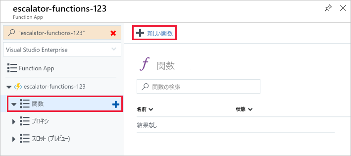
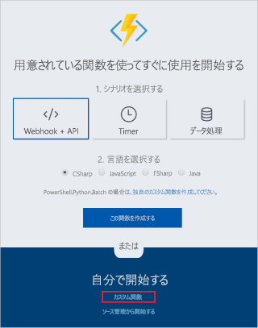
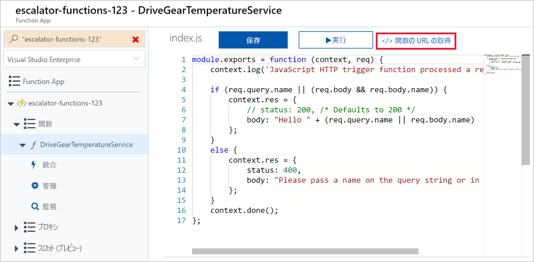
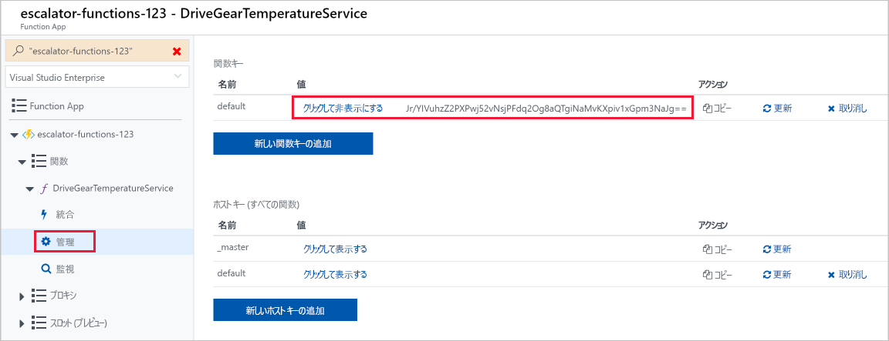
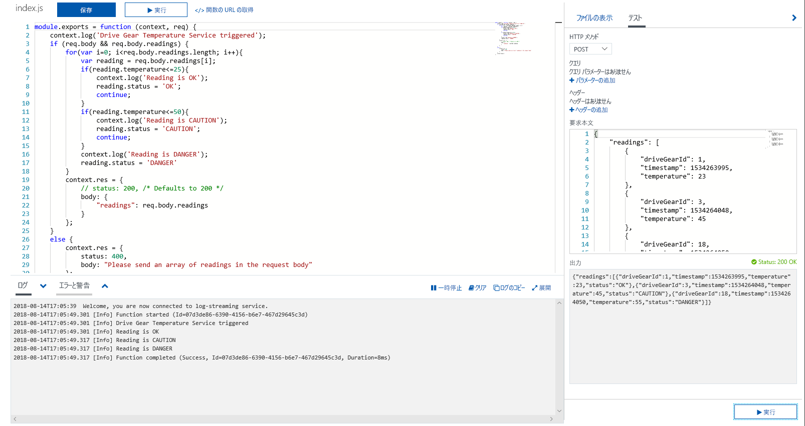
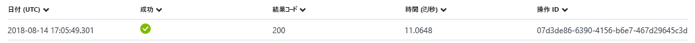

歯車駆動の例を続け、温度サービスのロジックを追加しましょう。 具体的には、HTTP 要求からデータを受信します。

## <a name="function-requirements"></a>関数の要件

まず、ロジックにいくつかの要件を定義する必要があります。

- 0 - 25 の温度には、**[OK]** のフラグを設定します。
- 26 - 50 の温度には、**[注意]** のフラグを設定します。
- 50 以上の温度には、**[危険]** のフラグを設定します。

## <a name="add-a-function-to-our-function-app"></a>関数アプリに関数を追加する

前のユニットで説明したように、Azure には関数の作成を始めるのに役立つテンプレートが用意されています。 このユニットでは、`HttpTrigger` テンプレートを使用して、温度サービスを実装します。

1. [Azure portal](https://portal.azure.com?azure-portal=true) にサインインします。

1. 最初の演習からを選択して、リソース グループを選択**すべてのリソース**で、左側のメニューとを選択する<rgn>[サンド ボックス リソース グループ名]</rgn>します。

3. グループのリソースが表示されます。 選択して、前の演習で作成した function app の名前をクリックして、**エスカレーター-関数-xxxxxxx**項目 (稲妻のアイコンの関数によっても示されます)。

  

4. 左側のメニューには、関数アプリ名と 3 項目 (*[関数]*、*[プロキシ]*、*[スロット]*) を含むサブメニューが表示されます。  最初の関数を作成するときに次のように選択します。**関数** をクリックし、**新しい関数**結果のページの上部にあるボタンをクリックします。

  

5. クイック スタート画面で、次のスクリーンショットで示されているように、**[関数を独自に作成する]** セクションの **[カスタム関数]** リンクを選択します。 クイック スタート画面が表示されない場合は、をクリックして、**クイック スタートに移動して**ページの上部にあるリンクです。

  

6. 、画面に表示されるテンプレートの一覧から選択、 **JavaScript**の実装、 **HTTP トリガー**テンプレートの次のスクリーン ショット。

7. 表示された **[新しい関数]** ダイアログの名前フィールドに「**DriveGearTemperatureService**」と入力します。 認証レベルを "関数" のままにして **[作成]** ボタンを押し、関数を作成します。

  

8. 関数の作成が完了すると、コード エディターが *index.js* コード ファイルの内容と共に表示されます。 テンプレートによって生成された既定のコードは、次のスニペット内に一覧表示されます。

```javascript
module.exports = function (context, req) {
    context.log('JavaScript HTTP trigger function processed a request.');

    if (req.query.name || (req.body && req.body.name)) {
        context.res = {
            // status: 200, /* Defaults to 200 */
            body: "Hello " + (req.query.name || req.body.name)
        };
    }
    else {
        context.res = {
            status: 400,
            body: "Please pass a name on the query string or in the request body"
        };
    }
    context.done();
};
```

この関数では、HTTP 要求のクエリ文字列から、または要求本文の一部として名前が渡されることを想定しています。 この関数では、メッセージ "**Hello, {name}**" を返し、要求で送信された名前をエコー バックすることによって応答が行われます。

ソース ビューの右側にタブが 2 つ表示されます。 **ファイルを表示**タブには、関数のコードと config ファイルが一覧表示されます。  選択**function.json**次のようになります関数の構成を表示します。

```javascript
{
    "disabled": false,
    "bindings": [
    {
        "authLevel": "function",
        "type": "httpTrigger",
        "direction": "in",
        "name": "req"
    },
    {
        "type": "http",
        "direction": "out",
        "name": "res"
    }
    ]
}
```

この構成では、HTTP 要求を受け取ったときに実行する関数を宣言します。 出力バインディングでは、HTTP 応答として送信される応答を宣言します。

## <a name="test-the-function-using-curl"></a>cURL を使用して関数をテストする

> [!TIP]
> **cURL** は、ファイルを送受信するために使用できるコマンドライン ツールです。 このツールは、Linux、macOS、および Windows 10 に含まれており、その他のほとんどのオペレーティング システムでもダウンロードできます。 cURL では、HTTP、HTTPS、FTP、FTPS、SFTP、LDAP、TELNET、SMTP、POP3 などのさまざまなプロトコルをサポートします。詳細については、次のリンクを参照してください。
>
>- <https://en.wikipedia.org/wiki/CURL>
>- <https://curl.haxx.se/docs/>

関数をテストするには、コマンド ラインで cURL を使用して、関数 URL に HTTP 要求を送信できます。 関数のエンドポイント URL を見つけるには、次のスクリーンショットに示すように、関数コードに戻り、**[関数の URL の取得]** リンクを選択します。 このリンクを一時的に保存します。

 

### <a name="securing-http-triggers"></a>HTTP トリガーをセキュリティで保護する

HTTP トリガーを使用すると、各要求で表示されるキーを要求することで、API キーを使用して不明な呼び出し元をブロックすることができます。 関数を作成すると、_認証レベル_を選択します。 既定では、"Function"は、関数に固有の API キーが必要なに設定されているが、"Admin"に設定して、キーが必要ないことを示すグローバル「マスター」キー、または"Anonymous"を使用することができますもします。 作成後に関数プロパティから認証レベルを変更することもできます。

Microsoft でこの関数を作成したときに [関数] を指定しているため、HTTP 要求を送信するときにキーを指定する必要があります。 これは、`code` という名前のクエリ文字列パラメーターとして、または `x-functions-key` という名前の HTTP ヘッダー (推奨) として送信できます。

関数とマスター キーは、関数を展開したときに **[管理]** セクションに表示されます。 既定では、これらは非表示であり、自分で表示する必要があります。

1. 選択、関数を展開し、**管理**セクション、既定の関数のキーを表示して、クリップボードにコピーします。



1. 次に、cURL コマンドをご自分の関数の URL と関数キーを使って設定します。

    - `POST` 要求を使用します。
    - `application/json` の種類の `Content-Type` ヘッダー値を追加します。
    - 以下の URL は必ず実際の URL に置き換えてください。
    - 関数キーをヘッダー値 `x-functions-key` として渡します。

    ```bash
    curl --header "Content-Type: application/json" --header "x-functions-key: <your-function-key>" --request POST --data "{\"name\": \"Azure Function\"}" https://<your-url-here>/api/DriveGearTemperatureService
    ```

関数では、テキスト `"Hello Azure Function"` と共に応答されます。

## <a name="add-business-logic-to-the-function"></a>関数にビジネス ロジックを追加する

次に、受け取った測定温度を確認し、それぞれの状態を設定する関数にロジックを追加しましょう。

この関数では、温度測定値の配列が要求されます。 次の JSON スニペットは、この関数に送信する要求本文の例です。 `reading` エントリごとに、ID、タイムスタンプ、温度があります。

```json
{
    "readings": [
        {
            "driveGearId": 1,
            "timestamp": 1534263995,
            "temperature": 23
        },
        {
            "driveGearId": 3,
            "timestamp": 1534264048,
            "temperature": 45
        },
        {
            "driveGearId": 18,
            "timestamp": 1534264050,
            "temperature": 55
        }
    ]
}
```

次に、関数にある既定のコードを、ビジネス ロジックを実装する次のコードに置き換えます。

1. **index.js** ファイルを開き、次のコードで置き換えます。

```javascript
module.exports = function (context, req) {
    context.log('Drive Gear Temperature Service triggered');
    if (req.body && req.body.readings) {
        req.body.readings.forEach(function(reading) {

            if(reading.temperature<=25) {
                reading.status = 'OK';
            } else if (reading.temperature<=50) {
                reading.status = 'CAUTION';
            } else {
                reading.status = 'DANGER'
            }
            context.log('Reading is ' + reading.status);
        });

        context.res = {
            // status: 200, /* Defaults to 200 */
            body: {
                "readings": req.body.readings
            }
        };
    }
    else {
        context.res = {
            status: 400,
            body: "Please send an array of readings in the request body"
        };
    }
    context.done();
};
```

ここで追加したロジックは簡単です。 測定値の配列を反復処理して、温度フィールドを確認します。 そのフィールドの値に応じて、**[OK]**、**[注意]**、または **[危険]** の状態を設定します。 次に、各エントリに追加された状態フィールドと共に、測定値の配列を返します。

`log` ステートメントに注目してください。 関数が実行されると、これらのステートメントによってログ ウィンドウにメッセージが追加されます。

## <a name="test-our-business-logic"></a>ビジネス ロジックをテストする

この場合、ポータル内の **[テスト]** ウィンドウを使用して、関数をテストします。

1. 右側のポップアップ メニューから **[テスト]** ウィンドウを開きます。

1. サンプルの要求を要求本文のテキスト ボックスに貼り付けます。

    ```json
    {
        "readings": [
            {
                "driveGearId": 1,
                "timestamp": 1534263995,
                "temperature": 23
            },
            {
                "driveGearId": 3,
                "timestamp": 1534264048,
                "temperature": 45
            },
            {
                "driveGearId": 18,
                "timestamp": 1534264050,
                "temperature": 55
            }
        ]
    }
    ```

1. **[実行]** を選択して、出力ウィンドウに応答を表示します。 ログ メッセージを表示するには、ページの下部にあるポップアップで **[ログ]** タブを開きます。 次のスクリーンショットでは、出力ウィンドウに応答の例と **[ログ]** ウィンドウにメッセージが示されています。



出力ウィンドウで、状態フィールドが各測定値に正しく追加されていることを確認できます。

**[監視]** ダッシュボードに移動すると、Application Insights に要求が記録されていることを確認することができます。


