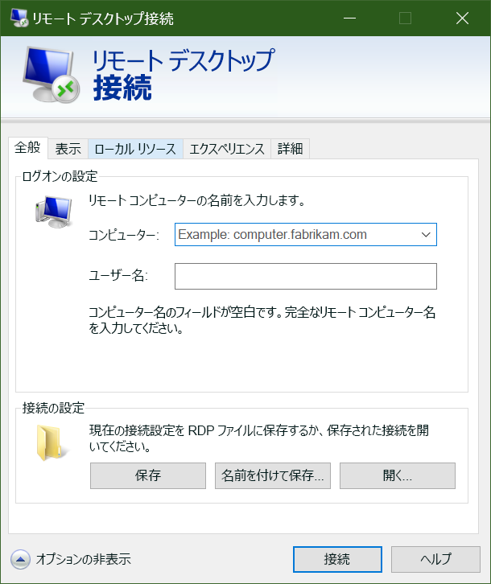

これで、Azure 内に Windows VM を用意できました。次に、ご自分のアプリケーションとデータをそれらの VM に配置し、トラフィックのビデオを処理します。 

しかし、Azure に対してサイト間 VPN を設定していない場合、ご利用の Azure VM にはご自分のローカル ネットワークからアクセスできません。 Azure を使い始めたばかりの場合は、サイト間 VPN を設定している可能性は低いです。 どのようにすればファイルを Azure VM に転送できるでしょうか?  Azure のリモート デスクトップ接続の機能を使用して、ご自分の新しい Azure VM でローカル ドライブを共有するのが簡単な方法です。

新しい Windows 仮想マシンがあり、そこにカスタム ソフトウェアをインストールする必要があります。 これを行うには、いくつかの方法があります。

- リモート デスクトップ プロトコル (RDP)
- カスタム スクリプト
- カスタム VM イメージ (プレインストールされているソフトウェアを含む)

Windows VM における最も簡単な手法であるリモート デスクトップを見てみましょう。

## リモート デスクトップ プロトコルとは

リモート デスクトップ (RDP) は、Windows ベース コンピューターの UI へのリモート接続を提供します。 RDP を使用すると、離れた場所にある物理または仮想 Windows コンピューターにサインインし、まるでコンソールで操作しているかのようにそのコンピューターを制御できます。 RDP 接続を利用すると、電源とハードウェアに関連する一部の機能を除き、物理コンピューターのコンソールからできる作業のほとんどを実行できます。

RDP 接続には RDP クライアントが必要です。 Microsoft では、次のオペレーティング システム用の RDP クライアントを提供しています。

- Windows (組み込み)
- MacOS
- iOS
- Android

次のスクリーンショットは、Windows 10 でのリモート デスクトップ プロトコル クライアントを示しています。

また、オープンソースの Linux クライアントもあり、たとえば、Remmina を利用すれば、Ubuntu ディストリビューションから Windows PC に接続できます。また、オープンソースの Linux クライアントもあり、たとえば、Remmina を利用すれば、Ubuntu ディストリビューションから Windows PC に接続できます。

## Azure VM への接続

少し前に説明したように、Azure VM は仮想ネットワーク経由で通信します。 また、任意のパブリック IP アドレスを VM に割り当てることもできます。 パブリック IP を使用すると、インターネット経由で VM と通信できます。 または、オンプレミスのネットワークを Azure に接続する仮想プライベート ネットワーク (VPN) を設定できます。そうすれば、パブリック IP を公開することなく、安全に VM に接続できます。 そのオプションを調べてみたい場合は、別のモジュールでこのアプローチが取り上げられており、詳細なドキュメントもあります。

Azure でのパブリック IP アドレスに関して注意すべき 1 つの点は、多くの場合、それが動的に割り当てられることです。 つまり、時間が経つと IP アドレスが変わる可能性があります。VM の場合、これは VM の再起動時に行われます。 名前ではなく IP アドレスに直接接続し、IP アドレスが変化しないようにする必要がある場合は、静的アドレスを割り当てることができます。

### RDP を使用して Azure の VM に接続する方法

RDP を使用した Azure の VM への接続はシンプルなプロセスです。 Azure portal で、お使いの VM のプロパティに移動し、一番上にある **[接続]** をクリックします。 これにより、その VM に割り当てられている IP アドレスが表示され、Windows が RDP クライアントで開かれる構成済みの **.rdp** ファイルをダウンロードするオプションが提供されます。 RDP ファイルの VM のパブリック IP アドレス経由で接続するように選択できます。 あるいは、VPN または ExpressRoute 経由で接続する場合、内部 IP アドレスを選択できます。 また、接続にポート番号も選択することもできます。

VM に静的パブリック IP アドレスを使用している場合、**.rdp** ファイルをお使いのデスクトップに保存できます。 動的 IP アドレスを使用している場合、VM が実行されている間のみ、**.rdp** ファイルは有効となります。 VM を停止し、再起動する場合、別の **.rdp** ファイルをダウンロードする必要があります。

> [!TIP]
> Windows RDP クライアントに VM のパブリック IP アドレスを入力し、**[接続]** をクリックすることもできます。

接続すると、通常、2 つの警告が表示されます。 次のとおりです。

-**発行元警告** - **.rdp** ファイルに公的な署名がないことが警告の原因です。
- **証明書警告** - コンピューター証明書が信頼されていないことが警告の原因です。

テスト環境では、これらの警告を無視できます。 運用環境では、**.rdp** ファイルに **RDPSIGN.EXE** を利用して署名し、コンピューター証明書をクライアントの**信頼されたルート証明機関**ストアに配置するということが可能です。

RDP を使用して VM に接続してみましょう。