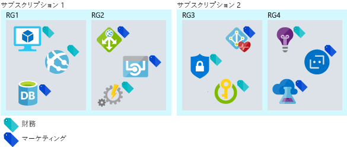

ここでは、皆さんはソリューション アーキテクトです。 所属組織である Lamna Healthcare では、ワークロードがクラウドに移行されました。 最近、これらのリソースやワークフローに対する課金が Lamna で予想した以上に増加しています。 この増加が自然な効率的成長を示すものかどうか、あるいは組織のクラウド リソースをより効率的に利用することでコストを削減できるかどうかを判断するように依頼されました。

## クラウドで経費を変更する方法

パブリック クラウドとオンプレミス インフラストラクチャとの違いの 1 つは、使用するサービスに対する支払い方法です。 オンプレミス データセンターでは、ハードウェアの調達時間が長く、ハードウェアのサイズは最大容量に対して設定されており、電力やスペースなどの一部のコストはリソースを消費する部署からは確認できません。 物理インフラストラクチャの購入は、長期的な資産への投資と関連付けられており、迅速なリソースの使用の妨げとなります。

クラウドに移行することで、使用した分だけ支払うというコスト モデルが導入されます。 資産への投資に関連付ける必要はなくなり、リソース要件が変更された場合、リソースを追加、移行、あるいは削除することで対応できます。 ワークロードはサービス間やサービス内で異なり、需要が予測不能となる可能性があり、成長パターンは時間の経過と共に変わります。 クラウドで使用した分だけ支払うため、コスト構造をリソースの変更と同期して移行することができます。

クラウド インフラストラクチャは、リソース使用量が変動するシナリオを処理できます。 非常に長い期間、非アクティブな状態にあるリソースについては、使用されておらず、コストがまったく発生していない場合、シャットダウンすることができます。 正常なサービスの成長に伴い、リソースが増加する可能性があります。次の調達サイクルを待つ必要はありません。 さらにリソースの動的な追加や削除を行うことで、予測可能および予測不可能な需要の急激な変化に対応できます。 次の図では、オンプレミスのインフラストラクチャがこのような変動するシナリオのすべてを処理できない理由を示します。

効率的なアーキテクチャでは、プロビジョニングされたリソースとこれらのリソースに対する需要が一致します。 仮想マシンの多くの時間の使用率が 10% 未満の場合、コンピューティングとコストの両方においてリソースの無駄となります。 逆に、90% の使用率で実行されている仮想マシンでは利用可能なリソースの大部分が使用され、経費は効率的に使われています。 使用率が 100% になるまでシステムを実行することは、パフォーマンスの問題を発生させる危険性があります。 効率を最大化した場合にシステムのパフォーマンスに悪影響を与えないようにすることが重要です。 需要が一定になることはほとんどないため、効率性を確保するためにできるだけ需要に合わせてリソースを調整することが重要です。

## クラウド支出を追跡する

賢明な判断を行うには、データが必要です。 コストのかかる場所を調べることで、その場所と使用率の比較を開始し、環境内で浪費している可能性がある場所を見つけることができます。

いつでも課金データをエクスポートすることができます。 課金データを使用することで、コストのかかる場所とリソース全体にコストがどのように割り当てられているかを追跡できます。 課題は、課金データにコストは表示されますが、使用率は表示されないことです。 大規模な VM に対して料金を支払っていることを示すデータは得られますが、実際にはどれくらい使用しているのでしょうか?

Azure Cost Management では、コストのかかる場所と使用率の低いリソースを把握できます。 Azure Cost Management では、総支出、サービスごとのコスト、経時的なコストが追跡されます。 リソースの種類とインスタンスの詳細を確認することができます。 また、リソースにカテゴリでタグ付けすることで、組織やコスト センターごとにコストの詳細を確認できます。

Azure Advisor にはコスト コンポーネントもあります。 Azure Advisor では、従量課金制インスタンスよりもコスト効率が高い場合は予約インスタンスを購入し、VM のサイズを変更することが推奨されます。 また、未使用の ExpressRoute 回線とアイドル状態の仮想ネットワーク ゲートウェイが識別されます。 Advisor によって、パフォーマンス、高可用性、セキュリティの領域において追加の推奨事項が示されます。

時間をかけて、支出を確認し、コストのかかる場所を評価することが重要です。 非効率な領域を識別し、できるだけ効率的に運用するようにします。

## 最適化のために整理する

一部の組織をリソースに配置することは、一部のコストがかかる場所を追跡するのに役立ちます。 リソースをまとめて、関係を確立し、コストが関連する場所を把握する方法はいくつかあります。 課金の観点から、次のようにしてリソースを簡単にグループ化することができます。

- リソースをさまざまなサブスクリプションに割り当てる。
- リソースをさまざまなリソース グループに割り当てる。
- タグをリソースに適用する。

サブスクリプションとリソース グループを使用してリソースを整理することは、論理的にリソースをグループ化する簡単な方法であり、課金データを調べる際に活用できます。 リソースの関係がサブスクリプションとリソース グループの境界にまたがる場合は、タグが役立ちます。 タグはキーと値のペアであり、任意のリソースに追加でき、課金データで公開され、部署やコスト センターをリソースに関連付けることができます。 タグを使用することで、コストについてより適切にレポートできるだけでなく、組織内の各部署に独自のコストに対する責任を与えることができます。 次の図では、異なるリソース グループ内のリソースに、さらには異なるサブスクリプション内のリソースにでも、同じタグを適用できる方法を示します。

一部の組織をリソースに追加することは非常に役立ち、コストのかかる場所を把握するのにとても役立ちます。 ここで、コストを最適化するための方法をいくつか見てましょう。

## IaaS コストの最適化

仮想マシンを使用する組織では、多くの場合、仮想マシンに関連するコストが支出の最も大きな部分となります。 一般に、コンピューティング コストが最も大きな部分であり、その次に大きいのがストレージです。 時間をかけてリソースを使用した分だけ支払う方法を最適化することは、月々の請求額に大きく影響する可能性があります。

コンピューティング コストとストレージ コストを削減するためのベスト プラクティスを見てみましょう。

### コンピューティング

仮想マシンのコスト削減を実現するために使用できるさまざまなオプションがあります。

- より小さい仮想マシン インスタンス サイズを選択します。
- 仮想マシンが実行される時間数を減らします。
- コンピューティング コストに対して割引を利用します。

#### 仮想マシンのサイズを適切に設定する

仮想マシンのサイズを適切に設定することは、仮想マシンのサイズを VM に求められるリソース需要と一致させるプロセスです。 25% のアイドル率で VM が実行されている場合、その VM のサイズを減らすと、コストはすぐに削減されます。 インスタンス ファミリ内では仮想マシンのコストは線形であり、より大きい次のサイズではそれぞれコストが倍になります。 逆に、1 つのインスタンス サイズごとに VM を減らすと、コストが半分に削減されます。 次の図では、同じシリーズ内で 1 つサイズを下げたことで 50% の節約を達成しています。

Azure Advisor によって、使用率の低い仮想マシンが識別されます。 Advisor では、仮想マシンの使用状況が 14 日間にわたって監視され、使用率が低い仮想マシンが識別されます。 CPU 使用率が 5% 以下で、ネットワーク使用量が 7 MB 以下である日が 4 日以上ある仮想マシンは、使用率が低い仮想マシンと見なされます。

#### 仮想マシン用のシャットダウン スケジュールを実装する

VM のワークロードが使用されるのは一定期間のみであるにもかかわらず、継続的に実行している場合、コストの無駄になります。 このような VM は、使用していないときにシャットダウンし、スケジュールに従ってバックアップを開始することができます。そうすれば、VM の割り当てが解除されている間、コンピューティング コストを節約できます。 これは特に、多くの場合、業務時間中にのみ開発が行われる開発環境に適用できます。 業務時間外にこれらのシステムの割り当てを解除し、コンピューティング コストが発生しないようにすることができます。

Azure Automation を使用して、VM の実行期間をワークロードで必要な時間のみに制限します。

仮想マシンで自動シャットダウン機能を使用して、1 回限りの自動シャットダウンのスケジュールを設定することもできます。

#### コンピューティング コストの割引を適用する

Azure ハイブリッド特典では、Windows Server と SQL Server の両方にかかるコストをさらに最適化することができます。その場合、これらの VM のコンピューティング コストに対する割引として使用されるソフトウェア アシュアランス付きのオンプレミスの Windows Server または SQL Server のライセンスを利用できるようにします。

一部の仮想マシンは常に稼働している必要があります。 運用ワークロード用の Web アプリケーション サーバー ファーム、または仮想ネットワーク上のさまざまなサーバーをサポートするドメイン コントローラーがある場合があります。 これらの仮想マシンが今後 1 年あるいはおそらくそれ以上実行されることが確実にわかっている場合、予約インスタンスを購入してコストをさらに節約できます。 Azure Reserved Virtual Machine Instances は 1 年間または 3 年間のコンピューティング容量を指定して購入することができ、従量課金制のコンピューティング リソースに比べて割安です。 Azure Reserved Virtual Machine Instances により、仮想マシンのコストを大幅に削減できます。割引率は、従量課金制の料金に対し、1 年間または 3 年間の前払い契約で最大 72% となります。 次の図では、オンプレミスのライセンスと Azure ハイブリッド特典を組み合わせたとき、およびオンプレミスのライセンスと Azure RI および Azure ハイブリッド特典の両方を組み合わせたときに、達成できる節約を示します。

### 仮想マシン ディスク ストレージのコストの最適化

信頼性とパフォーマンスの高いディスクを必要としないワークロードでは、低コストの標準的なストレージを使用できます。 運用ワークロードに関して完全に一致する必要がない開発およびテスト環境では、標準的なストレージを使用することを選択できます。

環境内に孤立ディスクが残らないようにしてください。 VM に関連付けられていないディスクでは引き続きストレージ コストが発生します。 VM は削除したものの、ディスクは削除していない場合、孤立ディスクでストレージ コストを削減できる可能性があります。

孤立ディスクと同様に、孤立スナップショットが残存している場合は、ある程度時間をかけてクリーンアップしてください。 これらの価格はディスク自体より低くなりますが、不要なリソースのコストをなくすことをお勧めします。

## PaaS コストの最適化

PaaS サービスは通常、IaaS サービス経由でコストに合わせて最適化されますが、無駄を特定し、コストを最小限に抑えるために最適化する機会があります。 Azure SQL Database と Azure BLOB ストレージのコストを削減する方法を見ていきましょう。

### Azure SQL Database コストの最適化

Azure SQL Database を作成するときに、Azure SQL Server を選択し、パフォーマンス レベルを決定する必要があります。 各レベルでは、データベース トランザクション ユニット (DTU) または仮想コア (vCore) におけるパフォーマンス レベルが提供されます。 データベースの負荷が一定の場合、必要なパフォーマンスに対して適切にサイズ設定されたレベルを選択することで、簡単に最適化できます。 しかし、データベースのアクティビティが予期せず急増した場合はどうでしょうか?  エラスティック プールにより、予期できないワークロードにかかるコストを削減できます。

SQL Database のエラスティック プールは、予期できないいくつかの使用ニーズを持つ複数のデータベースを管理し、スケーリングするための、シンプルでコスト効率の高いソリューションです。 エラスティック プール内のデータベースは単一の Azure SQL Database サーバー上にあり、設定された数のリソースが設定価格で共有されます。 プールは、数多くのデータベースが特定の使用パターンで使用されている場合に適しています。 あるデータベースは、使用が急増することはあまりなく、平均使用量が低いパターンの特徴を持っています。
プールに追加できるデータベースが多ければ多いほど、節約量も多くなります。 次の図では、3 種類 (Basic、Standard、Premium) のエラスティック データベース プールの機能を示します。  Basic は DB ごとに最大 5 eDTU まで、Standard は DB ごとに最大 100 eDTU まで、Premium は DB ごとに最大 1000 eDTU まで、自動的にスケールアップします。

エラスティック プールは複数のデータベース間でコストを分散する優れた方法であり、Azure SQL Database のコストの削減に大きく影響する場合があります。

### BLOB ストレージ コストの最適化

BLOB ストレージはデータを格納するためのコスト効率に優れた方法ですが、データ量が増えるにつれて、データの格納方法を最適化することによる利点が得られます。

Lamna Healthcare に話を戻します。 BLOB ストレージに画像を格納する医用画像アプリケーションがあります。 画像の数量とサイズにより、ストレージでのアプリケーションにかかるコストは著しいものになります。 患者の画像が撮影されたとき、最初の週は、その画像が何度か表示される可能性が高いことから、画像検索に求められるパフォーマンスは高くなります。 逆に、2 年前に撮影された画像へのアクセス頻度は通常低く、検索にさほど高いパフォーマンスは求められません。 画像が古くなるにつれ、必要なパフォーマンスが低くなった場合は、ストレージ層を使用して画像検索のコストを最適化することができます。

Azure Storage では、BLOB オブジェクト ストレージ用に 3 つのストレージ層が提供されています。 Azure ホット ストレージ層は、頻繁にアクセスされるデータを格納するために最適化されています。 Azure クール ストレージ層は、アクセスされる頻度は低いものの、30 日以上保管されるデータを格納するために最適化されています。 Azure アーカイブ ストレージ層は、ほとんどアクセスされず、180 日以上保管され、待ち時間の要件が柔軟であるデータを格納するために最適化されています。

- **ホット アクセス層** - ストレージ コストは最も高くなりますが、アクセス コストは最も低くなります。
- **クール アクセス層**- ストレージに比べてストレージ コストが低くなり、アクセス コストが高くなります。 この層は、30 日以上クール層に留まるデータを対象としています。
- **アーカイブ アクセス層** - ストレージ コストが最も低く、ホット ストレージとクール ストレージに比べてデータ取得コストが最も高くなります。 この層は、数時間の取得待ち時間が許容され、180 日以上アーカイブ層に留まるデータを対象としています。

Lamna Healthcare では、1 か月間ホット アクセス層で新しい画像を保持するのが妥当であるため、最新画像の表示は可能な限り高速に行われます。 1 年が経過した画像は、検索されなくなる可能性があるため、アーカイブ層に移動することができます。 これで、これらの画像の格納に関連するコストが削減されます。

## Lamna Healthcare でのコストの最適化

Lamna Healthcare では、コストの削減が順調に進んでいます。 コストを月単位で確認するようにし、各部署から Azure Cost Management にアクセスできるようにしたため、月を通してコストを確認することができます。 予約インスタンスを使用できる多くの場所を特定し、この割引を活用するためにいくつか購入しました。 業務時間外に開発環境を停止するための自動プロセスを実装しました。これにより、リソースが使用されていない時間の追加コストを節約できます。 

画像ストレージ用に BLOB ストレージを最適化すると同時に、特に過去数か月にわたり課金を減らすように管理しました。

## まとめ

クラウド インフラストラクチャのコストを最適化するには、支出を追跡し、リソース使用率がワークロードの需要と一致していることを確認する必要があります。 リソースに適した品質とパフォーマンス層を使用することで、クラウド コストをさらに最適化することができます。