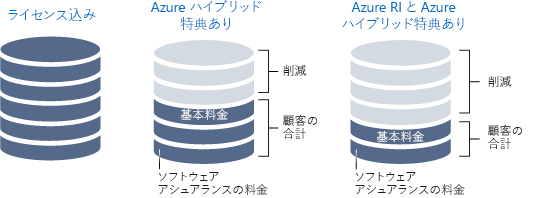

ここでは、皆さんはソリューション アーキテクトです。You are a solution architect. 所属組織である Lamna Healthcare では、ワークロードがクラウドに移行されました。Your organization, Lamna Healthcare has moved its workloads to the cloud. 最近、これらのリソースやワークフローに対する課金が Lamna で予想した以上に増加しています。Recently, the bill for these resources and workflows has increased more than Lamna had anticipated. この増加が自然な効率的成長を示すものかどうか、あるいは組織のクラウド リソースをより効率的に利用することでコストを削減できるかどうかを判断するように依頼されました。You have been asked to determine whether the increase is natural, efficient growth, or whether the cost can be reduced by being more efficient with the organization's cloud resources.

#### クラウド支出の効率を最大化するMaximize efficiency of cloud spend

> [!VIDEO https://www.microsoft.com/videoplayer/embed/RWjTgy]

## クラウドで経費を変更する方法How the cloud changes your expenses

パブリック クラウドとオンプレミス インフラストラクチャとの違いの 1 つは、使用するサービスに対する支払い方法です。One of the differences between the public cloud and on-premises infrastructure is how you pay for the services you use. オンプレミス データセンターでは、ハードウェアの調達時間が長く、ハードウェアのサイズは最大容量に対して設定されており、電力やスペースなどの一部のコストはリソースを消費する部署からは確認できません。In an on-premises datacenter, hardware procurement time is long, hardware is sized for maximum capacity, and some of the costs, such as power and space, can be hidden from the business unit consuming the resources. 物理インフラストラクチャの購入は、長期的な資産への投資と関連付けられており、迅速なリソースの使用の妨げとなります。Purchasing physical infrastructure ties up investments in long-term assets, hindering your ability to be agile with your resources.

クラウドに移行することで、使用した分だけ支払うというコスト モデルが導入されます。Shifting to the cloud introduces a pay-for-what-you-use cost model. 資産への投資に関連付ける必要はなくなり、リソース要件が変更された場合、リソースを追加、移行、あるいは削除することで対応できます。You no longer need to tie up investments in assets, and if your resource requirements change, you can respond by adding, moving, or removing resources. ワークロードはサービス間やサービス内で異なり、需要が予測不能となる可能性があり、成長パターンは時間の経過と共に変わります。Workloads vary between and within services, demand can be unpredictable, and your growth patterns shift over time. クラウドで使用した分だけ支払うため、コスト構造をリソースの変更と同期して移行することができます。Since you only pay for what you use in the cloud, your cost structure can move in sync with the changes in resources.

クラウド インフラストラクチャは、リソース使用量が変動するシナリオを処理できます。Cloud infrastructure can handle fluctuating resource usage scenarios. 非常に長い期間、非アクティブな状態にあるリソースについては、使用されておらず、コストがまったく発生していない場合、シャットダウンすることができます。Resources that have significant periods of inactivity can be shut down when not in use and not incur any cost at all. 正常なサービスの成長に伴い、リソースが増加する可能性があります。次の調達サイクルを待つ必要はありません。Resources can grow with a successful service as it grows, rather than having to wait for the next procurement cycle. さらにリソースの動的な追加や削除を行うことで、予測可能および予測不可能な需要の急激な変化に対応できます。More resources can be dynamically added and removed to respond to predictable and unpredictable bursts of demand. 次の図では、オンプレミスのインフラストラクチャがこのような変動するシナリオのすべてを処理できない理由を示します。The following illustration shows why the on-premises infrastructure cannot handle all these fluctuating scenarios.

効率的なアーキテクチャでは、プロビジョニングされたリソースとこれらのリソースに対する需要が一致します。In an efficient architecture, provisioned resources match the demand for those resources. 仮想マシンの多くの時間の使用率が 10% 未満の場合、コンピューティングとコストの両方においてリソースの無駄となります。If a virtual machine is less than 10% utilized the majority of the time, you are wasting resources, both in compute and cost. 逆に、90% の使用率で実行されている仮想マシンでは利用可能なリソースの大部分が使用され、経費は効率的に使われています。Conversely, a virtual machine that is running 90% utilized is using the majority of the available resources and is an efficient use of money. 使用率が 100% になるまでシステムを実行することは、パフォーマンスの問題を発生させる危険性があります。Running a system to 100% utilization runs the risk of introducing performance issues. 効率を最大化した場合にシステムのパフォーマンスに悪影響を与えないようにすることが重要です。It is important to ensure that maximizing efficiency doesn't negatively impact the performance of your system. 需要が一定になることはほとんどないため、効率性を確保するためにできるだけ需要に合わせてリソースを調整することが重要です。Demand is rarely constant, so adjusting resources when possible to match demand is important to ensure efficiency.

## クラウド支出を追跡するTrack your cloud spend

賢明な判断を行うには、データが必要です。In order to make intelligent decisions, you need data. コストのかかる場所を調べることで、その場所と使用率の比較を開始し、環境内で浪費している可能性がある場所を見つけることができます。By looking at where your money is going, you can start comparing that to utilization to uncover where you may have waste within your environment.

いつでも課金データをエクスポートすることができます。An export of your billing data is available at any time. 課金データを使用することで、コストのかかる場所とリソース全体にコストがどのように割り当てられているかを追跡できます。Using your billing data, you can track where your costs are going and how they're allocated across your resources. 課題は、課金データにコストは表示されますが、使用率は表示されないことです。The challenge is that the billing data shows cost but not utilization. 大規模な VM に対して料金を支払っていることを示すデータは得られますが、実際にはどれくらい使用しているのでしょうか?You'll have data that indicates you're paying for that large VM, but how much are you actually using it?

Azure Cost Management では、コストのかかる場所と使用率の低いリソースを把握できます。Azure Cost Management gives you insights where your spend is going, as well as underutilized resources. Azure Cost Management では、総支出、サービスごとのコスト、経時的なコストが追跡されます。Azure Cost Management tracks your total spend, cost by service, and cost over time. リソースの種類とインスタンスの詳細を確認することができます。You can drill down into resource types and instances. また、リソースにカテゴリでタグ付けすることで、組織やコスト センターごとにコストの詳細を確認できます。You can also break down your costs by organization or cost center by tagging resources with those categories.

Azure Advisor にはコスト コンポーネントもあります。Azure Advisor also has a cost component. Azure Advisor では、従量課金制インスタンスよりもコスト効率が高い場合は予約インスタンスを購入し、VM のサイズを変更することが推奨されます。It recommends VM resizing, buying reserved instances when more cost effective than pay-as-you-go instances. また、未使用の ExpressRoute 回線とアイドル状態の仮想ネットワーク ゲートウェイが識別されます。It identifies unused ExpressRoute circuits and idle virtual network gateways. Advisor によって、パフォーマンス、高可用性、セキュリティの領域において追加の推奨事項が示されます。Advisor makes additional recommendations in the areas of performance, high availability, and security.

時間をかけて、支出を確認し、コストのかかる場所を評価することが重要です。The important part is to take time to review your spend and evaluate where your money is going. 非効率な領域を識別し、できるだけ効率的に運用するようにします。Identify areas of inefficiency to ensure you're operating as efficiently as possible.

## 最適化のために整理するOrganize to optimize

一部の組織をリソースに配置することは、一部のコストがかかる場所を追跡するのに役立ちます。Putting some organization to your resources can help track where some of your costs are going. リソースをまとめて、関係を確立し、コストが関連する場所を把握する方法はいくつかあります。There are ways to group resources together, establishing a relationship so you know where your costs are related. 課金の観点から、次のようにしてリソースを簡単にグループ化することができます。From a billing perspective, resources can be easily grouped by:

- リソースをさまざまなサブスクリプションに割り当てる。Assigning resources to different subscriptions.
- リソースをさまざまなリソース グループに割り当てる。Assigning resources to different resource groups.
- タグをリソースに適用する。Applying tags to resources.

サブスクリプションとリソース グループを使用してリソースを整理することは、論理的にリソースをグループ化する簡単な方法であり、課金データを調べる際に活用できます。Using subscriptions and resource groups to organize resources is an easy way to logically group resources and can be leveraged when going through billing data. リソースの関係がサブスクリプションとリソース グループの境界にまたがる場合は、タグが役立ちます。Tags come into play when resource relationships span the boundaries of subscriptions and resource groups. タグはキーと値のペアであり、任意のリソースに追加でき、課金データで公開され、部署やコスト センターをリソースに関連付けることができます。Tags are key/value pairs that can be added to any resource, and are exposed in billing data, allowing you to associate a department or cost center with your resource. タグを使用することで、コストについてより適切にレポートできるだけでなく、組織内の各部署に独自のコストに対する責任を与えることができます。Tags improve your ability to report on cost, as well as giving each department in your organization accountability for their own costs. 次の図では、異なるリソース グループ内のリソースに、さらには異なるサブスクリプション内のリソースにでも、同じタグを適用できる方法を示します。The following illustration shows how you can apply the same tag to resources in different resource groups and even in different subscriptions.

一部の組織をリソースに追加することは非常に役立ち、コストのかかる場所を把握するのにとても役立ちます。Adding some organization to your resources can go a long way and can really aid in your ability to understand where your costs are going. ここで、コストを最適化するための方法をいくつか見てましょう。Now let's take a look at some ways to optimize costs.

## IaaS コストの最適化Optimizing IaaS costs

仮想マシンを使用する組織では、多くの場合、仮想マシンに関連するコストが支出の最も大きな部分となります。For organizations using virtual machines, the cost associated with virtual machines is often the biggest portion of spend. 一般に、コンピューティング コストが最も大きな部分であり、その次に大きいのがストレージです。The compute costs are typically the biggest piece, followed by storage. 時間をかけてリソースを使用した分だけ支払う方法を最適化することは、月々の請求額に大きく影響する可能性があります。Taking time to optimize pay-for-what-you-use resources can have a large impact on the size of your monthly bill.

コンピューティング コストとストレージ コストを削減するためのベスト プラクティスを見てみましょう。Let's take a look at best practices to reduce your compute and storage costs.

### コンピューティングCompute

仮想マシンのコスト削減を実現するために使用できるさまざまなオプションがあります。There are different options available to achieve cost savings for virtual machines.

- より小さい仮想マシン インスタンス サイズを選択します。Choose a smaller virtual machine instance size.
- 仮想マシンが実行される時間数を減らします。Reduce the number of hours a virtual machine runs.
- コンピューティング コストに対して割引を利用します。Use discounts for the compute costs.

#### 仮想マシンのサイズを適切に設定するRight size virtual machines

仮想マシンのサイズを適切に設定することは、仮想マシンのサイズを VM に求められるリソース需要と一致させるプロセスです。Right sizing a virtual machine is the process of matching the virtual machine size with the resource demand required of the VM. 25% のアイドル率で VM が実行されている場合、その VM のサイズを減らすと、コストはすぐに削減されます。If a VM is running 25% idle, reducing the size of the VM will immediately reduce your cost. インスタンス ファミリ内では仮想マシンのコストは線形であり、より大きい次のサイズではそれぞれコストが倍になります。Virtual machine costs are linear within an instance family; each next size larger will double your cost. 逆に、1 つのインスタンス サイズごとに VM を減らすと、コストが半分に削減されます。Conversely, reducing a VM by a single instance size will reduce your cost in half. 次の図では、同じシリーズ内で 1 つサイズを下げたことで 50% の節約を達成しています。The following illustration shows a 50% savings achieved by moving one size down within the same series.

Azure Advisor によって、使用率の低い仮想マシンが識別されます。Azure Advisor identifies which virtual machines are underutilized. Advisor では、仮想マシンの使用状況が 14 日間にわたって監視され、使用率が低い仮想マシンが識別されます。Advisor monitors your virtual machine usage for 14 days and then identifies underutilized virtual machines. CPU 使用率が 5% 以下で、ネットワーク使用量が 7 MB 以下である日が 4 日以上ある仮想マシンは、使用率が低い仮想マシンと見なされます。Virtual machines whose CPU utilization is 5 percent or less and network usage is 7 MB or less for four or more days are considered underutilized virtual machines.

#### 仮想マシン用のシャットダウン スケジュールを実装するImplement shutdown schedules for virtual machines

VM のワークロードが使用されるのは一定期間のみであるにもかかわらず、継続的に実行している場合、コストの無駄になります。If you have VM workloads that are only used periodically, but are running continuously, you're wasting money. このような VM を使用していないときにシャットダウンすることで、VM の割り当てが解除されている間のコンピューティング コストを節約できます。These VMs can be shut down when not in use saving you compute costs while the VM is deallocated. たとえば、開発は通常、業務時間内しか行われないため、開発環境は適切な候補です。For example, a development environment is a good candidate because development generally happens only during business hours.

VM はいくつかの方法で割り当てを解除することができます。You have several options to deallocate a VM. Azure Automation を使用して、ワークロードで必要な時間のみに VM を実行することができます。You can use Azure Automation to run your VMs only during those times that your workloads require. 仮想マシンで自動シャットダウン機能を使用して、1 回限りの自動シャットダウンのスケジュールを設定することができます。You can use the auto-shutdown feature on a virtual machine to schedule a one-off automated shutdown. 最後に、Azure portal で手動で VM を停止できます。Finally, you can stop a VM manually in the Azure portal. VM を停止する場合は常に Azure のコントロールを使用する必要があります。VM 内部で OS をシャットダウンしても、その Azure リソースの割り当ては解除されないため、引き続きコストが発生します。You should always use the Azure controls to stop your VMs; shutting down the OS from inside a VM does not deallocate its Azure resource so you will continue to accrue costs.

#### コンピューティング コストの割引を適用するApply compute cost discounts

Azure ハイブリッド特典では、Windows Server と SQL Server の両方にかかるコストをさらに最適化することができます。その場合、これらの VM のコンピューティング コストに対する割引として使用されるソフトウェア アシュアランス付きのオンプレミスの Windows Server または SQL Server のライセンスを利用できるようにします。The Azure Hybrid Benefit allows you to further optimize your costs for both Windows Server and SQL Server by allowing you to use your on-premises Windows Server or SQL Server licenses with Software Assurance to be used as a discount toward the compute cost of these VMs, eliminating the costs for Windows and SQL Server on enabled instances.

一部の仮想マシンは常に稼働している必要があります。Some virtual machines need to be up and running all the time. 運用ワークロード用の Web アプリケーション サーバー ファーム、または仮想ネットワーク上のさまざまなサーバーをサポートするドメイン コントローラーがある場合があります。Maybe you have a web application server farm for a production workload or maybe a domain controller supporting various servers on a virtual network. これらの仮想マシンが今後 1 年あるいはおそらくそれ以上実行されることが確実にわかっている場合、予約インスタンスを購入してコストをさらに節約できます。If you know with certainty that these virtual machines will run over the coming year or maybe longer, you can get further cost savings by purchasing a reserved instance. Azure Reserved Virtual Machine Instances は 1 年間または 3 年間のコンピューティング容量を指定して購入することができ、従量課金制のコンピューティング リソースに比べて割安です。Azure Reserved Virtual Machine Instances can be purchased for one year or three years of compute capacity, at a discount compared to pay-as-you-go compute resources. Azure Reserved Virtual Machine Instances により、仮想マシンのコストを大幅に削減できます。割引率は、従量課金制の料金に対し、1 年間または 3 年間の前払い契約で最大 72% となります。Azure Reserved Virtual Machine Instances can significantly reduce your virtual machine costs, up to 72 percent on pay-as-you-go prices, with one-year or three-year upfront commitment. 次の図では、オンプレミスのライセンスと Azure ハイブリッド特典を組み合わせたとき、およびオンプレミスのライセンスと Azure RI および Azure ハイブリッド特典の両方を組み合わせたときに、達成できる節約を示します。The following illustration shows savings achieved when you combine your on-premises license with the Azure Hybrid Benefit and when you combine your on-premises license with both Azure RI and the Azure Hybrid Benefit.

### 仮想マシン ディスク ストレージのコストの最適化Virtual machine disk storage cost optimization

信頼性とパフォーマンスの高いディスクを必要としないワークロードでは、低コストの標準的なストレージを使用できます。For workloads that do not require high reliability and performance disks, you can use the reduced-cost standard storage. 運用ワークロードに関して完全に一致する必要がない開発およびテスト環境では、標準的なストレージを使用することを選択できます。You might choose to use standard storage for development and test environments that are not required to be an identical match for a production workload.

環境内に孤立ディスクが残らないようにしてください。Ensure you don't have any orphaned disks remaining in your environment. VM に関連付けられていないディスクでは引き続きストレージ コストが発生します。Disks that aren't associated with a VM still incur storage costs. VM は削除したものの、ディスクは削除していない場合、孤立ディスクでストレージ コストを削減できる可能性があります。If you've removed a VM but not the disks, the orphaned disks may be a place to reduce your storage cost.

孤立ディスクと同様に、孤立スナップショットが残存している場合は、ある程度時間をかけてクリーンアップしてください。Similar to orphaned disks, if you have any orphaned snapshots lingering around, take some time to clean them up. これらの価格はディスク自体より低くなりますが、不要なリソースのコストをなくすことをお勧めします。Pricing for these is lower than the disks themselves, but it's still a good practice to eliminate costs of unnecessary resources.

## PaaS コストの最適化Optimizing PaaS costs

PaaS サービスは通常、IaaS サービス経由でコストに合わせて最適化されますが、無駄を特定し、コストを最小限に抑えるために最適化する機会があります。PaaS services are typically optimized for costs over IaaS services, but there are opportunities to identify waste and optimize for minimal costs. Azure SQL Database と Azure BLOB ストレージのコストを削減する方法を見ていきましょう。Let's take a look at ways to reduce Azure SQL Database and Azure Blob storage costs.

### Azure SQL Database コストの最適化Optimizing Azure SQL Database costs

Azure SQL Database を作成するときに、Azure SQL Server を選択し、パフォーマンス レベルを決定する必要があります。When creating an Azure SQL database, you have to select an Azure SQL Server and decide on a performance tier. 各レベルでは、データベース トランザクション ユニット (DTU) または仮想コア (vCore) におけるパフォーマンス レベルが提供されます。Each tier provides a performance level either in database transaction units (DTUs) or virtual cores (vCores). データベースの負荷が一定の場合、必要なパフォーマンスに対して適切にサイズ設定されたレベルを選択することで、簡単に最適化できます。For database loads that are steady, it's easy to optimize by selecting the properly sized tier for the needed performance. しかし、データベースのアクティビティが予期せず急増した場合はどうでしょうか? But what if your database has unpredictable bursts or spikes in activity? エラスティック プールにより、予期できないワークロードにかかるコストを削減できます。Elastic pools can reduce costs for unpredictable workloads.

SQL Database のエラスティック プールは、予期できないいくつかの使用ニーズを持つ複数のデータベースを管理し、スケーリングするための、シンプルでコスト効率の高いソリューションです。SQL Database elastic pools are a simple, cost-effective solution for managing and scaling several databases that have varying and unpredictable usage demands. エラスティック プール内のデータベースは単一の Azure SQL Database サーバー上にあり、設定された数のリソースが設定価格で共有されます。The databases in an elastic pool are on a single Azure SQL Database server and share a set number of resources at a set price. プールは、数多くのデータベースが特定の使用パターンで使用されている場合に適しています。Pools are well suited for a large number of databases with specific utilization patterns. あるデータベースは、使用が急増することはあまりなく、平均使用量が低いパターンの特徴を持っています。For a given database, this pattern is characterized by low average utilization with relatively infrequent utilization spikes.
プールに追加できるデータベースが多ければ多いほど、節約量も多くなります。The more databases you can add to a pool, the greater your savings become. 次の図では、3 種類 (Basic、Standard、Premium) のエラスティック データベース プールの機能を示します。The following illustration shows the capabilities of the three types of Elastic Database Pools: basic, standard, and premium.  Basic は DB ごとに最大 5 eDTU まで、Standard は DB ごとに最大 100 eDTU まで、Premium は DB ごとに最大 1000 eDTU まで、自動的にスケールアップします。Basic auto scales up to 5 eDTUs per DB, standard auto scales up to 100 eDTUs per DB, and Premium that auto scales up to 1000 eDTUs per DB.

エラスティック プールは複数のデータベース間でコストを分散する優れた方法であり、Azure SQL Database のコストの削減に大きく影響する場合があります。Elastic pools are a great way to spread costs across multiple databases and can make a significant impact on reducing your Azure SQL Database costs.

### BLOB ストレージ コストの最適化Optimizing Blob storage costs

BLOB ストレージはデータを格納するためのコスト効率に優れた方法ですが、データ量が増えるにつれて、データの格納方法を最適化することによる利点が得られます。Blob storage is a cost-effective way to store data, but as the amount of data grows, your bill can benefit from optimizing how the data is stored.

Lamna Healthcare に話を戻します。Let's return to Lamna Healthcare. BLOB ストレージに画像を格納する医用画像アプリケーションがあります。You have a medical-imaging application that stores images in blob storage. 画像の数量とサイズにより、ストレージでのアプリケーションにかかるコストは著しいものになります。Due to the quantity and size of the images, the storage ends up being a notable cost for the application. 患者の画像が撮影されたとき、最初の週は、その画像が何度か表示される可能性が高いことから、画像検索に求められるパフォーマンスは高くなります。When an image has been taken for a patient, it's likely that in the first week, that image will be viewed several times, and the performance of image retrieval is expected to be high. 逆に、2 年前に撮影された画像へのアクセス頻度は通常低く、検索にさほど高いパフォーマンスは求められません。Conversely, an image taken two years ago may be accessed infrequently and has a lower retrieval performance expectation. 画像が古くなるにつれ、必要なパフォーマンスが低くなった場合は、ストレージ層を使用して画像検索のコストを最適化することができます。You can use storage tiering to optimize the cost of image retrieval, given the reduced performance required as the image ages.

Azure Storage では、BLOB オブジェクト ストレージ用に 3 つのストレージ層が提供されています。Azure Storage offers three storage tiers for blob object storage. Azure ホット ストレージ層は、頻繁にアクセスされるデータを格納するために最適化されています。The Azure hot storage tier is optimized for storing data that is accessed frequently. Azure クール ストレージ層は、アクセスされる頻度は低いものの、30 日以上保管されるデータを格納するために最適化されています。The Azure cool storage tier is optimized for storing data that is infrequently accessed and stored for at least 30 days. Azure アーカイブ ストレージ層は、ほとんどアクセスされず、180 日以上保管され、待ち時間の要件が柔軟であるデータを格納するために最適化されています。The Azure archive storage tier is optimized for storing data that is rarely accessed and stored for at least 180 days with flexible latency requirements.

- **ホット アクセス層** - ストレージ コストは最も高くなりますが、アクセス コストは最も低くなります。**Hot access tier** - Highest storage costs but the lowest access costs.
- **クール アクセス層**- ストレージに比べてストレージ コストが低くなり、アクセス コストが高くなります。**Cool access tier** - Lower storage costs and higher access costs compared to hot storage. この層は、30 日以上クール層に留まるデータを対象としています。This tier is intended for data that will stay in the cool tier for at least 30 days.
- **アーカイブ アクセス層** - ストレージ コストが最も低く、ホット ストレージとクール ストレージに比べてデータ取得コストが最も高くなります。**Archive access tier** - Lowest storage cost and highest data retrieval costs compared to hot and cool storage. この層は、数時間の取得待ち時間が許容され、180 日以上アーカイブ層に留まるデータを対象としています。This tier is intended for data that can tolerate several hours of retrieval latency and will stay in the archive tier for at least 180 days.

Lamna Healthcare では、1 か月間ホット アクセス層で新しい画像を保持するのが妥当であるため、最新画像の表示は可能な限り高速に行われます。For Lamna Healthcare, keeping new images on the hot access tier for a month makes sense, so that viewing the most recent images performs as fast as possible. 1 年が経過した画像は、検索されなくなる可能性があるため、アーカイブ層に移動することができます。You could then move images over one year old to the archive tier since it is likely that these images will not be retrieved. これで、これらの画像の格納に関連するコストが削減されます。This would reduce their costs associated with storing these images.

### 従量課金モデルを利用するLeverage consumption pricing models

PaaS サービスへの移行により、実際の従量課金モデル以上に詳細な従量課金制モデルも採用される場合があります。Moving to PaaS services can also take the pay-as-you-go model even further into a true consumption pricing model. Azure Functions などのサービスでは、_従量課金プラン_を使用することができます。Services such as Azure Functions have the ability to use _Consumption plans_. 従量課金プランを使用する場合、Azure Functions ホストのインスタンスは、受信イベントの数に基づいて動的に追加および削除されます。When you're using a Consumption plan, instances of the Azure Functions host are dynamically added and removed based on the number of incoming events. このサーバーレス プランではスケーリングが自動的に行われ、関数の実行中にのみコンピューティング リソースに対して料金が発生します。This serverless plan scales automatically, and you're charged for compute resources only when your functions are running. 従量課金プランでは、構成可能な期間が経過すると関数の実行はタイムアウトします。On a Consumption plan, a function execution times out after a configurable period of time.

課金は、実行数、実行時間、メモリの使用量に基づきます。Billing is based on number of executions, execution time, and memory used. 関数アプリ内のすべての関数にわたって料金が集計されます。Billing is aggregated across all functions within a function app.

従量課金モデルを使用するサービスに移行することで、アーキテクチャに対するコストを削減するための新しいアプローチがもたらされる場合があります。Moving to services that use a consumption pricing model can bring a new approach to cost savings into your architecture.

## Lamna Healthcare でのコストの最適化Cost optimization at Lamna Healthcare

Lamna Healthcare では、コストの削減が順調に進んでいます。Lamna Healthcare is making strides on reducing their costs. コストを月単位で確認するようにし、各部署から Azure Cost Management にアクセスできるようにしたため、月を通してコストを確認することができます。They have organized a monthly review of their costs, and each department has access to Azure Cost Management, where they can review their costs throughout the month. 予約インスタンスを使用できる多くの場所を特定し、この割引を活用するためにいくつか購入しました。They've identified a number of places where reserved instances can be used and have purchased several to take advantage of this discount. 業務時間外に開発環境を停止するための自動プロセスを実装しました。これにより、リソースが使用されていない時間の追加コストを節約できます。They have implemented automated processes to stop development environments in off-hours, saving them additional costs during times when these resources were not being used. 

画像ストレージ用に BLOB ストレージを最適化すると同時に、特に過去数か月にわたり課金を減らすように管理しました。Along with the optimization of blob storage for their imaging storage, they've managed to drop their bill notably over the past couple of months.

## まとめSummary

クラウド インフラストラクチャのコストを最適化するには、支出を追跡し、リソース使用率がワークロードの需要と一致していることを確認する必要があります。Optimizing the cost of your cloud infrastructure involves tracking your spend and ensuring that your resource utilization matches the demands of your workloads. リソースに適した品質とパフォーマンス層を使用することで、クラウド コストをさらに最適化することができます。Using the right quality and performance tier for your resources further optimizes your cloud costs.