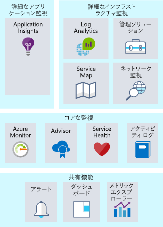
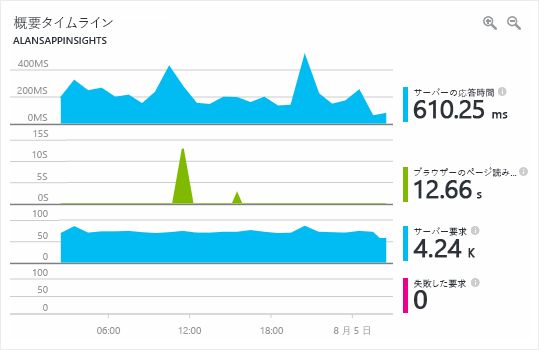

監視とは、ビジネス アプリケーションやそのアプリケーションで使用されるリソースのパフォーマンス、正常性、可用性を見極めるために、データを収集し、分析することを指します。Monitoring is the act of collecting and analyzing data to determine the performance, health, and availability of your business application and the resources that it depends on. Azure で実行されているリソースを担当する運用チームをあなたが管理したらどうだったでしょうか。What if you ran an operations team responsible for resources running on Azure? システムの正常性を確実に認識するにはどうしますか。What would you do to ensure you had visibility into the health of your systems? 何か問題が発生した場合、チームとエンド ユーザーのどちらが先に気付きますか。If something happens, who finds out first, your team or your end users? 効果的な監視戦略は、アプリケーションの正常性に注目するのに役立ちます。An effective monitoring strategy helps you focus on the health of your application. また、問題が顕在化する前に解決できるように重大な問題を事前に通知して、アップタイムを向上させることも可能です。It also helps you increase your uptime by proactively notifying you of critical issues, so that you can resolve them before they become problems. 

Azure での監視と分析に関しては、詳細なアプリケーション監視、詳細なインフラストラクチャ監視、コアな監視の 3 つの特定の注目領域に、サービスをバンドルできます。When it comes to monitoring and analytics on Azure, we can bundle services into three specific areas of focus: deep application monitoring, deep infrastructure monitoring, and core monitoring. この演習では、これらの各バンドルについてと、Azure サービスによってこれらの機能がお使いのアーキテクチャでどのように有効になるのかについて説明します。In this unit, we'll take a look through each of these bundles and how Azure services enable these capabilities for your architecture. サービスはグループ化されていますが、サービスの間には複数の統合ポイントがあり、サービスの間で重要な監視データ ポイントを共有できます。Even though we've grouped these services together, there are several integration points between them, allowing for sharing of important monitoring data points between them. 次の図では、利用可能な監視サービスを論理グループごとに示します。The following illustration shows the available monitoring services assembled into logical groups.

## コアな監視Core monitoring

コアな監視機能は、Azure リソースの監視に必要な基本機能です。Core monitoring provides fundamental, required monitoring across Azure resources. 基本的な監視とは、Azure プラットフォーム レベルでリソースに何が発生しているかの監視と考えることができます。When we talk about fundamental monitoring, you can think of this as monitoring what is happening with your resources at the Azure platform level. この注目領域では、Azure プラットフォームの正常性、ご自分のリソースに対して行われた変更、パフォーマンス メトリックなどに関する分析情報が得られます。This area of focus gives you insight into things like the health of the Azure platform, insight into changes being made to your resources, and performance metrics. この領域のサービスを使うと、アプリケーションの実行を維持するために必要な基本的な情報を監視できます。Using services from this area gives you the ability to monitor the basic pieces you need to keep your application running.

Azure では、アクティビティ ログ、サービスの正常性、メトリックと診断、およびベスト プラクティスについての推奨事項の 4 つの主要コア監視領域を見ることができるサービスが提供されています。Azure provides services to give you visibility into four key core monitoring areas: activity logging, the health of services, metrics and diagnostics, and recommendations on best practices. これらのサービスは Azure に組み込まれており、有効にしたり設定したりするための構成はほとんど、またはまったく必要ありません。These services are built in to Azure and take little to no configuration to enable and set up. 詳しく見ていきましょう。Let's take a closer look.

### アクティビティ ログActivity logging

アクティビティ ログは、Azure プラットフォーム レベルでリソースに何が発生しているかに関する情報を得るために非常に重要です。Activity logging is incredibly important to get information on what is happening with your resources at the Azure platform level. Azure プラットフォームに送信されたすべての変更は Azure アクティビティ ログに記録され、リソースに対して実行されたすべてのアクションをトレースできます。Every change submitted to the Azure platform is logged to the Azure Activity Log, giving you the ability to trace any action taken on your resources. アクティビティ ログにはアクティビティについての詳細な情報が含まれ、次のような疑問に対する答えを得るのに役立ちます。Activity Log will contain detailed information on activities to help you answer questions like:

- この仮想マシンにディスクをアタッチしたのは誰か。Who has attached a disk to this virtual machine?
- このマシンがシャットダウンされたのはいつか。When was this machine shut down?
- ロード バランサーの構成を変更したのは誰か。Who changed the load balancer configuration?
- 仮想マシン スケール セットに対する自動スケーリング操作が失敗したのはなぜか。Why did the autoscale operation on my virtual machine scale set fail?

アクティビティ ログを使ってこの種の疑問への回答を得ることは、問題のトラブルシューティング、変更の追跡、および Azure 環境内で何が起きているかの監査の際に役立ちます。Using Activity Log to answer these types of questions will help you troubleshoot issues, track changes, and provide auditing of what's happening in your Azure environment. アクティビティ ログのデータは 90 日間だけ保持され、ストレージ アカウントにアーカイブしたり、さらに長い保持や詳しい分析のために Azure Log Analytics に送信したりすることができます。Activity Log data is only retained for 90 days and can be archived to a storage account or sent to Azure Log Analytics for longer retention and further analysis.

### クラウド サービスの正常性Health of cloud services

どのようなシステムでもいつかは問題が発生する可能性があり、Azure サービスも例外ではありません。At some point, any system can have issues, and that's true for Azure services as well. Azure サービスの正常性を常に把握しておくことは、Azure サービスに影響する問題がお使いの環境に影響を与えるかどうかや、どのようなときか、といったことを理解するのに役立ちます。Staying informed of the health of Azure services will help you understand if and when an issue impacting an Azure service is impacting your environment. 局所的な問題のように見えることがもっと広い範囲の問題の結果である可能性があり、Azure Service Health ではその分析情報が提供されます。What may seem like a localized issue could be the result of a more widespread issue, and Azure Service Health provides this insight. Azure Service Health では、お使いのアプリケーションに影響を与える可能性のある Azure サービスでの問題が識別されます。Azure Service Health identifies any issues with Azure services that might affect your application. Service Health は、予定メンテナンスの計画にも役立ちます。Service Health also helps you plan for scheduled maintenance.

### メトリックと診断Metrics and diagnostics

本質的に局所性の高い問題では、システムまたはサービス インスタンスで何が起こっているかを把握することが重要です。For issues that are more localized in nature, it's important to have visibility into what is happening on your system or service instance. パフォーマンスに関する問題のトラブルシューティングを行い、問題が発生しているときに常に情報を得ているためには、メトリックと診断情報を表示する機能が不可欠です。The ability to view metrics and diagnostic information is critical to troubleshoot performance issues and stay notified when something goes wrong. この可視性を提供するため、Azure サービスには正常性、メトリック、または診断の情報を表示する共通の方法があります。To provide this visibility, Azure services have a common way of showing health, metric, or diagnostic information. Azure Monitor では、メトリック、アクティビティ ログ、診断ログを収集、集計、視覚化して、Azure サービスのコアな監視を行うことができます。Azure Monitor enables core monitoring for Azure services by allowing the collection, aggregation, and visualization of metrics, activity logs, and diagnostic logs.

メトリックでは、各種リソースはもちろんのこと、仮想マシン内のオペレーティング システムについても、パフォーマンス統計情報を収集できます。Metrics are available that provide performance statistics for different resources and even the operating system inside a virtual machine. Azure portal のいずれかのエクスプローラーを使用してこのデータを表示し、これらのメトリックに基づいてアラートを作成することができます。You can view this data with one of the explorers in the Azure portal and create alerts based on these metrics. Azure Monitor では非常に高速なメトリックのパイプライン (5 分から最短 1 分) が提供されるため、スピードが重視されるアラートと通知に使用してください。Azure Monitor provides the fastest metrics pipeline (5 minutes down to 1 minute), so you should use it for time-critical alerts and notifications.

### ベスト プラクティスに関する推奨事項Recommendations on best practices

監視というと、普通はリソースの現在の正常性のことを考えます。When we think of monitoring, we typically think of the current health of a resource. しかし、リソースが正常な場合でも、可用性の向上、コストの削減、セキュリティの強化につながる調整が存在する可能性があります。But even when a resource is healthy, there could be adjustments that would result in greater availability, reduced cost, or improved security. Azure Advisor を使うと、リソース内でのパフォーマンス、コスト、高可用性、セキュリティに関する潜在的な問題の監視を維持することができます。Azure Advisor can help by keeping an eye out for potential performance, cost, high availability, or security issues within your resources. Advisor では、リソースの構成とテレメトリに基づいてユーザーに応じた推奨事項が作成され、従来のほとんどの監視プラットフォームでは提供されないようなガイダンスが提供されます。Advisor makes personalized recommendations based on resource configuration and telemetry, providing guidance that most traditional monitoring platforms don't provide.

## 詳細なインフラストラクチャ監視Deep infrastructure monitoring

これまで説明してきた監視コンポーネントは分析情報の提供には適していますが、Azure プラットフォームの可視性しか提供されません。While the monitoring components we've covered thus far are great at offering insights, they only give visibility to the Azure platform. 一般的な IaaS ワークロードの場合、さらに多くのメトリックと診断情報が、ネットワークや実際のオペレーティング システムから収集されます。For typical IaaS workloads, there's more metrics and diagnostic information to gather from the network or the actual operating systems. SQL Server が正しく構成されていることを確認するための情報の取得、環境内のすべてのサーバーについての空きディスク容量の分析、システムとサービスの間のネットワーク依存関係の視覚化などはすべて、Log Analytics で詳細な分析情報を提供できる場合の例です。Pulling information from SQL Server to ensure it's properly configured, analyzing free disk space across all the servers in your environment, or visualizing the network dependencies between your systems and services are all examples where Log Analytics can provide deep insights.

監視戦略を設計するときは、すべてのコンポーネントをアプリケーション チェーンに組み込んで、サービスとリソースの間でイベントを関連付けられるようにすることが重要です。When designing a monitoring strategy, it's important to include every component in the application chain, so you can correlate events across services and resources. Azure Monitor をサポートするサービスでは、データを Log Analytics ワークスペースに送信するように簡単に構成できます。For services that support Azure Monitor, they can be easily configured to send their data to a Log Analytics workspace. 仮想マシン (クラウドとオンプレミスの両方) には、Log Analytics にデータを送信するエージェントをインストールできます。Virtual machines (both in the cloud and on-premises) can have an agent installed to send data to Log Analytics. Log Analytics API を使って Log Analytics にカスタム データを送信できます。You can submit custom data to Log Analytics through the Log Analytics API. 次の図では、Log Analytics がデータを監視するための中央ハブとして機能する方法を示します。The following illustration shows how Log Analytics acts as a central hub for monitoring data. Log Analytics は、Azure リソースから監視データを受け取り、コンシューマーが分析や視覚化に利用できるようにします。Log Analytics receives monitoring data from your Azure resources and makes it available to consumers for analysis or visualization.

Log Analytics 内のこのデータでは、トラブルシューティング、根本原因の識別、監査のために、生データを照会できます。With this data in Log Analytics, you can query the raw data for troubleshooting, root cause identification, and auditing purposes. いくつかのよく知られたサービス (SQL Server、Windows Server Active Directory) には、すぐに使用できる管理ソリューションがあり、監視データを表示したり、ベスト プラクティスへの準拠を明らかにしたりできます。For several known services (SQL Server, Windows Server Active Directory), there are management solutions readily available that visualize monitoring data and uncover compliance with best practices.

Log Analytics では、クエリを作成し、それらのクエリに基づいて他のシステムと対話することができます。Log Analytics allows you to create queries and interact with other systems based on those queries. 最も一般的な例はアラートです。The most common example is an alert. システムのディスク領域が不足したとき、または SQL Server がベスト プラクティスに準拠しなくなったときは、メールを受け取りたいと思うでしょう。Maybe you want to receive an email when a system runs out of disk space or a best practice on SQL Server is no longer followed. Log Analytics では、アラートの送信やオートメーションの開始、さらには IT サービス管理 (ITSM) との統合などのためのカスタム API へのフックを行うことができます。Log Analytics can send alerts, kick off automation, and even hook into custom APIs for things like integration with IT service management (ITSM).

## 詳細なアプリケーション監視Deep application monitoring

コア サービスとインフラストラクチャの動作状況を理解することは重要ですが、アプリケーションを詳細に調べてパフォーマンスの問題、使用の傾向、開発したサービスや依存しているサービスの全体的な可用性を明らかにすることで、監視機能をいっそう拡張できます。It's important to understand how core services and infrastructure are performing, but you can take your monitoring capabilities even further by looking deep into your applications to identify performance issues, usage trends, and overall availability of services you develop and depend on. アプリケーション パフォーマンス管理ツールを使用することにより、Web アプリとサービスの内部で発生した問題の検出と診断を向上させることができます。By using an application performance management tool, you can better detect and diagnose issues that occur within your web apps and services.

Azure Application Insights を使用すると、まさにそれを実行できます。Azure Application Insights allows you to do exactly that. Application Insights では、テレメトリの収集、クエリ、視覚化の機能が提供されます。Application Insights provides telemetry collection, query, and visualization capabilities. コードを変更する必要はほとんど、またはまったくありません。Little to no code changes are required. 小さなインストルメンテーション パッケージをアプリケーションにインストールすることだけが必要です。You only have to install a small instrumentation package into your application. Application Insights はクロスプラットフォームであり、.NET、Node.js、Java がサポートされています。Application Insights is cross platform, supporting .NET, Node.js, or Java.

たとえば、アプリケーションの応答時間のトラブルシューティングは複雑な場合があります。For instance, the response time of the application might be complex to troubleshoot. Web サーバーが過負荷状態になっているのでしょうか。Is it the web server being overloaded? 特定の SQL クエリが最適化されていないのでしょうか。Is it a specific SQL query that's not optimized? 呼び出している API のパフォーマンスが通常より低いのでしょうか。Is the API that you're calling performing slower than usual? アプリケーション パフォーマンス監視ソリューションは、基本的なメトリック監視では明らかにできない実際の問題を発見するのに役立つ場合があります。Application performance monitoring solutions can help uncover the actual issues that basic metric monitoring can't expose. 次のスクリーンショットでは、Azure Application Insights によって提供されるアプリケーションのパフォーマンスの詳細のグラフィカルな表示を示します。The following screenshot shows a graphical display of an application’s performance details provided by Azure Application Insights.

アプリケーション パフォーマンス監視ソリューションは、使用状況、パフォーマンス、可用性の監視に役立ち、はるかに短時間で障害に対応できるので、すべての監視戦略に組み込む必要があります。An application performance monitoring solution will help you monitor usage, performance, and availability, allowing you to respond to failure much faster, and should be included in any monitoring strategy.

## Lamna Healthcare での監視Monitoring at Lamna Healthcare

Lamna Healthcare は、リソースをクラウドに移行してから監視戦略の改良を行っています。Lamna Healthcare has been revamping their monitoring strategy since moving their resources to the cloud. パフォーマンスの問題がリソースに影響を与える可能性があるときのトラブルシューティングとアラートに、Monitor を使用しています。They're using Monitor for troubleshooting and alerting when performance issues may be impacting their resources. 運用チームがすぐに対応できるように、サービス正常性通知をチームに送信するように通知を構成しています。They have notifications configured to send any service health notifications to their operations team for immediate engagement. Advisor を定期的に調べて該当する環境に推奨事項が実装されていることを確認するプロセスが設けられています。They have a process in place to regularly review Advisor to ensure the recommendations are implemented into their environment where applicable. 

すべての Azure リソースとオンプレミス リソースから Log Analytics ワークスペースにログ データを送信しているので、ログ ソース全体でイベントの相関関係を検索することができ、Windows Server Active Directory と SQL Server に対して管理ソリューションを使用しています。They send log data from all Azure and on-premises resources to a Log Analytics workspace, so they have the ability to search across log sources for event correlation and are using management solutions for Windows Server Active Directory and SQL Server.

開発チームはアプリケーションへの Application Insights の統合を始めており、以前は検出できなかったパフォーマンスに影響を与える 2 つの欠陥を既に検出しています。Their development team has started integrating Application Insights into their applications, and they've already uncovered two defects that were impacting performance that had previously gone undetected.

## まとめSummary

優れた監視戦略とは、サポートしているインフラストラクチャから詳細なアプリケーション テレメトリまで、アーキテクチャの複数のレイヤーに目を光らせるものです。A good monitoring strategy looks across multiple layers of an architecture, from supporting infrastructure to deep application telemetry. それにより、アプリケーションの異なるコンポーネントの動作状況を詳細に把握できます。It will help you understand the detailed operation of the different components of your application. 実際に問題になる前に解決できるように重大な問題が事前に通知されるのでアップタイムが向上し、システム間でログとテレメトリを関連付けて問題を明らかにすることができます。It increases your uptime by proactively notifying you of critical issues, so that you can resolve them before they become problems, and allows you to correlate logs and telemetry across systems to uncover issues. 監視戦略で利用できる Azure のサービスをいくつか見てきました。We've taken a look at a number of services on Azure that you can leverage in your monitoring strategy.