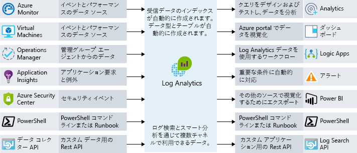

監視とは、ビジネス アプリケーションやそのアプリケーションで使用されるリソースのパフォーマンス、正常性、可用性を見極めるために、データを収集し、分析することを指します。 Azure で実行されているリソースを担当する運用チームをあなたが管理したらどうだったでしょうか。 システムの正常性を確実に認識するにはどうしますか。 何か問題が発生した場合、チームとエンド ユーザーのどちらが先に気付きますか。 効果的な監視戦略は、アプリケーションの正常性に注目するのに役立ちます。 また、問題が顕在化する前に解決できるように重大な問題を事前に通知して、アップタイムを向上させることも可能です。 

Azure での監視と分析に関しては、詳細なアプリケーション監視、詳細なインフラストラクチャ監視、コアな監視の 3 つの特定の注目領域に、サービスをバンドルできます。 この演習では、これらの各バンドルについてと、Azure サービスによってこれらの機能がお使いのアーキテクチャでどのように有効になるのかについて説明します。 サービスはグループ化されていますが、サービスの間には複数の統合ポイントがあり、サービスの間で重要な監視データ ポイントを共有できます。 次の図では、利用可能な監視サービスを論理グループごとに示します。

## コアな監視

コアな監視機能は、Azure リソースの監視に必要な基本機能です。 基本的な監視とは、Azure ファブリック レベルでリソースに何が発生しているかの監視と考えることができます。 この注目領域では、Azure プラットフォームの正常性、ご自分のリソースに対して行われた変更、パフォーマンス メトリックなどに関する分析情報が得られます。 この領域のサービスを使うと、アプリケーションの実行を維持するために必要な基本的な情報を監視できます。

Azure では、アクティビティ ログ、サービスの正常性、メトリックと診断、およびベスト プラクティスについての推奨事項の 4 つの主要コア監視領域を見ることができるサービスが提供されています。 これらのサービスは Azure に組み込まれており、有効にしたり設定したりするための構成はほとんど、またはまったく必要ありません。 詳しく見ていきましょう。

### アクティビティ ログ

アクティビティ ログは、Azure ファブリック レベルでリソースに何が発生しているかに関する情報を得るために非常に重要です。 Azure プラットフォームに送信されたすべての変更は Azure アクティビティ ログに記録され、リソースに対して実行されたすべてのアクションをトレースできます。 アクティビティ ログにはアクティビティについての詳細な情報が含まれ、次のような疑問に対する答えを得るのに役立ちます。

- この仮想マシンにディスクをアタッチしたのは誰か。
- このマシンがシャットダウンされたのはいつか。
- ロード バランサーの構成を変更したのは誰か。
- 仮想マシン スケール セットに対する自動スケーリング操作が失敗したのはなぜか。

アクティビティ ログを使ってこの種の疑問への回答を得ることは、問題のトラブルシューティング、変更の追跡、および Azure 環境内で何が起きているかの監査の際に役立ちます。 アクティビティ ログのデータは 90 日間だけ保持され、ストレージ アカウントにアーカイブしたり、さらに長い保持や詳しい分析のために Azure Log Analytics に送信したりすることができます。

### クラウド サービスの正常性

どのようなシステムでもいつかは問題が発生する可能性があり、Azure サービスも例外ではありません。 Azure サービスの正常性を常に把握しておくことは、Azure サービスに影響する問題がお使いの環境に影響を与えるかどうかや、どのようなときか、といったことを理解するのに役立ちます。 局所的な問題のように見えることがもっと広い範囲の問題の結果である可能性があり、Azure Service Health ではその分析情報が提供されます。 Azure Service Health では、お使いのアプリケーションに影響を与える可能性のある Azure サービスでの問題が識別されます。 Service Health は、予定メンテナンスの計画にも役立ちます。

### メトリックと診断

本質的に局所性の高い問題では、システムまたはサービス インスタンスで何が起こっているかを把握することが重要です。 パフォーマンスに関する問題のトラブルシューティングを行い、問題が発生しているときに常に情報を得ているためには、メトリックと診断情報を表示する機能が不可欠です。 この可視性を提供するため、Azure サービスには正常性、メトリック、または診断の情報を表示する共通の方法があります。 Azure Monitor では、メトリック、アクティビティ ログ、診断ログを収集、集計、視覚化して、Azure サービスのコアな監視を行うことができます。

メトリックでは、各種リソースはもちろんのこと、仮想マシン内のオペレーティング システムについても、パフォーマンス統計情報を収集できます。 Azure portal のいずれかのエクスプローラーを使用してこのデータを表示し、これらのメトリックに基づいてアラートを作成することができます。 Azure Monitor では非常に高速なメトリックのパイプライン (5 分から最短 1 分) が提供されるため、スピードが重視されるアラートと通知に使用してください。

### ベスト プラクティスに関する推奨事項

監視というと、普通はリソースの現在の正常性のことを考えます。 しかし、リソースが正常な場合でも、可用性の向上、コストの削減、セキュリティの強化につながる調整が存在する可能性があります。 Azure Advisor を使うと、リソース内でのパフォーマンス、コスト、高可用性、セキュリティに関する潜在的な問題の監視を維持することができます。 Advisor では、リソースの構成とテレメトリに基づいてユーザーに応じた推奨事項が作成され、従来のほとんどの監視プラットフォームでは提供されないようなガイダンスが提供されます。

## 詳細なインフラストラクチャ監視

これまで説明してきた監視コンポーネントは分析情報の提供には適していますが、Azure ファブリックの可視性しか提供されません。 一般的な IaaS ワークロードの場合、さらに多くのメトリックと診断情報が、ネットワークや実際のオペレーティング システムから収集されます。 SQL Server が正しく構成されていることを確認するための情報の取得、環境内のすべてのサーバーについての空きディスク容量の分析、システムとサービスの間のネットワーク依存関係の視覚化などはすべて、Log Analytics で詳細な分析情報を提供できる場合の例です。

監視戦略を設計するときは、すべてのコンポーネントをアプリケーション チェーンに組み込んで、サービスとリソースの間でイベントを関連付けられるようにすることが重要です。 Azure Monitor をサポートするサービスでは、データを Log Analytics ワークスペースに送信するように簡単に構成できます。 仮想マシン (クラウドとオンプレミスの両方) には、Log Analytics にデータを送信するエージェントをインストールできます。 Log Analytics API を使って Log Analytics にカスタム データを送信できます。 次の図では、Log Analytics がデータを監視するための中央ハブとして機能する方法を示します。 Log Analytics は、Azure リソースから監視データを受け取り、コンシューマーが分析や視覚化に利用できるようにします。

Log Analytics 内のこのデータでは、トラブルシューティング、根本原因の識別、監査のために、生データを照会できます。 いくつかのよく知られたサービス (SQL Server、Windows Server Active Directory) には、すぐに使用できる管理ソリューションがあり、監視データを表示したり、ベスト プラクティスへの準拠を明らかにしたりできます。

Log Analytics では、クエリを作成し、それらのクエリに基づいて他のシステムと対話することができます。 最も一般的な例はアラートです。 システムのディスク領域が不足したとき、または SQL Server がベスト プラクティスに準拠しなくなったときは、メールを受け取りたいと思うでしょう。 Log Analytics では、アラートの送信やオートメーションの開始、さらには IT サービス管理 (ITSM) との統合などのためのカスタム API へのフックを行うことができます。

## 詳細なアプリケーション監視

コア サービスとインフラストラクチャの動作状況を理解することは重要ですが、アプリケーションを詳細に調べてパフォーマンスの問題、使用の傾向、開発したサービスや依存しているサービスの全体的な可用性を明らかにすることで、監視機能をいっそう拡張できます。 アプリケーション パフォーマンス管理ツールを使用することにより、Web アプリとサービスの内部で発生した問題の検出と診断を向上させることができます。

Azure Application Insights を使用すると、まさにそれを実行できます。 Application Insights では、テレメトリの収集、クエリ、視覚化の機能が提供されます。 コードを変更する必要はほとんど、またはまったくありません。 小さなインストルメンテーション パッケージをアプリケーションにインストールすることだけが必要です。 Application Insights はクロスプラットフォームであり、.NET、Node.js、Java がサポートされています。

検出する方法は簡単であっても、アプリケーションの応答時間のトラブルシューティングは複雑な場合があります。 Web サーバーが過負荷状態になっているのでしょうか。 特定の SQL クエリが最適化されていないのでしょうか。 呼び出している API のパフォーマンスが通常より低いのでしょうか。 アプリケーション パフォーマンス監視ソリューションは、単純なメトリック監視では明らかにできない実際の問題を発見するのに役立つ場合があります。 次のスクリーンショットでは、Azure Application Insights によって提供されるアプリケーションのパフォーマンスの詳細のグラフィカルな表示を示します。

アプリケーション パフォーマンス監視ソリューションは、使用状況、パフォーマンス、可用性の監視に役立ち、はるかに短時間で障害に対応できるので、すべての監視戦略に組み込む必要があります。

## Lamna Healthcare での監視

Lamna Healthcare は、リソースをクラウドに移行してから監視戦略の改良を行っています。 パフォーマンスの問題がリソースに影響を与える可能性があるときのトラブルシューティングとアラートに、Monitor を使用しています。 運用チームがすぐに対応できるように、サービス正常性通知をチームに送信するように通知を構成しています。 Advisor を定期的に調べて該当する環境に推奨事項が実装されていることを確認するプロセスが設けられています。 

すべての Azure リソースとオンプレミス リソースから Log Analytics ワークスペースにログ データを送信しているので、ログ ソース全体でイベントの相関関係を検索することができ、Windows Server Active Directory と SQL Server に対して管理ソリューションを使用しています。

開発チームはアプリケーションへの Application Insights の統合を始めており、以前は検出できなかったパフォーマンスに影響を与える 2 つの欠陥を既に検出しています。

## まとめ

優れた監視戦略とは、サポートしているインフラストラクチャから詳細なアプリケーション テレメトリまで、アーキテクチャの複数のレイヤーに目を光らせるものです。 それにより、アプリケーションの異なるコンポーネントの動作状況を詳細に把握できます。 実際に問題になる前に解決できるように重大な問題が事前に通知されるのでアップタイムが向上し、システム間でログとテレメトリを関連付けて問題を明らかにすることができます。 監視戦略で利用できる Azure のサービスをいくつか見てきました。