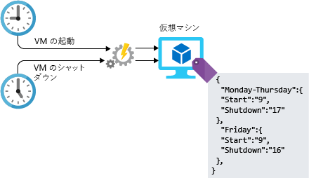

どのような種類のワークロードであっても、そのインフラストラクチャの管理には構成タスクが含まれます。 この構成は手動でもできますが、手動手順は手間がかかり、エラーが発生しやすく、非効率的です。 何百ものシステムを Azure に展開する必要のあるプロジェクトのリーダーを任されたらどうしますか。 このようなリソースをどのようにして構築して構成しますか。 それにはどのくらいの時間がかかるでしょうか。 各システムがばらつきなく適切に構成されたことを保証できますか。 アーキテクチャの設計でオートメーションを使用すると、これらの課題に対応できます。 Azure での自動化に利用できるいくつかの方法を見ていきましょう。

## <a name="infrastructure-as-code"></a>コードとしてのインフラストラクチャ

コードとしてのインフラストラクチャでは、ソース コードで使用されているものに似たバージョン管理システムを使用し、記述的モデルでインフラストラクチャ (ネットワーク、仮想マシン、ロード バランサー、接続トポロジ) が管理されます。 同じソース コードで同じバイナリが生成されるという原則と同様に、IaC モデルにより、適用のたびに同じ環境が生成されます。 IaC は DevOps の重要な慣行であり、多くの場合、継続的デリバリーとの連動で使用されます。

コードとしてのインフラストラクチャは、環境ドリフトの問題を解決するために進化しました。 IaC を使用しない場合、各チームは個々のデプロイ環境設定を維持する必要があります。 時間の経過と供に、各環境がスノーフレークに、つまり、自動的に再現できない一意の構成になります。 環境に不一致があると、デプロイ中に問題が発生します。 スノーフレークが存在すると、インフラストラクチャの管理と保守に手動プロセスが伴い、それは追跡記録が難しく、エラーを招くものとなっていました。

サービスとインフラストラクチャのデプロイを自動化するには、命令型と宣言型の 2 種類の方法を利用できます。 命令型の方法では、想定する結果を生成するために実行されるコマンドを明示的に示します。 宣言型の方法では、実行方法を指定する代わりに、望ましい結果を指定します。 どちらの方法にも価値があるので、どちらを選んでも誤ることはありません。 これらの異なる方法は Azure ではどのようになっていて、どのように使用するのでしょうか。

### <a name="imperative-automation"></a>命令型のオートメーション

命令型のオートメーションから始めましょう。 命令型のオートメーションでは、何かを行う "_方法_" を指定します。 通常これは、スクリプト言語または SDK を使用してプログラム的に行われます。 Azure リソースの場合は、Azure CLI または Azure PowerShell を使用できます。 Azure CLI を使用してストレージ アカウントを作成する例を見ていきましょう。

```azure-cli
az group create --name storage-resource-group \
        --location eastus

az storage account create --name mystorageaccount \
        --resource-group storage-resource-group \
        --kind BlobStorage \
        --access-tier hot
```

この例では、これらのリソースを作成する方法を指定します。 コマンドを実行してリソース グループを作成します。 別のコマンドを実行してストレージ アカウントを作成します。 必要な結果を生成するために実行するコマンドを、Azure に明示的に指示します。

この方法では、インフラストラクチャを完全に自動化できます。 入力と出力のための領域を提供でき、毎回同じコマンドが実行されることが保証されます。 リソースを自動化することにより、プロセスから手動の手順を取り除き、リソース管理の運用をいっそう効率的にします。 ただし、この方法にはいくつかの欠点があります。 アーキテクチャが複雑になると、リソースを作成するスクリプトもたちまち複雑になる場合があります。 完全な実行のためには、エラー処理と入力の検証を追加することが必要な場合があります。 コマンドが変更される可能性があり、スクリプトを継続的にメンテナンスする必要があります。

### <a name="declarative-automation"></a>宣言型のオートメーション

宣言型のオートメーションでは、望ましい結果が "_何_" かを指定し、それを行う方法の詳細は使用しているシステムに委ねます。 Azure では、宣言型のオートメーションは Azure Resource Manager テンプレートを使用して行われます。

Resource Manager テンプレートは、作成したいものを指定する JSON 構造のファイルです。 次の例では、指定した名前とプロパティを使用してストレージ アカウントを作成するように Azure に指示しています。 このストレージ アカウントを作成するために実行される実際の手順は、Azure に任されています。 テンプレートには、パラメーター、変数、リソース、出力の 4 つのセクションがあります。 パラメーターでは、テンプレート内で使用される入力を処理します。 変数では、テンプレート全体で使用する値を格納する方法を提供します。 リソースは作成されるものであり、出力は作成されたものの詳細をユーザーに提供する手段です。

```json
{
    "$schema": "https://schema.management.azure.com/schemas/2015-01-01/deploymentTemplate.json#",
    "contentVersion": "1.0.0.0",
    "parameters": {
        "name": {
            "type": "string"
        },
        "location": {
            "type": "string"
        },
        "accountType": {
            "type": "string",
            "defaultValue": "Standard_RAGRS"
        },
        "kind": {
            "type": "string"
        },
        "accessTier": {
            "type": "string"
        },
        "httpsTrafficOnlyEnabled": {
            "type": "bool",
            "defaultValue": true
        }
    },
    "variables": {
    },
    "resources": [
        {
            "apiVersion": "2018-02-01",
            "name": "[parameters('name')]",
            "location": "[parameters('location')]",
            "type": "Microsoft.Storage/storageAccounts",
            "sku": {
                "name": "[parameters('accountType')]"
            },
            "kind": "[parameters('kind')]",
            "properties": {
                "supportsHttpsTrafficOnly": "[parameters('httpsTrafficOnlyEnabled')]",
                "accessTier": "[parameters('accessTier')]",
                "encryption": {
                    "services": {
                        "blob": {
                            "enabled": true
                        },
                        "file": {
                            "enabled": true
                        }
                    },
                    "keySource": "Microsoft.Storage"
                }
            },
            "dependsOn": []
        }
    ],
    "outputs": {
        "storageAccountName": {
            "type": "string",
            "value": "[parameters('name')]"
        }
    }
}
```

Azure のほとんどのサービスの作成と操作にテンプレートを使用できます。 テンプレートは、コード リポジトリに格納してソース管理でき、異なる環境間で共有して、開発対象のインフラストラクチャが運用環境内に実際に存在するものと一致することを保証できます。 展開を自動化して一貫性を保証する優れた方法であり、展開が誤って構成されることがなくなり、運用の速度を上げることができます。

インフラストラクチャの展開の自動化は大きな第一歩ですが、仮想マシンを展開するときは、まだ他にもやることがあります。 展開後の構成を自動化するいくつかの方法を見ていきましょう。

## <a name="vm-customization-images-vs-post-deployment-configuration"></a>VM のカスタマイズ: イメージと展開後の構成

仮想マシンの展開の多くでは、ジョブはマシンの実行時に行われません。 VM が意図された目的を実際に提供できるようにするには、多くの場合、事前の追加構成が必要です。 追加ディスクのフォーマット、ドメインへの VM の参加、管理ソフトウェア用のエージェントのインストールなどが必要になる場合があり、最も可能性が高いのは、実際のワークロードもインストールして構成することです。

VM 自体の構成の一部と見なされる構成作業に対して適用される一般的な戦略が 2 つあり、どちらにも長所と短所があります。

- カスタム イメージ
- 展開後のスクリプト実行

カスタム イメージを生成するには、仮想マシンを展開してから、その実行しているインスタンス上でソフトウェアを構成またはインストールします。 すべてを正しく構成したら、マシンをシャットダウンすることができ、VM からイメージが作成されます。 その後、他の新しい仮想マシンのベースとしてイメージを使用できます。 カスタム イメージを使用すると、仮想マシンを展開して実行した後は追加構成の必要がないため、展開全体の時間を短縮できます。 展開の速度が重要な要因である場合は、間違いなくカスタム イメージを検討する価値があります。

展開後のスクリプト実行では、通常、基本的なベース イメージを利用した後、スクリプトや構成管理プラットフォームを使用して、VM が展開された後の構成を行います。 展開後のスクリプト実行は、Azure スクリプト拡張機能を使用して VM でスクリプトを実行することで、または Azure Automation Desired State Configuration (DSC) などのより堅牢なソリューションを利用して、行うことができます。

いずれの方法でも、いくつかの考慮事項に留意する必要があります。 イメージを使用する場合は、イメージの更新プログラム、セキュリティ修正プログラム、およびイメージ自体のインベントリ管理を処理するためにプロセスが存在することを確認する必要があります。 展開後スクリプト実行では、ビルドが完了するまで VM をライブ ワークロードに追加できないため、ビルド時間が長くなることがあります。 これはスタンドアロン システムについては大きな問題ではないかもしれませんが、自動スケーリングを行うサービスを使用しているときは (仮想マシン スケール セットなど)、ビルドの時間が長くなると、スケーリングできる速さに影響する可能性があります。 どちらの方法でも、構成のずれに対処する必要あります。新しい構成をロールアウトするときは、既存のシステムが適宜更新されるようにする必要があります。

リソースのデプロイを自動化することは、環境に対して大きなメリットになる場合があります。 時間の短縮と、エラーの削減により、運用機能が別のレベルに移る可能性があります。

## <a name="automation-of-operational-tasks"></a>運用タスクの自動化

ソリューションが稼働状態になった後は、継続的な運用アクティビティの中にも自動化できるものがあります。 Azure Automation でこれらのタスクを自動化すると、手動のワークロードが減り、コンピューティング リソースの構成と更新を管理でき、スケジュール、資格情報、証明書などの共有リソースが集中化され、任意の種類の Azure タスクを実行するためのフレームワークが提供されます。

Lamna Healthcare の作業の場合、次のようなものが含まれます。

- 孤立したディスクの定期的な検索
- VM への最新のセキュリティ修正プログラムのインストール
- 業務時間外の仮想マシンの検索とシャットダウン
- 上級管理者に報告するための日次レポートの実行とダッシュボードの生成

具体的な例として、営業時間中にのみ仮想マシンを実行したいものとします。 朝 VM を起動して夜はシャットダウンするスクリプトを記述できます。 設定した時刻にスクリプトを実行するように Azure Automation を構成できます。 次の図では、このプロセスでの Azure Automation の役割を示します。



## <a name="automating-development-environments"></a>開発環境の自動化

クラウド インフラストラクチャのパイプラインのもう一方の端は、ビジネスの中核となるアプリケーションとサービスを作成するために開発者が使用する開発用マシンです。 Azure DevTest Labs を使用すると、必要とするすべての適切なツールとリポジトリを VM に設定できます。 複数のサービスで作業する開発者は、新しいマシンを自分でプロビジョニングする必要なしに、開発環境を切り替えることができます。 これらの開発環境は、使っていないときはシャットダウンし、再び必要になったら再起動できます。

## <a name="automation-at-lamna-healthcare"></a>Lamna Healthcare でのオートメーション

オートメーションを使用することで Lamna Healthcare がどのように改善されるかを見てみましょう。 オートメーションの導入を始める前は、インフラストラクチャの展開とサーバーの構築は完全に手動でした。 エンジニアは、ポータルを通してすべてのものを展開していました。 そのため、テスト環境と運用環境の間で不一致とエラーが発生し、相違のため、コードを運用状態にする前に問題を検出する機能が妨げられていました。

現在は、Resource Manager テンプレートを使用してすべてのインフラストラクチャを展開するようになりました。 これらのテンプレートは GitHub リポジトリにチェックインされ、展開にリリースされる前にコード レビューが行われます。 開発環境、テスト環境、運用環境の間に同じインフラストラクチャを構築し、すべての環境で構成が検証されるようにすることもできます。

仮想マシンを使用するほとんどのサービスについて、標準のベース イメージを用意し、DSC を使用して展開後のシステムを構成しています。 仮想マシン スケール セットのスケーラビリティを必要とする Web ファームでは、スケール セットで使用できるようにする前に、完全に自動化されたプロセスを使用してコードをチェックインし、必要な構成がすべて組み込まれた新しいイメージをビルドします。

コストを削減するために勤務時間外に識別された仮想マシンをシャットダウンする Automation ジョブがあり、VM の修正プログラムの適用も自動化されています。

開発者には DevTest Labs にセルフ サービスの環境があり、そこでは最新のイメージと構成に対して開発を行うことができ、開発対象と運用環境の構成が一致することが保証されます。

このすべてには若干の事前作業がありますが、長い目で見ればメリットの方が上回ります。 エラーと、環境を維持するために運用チームで必要な労力が、大幅に減少しています。 開発者は、開発対象のリソースを簡単にプロビジョニングでき、行ったり来たりして環境を作成する必要がないことを、喜んでいます。

## <a name="summary"></a>まとめ

アーキテクチャにオートメーション機能を組み込むいくつかの方法を見てきました。 コードとしてのインフラストラクチャの展開から、ラボ環境での開発者の生産性向上まで、環境の自動化に時間をかけると多くのメリットがあります。 エラーの削減、差異の減少、運用コストの節約は、組織にとって大きなメリットであり、クラウド環境をレベルアップするのに役立ちます。