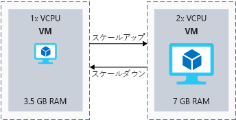
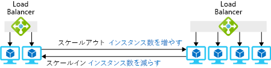
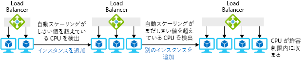

システムの負荷を正確に予測できることはほとんどありません。公開されているアプリケーションの負荷が急に増えたり、ビジネスの成長に伴い内部アプリケーションでサポートする必要のあるユーザー ベースが大きくなったりする可能性があります。 負荷を予測できる場合でも、フラットになることはあまりありません。小売りサイトは休日には需要が増え、スポーツ Web サイトはプレーオフの間にピークになります。 ここでは、"_スケールアップ/スケールダウン_" と "_スケールアウト/スケールイン_" を定義し、Azure でスケーリング機能を向上させる方法を説明した後、サーバーレス技術とコンテナー技術でお使いのアーキテクチャのスケーリング機能を向上させる方法を見ていきます。

## スケーリングの対象

"_スケーリング_" とは、アプリケーションが一連のパフォーマンス要件を満たすようにリソースを管理するプロセスです。  ユーザーに提供するリソースが多すぎると、リソースを効率的に使用できず、コストが無駄になります。 使用できるリソースが少なすぎると、アプリケーションのパフォーマンスが低下することを意味します。 目標は、コストを最適化しながら、定義されているパフォーマンス要件を満たすことです。 

"_リソース_" は、アプリケーションを実行するために管理する必要のあるすべてのものを指す＠場合があります。 仮想マシンのメモリと CPU は最も明らかなリソースですが、一部の Azure サービスでは帯域幅または Cosmos DB 要求ユニットのような抽象化の考慮が必要になる場合があります。

アプリケーションの需要が一定の世界では、必要になるリソースの正確な量を簡単に予測できます。 現実の世界では、アプリケーションの需要は時間と共に変化するので、必要になるリソースの正確な量を予測するのが困難な場合があります。 運がよければ、その変化は予測可能であったり、季節的であったりしますが、すべてのアプリケーションでそれが一般的なわけではありません。 需要に見合った適切な量のリソースをプロビジョニングし、需要の変化に応じて調整するのが理想的です。

ユーザーが独自にサーバーを購入して管理するオンプレミスのシナリオでは、スケーリングは困難です。 リソースを追加すると、コストがかかる場合があり、オンラインにするまでに時間がかかりすぎ、場合によっては増えた容量に対して実際に必要な時間より長くなることもあります。 システムの需要が低下しているときに容量を減らすのが困難な場合があり、コストが増加したままの状態になる可能性があります。

スケーリングの容易さは Azure の主な利点です。 ほとんどの Azure リソースについては需要の変化に応じてリソースを簡単に追加または削除でき、多くのサービスには要求を自動的に監視して調整するオプションがあります。 この自動的なスケーリング機能は自動スケーリングと呼ばれ、使用できる必要があるインスタンスの最小レベルと最大レベルのしきい値を設定でき、パフォーマンス メトリック (CPU 使用率など) に基づいてインスタンスが追加または削除されます。

## スケールアップやスケールダウンとは

スケールアップとは、特定のインスタンスの容量を増やすプロセスのことです。 仮想マシンでは、1 vCPU と 3.5 GB の RAM を、2 vCPU と 7 GB の RAM に増やして、より多くの処理能力を提供することができます。 一方、スケールダウンとは、特定のインスタンスの容量を減らすプロセスのことです。 たとえば、仮想マシンの容量を 2 vCPU と 7 GB の RAM から 1 vCPU と 3.5 GB の RAM に減らすと、容量とコストの両方が減ります。 次の図は、仮想マシンのサイズ変更の例を示しています。

Azure リソースのコンテキストでスケールアップやスケールダウンがどのような意味を持つかを見ていきましょう。

- Azure 仮想マシンでは、仮想マシンのサイズに基づいてスケーリングします。 仮想マシンのサイズでは、一定の量の vCPU、RAM、ローカル ストレージが仮想マシンに関連付けられています。 たとえば、Standard_DS1_v2 の仮想マシン (1 vCPU、3.5 GB の RAM) から Standard_DS2_v2 の仮想マシン (2 vCPU、7 GB の RAM) にスケールアップできます。
- Azure SQL Database は、Microsoft SQL Server のサービスとしてのプラットフォーム (PaaS) の実装です。  データベース トランザクション ユニット (DTU) または vCPU の数に基づいて、データベースをスケールアップできます。 基になっているリソースを抽象化したものが DTU であり、CPU、IO、メモリの組み合わせです。 データベース インスタンスは 500 DTU から 250 DTU にスケーリングできます。
- Azure App Service は、Azure 上の ＠PaaS Web サイト ホスティング サービスです。 Web サイトは、App Service プランとも呼ばれる仮想サーバー ファーム上で実行されます。 App Service プランはレベル間でスケールアップまたはスケールダウンでき、レベル内には容量のオプションがあります。 たとえば、S1 App Service プランでは、インスタンスごとに 1 vCPU と 1.75 GB RAM があります。 これを、インスタンスごとに 2 vCPU と 3 GB RAM の S2 App Service プランにスケールアップできます。

オンプレミス環境でこれらの機能を利用するには、通常、必要なハードウェアを購入してインストールするまで待ってからでないと、新しいレベルのスケールを使用できません。 Azure では、物理リソースが既にデプロイされており、使用可能です。 ＠あとは、使用しようとしているスケールの代替レベルを選択するだけです。

選択したクラウド サービスによっては、お使いのソリューションでのスケールアップの影響を考慮することが必要になる場合があります。

たとえば、Azure SQL Database でのスケールアップを選択した場合、サービスによって個々のノードのスケールアップが処理され、サービスの操作は続行されます。 データベースのサービス レベルやパフォーマンス レベルを変更すると、新しいパフォーマンス レベルで元のデータベースのレプリカが作成され、接続先がそのレプリカに切り替えられます。 このプロセスの間にデータが失われることはなく、サービスがレプリカに切り替わるときに短い中断 (通常は 4 秒未満) があるだけです。

代わりに、仮想マシンをスケールアップまたはスケールダウンする場合は、異なるインスタンス サイズを選択することで行います。 ほとんどの場合、これには VM の再起動が必要なので、再起動が必要なものと想定するのが最善であり、この作業を行うときはそれを見込んでおく必要があります。

最後に、スケールダウンが可能な場所を常に探すようにする必要があります。 もっと低い価格レベルでもアプリケーションで十分なパフォーマンスが提供できる場合、Azure の料金を大幅に削減できる可能性があります。

## スケールアウトやスケールインとは

スケールアップとスケールダウンが単一のインスタンスで使用可能なリソースの量を調整することであるのに対し、スケールアウトとスケールインはインスタンスの総数を調整することです。

_スケール アウト_＠とは、ソリューションの負荷をサポートするためにインスタンスを追加するプロセスです。 たとえば、Web サイトのフロントエンドが仮想マシンでホストされている状態で、負荷のレベルが上がった場合は仮想マシンの数を増やすことができます。

_スケールイン_とは、ソリューションの負荷をサポートするために必要なくなったインスタンスを削除するプロセスです。 Web サイトのフロントエンドの使用率が低い場合は、インスタンスの数を減らしてコストを削減できます。 次の図は、仮想マシン インスタンスの数を変更する例を示しています。

Azure リソースのコンテキストでのスケールアウトやスケールインの意味についていくつかの例を示します。

- インフラストラクチャ レイヤーでは、仮想マシン スケール セットを使用してインスタンスの追加と削除を自動化できます。
  - 仮想マシン スケール セットでは、同一の負荷分散された VM のグループを作成して管理できます。
  - 需要または定義されたスケジュールに応じて、VM インスタンスの数を自動的に増減させることができます。
- Azure SQL Database の実装では、シャーディングによってデータベース インスタンス間に負荷を分散させることができます。 _シャーディング_とは、同じ構造を持つ大量のデータを複数の独立したデータベースに分散する手法です。
- Azure App Service では、App Service プランはコンテンツをホストする仮想 Web サーバー ファームです。 この方法でのスケールアウトは、ファーム内の仮想マシンの数を増やすことを意味します。 仮想マシン スケール セットと同様に、特定のメトリックまたはスケジュールに応じてインスタンスの数を自動的に増減できます。

通常は、Azure portal、コマンド ライン ツール、または Resource Manager テンプレートでスケールアウトを簡単に実行でき、ほとんどの場合はエンド ユーザーが気付くことはありません。

### 自動スケーリング

自動スケーリングと呼ばれる機能を使用するように、これらのサービスの一部を構成できます。 自動スケーリングを使用すると、サービスを手動でスケーリングする必要はなくなります。 代わりに、インスタンス数の最小と最大のしきい値を設定し、特定のメトリック (キューの長さ、CPU 使用率など) またはスケジュール (平日午後 5 時から午後 7 時の間など) に基づいてスケーリングできます。 次の図は、自動スケーリング機能が負荷を処理するためにどのようにインスタンスを管理しているかを示しています。

### スケールインおよびスケールアウトを行うときの考慮事項

スケールアウトでは、アプリケーションの起動時間がアプリケーションをスケーリングできる速さに影響する可能性があります。 Web アプリを起動してからユーザーが使用できるようになるまでに 2 分かかる場合は、ユーザーが各インスタンスを使用できるようになるのに 2 分かかることを意味します。 スケーリングの速さを決めるときは、この起動時間を考慮します。

また、アプリケーションが状態を処理する方法についても考慮する必要があります。 アプリケーションをスケールインすると、マシンに格納されているすべての状態は使用できなくなります。 状態を持たないインスタンスにユーザーが接続する場合、サインインまたはデータの再選択を強制され、ユーザー エクスペリエンスが低下する可能性があります。 一般的なパターンでは、Redis Cache や SQL Database などの別のサービスに状態を外部化し、Web サーバーをステートレスにします。 これで Web フロントエンドはステートレスになり、個々のインスタンスが使用可能であることを心配する必要はなくなります。 すべてのインスタンスでは同じジョブが実行され、同じ方法でデプロイされます。

## 調整

アプリケーションの負荷は時間と共に変わることを示しました。 その原因は、アクティブなユーザーや同時実行ユーザーおよび実行されているアクティビティの数である場合があります。 自動スケーリングを使用して容量を追加できますが、調整メカニズムを使用してソースからの要求の数を制限することもできます。 アプリケーション レベルで既知の制限を設定することによってパフォーマンスの限界を保護し、アプリケーションが壊れるのを防ぐことができます。 調整が最もよく使用されるのは、API エンドポイントを公開しているアプリケーションです。

アプリケーションが制限を超えることがわかったら、調整を開始して、システムの全体的な SLA が確実に損なわれないようにすることができます。 たとえば、顧客がデータを取得するための API を公開する場合は、1 分あたり 100 個の要求に制限するといったことができます。 ある 1 人の顧客がこの制限を超えた場合、HTTP 429 状態コードで応答し、別の要求を正常に送信できるようになるまでに待機時間を設けることができます。

## サーバーレス

サーバーレス コンピューティングとは、ユーザーのアプリを実行するクラウドでホストされた実行環境ですが、基になる環境が完全に抽象化されています。 サービスのインスタンスを作成して、コードを追加します。インフラストラクチャを管理またはメンテナンスする必要はありませんが、許可されていることもあります。

イベントに応答するようにサーバーレス アプリを構成します。 REST エンドポイント、タイマー、別の Azure サービスから受信したメッセージなどのイベントがあります。 イベントでトリガーされた場合にのみ、サーバーレス アプリが実行されます。

ユーザーにはインフラストラクチャに関する責任はありません。 スケーリングとパフォーマンスは自動的に処理され、使用した正確なリソースに対してのみ課金されます。 容量を予約する必要さえありません。 Azure で利用できるサーバーレス コンピューティングの例としては、Azure Functions、Azure Container Instances、Logic Apps などがあります。

Lamna Healthcare の例を再び見てみましょう。 コストを削減して管理を容易にできる可能性があります。 API エンドポイントについて検討します。 予約された容量に対して支払う必要がある Azure App Service で API をホストするのではなく、HTTP 要求によってトリガーされる Azure 関数アプリを使用できます。 Azure 関数を使用すると、チームは各トランザクションの処理に必要なリソースに対して支払うだけで済みます。 コストとスケールは、システム内のトランザクションの数に直接＠対応するようになります。

## コンテナー

コンテナーとは、仮想化された環境でアプリケーションを実行する方法です。 仮想マシンはハードウェア レベルで仮想化されており、ハイパーバイザーによって単一の物理サーバーで複数の仮想化されたオペレーティング システムを実行できます。 コンテナーによって仮想化がレベルアップされます。 仮想化は OS レベルで行われるようになり、同じ OS 内で複数の同じアプリケーション インスタンスを実行できます。

コンテナーは、スケールアウトのシナリオに適してします。 コンテナーは軽量になるように意図され、環境や需要の変化に応じて動的に作成、スケールアウト、停止されるように設計されています。

コンテナーを使用する利点は、複数の独立したアプリケーションを各仮想マシンで実行できることです。 コンテナー自体がカーネル レベルでセキュリティ保護されて分離されるため、異なるワークロードごとに VM を分ける必要は必ずしもありません。

仮想マシンでコンテナーを実行できますが、コンテナーの管理とスケーリングを容易にすることを目的とする 2 つの Azure サービスがあります。

- **Azure Kubernetes Service (AKS)**

  Azure Kubernetes Service を使用すると、ノードとして機能するように仮想マシンを設定できます。 Azure によって Kubernetes の管理プレーンがホストされ、コンテナーをホストする実行している worker ノードに対してのみ課金されます。

  Azure 内の worker ノードの数は、Azure CLI を使用して手動で増やすことができます。 この記事を書いている時点で、worker ノードの自動スケーリングを可能にするプレビュー機能の Cluster Autoscaler を AKS で使用できます。 Kubernetes クラスターでは、Horizontal Pod Autoscaler を使用して、展開されるコンテナーのインスタンスの数をスケールアウトできます。

  次に説明する Virtual Kubelet を使用して AKS をスケーリングすることもできます。

- **Azure Container Instances (ACI)**
  
  Azure Container Instances はサーバーレス アプローチであり、＠オンデマンドでコンテナーを作成して実行できます。 1 秒あたりの実行時間に対してのみ課金されます。

  Virtual Kubelet を使用して、AKS などの Kubernetes 環境に Azure Container Instances を接続できます。 Virtual Kubelet では、Kubernetes クラスターでさらに多くのコンテナー インスタンスが必要になったときは、ACI で要求を満たすことができます。 ACI はサーバーレスであるため、容量を予約する必要はありません。 そのため、サーバーレスの 1 秒あたりの課金で、Kubernetes の制御と柔軟性を利用できます。 この記事を書いている時点では、Virtual Kubelet は実験的なソフトウェアと説明されており、運用シナリオでは使用できません。

## Lamna Healthcare でのスケーリング

Lamna Healthcare では患者管理および予約システムが運用されています。 管理システムでは、数十の病院および医療施設における予定の予約と患者のレコードが処理されます。 ローカル ヘルス サービスは最大能力で実行されており、現時点で拡張は予定されていません。 システムは、Azure App Service でホストされる PHP Web サイトで実行されています。

主に使用されるのは月曜日から金曜日までの 9 時から 5 時の間であるため、アプリケーションの負荷パターンは予測可能です。  火曜日から金曜日までは、システム全体での 1 時間あたりのトランザクションの平均数は 1,200 となります。 週末は、1 時間あたり 500 件のトランザクションが処理されます。 処理量が少ない週末の後、月曜日には 1 時間あたりのトランザクションの平均数が 2,000 に増えます。

アプリケーションは S1 App Service プランでホストされていますが、運用チームはすべてのインスタンスで CPU 使用率が高レベル (95% を超える) であることに気付いています。 高い使用率が、アプリケーションの処理と読み込みの時間に影響しています。 クラウド環境では、リソースの使用率が高いのは必ずしも悪いことではありません。 デプロイされているリソースが十分に使用されているので、＠コストに見合う価値を得ていることを意味します。 

チームは、デプロイされているインスタンスの App Service プランのレベルを S1 (1 vCPU、1.75 GB の RAM) から S2 (2 vCPU、3 GB の RAM) に_スケールアップ_することを決定しています。 Azure portal を使用してこれを簡単に実現できますが、Azure CLI の単一のコマンド、Azure PowerShell、または Resource Manager テンプレートを使用して、同じことを実現することもできます。

チームは、負荷プロファイルが予測可能であるため、デプロイされるインスタンスの数をスケジュールに基づいて自動化することにします。 チームは、App Service プランの自動スケーリングのスケジュールを構成します。 1 時間あたり 500 件のトランザクションを処理するには 2 つのインスタンスで十分であるものと仮定します。 そうすると、火曜日から金曜日までは 6 インスタンス、月曜日は 8 インスタンスにスケーリングすると要件を満たすことができます (分析情報とロード テストの監視に基づきます)。

自動スケーリングには、次のような予測できないシナリオに対応できるメリットもあります。 週末にサイトの負荷が予想以上に急増する可能性があります (冬期の風邪やインフルエンザによる予約の増加)。 チームは、CPU 使用率が 90% を超えたらインスタンスを 1 つ増やし、使用率が 15% を下回ったらインスタンスを 1 つ減らすように、自動スケーリングを設定できます。

チームは、Azure API Management インスタンスの背後で公開している患者予約 API の内部で調整パターンを使用しています。 これにより、一定の量のスループットだけがシステムを通過できるようにすることで、システムのパフォーマンス低下を防ぐことができます。

## まとめ

スケールアップとスケールダウン、スケールインとスケールアウト、そしてアーキテクチャでこれらのオプションを使用する方法について説明しました。 また、サーバーレス テクノロジとコンテナーがスケーリング機能の向上にどのように役立つかについても説明しました。 次に、ネットワークのパフォーマンスがアプリケーションに与える影響と、ネットワークを最適化できるさまざまな方法について説明します。