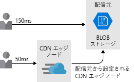

ネットワーク パフォーマンスはユーザーのエクスペリエンスに大きな影響を及ぼす可能性があります。Network performance can have a dramatic impact on a user's experience. 多くの異なるサービスを使用した複雑なアーキテクチャにおいては、各ホップでの待ち時間を最小限に抑えることが、全体のパフォーマンスを大きく左右します。In complex architectures with many different services, minimizing the latency at each hop can have a huge impact on the overall performance. このユニットでは、ネットワーク待ち時間の重要性と、使用するアーキテクチャでのネットワーク待ち時間を削減する方法について説明します。In this unit, we'll talk about the importance of network latency and how to reduce it within your architecture. また、Azure ユーザーと Azure との間の待ち時間だけでなく、Azure リソース間のネットワーク待ち時間を最小限に抑えるために、Lamna Healthcare がどのように戦略を採用したかについても説明します。We'll also discuss how Lamna Healthcare adopted strategies to minimize network latency between their Azure resources as well as between their users and Azure.

## ネットワーク待ち時間の重要性The importance of network latency

待ち時間は、遅延の測定基準です。Latency is a measure of delay. ネットワーク待ち時間は、なんらかのネットワーク インフラストラクチャを介してソースから宛先に到達するために必要な時間です。Network latency is the time needed to get from a source to a destination across some network infrastructure. この所要時間は一般的にラウンドトリップ遅延として知られています。ラウンドトリップ遅延とは、ソースから宛先に到達し、再び戻ってくるのにかかる時間です。This time period is commonly known as a round-trip delay, or the time taken to get from the source to destination and back again.

従来のデータセンター環境では、多くの場合にリソースでは同じ場所と共通のインフラストラクチャ セットを共有しているため、待ち時間が最小限に抑えられる可能性があります。In a traditional datacenter environment, latency may be minimal since resources often share the same location and a common set of infrastructure. リソースが物理的に近い場所にあれば、ソースから宛先に到達するためにかかる時間は短くなります。The time taken to get from source to destination is lower when resources are physically close together.

それに比べて、クラウド環境はスケールに対応できるように構築されています。In comparison, a cloud environment is built for scale. クラウドでホストされたリソースが、同じラックやデータセンター、さらにはリージョン内に存在するとは限りません。Cloud-hosted resources may not be in the same rack, datacenter, or even region. この分散型アプローチが、ネットワーク通信のラウンドトリップ時間に影響を与える可能性があります。This distributed approach can have an impact on the round-trip time of your network communications. すべての Azure リージョンは高速なファイバー バックボーンで相互接続されていますが、それでも光の速度が物理的な限界です。While all Azure regions are interconnected by a high-speed fiber backbone, the speed of light is still a physical limitation. 異なる物理的な場所にあるサービス間の呼び出しでは、やはり、それらの場所間の距離に直接関係したネットワーク待ち時間が発生します。Calls between services in different physical locations will still have network latency directly correlated to the distance between them.

さらに、アプリケーションの通信量が多いほど、必要なラウンドトリップの回数も増えます。On top of this, the chattier an application, the more round trips that are required. 1 回のラウンドトリップに伴う待ち時間がラウンドトリップごとに付加されて、全体的な待ち時間が増加します。Each round trip comes with a latency tax, with each round trip adding to the overall latency. 次の図は、ユーザーによって認識される待ち時間が要求の処理に必要なラウンドトリップの組み合わせであることを示しています。The following illustration shows how the latency perceived by the user is the combination of the roundtrips required to service the request.

Azure リソース間のパフォーマンスと、エンド ユーザーからご使用の Azure リソースまでのパフォーマンスを改善する方法を見てみましょう。Now let's take a look at how to improve performance between Azure resources and from your end users to your Azure resources.

## Azure リソース間の待ち時間Latency between Azure resources

Lamna Healthcare では、西ヨーロッパの Azure リージョンにある複数の Web サーバーと 1 つのデータベースを使用して、新しい患者予約システムのパイロット運用を実施しようとしています。Imagine that Lamna Healthcare is piloting a new patient booking system running on several web servers and a database in the West Europe Azure region. このアーキテクチャでは、リソースが Azure リージョンの内部に併置されているため、データがネットワーク上にある時間が最小限に抑えられます。This architecture minimizes the data time on the wire as resources are co-located inside an Azure region.

システムのパイロット運用が順調に進み、オーストラリアのユーザーにまで拡大されたとします。Suppose that the pilot of the system went well and has been expanded to users in Australia. オーストラリアのユーザーが Web サイトを閲覧すると、西ヨーロッパのリソースまでのラウンドトリップ時間が発生し、ネットワーク待ち時間によってエンド ユーザー エクスペリエンスが低下します。Users in Australia will incur the round-trip time to the resources in West Europe to view the website, and their end-user experience will be poor due to the network latency.

ユーザーの待ち時間を削減するため、Lamna Healthcare チームは、オーストラリア東部リージョンにおいて、追加のフロントエンド インスタンスをホストすることにしました。The Lamna Healthcare team decide to host another front-end instance in the Australia East region to reduce user latency. この設計では、Web サーバーからエンド ユーザーにコンテンツを返すのにかかる時間の削減が期待できる一方、オーストラリア東部のフロントエンド Web サーバーと西ヨーロッパのデータベースとの間の通信に長い待ち時間が存在するため、エクスペリエンスの低下はまだ改善されません。While this design helps reduce the time for the web server to return content to end users, their experience is still poor since there's significant latency communicating between the front-end web servers in Australia East and the database in West Europe.

残りの待ち時間を削減できる方法がいくつかあります。There are a few ways we could reduce the remaining latency:

- オーストラリア東部にデータベースの読み取りレプリカを作成します。Create a read-replica of the database in Australia East. これにより、読み取りのパフォーマンスは向上しますが、書き込みにはまだ待ち時間が伴います。This would allow reads to perform well, but writes would still incur latency. Azure SQL Database の geo レプリケーションにより、読み取りレプリカが実現します。Azure SQL Database geo-replication allows for read-replicas.
- Azure SQL データ同期機能を使用してリージョン間でデータを同期します。Sync your data between regions with Azure SQL Data Sync.
- Azure Cosmos DB などのグローバル分散データベースを使用します。Use a globally distributed database such as Azure Cosmos DB. これにより、場所に関係なく読み取りと書き込みの両方を発生させることができますが、ご利用のアプリケーションでデータを保存および参照する方法を変更する必要がある可能性があります。This would allow both reads and writes to occur regardless of location, but may require changes to the way your application stores and references data.
- Azure Redis Cache などのキャッシュ テクノロジを使用して、頻繁にデータにアクセスするリモート データベースへの待ち時間の長い呼び出しを最小限に抑えます。Use caching technology such as Azure Redis Cache to minimize high-latency calls to remote databases for frequently accessed data.

ここでの目標は、アプリケーションの各レイヤー間のネットワーク待ち時間を最小限に抑えることです。The goal here is to minimize the network latency between each layer of the application. これをどのように解決するかは実際のアプリケーションとデータのアーキテクチャによって異なりますが、Azure には、これを解決するメカニズムが複数のサービス上に用意されています。How this is solved depends on your application and data architecture, but Azure provides mechanisms to solve this on several services.

## ユーザーと Azure リソース間の待ち時間Latency between users and Azure resources

Azure リソース間の待ち時間を見てきましたが、ユーザーとクラウド アプリケーションとの間の待ち時間も考慮する必要があります。We've looked at the latency between our Azure resources, but we should also consider the latency between users and our cloud application. ユーザーへのフロントエンド ユーザー インターフェイスのデリバリーを最適化する必要があります。We're looking to optimize delivery of the front end-user interface to our users. エンド ユーザーとアプリケーションとの間のネットワーク パフォーマンスを改善する方法を見てみましょう。Let's take a look at some ways to improve the network performance between end users and the application.

### エンドポイント パスの最適化に DNS ロード バランサーを使用するUse a DNS load balancer for endpoint path optimization

Lamna Healthcare の例では、既に説明したように、チームはオーストラリア東部に追加の Web フロントエンド ノードを作成しました。In the Lamna Healthcare example, we saw that the team created an additional web front-end node in Australia East. ただし、エンド ユーザーは、どのフロントエンド エンドポイントを使用するかを明示的に指定する必要があります。However, end users have to explicitly specify which front-end endpoint they want to use. ソリューションの設計者として、Lamna Healthcare はユーザーにとってのエクスペリエンスをできる限りスムーズにしたいと考えています。As the designer of a solution, Lamna Healthcare wants to make the experience as smooth as possible for their users.

Azure Traffic Manager が役に立つ可能性があります。Azure Traffic Manager could help. Traffic Manager は DNS ベースのロード バランサーです。これを使用すると、Azure リージョン内および Azure リージョン間でのトラフィックの分散が可能になります。Traffic Manager is a DNS-based load balancer that enables you to distribute traffic within and across Azure regions. ユーザーに Web フロントエンドの特定のインスタンスを選択してもらわなくても、Traffic Manager を使用すれば、次のようないくつかの特性に基づいてユーザーをルーティングすることができます。Rather than having the user browse to a specific instance of our web front end, Traffic Manager can route users based upon a set of characteristics:

- **優先度** - フロントエンド インスタンスの番号付きリストを指定します。**Priority** - You specify an ordered list of front-end instances. 最も優先度が高いインスタンスが利用不可の場合には、Traffic Manager によって、利用可能な次のインスタンスにユーザーがルーティングされます。If the one with the highest priority is unavailable, Traffic Manager will route the user to the next available instance.
- **重み付け** - 各フロントエンド インスタンスに重みを設定します。**Weighted** - You would set a weight against each front-end instance. それらの定義済み比率に従い、Traffic Manager によってトラフィックが分散されます。Traffic Manager then distributes traffic according to those defined ratios.
- **パフォーマンス** - Traffic Manager により、ユーザーはネットワーク待ち時間に基づいて最も近いフロントエンド インスタンスにルーティングされます。**Performance** - Traffic Manager routes users to the closest front-end instance based on network latency.
- **地理** - フロントエンド デプロイの地理的リージョンを設定し、データ主権規制やコンテンツのローカライズに基づいてユーザーをルーティングすることができます。**Geographic** - You could set up geographical regions for front-end deployments, routing your users based upon data sovereignty mandates or localization of content.

Traffic Manager プロファイルをネストすることもできます。Traffic Manager profiles can also be nested. 最初は、地理的ルーティングを使用して異なる複数の地理的な場所 (たとえば、ヨーロッパとオーストラリア) の間でユーザーをルーティングし、次にパフォーマンス ルーティングという方法を使用して、ローカル フロントエンド デプロイにルーティングすることができます。You could first route your users across different geographies (for example, Europe and Australia) using geographic routing and then route them to local front-end deployments using the performance routing method.

Lamna Healthcare で西ヨーロッパとオーストラリアに Web フロントエンドがデプロイされたとします。Consider that Lamna Healthcare has deployed a web front end in West Europe and Australia. 西ヨーロッパにプライマリ デプロイと共に Azure SQL Database をデプロイし、オーストラリア東部に読み取りレプリカをデプロイしたと仮定します。Assume they have deployed Azure SQL Database with their primary deployment in West Europe, and a read replica in Australia East. また、アプリケーションからローカルの SQL インスタンスに接続して読み取りクエリを実行できると仮定しましょう。Let's also assume the application can connect to the local SQL instance for read queries.

チームは Traffic Manager インスタンスをパフォーマンス モードでデプロイし、Traffic Manager プロファイルとしてフロントエンド インスタンスを 2 つ追加します。The team deploy a Traffic Manager instance in performance mode and add the two front-end instances as Traffic Manager profiles. エンド ユーザーがカスタム ドメイン名 (たとえば、lamnahealthcare.com) にナビゲートすると、Traffic Manager にルーティングされます。As an end user, you navigate to a custom domain name (for example, lamnahealthcare.com) which routes to Traffic Manager. 次に、Traffic Manager から、最適なネットワーク待ち時間のパフォーマンスに基づいて、西ヨーロッパまたはオーストラリア東部のフロントエンドの DNS 名が返されます。Traffic Manager then returns the DNS name of the West Europe or Australia East front end based on the best network latency performance.

この負荷分散は DNS を経由してのみ処理されることに注意してください。ここではインライン負荷分散やキャッシングは行われず、単にユーザーに最も近いフロントエンドの DNS 名が Traffic Manager から返されます。It's important to note that this load balancing is only handled via DNS, there's no inline load balancing or caching that's happening here, Traffic Manager is simply returning the DNS name of the closest front end to the user.

### CDN を使用してユーザーに近いコンテンツをキャッシュするUse CDN to cache content close to users

Web サイトでは、何らかの形式の静的コンテンツ (ページ全体、またはイメージやビデオなどの資産) が使用されると考えられます。The website will likely be using some form of static content (either whole pages or assets such as images and videos). Azure CDN などのコンテンツ配信ネットワーク (CDN) を使用することで、このコンテンツをより高速にユーザーに配信できます。This content could be delivered to users faster by using a content delivery network (CDN) such as Azure CDN. 

Lamna が Azure CDN にコンテンツをデプロイすると、それらの項目は世界中の複数のサーバーにコピーされます。When Lamna deploys content to Azure CDN, those items are copied to multiple servers around the globe. それらの項目の 1 つとして、Blob Storage から提供される `HowToCompleteYourBillingForms.MP4` というビデオがあるとします。Let's say one of those items is a video served from blob storage: `HowToCompleteYourBillingForms.MP4`. そしてチームは、各ユーザーのビデオへのリンクが Blob Storage を参照するのではなく、実際にはそのユーザーに最も近い CDN エッジ サーバーを参照するように、Web サイトを構成します。The team then configure the website so that each user's link to the video will actually reference the CDN edge server nearest them, rather than referencing blob storage. このアプローチでは、コンテンツと宛先の距離が近くなり、待ち時間が短縮されてユーザー エクスペリエンスが向上します。This approach puts content closer to the destination, reducing latency and improving user experience. 次の図は、Azure CDN を使用し、宛先に近い場所にコンテンツを配置して、待ち時間を短縮し、ユーザー エクスペリエンスを向上させる方法を示しています。The following illustration shows how using Azure CDN puts content closer to the destination which reduces latency and improves the user experience.

コンテンツ配信ネットワークは、キャッシュされた動的コンテンツをホストするために使用することも "_できます_"。Content delivery networks _can_ also be used to host cached dynamic content. しかし、キャッシュされたコンテンツはソースと比較して古い可能性があるため、さらに配慮が必要です。Extra consideration is required, though, since cached content may be out of date compared with the source. コンテンツの期限切れは、TTL (有効期限) を設定することによって制御できます。Context expiration can be controlled by setting a time to live (TTL). TTL の値が大きすぎる場合は、古いコンテンツが表示される可能性があり、そのためにキャッシュを消去することが必要になります。If the TTL is too high, out-of-date content may be displayed and the cache would need to be purged.

キャッシュされたコンテンツを処理する 1 つの方法として、**動的サイトの高速化**と呼ばれる機能を使用する方法があります。この機能を使用すると、動的コンテンツを含む Web ページのパフォーマンスを高めることができます。One way to handle cached content is with a feature called **dynamic site acceleration**, which can increase performance of webpages with dynamic content. 動的サイトの高速化により、ソリューションに含まれるその他のサービス (たとえば、API エンドポイント) への、待ち時間の少ないパスを提供することもできます。Dynamic site acceleration can also provide a low-latency path to additional services in your solution (for example, an API endpoint).

### オンプレミスから Azure への接続に ExpressRoute を使用するUse ExpressRoute for connectivity from on-premises to Azure

オンプレミス環境から Azure へのネットワーク接続を最適化することも重要です。Optimizing network connectivity from your on-premises environment to Azure is also important. アプリケーションに接続するユーザーに対しては、仮想マシン上でホストされているか、Azure App Service のような PaaS 型サービスでホストされているかにかかわらず、アプリケーションへの接続を確実に最適化する必要があります。For users connecting to applications, whether they're hosted on virtual machines or on PaaS offerings like Azure App Service, you'll want to ensure they have the best connection to your applications. 

ユーザーをサービスに接続する場合、パブリック インターネットを常に使用できますが、インターネットのパフォーマンスは一定ではなく、外部の問題によって影響されることがあります。You can always use the public internet to connect users to your services, but internet performance can vary and may be impacted by outside issues. さらに、すべてのサービスをインターネット上に公開することを希望しておらず、Azure リソースへのプライベート接続が必要な場合があります。On top of that, you may not want to expose all of your services over the internet, and you may want a private connection to your Azure resources.

インターネットを使用したサイト間の VPN もオプションの 1 つですが、高スループットのアーキテクチャの場合、VPN のオーバーヘッドとインターネットの可変性によって待ち時間が大幅に増加する可能性があります。Site-to-site VPN over the internet is also an option, but for high throughput architectures, VPN overhead and internet variability can increase latency noticeably.

Azure ExpressRoute が役に立ちます。Azure ExpressRoute can help. ExpressRoute はネットワークと Azure との間の、非公開の専用接続です。これを使用すると、パフォーマンスが保証され、エンド ユーザーがすべての Azure リソースへの最適なパスを確実に使用できるようになります。ExpressRoute is a private, dedicated connection between your network and Azure, giving you guaranteed performance and ensuring that your end users have the best path to all of your Azure resources. 次の図は、ExpressRoute 回線がオンプレミス アプリケーションと Azure リソース間に接続性を提供する方法を示しています。The following illustration shows how ExpressRoute Circuit provides connectivity between on-premises applications and Azure resources.

もう一度 Lamna のシナリオを見てみると、Lamna は ExpressRoute の回線をオーストラリア東部と西ヨーロッパの両方にプロビジョニングし、施設内のエンド ユーザー エクスペリエンスをさらに改善することに決めました。Once again looking at Lamna's scenario, they decide to further improve end-user experience for users who are in their facilities by provisioning an ExpressRoute circuit in both Australia East and West Europe. これで、エンド ユーザーが予約システムに直接接続できるようになり、確実にアプリケーションの待ち時間が可能な限り少なくなります。This gives their end users a direct connection to their booking system and ensures the lowest latency possible for their application.

可能な最良のパフォーマンスをエンド ユーザーが確実に得られるようにするには、ネットワーク待ち時間がアーキテクチャに与える影響を考慮することが重要です。Considering the impact of network latency on your architecture is important to ensure the best possible performance for your end users. エンド ユーザーと Azure との間および Azure リソース間のネットワーク待ち時間を削減するための、いくつかのオプションについて説明しました。We've taken a look at some options to lower network latency between end users and Azure and between Azure resources.