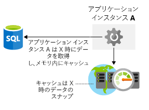

アーキテクチャにストレージのパフォーマンスに関する考慮事項を含めることが重要です。 ネットワーク待ち時間と同じように、ストレージ層でのパフォーマンスの低下は、エンドユーザー エクスペリエンスに影響する場合があります。 データ ストレージを最適化するにはどうすればよいでしょうか? アーキテクチャ内でストレージのボトルネックが発生しないことを確保するために、考慮する必要があることは何でしょうか? ここでは、使用するアーキテクチャにおけるストレージのパフォーマンスを最適化する方法を考えます。

## 仮想マシンのストレージのパフォーマンスを最適化する

最初に仮想マシンのストレージの最適化を見てみましょう。 ディスク ストレージは、仮想マシンのパフォーマンスにおいて重要な役割を果たします。そのため、アプリケーションに適したディスクの種類を選択することが、重要な決定事項になります。

アプリケーションが異なれば、ストレージの要件も異なります。 アプリケーションで読み取りと書き込みの待ち時間が重視される場合もあれば、高い数値の IOPS (1 秒あたりの入力/出力操作回数) を処理する能力が求められたり、全体的なスループットを上げることが求められたりする場合もあります。

IaaS のワークロードを構築する場合、どの種類のディスクを使用する必要がありますか。 4 つのオプションがあります。

- **ローカル SSD ストレージ** - 各 VM には、ローカル SSD ストレージを使用した一時ディスクがあります。 このディスクのサイズは仮想マシンのサイズによって異なります。 このディスクはローカル SSD であるため、高パフォーマンスですが、メンテナンス イベントや VM の再デプロイ時にデータが失われる可能性があります。 このディスクは、永続的に必要なデータではないデータの一時的なストレージとしての用途にのみ、適しています。 このディスクは、ページ ファイル、スワップ ファイル、SQL Server 内の tempdb などの場合に適しています。 このストレージの料金は発生しません。 VM のコストに含まれています。

- **Standard Storage HDD** - これはスピンドル ディスク ストレージであり、一貫しない待ち時間や低水準のスループットによってアプリケーションが制約されない場合に、高い適合性があります。 パフォーマンスを保証する必要がない開発/テスト ワークロードは、このディスクの種類に適した用途です。

- **Standard Storage SSD** - これは SSD を使用したストレージであり、SSD と同じで待ち時間が少ない一方、スループットは低水準です。 非運用環境の Web サーバーは、このディスクの種類に適したユース ケースです。

- **Premium Storage SSD** - SSD を使用したこのストレージは、運用環境に発生するワークロード、最大限の信頼性と需要に対する一貫した短い待ち時間が要求されるワークロード、または高水準のスループットと IOPS が要求されるワークロードに適しています。 これらのディスクはパフォーマンスと信頼性の高い機能を備えているため、すべての運用ワークロード用にお勧めします。

Premium Storage は、特定のサイズの仮想マシン (VM) にのみアタッチできます。 Premium storage 対応サイズは、名前、たとえば D2 で"s"で指定されます**s**_v3 または Standard_F2**s**_v2 します。 Standard Storage HDD または Standard Storage SSD ドライブを任意の種類の仮想マシン (名前に "s" が付いているかどうかにかかわらず) にアタッチできます。

ストライプ化テクノロジ (Windows の記憶域スペース ダイレクトや Linux の mdadm など) を使用してディスクをストライプ化し、複数のディスク間にディスク アクティビティを分散することによって、スループットと IOPS を高めることができます。 ディスク ストライプ化を使用すると、ディスクのパフォーマンスの限界を押し上げることができ、多くの場合は、高パフォーマンスのデータベース システムやストレージ要件の厳しいその他のシステムで見られます。

仮想マシンのワークロードに依存している場合は、アプリケーションのパフォーマンス要件を評価して、仮想マシンに対してプロビジョニングする基盤のストレージを決定する必要があります。

## アプリケーションに使用するストレージのパフォーマンスを最適化する

さまざまなストレージ テクノロジを使用して RAW ディスクのパフォーマンスを向上させることができますが、データへのアクセスのパフォーマンスについて、アプリケーション レイヤーにおいて対処することもできます。 これを行ういくつかの方法を見ていきましょう。

### キャッシュ

アプリケーションのパフォーマンス向上のための一般的なアプローチは、アプリケーションとデータ ストアとの間にキャッシュ レイヤーを統合することです。 通常、キャッシュはメモリにデータを格納して、迅速に取得できるようにします。 このデータは、頻繁にアクセスされるデータ、データベースから指定したデータ、ユーザーの状態などの一時的なデータであることが考えられます。 格納データの種類、更新頻度、および有効期限を自分で制御できます。 このキャッシュをアプリケーションおよびデータベースと同じリージョンに併置することにより、アプリケーションとデータベースの間の全体的な待ち時間を減らします。 キャッシュからのデータのプルは、ほぼ常に、同じデータをデータベースから取得するよりも高速です。したがって、キャッシュ レイヤーを使用することで、アプリケーションの全体的なパフォーマンスを大幅に高めることができます。 次の図は、アプリケーションをデータベースからデータを取得、キャッシュに格納して使用する方法、キャッシュされた値に応じてを示します。

Azure Redis Cache は、Azure のキャッシュ サービスです。 これは、オープン ソースの Redis Cache に基づいています。 Azure Redis Cache は、Microsoft によるフル マネージド サービス オファリングです。 必要なパフォーマンス レベルを選択し、このサービスを使用するようにアプリケーションを構成します。

### ポリグロットな永続化

ポリグロットな永続化は、ストレージ要件を処理するためにさまざまなデータ ストレージ テクノロジの使用法です。

eコマースの例を考えてみます。 アプリケーション資産を BLOB ストアに、製品レビューとレコメンデーションを NoSQL ストアに、ユーザー プロファイルまたはアカウントのデータを SQL データベースに保存できます。 次の図では、アプリケーションがさまざまな種類のデータを格納する複数のデータ ストレージ手法を使用可能性がある方法を示します。

異なるデータ ストアが特定のユース ケース用に設計されているか、コストを理由にもっとアクセスできる可能性があるため、これは重要です。 例として、BLOB を SQL データベースに保存することは、BLOB ストアから直接アクセスするよりもコストがかかり、アクセスも低速になる可能性があります。

多くのバッキング ストアを使用すると、ソリューションの複雑さが増します。 これらのデータ ストア間で機能以外の要件を満たす方法と、サービスの低下がアプリケーション全体に与える影響を検討してください。 また、これらのデータ ストア間でデータの一貫性を維持する方法も検討してください。 

**最終的な一貫性**: 多くの場合は適切なバランスが提供されますが、サービスに応じて複数の異なる一貫性モデルが利用可能です。

最終的な一貫性とは、それ以上の書き込みがなかった場合、レプリカのデータ ストアが最終的に収束することを意味します。 いずれかのデータ ストアに書き込みが行われた場合、別のデータ ストアからの読み取り時に、わずかに古いデータが提供される可能性があります。 最終的な一貫性により、上位のスケールが利用可能になります。理由は、情報がすべてのストアで一貫しているかどうかの確認待ちがなく、読み取りと書き込みの待ち時間が少ないためです。

## Lamna Healthcare の例

Lamna Healthcare の患者予約システムは、西ヨーロッパとオーストラリア東部という 2 つの Azure リージョンにまたがってホストされます。 仮想マシンをフロントエンド ノードとして使用して Web サイトをデプロイし、西ヨーロッパにデプロイした Azure SQL DB をプライマリに設定し、オーストラリア東部を読み取り可能なセカンダリに設定します。 フロントエンド ノードでは、高レベルのディスク スループットは必要ありませんが、一貫した待ち時間のパフォーマンスおよび運用の信頼性が必要であり、Premium SSD を使用したストレージを利用しています。

各 Azure リージョン内で Azure Redis Cache をローカルにホストし、一般的なユーザー要求と医師の空き時間を保存します。 アプリケーションで見られる最も一般的なデータ読み取りアクティビティのパフォーマンスを最適化するために、キャッシュが実装されています。

## まとめ

インフラストラクチャ レイヤーにおいて適切なディスク アーキテクチャを選択し、また、アプリケーション レベルにおいてキャッシュを使用し、自分のデータに適したデータ プラットフォームを選択することにより、ストレージのパフォーマンスを高める方法の例をいくつか示しました。 ソリューションを適切に設計することで、データへのアクセスをできる限り確実に効率よく実行できるようになります。 次に、アーキテクチャにおけるパフォーマンスの問題を特定する方法を見てみましょう。
