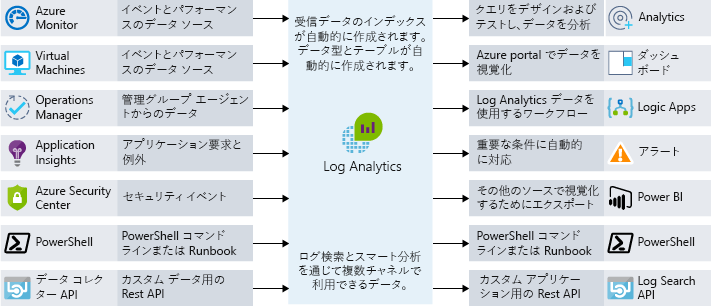

エンド ユーザーは、より多くのことをアプリケーションに期待しています。 優れたユーザー エクスペリエンスを望み、パフォーマンスの問題によって影響されないことを希望します。 パフォーマンスのボトルネックを特定する機能をどのようにしてアーキテクチャに統合しますか。 ＠このユニットでは、アプリケーションが確実に効率的に実行されるようにするのに役立ち、また、実行されていない場合はその原因を追跡するのに役立つプロセスとツールの両方について見ていきます。

## 要件の重要性

パフォーマンスについて説明する前に重要なこととして、要件について説明します。 理論的には、スケーラビリティとパフォーマンスの向上を際限なく続けることが可能です。 しかし、ある時点で、改善するにはコストが高すぎる、困難である、または価値を認めるだけの十分なビジネス上の効果がないという状態になります。 

その特定の時点を見つけるために役立つのが、**機能以外の要件**です。 これらの特定の要件は、アプリで "*実行する*" 必要があることを示すものではありません。 そうではなく、どのような品質レベルを満たす必要があるかを示します。 たとえば、次のような機能以外の要件を定義することができます。

- 特定の負荷がかかっている状態で、どれだけ速くトランザクションから戻る必要があるか。
- エラーを返し始める前に、どれだけの数の同時接続をサポートする必要があるか。
- サーバー障害の発生時、バックアップをオンラインにする前に、アプリケーションに許可される最長ダウン時間。

アプリケーションで確実に要求事項が満たされ、かつ、追加作業や追加費用が必要以上に発生することのないように、ソリューションを構築する前に、これらの要件をあらかじめ定義することが重要です。 このような機能以外の要件に関する監視と運用のルールを計画することもできます。 

利害関係者や顧客と要件について話し合い、話し合った内容を文書化して周知し、"良好なパフォーマンス" が何を意味するかについて全員が確実に同意するようにします。

## DevOps とアプリケーションのパフォーマンス

DevOps の背後にある考え方は、組織に開発とインフラストラクチャの分断が存在しないということです。 そうではなく、両者が連携して効率的に、合理化されたプロセスに従ってアプリのビルド、デプロイ、監視、メンテナンスを行います。

計画、デプロイ、テスト、監視は反復型アプローチに従って実施されます。 アプリケーションのパフォーマンスと品質は、ライブ環境にデプロイするときになって、後から思い付くのではなく、ソフトウェア ライフ サイクルに組み入れられます。 次の図では、ソフトウェア開発ライフサイクルにおいて共同作業の機会が存在する場所を示します。

このアプローチは、"シフト レフト" と呼ばれる DevOps の概念に沿ったものです。 つまり、品質管理チェックを前倒しにしてデプロイ プロセスとリリース プロセスに組み込みます。 これにより、エンド ユーザーに影響する問題をプロセスの早い段階で検出することができます。 継続的なサイクルで運用しながら、手動操作の量を制限し、可能な限り自動化します。 

DevOps プロセスのパフォーマンスの部分を組み立てる 1 つの方法は、運用環境へのデプロイの前に、あらかじめパフォーマンス テストまたはロード テストを実行して、アプリケーションが機能以外の要件を満たしているかを検証することです。

運用環境とまったく同様の環境で、実際の運用サーバーに影響を与えることなく、パフォーマンス テストとロード テストを実行できることが理想です。 クラウドを活用すると、これが完全に可能になります。 運用環境に似た環境の作成を自動化し、テストを実行した後、コストを最小限にするためにその環境を破棄できます。 自動化に対するこのアプローチにより、アプリケーションでは確実に、現時点で必要なスケールを処理することができ、また、将来の成長に対応できるようになります。

この中核になるのが、アプリケーションのパフォーマンス監視です。 アプリケーションでパフォーマンス テストとロード テストを実行しているときや、運用環境のパフォーマンスを管理するときは、アプリケーションのどの部分が最適に実行されていないかを把握する必要があります。 これを行うための方法をいくつか見てみましょう。

## Azure のパフォーマンス監視オプション

監視とは、ビジネス アプリケーションや関連するリソースのパフォーマンス、正常性、可用性を見極めるために、データを収集し、分析することを指します。

アプリケーションがスムーズに実行されているかどうかについて、常に最新情報を受け取る必要があります。 プロアクティブな通知を使用して、発生した重要な問題について知らせることができます。 考慮すべき多くの監視レイヤーがあります。主なレイヤーは、インフラストラクチャ レイヤーとアプリケーション レイヤーです。

### Azure Monitor

Azure Monitor では、大部分の Azure サービスを対象とした、インフラストラクチャ レベルのログと監視のための単一管理ポイントが提供されます。 メトリック、アクティビティ ログ、診断ログなどが収集されます。 Azure Monitor には、次のようなさまざまな機能があります。

- ＠メトリックに対する違反をプロアクティブに通知するため、または発生したアクティビティに対処するための、Azure アラート。
- Azure ダッシュボードを使用して多くの監視ソースを 1 つのアプリケーション ビューに統合します。

Azure Monitor は、ほぼリアルタイムのリソース メトリック分析情報を得るための開始点です。 多くの Azure リソースが、デプロイ後は自動的にメトリックを出力し始めます。 たとえば、Azure Web App インスタンスは計算およびアプリケーション要求のメトリックを出力します。 Application Insights のメトリックも、VM ホスト診断メトリックに加えて、ここに＠まとめられます。 VM ゲストの診断メトリックも、オプトインすると表示されます。

### Log Analytics

ログの一元化により、追跡することが困難な隠れた問題を明らかにすることができます。 Log Analytics では、ログ全体に対してクエリを実行でき、ログ全体でデータを集計できます。 このソース間の相関は、ログやメトリックを個別に見ている限り明らかになりにくい懸念事項やパフォーマンスの問題を特定するのに役立ちます。 次の図では、Log Analytics がデータを監視するための中央ハブとして機能する方法を示します。 Log Analytics は、Azure リソースから監視データを受け取り、コンシューマーが分析や視覚化に利用できるようにします。

さまざまなデータ ソース、セキュリティ ログ、Azure アクティビティ ログ、サーバー、ネットワーク、およびアプリケーションのログを照合することができます。 また、ハイブリッド デプロイ シナリオにおいてオンプレミスの System Center Operations Manager データを Log Analytics にプッシュし、詳細なパフォーマンス監視を行うために Azure SQL Database から Log Analytics に診断情報を直接送信できます。

ログの一元化は、パフォーマンスの問題を含むあらゆる種類のシナリオについてトラブルシューティングを行うときに、大きなメリットをもたらす可能性があります。 それは、どのアーキテクチャが対象であっても、適切な監視戦略の重要な部分になります。

## アプリケーション パフォーマンス管理

多くの場合、詳細なアプリケーションの問題の追跡には注意が必要です。 これは、アプリケーション パフォーマンス管理ソリューション (APM) を使用してテレメトリをアプリケーションに統合し、低レベルのアプリケーション パフォーマンスと動作を追跡することが有益な場所です。 このテレメトリには、個々のページ要求の回数やアプリケーション内の例外のほか、ビジネス ロジックを追跡するカスタム メトリックも含めることができます。 このテレメトリから、アプリケーション内で何が起こっているかについて、豊富な分析情報を得ることができます。

Azure では、Application Insights というサービスにより、この詳細なアプリケーション パフォーマンス管理機能が提供されます。 小さなインストルメンテーション パッケージをアプリケーションにインストールし、Application Insights リソースを Microsoft Azure portal に設定します。 このインストルメンテーションでアプリが監視され、テレメトリ データがポータルに送信されます。

パフォーマンス カウンター、Azure 診断、Docker のログなど、ホスト環境からテレメトリを取り込むことができます。 定期的に Web サービスに＠人工的な要求を送信する Web テストを設定することもできます。 クライアントまたはサーバー コードで自分が作成したカスタム イベントとメトリックを送信するようにアプリケーションを構成することもできます。 たとえば、販売した品目や勝った試合など、アプリケーション固有のイベントです。

＠Application Insights ではデータが共通のリポジトリに保存され、メトリックが Azure Monitor と共有されます。 アラート、ダッシュボード、Log Analytics クエリ言語を使用した詳細分析などの共有機能を活用できます。

Web アプリケーションの可用性の決定に使用される一般的なパターンは、正常性エンドポイント監視パターンです。 このパターンを使用して Web アプリケーションと関連バックエンド サービスを監視し、それらが確実に利用可能で正しく実行されるようにします。 パターンは特定の URI のクエリを実行することによって実装されます。 エンドポイントでは、フロント エンド自体の可用性だけではなく、アプリが依存しているバックエンド サービスを含む、多くのコンポーネントの状態が確認されます。 これはサービス レベルの正常性チェックとして機能し、サービスの全体的な正常性を示す値を返します。

Application Insights などの APM ソリューションを使用して、アプリケーションについて詳細に理解し、アプリケーション全体でアクティビティを関連付けます。 これは、特定のアクションがクライアント ブラウザー内、サーバー上、ダウンストリーム サービスに至るまでどのように機能するかを理解するのに役立ちます。 また、傾向についての分析情報を取得して、問題がある場合は通知し、ユーザーが気付く前に問題が存在する場所と問題の修正方法を特定できます。

## Lamna Healthcare でのパフォーマンス監視

Lamna Healthcare では、＠2 つの Azure リージョンにまたがる、仮想マシンと Azure SQL データベースを使用して、Web ベースの患者予約システムを実装しました。 VM エージェントと Log Analytics を使用して、基盤となるフロントエンド仮想マシンのパフォーマンスを監視することを決定しました。

Azure Monitor を使用して Azure SQL データベースのパフォーマンスを把握し、CPU % やデッドロックなどの主要なパフォーマンス メトリックをキャプチャします。

可用性とテレメトリ情報をキャプチャするために、Application Insights が構成されています。 チームは、カスタム イベント テレメトリを Application Insights に送信するように新しい予約機能を変更しました。 現在、チームは発生したビジネス関連イベントの数量を把握する＠ためのアプローチを行っており、アプリケーション内で何が起きているかについて、はるかに明確な分析情報を得ることができます。

## まとめ

パフォーマンスの問題を追跡し、アプリケーションが最適な状態で実行されていることを確認するために役立つ、いくつかのプロセス、ツール、ベスト プラクティスを見てきました。 このモジュールで学習した内容をまとめましょう。
