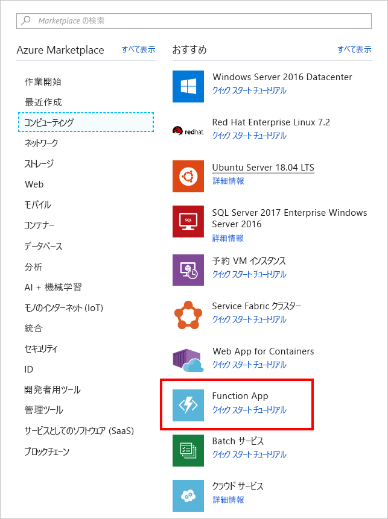
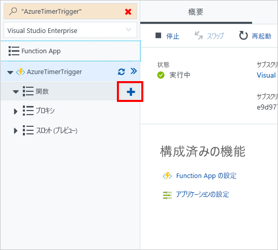

このユニットでは、タイマー トリガーを使用して 20 秒ごとに呼び出される、Azure function app を作成します。

## <a name="create-an-azure-function-app"></a>Azure function app を作成します。

[!include[](../../../includes/azure-sandbox-activate.md)]

[!include[](../../../includes/azure-sandbox-regions-first-mention-note.md)]

ポータルで、Azure Function app を作成してみましょう。

1. [Azure portal](https://portal.azure.com?azure-portal=true) にサインインします。

1. 左側のナビゲーションで、**[リソースの作成]** を選択します。

1. **[コンピューティング]** を選択します。

1. **[Function App]** を検索して選択します。 必要に応じて検索バーを使用してテンプレートを検索することもできます。

    

1. グローバル一意識別入力**アプリ名**します。

1. **サブスクリプション**を選択します。

1. 既存**リソース グループ** <rgn>[サンド ボックス リソース グループ名]</rgn>します。

1. 使用する **OS** として **[Windows]** を選択します。

1. 使用する**ホスティング プラン**には、**[従量課金プラン]** を選択します。 ご利用の関数を実行するたびに課金されます。 ご利用のアプリケーション ワークロードに基づいてリソースが自動的に割り当てられます。

1. **[場所]** を選択します。

1. 新しい**ストレージ** アカウントを作成します。既定はアプリ名のバリエーションですが、名前は任意で変更することができます。

1. **[Application Insights]** をオフにします。

1. **[作成]** を選択します。 これの完了には数分かかります。リソースの作成が完了すると、ツールバー領域の **[通知]** アイコンには、Azure Portal で開くためのボタンが作成されることが確認できます。

## <a name="create-a-timer-trigger"></a>タイマー トリガーを作成する

ここ、関数内のタイマー トリガーを作成します。

1. 関数が作成された後、選択**すべてのリソース**左側のナビゲーションから。

1. 検索し、関数を選択します。

1. 新しいブレード上で、**[関数]** をポイントし、プラス (+) アイコンを選択します。

    

1. **[タイマー]** を選択します。

1. 言語として **[CSharp]** を選択します。

1. **[この関数を作成する]** をクリックします。

## <a name="configure-the-timer-trigger"></a>タイマー トリガーを構成する

ログ ウィンドウにメッセージを印刷するロジックで、Azure function app があります。 20 秒ごとに実行されるようにタイマーのスケジュールを設定することにします。

1. **[統合]** を選択します。

1. **[スケジュール]** ボックスに次の値を入力します。

    ```log
    */20 * * * * *
    ```

1. **[保存]** を選択します。

## <a name="start-the-timer"></a>タイマーを開始する

これで、タイマーは構成されましたので、いつでも開始することができます。

1. **[TimerTriggerCSharp1]** を選択します。

    > [!NOTE]
    > **[TimerTriggerCSharp1]** は既定の名前です。 これは、トリガーを作成するとき自動的に選択されます。

1. **[実行]** を選択します。

この時点では、ログ ウィンドウに 20 秒ごとにメッセージが表示されるはずです。

## <a name="clean-up"></a>クリーンアップ

この関数に対して課金されないようにするには、ログ ウィンドウの上にある **[一時停止]** を選択してタイマーを停止します。


