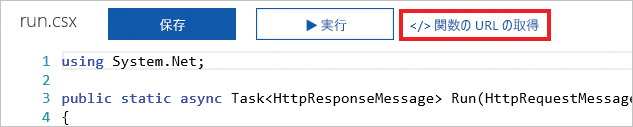

HTTP 要求とは、ほとんどのプラットフォームおよびデバイスで一般的に実行される操作です。 辞書から単語を調べる要求や、地域の天気を取得する要求など、ユーザーは、常に HTTP 要求を送信します。 Azure Functions では、HTTP 要求の受信時に一片のロジックを迅速に作成できます。

ここでは、HTTP トリガーを使用して Azure 関数を作成および呼び出す方法について説明します。 また、実行可能なカスタマイズ オプションについても説明します。

## HTTP トリガーとは

HTTP トリガーとは、HTTP 要求を受け取ったときに関数を実行するトリガーです。 HTTP トリガーには、次のような多数の機能やカスタマイズがあります。

- キーを指定し、承認されたアクセスを提供します。
- どの HTTP 動詞をサポートするかを制限します。
- 呼び出し元にデータを戻します。
- クエリ文字列パラメーターまたは要求本文を介して、データを受け取ります。
- 関数 URL を修正するために URL ルート テンプレートをサポートします。

HTTP トリガーを作成する場合、プログラミング言語を選択し、トリガー名を指定し、承認レベルを選択します。

## HTTP トリガーの承認レベルとは

HTTP トリガーの承認レベルとは、受信 HTTP 要求に承認のために API キーが必要であるかどうかを示すフラグです。

承認レベルは、次のとおり 3 つあります。

1. 関数
2. Anonymous
3. [Admin]

**関数**および**管理者**レベルは、"キー" に基づきます。 HTTP 要求を送信するには、承認にキーを指定する必要があります。 キーには、*関数*と*ホスト*の 2 種類があります。 2 つのキーの違いは、そのスコープです。 *関数*キーは、関数に固有です。 *ホスト* キーは、Azure Functions アプリケーション全体のすべての関数に適用されます。 使用する承認レベルが**関数**に設定されている場合、*関数*または*ホスト* キーのいずれかを使用できます。 使用する承認レベルが**管理者**に設定されている場合、*ホスト* キーを指定する必要があります。

**匿名**レベルとは、認証は必要ないということです。 演習では、このレベルを使用します。

## HTTP トリガーの作成方法

HTTP トリガーは、タイマー トリガーと同様に Azure Portal で作成できます。 作成する Azure 関数の中で、定義済みのトリガーの種類の一覧から **[HTTP トリガー]** を選択します。 次に、実行するロジックを入力し、必要に応じてカスタマイズ (たとえば、特定の HTTP 動詞の使用を禁止する) を行います。

理解しておく必要がある重要な設定の 1 つに、**[要求パラメーター名]** があります。 この設定は、受信 HTTP 要求の情報を含むパラメーター名を表す文字列です。 既定のパラメーター名は *req* です。

## HTTP トリガーを起動する方法

HTTP トリガーを起動するには、使用している関数用に URL に HTTP 要求を送信します。 この URL を取得するには、使用している関数のコード ページに進み、**[関数の URL の取得]** リンクを選択します。

ご利用の関数の URL を取得したら、HTTP 要求を送信できます。 ご利用の関数でデータを受信したら、クエリ文字列パラメーターを使用するか、要求本文からデータを指定できることに注意してください。

HTTP トリガーは、その関数 URL で HTTP 要求を受け取ると、Azure 関数を実行します。 HTTP トリガーでは、データを受信して、呼び出し元にデータを戻すことができます。