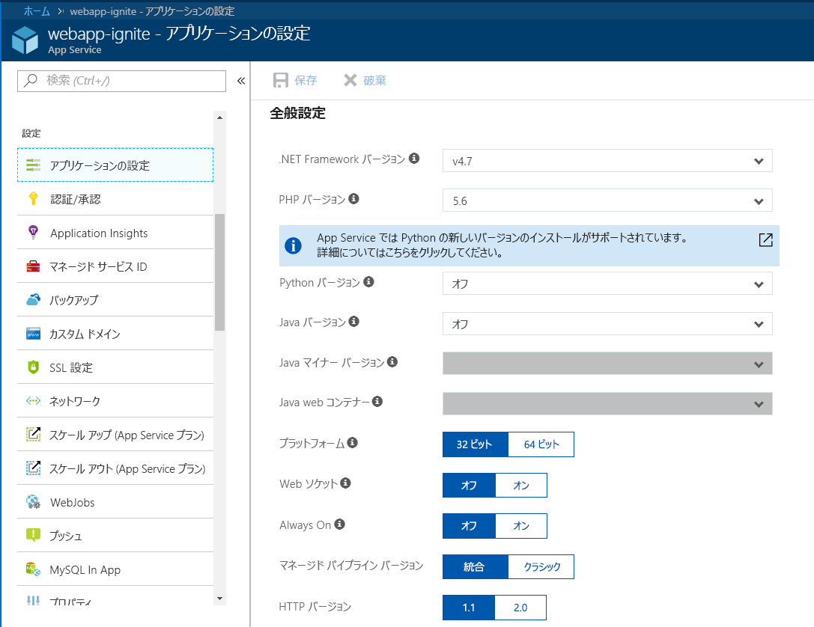
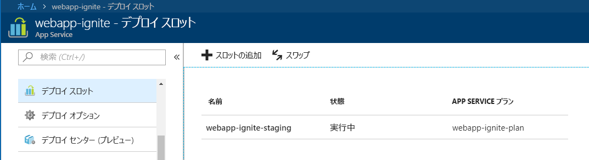
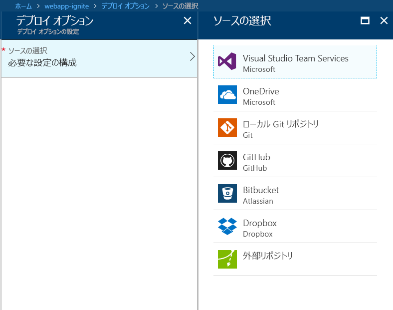

ここでは、Azure portal を使用して Azure App Service で web アプリを作成する方法について説明します。

## Azure portal を使用する理由

Web アプリケーションをホストする最初の手順では、Azure サブスクリプション内で web アプリ (App Service アプリ) を作成します。

Web アプリを作成するいくつかの方法はあります。 Azure portal、Azure CLI、スクリプト、または IDE を使用することができます。

ここでは、ポータルを使用します。ポータルはグラフィカルなエクスペリエンスであるため、最適な学習ツールになります。 このポータルは、使用可能な機能の検出、リソースの追加、既存のリソースのカスタマイズを行うのに役立ちます。

## Azure App Service とは

Azure App Service は、web アプリケーション、REST Api、およびモバイルのバックエンドをホストするために最適化された Azure 環境内で完全に管理されたコンピューティング プラットフォームです。

Microsoft Azure によって提供される、このサービスとしてのプラットフォーム (PaaS) を使用すると、ご利用のアプリケーションの実行とスケーリングのためのインフラストラクチャは Azure で処理されるため、お客様はビルド側の作業に集中できます。

## Web アプリを作成する方法

Azure portal にアクセスし、作成、独自のアプリをホストするときは、ときに、 **Web アプリ**します。 作成して、 **Web アプリ**Azure portal で、App service で ASP.NET Core、Node.js、PHP などであるかどうか、Azure でサポートされている web ベースのアプリケーションをホストするために使用できるリソースをホストしているのセットを作成するは実際にします。次の図は、アプリによって使用されるフレームワーク/言語を簡単に構成する方法を示しています。

Azure portal では、web アプリを作成するテンプレートを提供します。 このテンプレートには、次のフィールドが必要です。

- **名前**: Web アプリの名前。
- **サブスクリプション**: 有効でアクティブなサブスクリプション。
- **リソース グループ**: 有効なリソース グループ。 以下のセクションでは、リソース グループの内容を詳細に説明します。
- **OS**: オペレーティング システム。 オプションとして、Windows、Linux、および Docker コンテナーを使用できます。 Windows では、さまざまなテクノロジから任意のアプリケーションの種類をホストできます。 .NET Core フレームワークを使用する ASP.NET Core Web アプリのみを作成できる事実を除いて、Linux のホスティングにも同じことが適用されます。 完全な .NET Framework を使用するその他の ASP.NET アプリについては、Windows OS 経由でホストする必要があります。 最後のオプションは Docker コンテナーです。この場合、Azure によってホストおよび保守されるコンテナー経由で直接、独自のローカルの Docker コンテナーをデプロイできます。 そのため、基本的には、オープンソース テクノロジ (PHP、ASP.NET Core など) を活用する任意の Web アプリを、Linux OS 上でホストすることができます。
- **App Service プラン/場所**: 有効な Azure App Service プラン。 以下のセクションでは、App Service プランの内容を詳細に説明します。
- **Applications Insights**: Azure Application Insights オプションを有効にすると、Azure portal が提供する監視とメトリック ツールを利用して、ご自分のアプリのパフォーマンスを監視できます。

Azure portal では、多くの使用可能なツールからご自分のアプリを優位に管理、監視、および制御できます。

### デプロイ スロット

Azure portal を使用して簡単に追加できます**デプロイ スロット**を App Service web アプリ。 たとえば、ご自分のコードをプッシュできる**ステージング**のデプロイ スロットを作成して、Azure 上でテストできます。 適切なコードになったら、ステージングのデプロイ スロットを運用スロットに簡単に**切り替える**ことができます。 Azure portal で単純なマウス クリックを数回行うだけで、すべての操作を行うことができます。

### 継続的インテグレーション/デプロイのサポート

Azure portal では、開発用コンピューターに Visual Studio Team Services、GitHub、Bitbucket、Dropbox、OneDrive、またはローカルの Git リポジトリによるボックスの継続的インテグレーションとデプロイを提供します。 上記のソースのいずれかで web アプリを接続して、App Service は web アプリにコードの自動同期と、コードの今後の変更の残りの部分を実行するがします。 さらに、Visual Studio Team Services では、独自のビルドを定義してプロセスをリリースできます。これにより、コードをコミットするたびに、ご自分のソース コードのコンパイル、テストの実行、リリースのビルドを行い、最後に Web アプリにリリースがプッシュされます。 介入する必要はなく、暗黙的にすべてが実行されます。

### Visual Studio の発行と FTP の発行の統合

ご自分の Web アプリ用に継続的インテグレーション/デプロイを設定できるのに加え、常に、Visual Studio との緊密な統合からの恩恵を受け、Web 配置テクノロジによってご自分の Web アプリを Azure に発行することができます。 また、Azure では FTP もサポートします。Web 配置で変更または追加されたそれらのファイルのみを選び、単純にすべてを Azure に公開しないようにするための機能がないため、公開するために FTP を使用することはお勧めしません。

### 組み込みの自動スケール サポート (自動スケール アウト実際の負荷に基づく)

組み込み済みの Web アプリの機能は、スケーリングまたはスケール アウトです。Web アプリの使用量に応じて、ご自分の Web アプリをホストしている基になるマシンのリソースの増加または減少により、ご自分のアプリをスケーリングできます。 リソースは、コアの数または利用可能な RAM の量になります。

一方、スケール アウトは、ご自分の Web アプリを実行しているマシン インスタンスの数を増やす機能です。

## リソース グループとは

リソース グループは、指定したアプリケーションと環境に対して、仮想マシン、Web アプリ、データベースなどの相互に依存するリソースとサービスをグループ化するメソッドです。 リソース グループを、ご自分のアプリの要素をグループ化する場所である**フォルダー**と考えます。

リソース グループを使用すると、簡単にリソースを管理および削除できます。 また、アプリケーションの実行に必要であったり、クライアントによって使用されたりするリソースのコレクションへの請求の監視、アクセスの制御、プロビジョニング、および管理を行う方法も提供します。

## App Service プランとは

App Service プランは、ご自分の App Service アプリをデプロイできる物理リソースと容量のセットです。

Azure portal では、新しい App Service プランを作成するためにテンプレートを提供します。 このテンプレートには、次の基本情報が必要です。

- リージョン (米国西部、米国中部、北ヨーロッパなど)
- スケール カウント (インスタンス数 1、2、3 など)
- インスタンス サイズ (S、M、L)
- SKU または価格レベル (Free、Shared、Basic、Standard、Premium、PremiumV2、および分離プロセス)

Web アプリ、モバイル アプリ、および Azure Functions、App Service プランではすべて実行と同様に、Azure App Service でホストされている API アプリです。 アプリケーションを無制限に App Service プランにデプロイできますが、使用する数は、デプロイされているアプリケーションの種類や CPU 使用率で必要なリソースによって大幅に異なります。

スケーリングするか、アプリケーションを別の App Service プランに移動するかの必要性を判断できるように、常に、Azure portal でご自分の App Service プランを使用し、ご自分の CPU とメモリの使用率を視覚化することができます。
