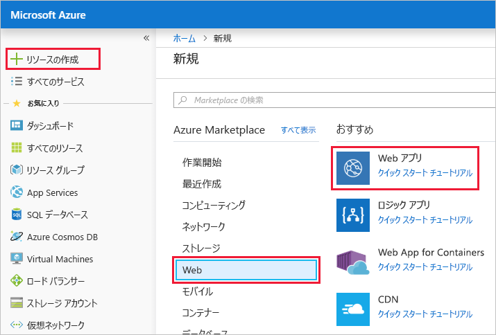

このユニットでは、Azure portal を使用して Web アプリを作成します。

[!include]

## Web アプリを作成する

サンドボックスをアクティブ化したときと同じアカウントを使用して、[Azure portal](https://portal.azure.com/triplecrownlabs.onmicrosoft.com?azure-portal=true) にサインインします。

1. 左側のナビゲーションの上部にある **[リソースの作成]** リンクをクリックします。 Azure 上で作成するあらゆるものがリソースです。

1. ポータルの表示が **[Marketplace]** ページに変わります。 ここから、作成するリソースを検索したり、ユーザーが Azure portal で作成した人気のあるリソースの 1 つを選択したりすることができます。

1. **[Web]** > **[Web アプリ]** をクリックします。 ポータルの表示が **[新しい Web アプリを作成する]** ページにリダイレクトされます。

1. 新しい Web アプリを作成すると、Azure portal では自動的にアプリを作成するために情報が要求されます。 このセクションでは、次の基本情報を提供する必要があります。

    1. **アプリ名**: クライアントは、アプリケーションを `BestBike` という名前にする必要があります。 このフィールドにその名前を入力します。 この値は、Azure でホストされている他のすべての Web アプリの間でグローバルに一意である必要があり、他の Web アプリがそのアプリ名を使用していないことが確認されます。 名前を確実に一意にするには、一意のバリアントが見つかるまで、アプリ名にいくつかの数字を追加します。

    2. **サブスクリプション**: このフィールドでは、ドロップダウン リストからアクティブな Azure サブスクリプションを選択する必要があります。 コンシェルジェ サブスクリプションを選択します。

    3. **OS**: このフィールドでは、新しい Web アプリをホストするために、**Windows** または **Linux** のいずれかを使用することを決定する必要があります。 この設定は、以下で選択または作成する App Service プランに直接影響します。 ご記憶のとおり、App Service プランでは仮想マシンを使用します。これは、ご自分のアプリケーションを実行するマシン上で必要なすべてのリソース (CPU、RAM など) を含むオペレーティング システムです。 この場合、クライアントは Windows マシンで Web アプリをホストすることを選びます。 そのため、**[Windows]** を選択します。

    4. **Application Insights**: Azure Application Insights は、ご自分の Web app と Web サービスでの品質の問題を検出および診断するのに役立ち、ユーザーがそれを使って実際に行う内容を解釈するのに役立ちます。 クライアントの要件の 1 つは、クライアントの Web サイトからのトラフィックに関する分析情報レポートを表示し、トラフィックが多いときと少ないときの傾向を調べる機能です。 ここでは、**[オン]** を選択して、この Web アプリに対して Application Insights を有効にします。 **[オン]** を選択したら、Application Insights データを保存する場所またはリージョンも選択する必要があります。 Application Insights は、限られた数のリージョンでのみ使用できることに注意してください。 このデモでは、利用可能なリージョンのいずれかを選択します。

## サンドボックス リソース グループを使用する

Azure Web アプリは、リソース グループの一部である必要があります。 **[既存のものを使用]** を選択し、<rgn>[サンドボックス リソース グループ名]</rgn> を選択します。

## App Service プランを作成する

このフィールドでは、ご自分のアプリケーションを実行する App Service プランを選択する必要があります。 既定では、作成した最新の App Service プランがポータルで選択されます。 **[App Service プラン/場所]** フィールドをクリックして、**[App Service プラン]** ページに移動します。

**[新規作成]** リンクをクリックして、**[新しい App Service プラン]** ページに移動します。 新しい App Service プランを作成するために情報が要求されます。

1. **App Service プラン**: このフィールドでは、新しい App Service プランに名前を指定します。 このアプリの場合、上記で選択した Web アプリ名を入力し、このリソースを他のリソースと簡単に区別できるように、`-app-service-plan` というサフィックスを追加します。

2. **場所**: このフィールドでは、この App Service プランが存在するリージョンを選択する必要があります。 つまり、App Service プランで、アプリケーションを実行するために必要な仮想マシンをセットアップする地理的な場所を選択します。 ここでは、一覧で任意のオプションを選択できます。

[!include]

3. **価格レベル**: このフィールドでは、ご自分のアプリケーションをホストする仮想マシンのサイズを選択する必要があります。 **>** 記号をクリックし、**[価格レベル]** ページに移動します。

    ここでは、多くのオプションから選択できます。 このポータルでは、必要なワークロードのレベルによってそれらのオプションがグループ化されます。 利用できる 3 つのワークロード カテゴリは、Dev/Test、Production、Isolated です。 Azure でホストするアプリケーションの要件に応じて、該当するワークロード カテゴリを選択します。 **BestBike** アプリケーションがビルドされ、調整中であるため、自分に適した最小ワークロード カテゴリから開始します。 クライアントの要件の 1 つは、アプリケーションからの新しい変更をライブでテストする機能でした。 今後のユニットでは、この要件を実現するために、**デプロイ スロット**を追加する必要があります。 デプロイ スロットは、最小価格レベルの **S1** から利用できます。 そのため、**[運用ワークロード]** カテゴリの **[S1]** 価格レベルを選択します。 次に、**[適用]** をクリックして、上で選択した価格レベルを確認します。

    > [!NOTE]
    > このモジュールから、**[Production]** と **[Isolated]** ワークロード カテゴリのみで **デプロイ スロット**をご自分の Web アプリに追加できることが通知されます。

    **[新しい App Service プラン]** ページに戻ります。

    ![設定にこの演習のサンプル値を使用した [新しい App Service プラン] ページを示すスクリーンショット。](../media/3-new-app-service-plan.PNG)

4. **[OK]** をクリックして、新しい App Service プランを使用します。

    ポータルの表示がメインの **[Web アプリの作成]** ページに戻ります。

    

5. **[作成]** をクリックして、Web アプリの作成プロセスを開始します。

    > [!NOTE]
    > Web アプリが作成され、使用できる状態になるまで数秒かかることがあります。

ダッシュボード ページにリダイレクトされ、Web アプリが作成されると通知されます。

アプリの準備ができたら、Azure portal で新しいアプリに移動します。

1. 左側のナビゲーションで **[すべてのリソース]** メニューをクリックします。 **[すべてのリソース]** ページに、Azure portal で作成されたすべてのリソースが一覧表示されます。

2. 先ほど作成された BestBike App Service をクリックします。

    > [!NOTE]
    > "BestBike" という名前でアプリを検索すると、新しい Web アプリ用に作成された Application Insights リソースと App Service プラン リソースも見つかる場合があります。 必ず、種類が **App Service** であるリソースをクリックしてください。

    ![新しく作成された BestBike123 App Service が強調表示された、[すべてのリソース] ページ内の検索結果の例を示すスクリーンショット。](../media/3-web-app.PNG)

**[概要]** セクションが選択された、Web アプリ サービスのホーム ページが開きます。

![[概要] セクションの URL リンクが強調表示された BestBike App Service ページを示すスクリーンショット。](../media/3-web-app-home.PNG)

新しい Web アプリの既定のコンテンツをプレビューするには、Azure portal の右上にある **URL** をクリックします。 プレースホルダー Web ページが表示された場合は、Web アプリが正常に作成されたことを示しています。
