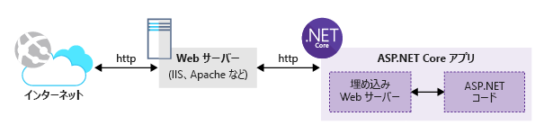

Web アプリケーションをビルドするためにオープン ソース テクノロジを使用することにしました。 ASP.NET Core がクロス プラットフォームのオープン ソース フレームワークであることはわかっています。 ASP.NET Core を使用して、Linux 開発環境で Web アプリを開発することにします。

Azure App Service では、Node.js、PHP、.NET Core などの好みの Web テクノロジを使用できます。

ここでは、.NET コマンド ライン インターフェイス (CLI) を使用して ASP.NET Core アプリケーションを作成する方法を学習します。

## <a name="what-is-aspnet-core"></a>ASP.NET Core とは

ASP.NET Core は Microsoft の一般的な ASP.NET Core Web フレームワークが進化した最新のものであり、最新のクラウド ベースのインターネット接続アプリケーションをビルドするためのクロスプラットフォームのオープン ソース フレームワークです。

ASP.NET Core アプリケーションは、.NET Core Framework または既存の完全な .NET Framework を対象に記述できます。

クロス プラットフォームのオープン ソース フレームワークであるため、Windows、macOS、および Linux を含むさまざまなプラットフォーム上に ASP.NET Core アプリをビルドすることができます。 Microsoft では Windows と macOS の両方の環境向けに Visual Studio IDE を提供しています。 また、Visual Studio Code エディターはクロス プラットフォームであり、これらおよび Linux と互換性があります。

>ASP.NET Core アプリケーションをさまざまなプラットフォームでビルドできるようにするため、Microsoft では .NET Core CLI ツールを導入しました。このツールは、豊富な一貫性のあるクロスプラットフォームの API セットを使用して、アプリケーションをビルド、テスト、公開するのに役立ちます。

ASP.NET Core を使用することで、Web アプリとサービス、IoT アプリ、およびモバイル バック エンドをビルドできます。 ASP.NET Core アプリケーションはクラウド内またはオンプレミスでホストすることができます。

意図的に、ASP.NET Core は、埋め込みの Web サーバーと、アプリケーション コードを実行するランタイム環境で構成されています。 アプリケーション コードは、より小さいモジュールとパッケージに依存する再作成された ASP.NET MVC フレームワークを使用して記述されます。 その結果、Web アプリケーション ブループリントがより小さくなり、クラウド環境での管理とホストが容易になります。 次の図に、.NET Core でホストされている ASP.NET Core アプリケーションと、インターネット http トラフィックを処理する外部 Web サーバーを示します。



ASP.NET Core アプリケーションは、**dotnet** ドライバー ツールを通じて呼び出されるスタンドアロンの**コンソール** アプリケーションです。 ASP.NET Core アプリケーションは、IIS ワーカー プロセスに読み込まれるのではなく、外部のコンソール アプリケーションを実行する **AspNetCoreModule** というネイティブ IIS モジュールを通じて読み込まれます。

## <a name="how-to-create-an-aspnet-core-web-project"></a>ASP.NET Core Web プロジェクトの作成方法

新しい ASP.NET Core プロジェクトを作成するための 2 つの一般的なオプションがあります。

- Visual Studio (Windows および macOS バージョン) のテンプレートを使用して、新しいプロジェクトを生成することができます。 Visual Studio では、Web プロジェクトの作成に使用できるさまざまなテンプレートが提供されます。 たとえば、**空**のテンプレートを使用して、基本的なセットアップで必要最小限の ASP.NET Core プロジェクトを作成することができます。 さらに、**[Web Application (Modal-View-Controller)]\(Web アプリケーション (モデル ビュー コントローラー)\)** テンプレートを使用して、アプリケーションのコーディングを開始するのに役立つサンプルの**コントローラー**と**ビュー**で本格的な ASP.NET Core MVC アプリケーションを生成することができます。 最新の **Web アプリケーション** プロジェクト テンプレートを使用すれば、従来の MVC プロジェクトの構造ではなく、Razor ページに基づく ASP.NET Core プロジェクトを作成できます。

- .NET Core CLI ツールを使用して、新しい ASP.NET Core プロジェクトを生成することができます。 CLI ツール用の ASP.NET Core プロジェクト テンプレートのセットを保持しており、Visual Studio のテンプレートとほとんど同じです。 CLI ツールとの唯一の違いは、新しい ASP.NET Core プロジェクトを作成するためにコマンドを入力する必要があることです。
> .NET CLI ツールでは、**テンプレート エンジン**を利用して、さまざまなプロジェクト テンプレートをサポートします。  詳細については、GitHub リポジトリの .NET CLI ツールで内部的に使用される[テンプレート エンジン](https://github.com/dotnet/templating)に関するページを参照してください。

これらは、ASP.NET Core プロジェクトを作成するための最も一般的なツールです。 しかし、検索および探索できるツールは他にもあります。

特筆すべきは、さまざまなツールで生成されるプロジェクトは若干異なる場合がありますが、すべて有効で最適化された ASP.NET Core プロジェクトが生成されることです。

## <a name="net-cli-tools"></a>.NET CLI ツール

.NET CLI ツール (.NET Core CLI とも呼ばれる) はクロスプラットフォーム ツールであり、パッケージの作成や復元、およびコマンド ラインからの .NET アプリケーションのビルド、実行、公開のためのコマンドが提供されます。全機能装備の IDE は必要ありません。

.NET CLI は、.NET Core SDK の一部としてインストールされます。 複数のバージョンの CLI を同じコンピューター上に共存させ、並行して実行することができます。

ローカルで開発している場合、.NET CLI の使用を開始するには、関連する .NET Core SDK をインストールする必要があります。 Azure Cloud Shell には .NET CLI が既にインストールされています。

コマンド ラインを開き、次のように入力します。

```console
dotnet --version
```

このコマンドではインストールされている .NET CLI のバージョンが表示されます。

これを書いている時点では、Azure Cloud Shell でコマンドを実行すると `2.0.0` が返ります。 さらに新しいバージョンを利用でき、お使いのローカル コンピューターにはこれより新しいバージョンがインストールされている可能性があります。

.NET CLI の一般的なコマンドをいくつか見ていきましょう。

*dotnet* コマンドの一般的な構文は次のとおりです。

```console
dotnet [verb] [arguments]
```

動詞は実行するアクションを表します。 引数は、動詞を実行するために必要な入力引数の一覧を表します。

*dotnet* の使用に関するヘルプを取得し、利用可能なすべての*動詞*を一覧表示し、またその他の関連情報を得るには、次のコマンドを入力します。

```console
dotnet --help
```

このコマンドでは次のように表示されます。

```console
.NET Command Line Tools (2.1.302)
Usage: dotnet [runtime-options] [path-to-application]
Usage: dotnet [sdk-options] [command] [arguments] [command-options]

path-to-application:
  The path to an application .dll file to execute.

SDK commands:
  new              Initialize .NET projects.
  restore          Restore dependencies specified in the .NET project.
  run              Compiles and immediately executes a .NET project.
  build            Builds a .NET project.
  publish          Publishes a .NET project for deployment (including the runtime).
  test             Runs unit tests using the test runner specified in the project.

...
```

**SDK コマンド**の下には、.NET Core SDK に対して実行できるコマンドの完全な一覧が表示されます。

常に最も役立つコマンドは次のとおりです。

- **dotnet new**: このコマンドは新しい .NET アプリケーションをスキャフォールディング/生成するために使用されます。

- **dotnet restore**: このコマンドは、アプリケーションによって参照されているすべてのパッケージを復元/ダウンロードするために使用されます。

- **dotnet run**: このコマンドは、.NET アプリケーションを実行するために使用されます。

ここで、特定のコマンドを使用する方法について支援を得るには、次のように入力します。

```console
dotnet new --help
```

このコマンドの結果は次のようになります。

```console
Usage: new [options]

Options:
  -h, --help          Displays help for this command.
  -l, --list          Lists templates containing the specified name. If no name is specified, lists all templates.
  -n, --name          The name for the output being created. If no name is specified, the name of the current directory is used.
  -o, --output        Location to place the generated output.
  -i, --install       Installs a source or a template pack.
  -u, --uninstall     Uninstalls a source or a template pack.
  --nuget-source      Specifies a NuGet source to use during install.
  --type              Filters templates based on available types. Predefined values are "project", "item" or "other".
  --force             Forces content to be generated even if it would change existing files.
  -lang, --language   Filters templates based on language and specifies the language of the template to create.


Templates                                         Short Name         Language          Tags
----------------------------------------------------------------------------------------------------------------------------
Console Application                               console            [C#], F#, VB      Common/Console
Class library                                     classlib           [C#], F#, VB      Common/Library
...

Razor Page                                        page               [C#]              Web/ASP.NET
MVC ViewImports                                   viewimports        [C#]              Web/ASP.NET
MVC ViewStart                                     viewstart          [C#]              Web/ASP.NET
ASP.NET Core Empty                                web                [C#], F#          Web/Empty
ASP.NET Core Web App (Model-View-Controller)      mvc                [C#], F#          Web/MVC
ASP.NET Core Web App                              razor              [C#]              Web/MVC/Razor Pages
ASP.NET Core with Angular                         angular            [C#]              Web/MVC/SPA
...

Solution File                                     sln                                  Solution

Examples:
    dotnet new mvc --auth Individual
    dotnet new webapi
    dotnet new --help
```

このコマンドでは、`dotnet new` コマンドで使用できるすべての利用可能なオプションが一覧表示されます。 また、次の .NET アプリケーションを生成するために使用できるすべての利用可能なプロジェクト テンプレートが一覧表示されます。 最後のセクションでは、コマンドを使用して新しい .NET アプリケーションを生成する方法の例を示します。

.NET CLI で利用可能なコマンドで `--help` 引数を使用することで、他のコマンドについて学習できます。

## <a name="summary"></a>まとめ

Web アプリケーションをビルドするようにした場合は、多くの言語とフレームワークを選択できます。 App Service では、Node.js、PHP、.NET Core などのさまざまな種類のアプリケーションをホストできるため、この選択をより簡単に行えます。 これにより、Web ホストのニーズに合わせて変更するのではなく、最も使い慣れている言語とフレームワークを使用できます。
