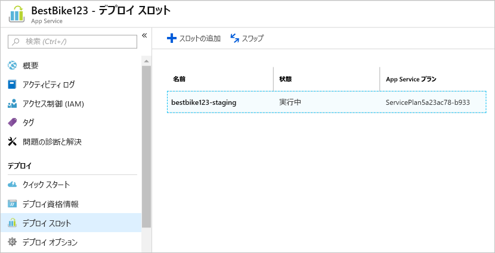
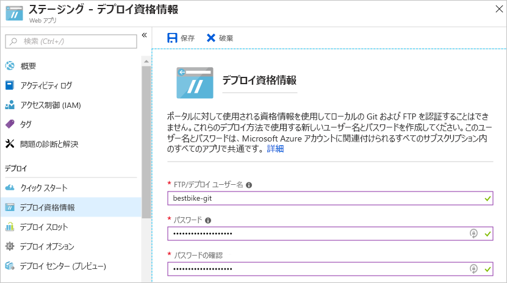
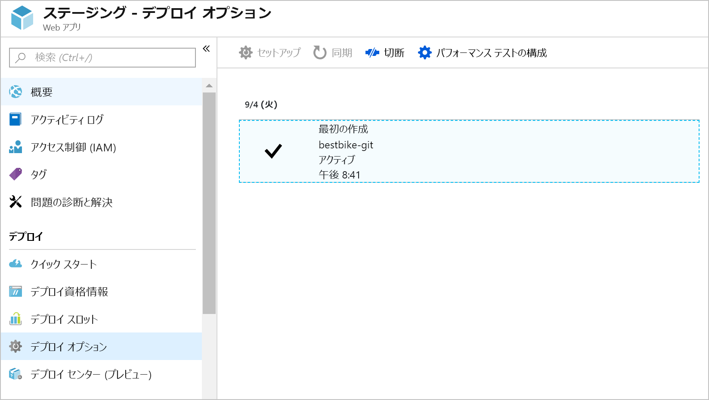

このユニットでは、Azure App Service に ASP.NET Core アプリケーションをアップロードします。

## <a name="create-a-staging-deployment-slot"></a>ステージング デプロイ スロットを作成する

1. 以前に作成した App Service リソース (web アプリ) を開きます。 そのリソース ページを閉じた場合に見つけでアプリを検索して**すべてのリソース**に含まれるリソース グループまたは**リソース グループ**します。

1. 左側のナビゲーションで **[デプロイ スロット]** メニュー項目をクリックします。

1. 内で、**デプロイ スロット** ページで、をクリックして、**スロットの追加**デプロイ スロット ページの上部のナビゲーション バーのボタン。

1. Azure portal が開き、**スロットの追加**次に示すようにページします。

    1. デプロイ スロットの名前を指定します。 例では `staging` が使用されます。

    2. **[構成のソース]** を選択するときは、2 つのオプションがあります。

        * 任意の既存のデプロイ スロットまたは App Service アプリからの構成要素を複製することができます。
        * または、構成要素を複製しないことを選択します。 **[既存のスロットから構成を複製しない]** を選択します。

        このデプロイ スロットでは、2 番目のオプションの **[既存のスロットから構成を複製しない]** を選択します。 スロットを直接構成します。

    

1. をクリックして、 **OK**新しいデプロイ スロットを作成するページの下部にあるボタンをクリックします。

1. デプロイ スロットが正常に作成されると、Azure portal 移動に戻す、**デプロイ スロット**web アプリのページ。

    ここで、先ほど作成した新しいデプロイ スロットを確認できます。

    

1. 新しいデプロイ スロットを選択します。

1. 新しく作成されたデプロイ スロットの **[概要]** ページに表示が変わります。

    

    ステージング デプロイ スロットの **URL** に注意してください。 スロット名が追加され、以前に表示されていたものとは異なる URL になっています。

    デプロイ スロットは、Azure 内で完全な App Service アプリとして扱われます。 ただし、元のアプリの子であり、元のアプリとスワップできるされる特殊な種類を勧めします。

    クリックすると、 **URL**Azure では、Azure portal で作成した最初の時間を"app"デプロイ スロット用に作成と同じ既定のページが表示されます。

ステージング デプロイ スロットが正常に作成されたので、次に、**デプロイ資格情報**を構成する必要があります。

## <a name="create-deployment-credentials"></a>デプロイ資格情報を作成する

Azure では、実際のデプロイ プロセスを始める前に、デプロイ資格情報を設定する必要があります。 そのため、独自のデプロイ資格情報を作成する方法を学習します。

1. 左側のナビゲーションで、**[デプロイ資格情報]** メニュー項目をクリックします。

1. Azure portal に移動する、**デプロイ資格情報**次に示すようにページします。

    適切な**ユーザー名**と**パスワード**を入力し、パスワードをもう一度入力して確認します。

    > [!NOTE]
    > 忘れないように、ユーザー名とパスワードを書き留めておきます。 後で Azure へのコードのアップロードとデプロイを始めるときに必要になります。

    

1. をクリックして、**保存**の上部にある、**デプロイ資格情報**ページ。

デプロイ資格情報が正常に作成されたので、次に、他のデプロイ オプションを構成する必要があります。

## <a name="use-a-local-git-repository-as-your-deployment-option"></a>デプロイ オプションとしてローカル Git リポジトリを使用する

次に、コードのアップロードを開始できるように Azure では、ローカル Git リポジトリを作成します。

1. 内で、**ステージング**デプロイ スロット"app"をクリックして、**展開オプション**左側のナビゲーション メニュー項目。

1. Azure portal に移動する、**展開オプション**ページ。

1. **[ソースの選択]** をクリックして必要な設定を構成します。

1. 構成して使用できるオプションが表示されます。 この例では、**[ローカル Git リポジトリ]** オプションを選択します。

1. 返される、**展開オプション**ページ。 をクリックして、 **OK**デプロイ ソースを設定するページの下部にあるボタンをクリックします。

1. 次に、左側のナビゲーションの **[デプロイ センター (プレビュー)]** セクションに移動して、新しいデプロイの詳細を表示します。

    

    ここでは、重要な情報、 **Git Clone Uri**、として使用するローカルの Git リポジトリの URL である、**リモート**ローカルのアプリケーション コード リポジトリの。

ここで、ステージング デプロイ スロットへのコードのアップロードを始めます。

## <a name="install-git-on-your-machine"></a>コンピューターに Git をインストールする

Linux マシンに Git をインストールします (まだインストールしていない場合)。

> [!NOTE]
> 以下の手順は Ubuntu 18.04 向けです。Git をインストールする手順は、ディストリビューションとバージョンによって異なる場合があります。 適切な手順については、[Linux Git のインストール手順](https://git-scm.com/download/linux)に関するページをご覧ください。

1. 新しい**ターミナル** ウィンドウを開きます。

1. 次のコマンドを入力します。 Ubuntu のユーザー パスワードの入力を求めるプロンプトが表示されます。

    ```console
    sudo apt-get update
    ```

1. 更新が成功したら、次のコマンドを入力して Git をローカルにインストールします。 コンピューターへの Git のインストールに同意するように求められます。

    ```console
    sudo apt-get install git-core
    ```

1. Git がインストールされたことを確認するには、次のコマンドを入力します。

    ```console
    git --version
    ```

   インストールが成功した場合、次の出力が表示されます。

    ```console
    git version 2.17.1
    ```

1. ユーザーの名前とメール アドレスを提供することで、Git の設定を構成するのが常によい方法です。 そのためには、次のコマンドを発行する必要があります。プレースホルダー `{your name}` と `{your email}` を、自分の名前とメール アドレスに置き換えます (中かっこ (`{}`) は不要です)。

    ```console
    git config --global user.name "{your name}"
    git config --global user.email "{your email}"
    ```

1. Git によってユーザーの情報が記録されたことを確認するには、次のコマンドを入力します。

    ```console
    cat ~/.gitconfig
    ```

   次のように、名前とメール アドレスが表示されるはずです。

    ```console
    [user]
        name = {your name}
        email = {your email}
    ```

## <a name="initialize-a-local-git-repository-for-your-code"></a>コードのローカル Git リポジトリを初期化します。

Git を使用するには、.NET Core アプリケーション コードのローカル Git リポジトリを初期化する必要があります。

1. 新しい**ターミナル** ウィンドウを開きます。

1. 以前に作成した .NET Core アプリのコンテンツのルート フォルダーに移動します。 次のように入力します。

    ```console
    cd ~/Documents/BestBikeApp/
    ```

1. 次のコマンドを発行して、新しい Git リポジトリを初期化します。

    ```console
    git init
    ```

    コマンドが成功すると、次のようなメッセージが表示されます。

    ```console
    Initialized empty Git repository in /home/{your-user}/Documents/BestBikeApp/.git/
    ```

1. Git へのすべてのアプリケーション ファイルをステージングします。

   次の手順では、Git は、アプリケーション ファイルを認識できるようにします。 そのためには、Git によって**ステージング**されるように、作業ディレクトリのすべてのファイルを追加します。 次のコマンドを入力します。

    ```console
    git add .
    ```

    上のコマンドでは、"." によって表されるすべてのファイルが、Git のステージング状態に追加されます。

1. 次に、Git に変更をコミットする必要があります。

   Git にファイルをステージングした後は、ローカル コンピューター上の **Git コミット履歴**にファイルをコミットする必要があります。 そのためには、次のコマンドを入力します。

    ```console
   git commit -m "Initial create"
    ```

   `commit` コマンドでは、作成しているコミットに関するメッセージを含めるための `-m` 引数が受け付けられます。 後で、コードを Azure にプッシュするときに、この特定のコミットに格納されている同じメッセージを見ることができます。

## <a name="add-a-remote-for-the-local-git-repository"></a>ローカル Git リポジトリに対するリモートを追加する

この時点では、新しいローカル Git リポジトリが正常に初期化されています。 さらに、すべてのアプリケーション ファイルを Git にコミットしました。 残っているのは、ローカル Git リポジトリを Azure でホストされているリポジトリに接続するための**リモート**を追加することです。

そのためには、以下のことを行う必要があります。

1. 前の手順で表示された **Git クローン URL** をコピーします。

1. コピーした後、**ターミナル** ウィンドウに戻り、次の Git コマンドを発行します。

    ```console
    git remote add origin https://BESTBIKE-git@BESTBIKE-staging.scm.azurewebsites.net:443/BESTBIKE.git
    ```

    上の Git コマンドでは、ローカル Git リポジトリが Azure でホストされているリポジトリにフックされます。 これで、ローカル Git リポジトリとリモート Git リポジトリの間でプッシュとプルを始めることができます。

1. 上記のコマンドを確認するには、次の Git コマンドを入力します。

    ```console
    git remote -v
    ```

    上のコマンドでは、次の出力が生成されます。

    ```console
    origin  https://BESTBIKE-git@BESTBIKE-staging.scm.azurewebsites.net:443/BESTBIKE.git (fetch)
    origin  https://BESTBIKE-git@BESTBIKE-staging.scm.azurewebsites.net:443/BESTBIKE.git (push)
    ```

## <a name="push-your-code-to-azure"></a>コードを Azure にプッシュする

Azure でのリモート Git リポジトリに接続されているローカル Git リポジトリがある場合は、できた開発アプリケーションをビルドおよびを Azure にアプリケーション コードをプッシュします。

1. **master** ブランチを Azure 上のリモート Git リポジトリにプッシュするには、次の Git コマンドを入力します。

    ```console
    git push origin master
    ```

1. 前に **[デプロイ資格情報]** セクションで構成したパスワードの入力を求められます。 パスワードを入力して Enter キーを押します。 Git で、ステージング デプロイ スロットに構成されている Azure リモート Git リポジトリへのコミットされたファイルのアップロードが開始されます。

## <a name="verify-the-code-is-uploaded-to-azure"></a>コードが Azure にアップロードされたことを確認します。

1. Azure portal にサインインします。

1. 左側のナビゲーションで、**[すべてのリソース]** メニュー項目をクリックします。

1. それまでに Azure で作成されたすべてのリソースの一覧が表示されます。

1. 上記で作成したステージング スロットをクリックします。 ただし、デプロイ スロットは、アプリとしてと見なされ、そのため、下の App Service リソースとして表示されます**すべてのリソース**します。

1. ステージング デプロイ スロットのページが表示されたらに移動**展開オプション**します。

    コンピューター上にローカルに存在する最初のコミットが、Azure portal にアップロードされていることがわかります。

    App Service でのリモート Git リポジトリをローカルでコードをプッシュするときに、Azure は、この操作を記録します。

    Azure にコードをプッシュするたびに、新しいレコードと、コンピューター上でローカルに変更をコミットするときに入力したメッセージが表示されます。

    

1. **ステージング スロット**の URL にアクセスしてみましょう。 URL については既に説明しましたが、その URL を忘れた場合は、いつでも、ステージング デプロイ スロットの **[概要]** ページに移動して、URL を選択できます。

1. ブラウザーのアドレス バーに次の URL を入力します。[https://BESTBIKE-staging.azurewebsites.net/](https://BESTBIKE-staging.azurewebsites.net/)

    

Azure のステージング デプロイ スロットに、ローカル アプリケーション ファイルを正しくアップロードしました。

## <a name="swapping-the-staging-and-production-deployment-slots"></a>ステージング デプロイ スロットと運用デプロイ スロットのスワップ

Azure でホストされているステージング デプロイ スロットでアプリケーションが起動されて実行されるようになったので、次にこのスロットを運用スロットとスワップします。 これを行うには、次の手順のようにします。

1. 先ほど作成した元のアプリ ページに移動します。 元の web アプリを見つけることができます、**すべてのリソース**ページ。

1. 左側のナビゲーションで **[デプロイ スロット]** メニュー項目をクリックします。

1. をクリックして、**スワップ**ページの上部にあるボタンをクリックします。

1. Azure portal に移動する、**スワップ**ページ。

1. **[スワップ]** フィールドで、**[スワップ]** を選択します。

1. **[ソース]** フィールドで、**[ステージング]** を選択します。

1. **[ターゲット]** フィールドで、**[運用]** を選択します。

    

1. をクリックして、 **OK**ページの下部にあるボタンをクリックします。

1. Azure でスワップ プロセスが開始されます。 スワップする Web アプリのサイズにもよりますが、通常、この操作には数秒かかります。

1. 操作が終了したら、Web アプリの URL [https://bestbike.azurewebsites.net/](https://bestbike.azurewebsites.net/) にアクセスします。

    

    スワップ操作が正常に完了しました。 ステージング デプロイ スロットにアップロードされ、運用スロットでホストされるようになったコードを確認できます。

1. 次に、ステージング スロットの URL [https://bestbike-staging.azurewebsites.net/](https://bestbike-staging.azurewebsites.net/) にアクセスします。

    

    ステージング デプロイ スロットは、運用スロットから提供された以前 HTML ファイル、元の既定値を提供するようになりました。

お疲れさまでした。 アプリケーション コードを Azure にアップロードし、デプロイ スロットをスワップしました。
