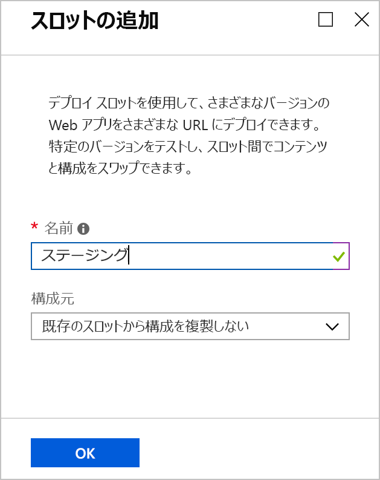
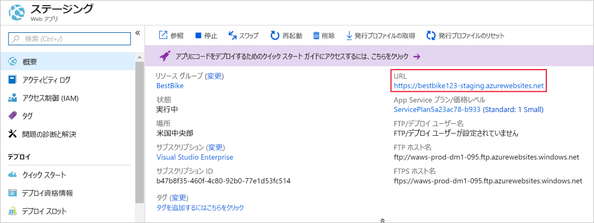
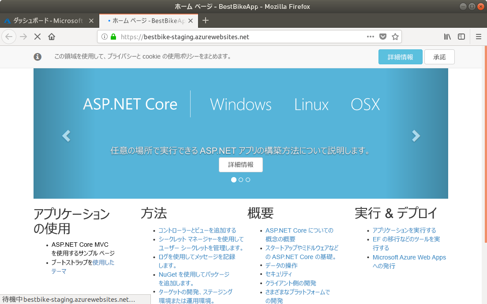
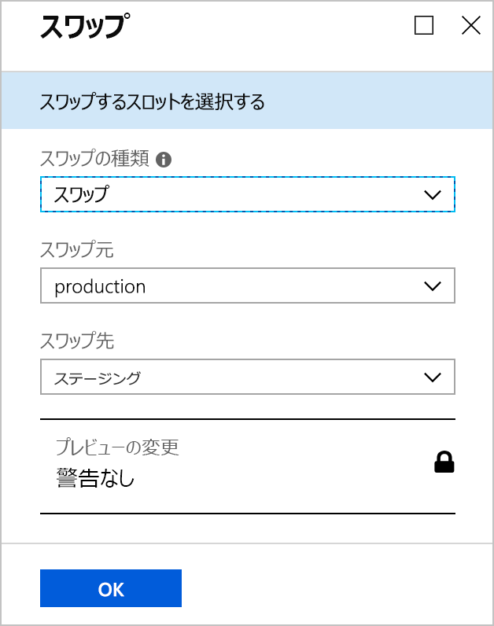
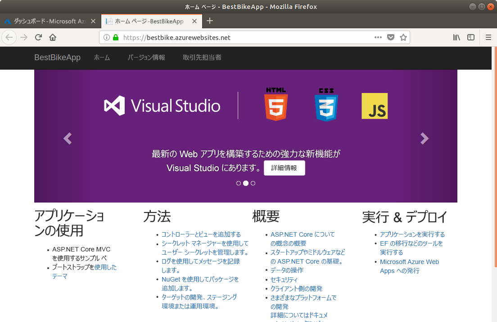
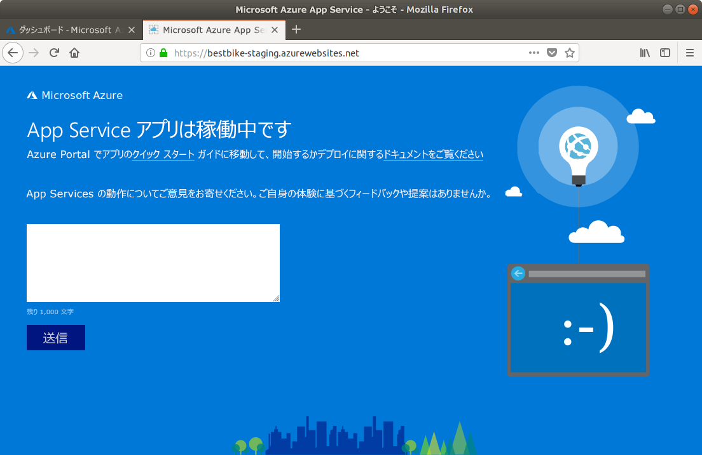

このユニットでは、ASP.NET Core アプリケーションを Azure App Service にアップロードします。

## <a name="create-a-staging-deployment-slot"></a>ステージング デプロイ スロットを作成する

1. [Azure portal](https://portal.azure.com/triplecrownlabs.onmicrosoft.com?azure-portal=true) に戻ります。

1. 以前に作成した App Service リソース (Web アプリ) を開きます。 **[すべてのリソース]** でアプリを検索するか、**[リソース グループ]** でアプリが属するリソース グループを検索することでもう一度見つけることができます。

1. 左側のナビゲーションで **[デプロイ スロット]** メニュー項目をクリックします。

1. **[デプロイ スロット]** ページで、上部ナビゲーション バーの **[スロットの追加]** ボタンをクリックします。

1. 次に示すような **[スロットの追加]** ページが開きます。

    1. デプロイ スロットに名前を付けます。 ここでは `staging` を使用します。

    2. **[構成のソース]** を選択するときは、2 つのオプションがあります。

        * 既存のデプロイ スロットまたは App Service アプリから構成要素を複製します。
        * または、構成要素を複製しないことを選択します。 **[既存のスロットから構成を複製しない]** を選択します。

        このデプロイ スロットでは、2 番目のオプションの **[既存のスロットから構成を複製しない]** を選択します。 スロットを直接構成します。

    

1. ページの下部にある **[OK]** をクリックして、新しいデプロイ スロットを作成します。

1. デプロイ スロットが正常に作成されると、Web アプリの **[デプロイ スロット]** ページに表示が戻ります。

    ここで、先ほど作成した新しいデプロイ スロットを確認できます。

    ![作成した新しいスロットが含まれた [デプロイ スロット] ページを示す Azure portal のスクリーンショット。](../media/7-deployment-slot-created.png)

1. 新しいデプロイ スロットを選択します。

1. 新しく作成されたデプロイ スロットの **[概要]** ページが表示されます。

    

    ステージング デプロイ スロットの **URL** に注意してください。 スロット名が追加され、以前に表示されていたものとは異なる URL になっています。

    デプロイ スロットは、Azure 内で完全な App Service アプリとして扱われます。 ただし、元のアプリの子という特別な種類であり、元のアプリとスワップすることができます。

    **URL** をクリックすると、Azure portal で初めて作成したデプロイ スロット "アプリ" に対して Azure で作成されたものと同じ既定のページが表示されます。

ステージング デプロイ スロットが正常に作成されたので、次に、**デプロイ資格情報**を構成する必要があります。

## <a name="create-deployment-credentials"></a>デプロイ資格情報を作成する

Azure では、実際のデプロイ プロセスを始める前に、デプロイ資格情報を設定する必要があります。 そのため、独自のデプロイ資格情報を作成する方法を学習します。

1. 左側のナビゲーションで、**[デプロイ資格情報]** メニュー項目をクリックします。

1. 次に示すような **[デプロイ資格情報]** ページに表示が変わります。

    任意の**ユーザー名**と**パスワード**を入力し、そのパスワードをもう一度入力して確認します。

    > [!NOTE]
    > ユーザー名とパスワードは決して忘れないでください。 後で Azure へのコードのアップロードとデプロイを始めるときに必要になります。

    ![必須フィールドに資格情報の例が入力された、ステージング スロットの [デプロイ資格情報] ページを示す Azure portal のスクリーンショット。](../media/7-deployment-credentials.png)

1. **[デプロイ資格情報]** ページの上部にある **[保存]** ボタンをクリックします。

デプロイ資格情報が正常に作成されたので、次に、他のデプロイ オプションを構成する必要があります。

## <a name="use-a-local-git-repository-as-your-deployment-option"></a>デプロイ オプションとしてローカル Git リポジトリを使用する

次に、コードのアップロードを開始できるように、Azure でローカル Git リポジトリを作成します。

1. **staging** デプロイ スロット "アプリ" 内で、左側のナビゲーションの **[デプロイ オプション]** メニュー項目をクリックします。

1. **[デプロイ オプション]** ページが表示されます。

1. **[ソースの選択]** をクリックして必要な設定を構成します。

1. 構成して使用できるオプションが表示されます。 この例では、**[ローカル Git リポジトリ]** を選択します。

1. 自動的に **[デプロイ オプション]** ページに戻ります。 ページの下部にある **[OK]** をクリックしてデプロイ ソースを設定します。

1. 次に、左側のナビゲーションにある **[概要]** セクションに移動します。

    ここで注意すべき重要な情報は **Git Clone URI** です。これは、ご利用のローカル アプリケーション コード リポジトリで**リモート**として使用するローカル Git リポジトリの URL です。

次に、ステージング デプロイ スロットへのご自分のコードのアップロードを開始します。

## <a name="set-up-git-on-cloud-shell"></a>Cloud Shell 上で git を設定する

Git は既にインストールされている Azure Cloud Shell ですが、ご自分の Cloud Shell アカウントのユーザー名と電子メール アドレスを設定することが必要になります。

1. 右側の Cloud Shell で、次のコマンドを入力し、プレースホルダー `[your name]` と `[your email]` を、自分の名前とメール アドレスに置き換えます (かっこは不要です)。

    ```bash
    git config --global user.name "[your name]"
    git config --global user.email "[your email]"
    ```

1. Git によって情報が記録されたことを確認するには、次のコマンドを入力します。

    ```bash
    cat ~/.gitconfig
    ```

   次のように、名前とメール アドレスが表示されるはずです。

    ```output
    [user]
        name = {your name}
        email = {your email}
    ```

## <a name="initialize-a-local-git-repository-for-your-code"></a>コード用にローカル Git リポジトリを初期化する

Git を使い始めるには、ご自分の .NET Core アプリケーション コード用にローカル Git リポジトリを初期化する必要があります。

1. 先ほど作成したプロジェクト フォルダーが選択されていることを確認します。

    ```bash
    cd ~/BestBikeApp/
    ```

1. 次のコマンドを発行して、新しい Git リポジトリを初期化します。

    ```bash
    git init
    ```

    コマンドが成功すると、次のようなメッセージが表示されます。

    ```output
    Initialized empty Git repository in /home/{your-user}/BestBikeApp/.git/
    ```

1. すべてのアプリケーション ファイルを Git にステージングします。

   次に、Git にアプリケーション ファイルを認識させます。 そのためには、Git によって**ステージング**されるように、作業ディレクトリのすべてのファイルを追加します。 次のコマンドを入力します。

    ```bash
    git add .
    ```

    上のコマンドでは、"." によって表されるすべてのファイルが、Git のステージング状態に追加されます。

1. 次に、Git に変更をコミットする必要があります。

   Git にファイルをステージングした後は、ローカル コンピューター上の **Git コミット履歴**にファイルをコミットする必要があります。 そのためには、次のコマンドを入力します。

    ```bash
   git commit -m "Initial create"
    ```

   `commit` コマンドでは、作成しているコミットに関するメッセージを含めるための `-m` 引数が受け付けられます。 後で、コードを Azure にプッシュするときに、この特定のコミットに格納されている同じメッセージを見ることができます。

## <a name="add-a-remote-for-the-local-git-repository"></a>ローカル Git リポジトリに対するリモートを追加する

この時点では、新しいローカル Git リポジトリが正常に初期化されています。 さらに、すべてのアプリケーション ファイルを Git にコミットしてあります。 残っているのは、ローカル Git リポジトリを Azure でホストされているリポジトリに接続するための**リモート**を追加することです。

そのためには、以下のことを行う必要があります。

1. 前の手順で表示された **Git クローン URL** をコピーします。

1. コピーした後、**ターミナル** ウィンドウに戻り、URL を含む次の Git コマンドを発行します。

    ```bash
    git remote add origin https://BESTBIKE-git@BESTBIKE-staging.scm.azurewebsites.net:443/BESTBIKE.git
    ```

    上の Git コマンドでは、ローカル Git リポジトリが Azure でホストされているリポジトリにフックされます。 これで、ローカル Git リポジトリとリモート Git リポジトリの間でプッシュとプルを始めることができます。

1. 上記のコマンドを確認するには、次の Git コマンドを入力します。

    ```bash
    git remote -v
    ```

    上のコマンドでは、次の出力が生成されます。

    ```output
    origin  https://BESTBIKE-git@BESTBIKE-staging.scm.azurewebsites.net:443/BESTBIKE.git (fetch)
    origin  https://BESTBIKE-git@BESTBIKE-staging.scm.azurewebsites.net:443/BESTBIKE.git (push)
    ```

## <a name="push-your-code-to-azure"></a>コードを Azure にプッシュする

ローカル Git リポジトリを Azure 上のリモート Git リポジトリにフックしたので、アプリを開発してビルドした後、Azure にアプリケーション コードをプッシュします。

1. **master** ブランチを Azure 上のリモート Git リポジトリにプッシュするには、次の Git コマンドを入力します。

    ```bash
    git push origin master
    ```

1. 前に **[デプロイ資格情報]** セクションで構成したパスワードの入力を求められます。 パスワードを入力して Enter キーを押します。 Git で、ステージング デプロイ スロットに構成されている Azure リモート Git リポジトリへのコミットされたファイルのアップロードが開始されます。

## <a name="verify-the-code-is-uploaded-to-azure"></a>コードが Azure にアップロードされたことを確認する

1. Azure portal に戻ります。

1. 左側のナビゲーションで、**[すべてのリソース]** メニュー項目をクリックします。

1. これまでに Azure で作成されたすべてのリソースの一覧が表示されます。

1. 上記で作成したステージング スロットをクリックします。 デプロイ スロットはアプリと見なされるため、**[すべてのリソース]** では App Service リソースとして表示されます。

1. ステージング デプロイ スロットのページが表示されたら、**[デプロイ オプション]** に移動します。

    コンピューター上にローカルに存在する最初のコミットが、Azure portal にアップロードされていることがわかります。

    App Service 内のリモート Git リポジトリにコードをローカルにプッシュすると、Azure によってこの操作が記録されます。

    Azure にコードをプッシュするたびに、新しいレコードと、コンピューター上でローカルに変更をコミットするときに入力したメッセージが表示されます。

    ![[デプロイ オプション] ページの最近の Git リポジトリ デプロイを示す Azure portal のスクリーンショット。](../media/7-staging-deployment-slot-after-uploading-files.png)

1. **ステージング スロット**の URL にアクセスしてみましょう。 URL については既に説明しましたが、その URL を忘れた場合は、いつでも、ステージング デプロイ スロットの **[概要]** ページに移動して、URL を選択できます。

1. ブラウザーのアドレス バーに、URL として [https://BESTBIKE-staging.azurewebsites.net/](https://BESTBIKE-staging.azurewebsites.net/) を入力します。

    

ローカル アプリケーションのファイルを Azure 上のステージング デプロイ スロットに正しくアップロードできました。

## <a name="swapping-the-staging-and-production-deployment-slots"></a>ステージング デプロイ スロットと運用デプロイ スロットのスワップ

Azure でホストされているステージング デプロイ スロットでアプリケーションが起動されて実行されるようになったので、次にこのスロットを運用スロットとスワップします。 これを行うには、次の手順に従います。

1. 以前に作成した元のアプリ ページに移動します。 元の Web アプリは、**[すべてのリソース]** ページで見つかります。

1. 左側のナビゲーションで **[デプロイ スロット]** メニュー項目をクリックします。

1. ページの上部にある **[スワップ]** ボタンをクリックします。

1. Azure portal の表示が **[スワップ]** ページに変わります。

1. **[スワップ]** フィールドで、**[スワップ]** を選択します。

1. **[ソース]** フィールドで、**[ステージング]** を選択します。

1. **[ターゲット]** フィールドで、**[運用]** を選択します。

    

1. ページの下部にある **[OK]** をクリックします。

1. Azure でスワップ プロセスが開始されます。 スワップする Web アプリのサイズにもよりますが、通常、この操作には数秒かかります。

1. 操作が終了したら、ウェブ アプリの URL にアクセスします。これは、ポータル内のアプリ サービスの [概要] ページにあります: [https://bestbike.azurewebsites.net/](https://bestbike.azurewebsites.net/)。

    

    スワップ操作が正常に完了しました。 ステージング デプロイ スロットにアップロードされ、運用スロットでホストされるようになったコードを確認できます。

1. 次に、ステージング スロットの URL ([https://bestbike-staging.azurewebsites.net/](https://bestbike-staging.azurewebsites.net/)) にアクセスします。

    

    これで、ステージング デプロイ スロットは、以前は運用スロットで処理されていた元の既定の HTML ファイルを処理するようになりました。

お疲れさまでした。 Azure にアプリケーション コードが正常にアップロードされ、デプロイ スロットがスワップされました。
